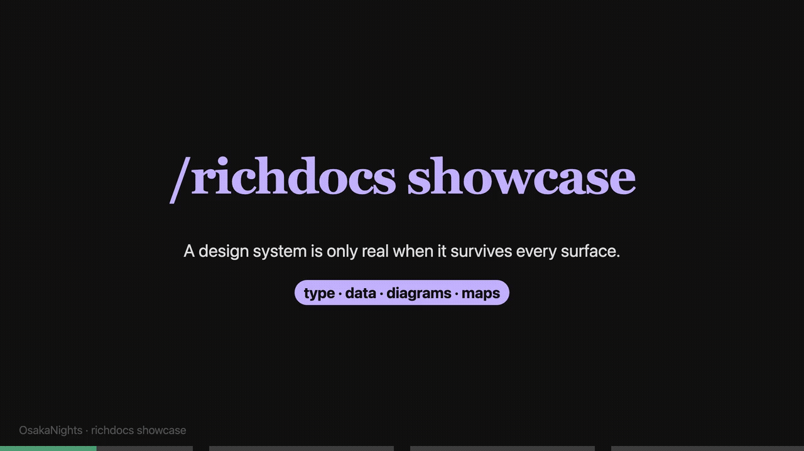

# agentic-dotfiles

Skills, rules and workflows for agentic coding, installable with [`skills`](https://www.npmjs.com/package/skills).



The richdocs showcase demonstrates the visual surface shipped by the skill.

## Install

```sh
# Browse what's in here
npx skills@latest add neozenith/agentic-dotfiles -l

# Install one skill into this project
npx skills@latest add neozenith/agentic-dotfiles -s richdocs -y

# Install globally (~/.claude) instead
npx skills@latest add neozenith/agentic-dotfiles -s richdocs -g -y

# Everything, every agent
npx skills@latest add neozenith/agentic-dotfiles --all
```

```sh
npx skills@latest list
npx skills@latest update
npx skills@latest remove -s richdocs
```

## Skills

### richdocs

Markdown → interactive HTML (mermaid, cytoscape, plotly, draw.io cloud stencils) with a localhost server.

```sh
npx skills@latest add neozenith/agentic-dotfiles -s richdocs -y
```

### mermaidjs-diagrams

Render Mermaid diagrams in markdown with enforced complexity limits and WCAG contrast checks.

```sh
npx skills@latest add neozenith/agentic-dotfiles -s mermaidjs-diagrams -y
```

### gooddocs

Audit docs for drift, write/improve them with the Diátaxis lens, or restructure for readability.

```sh
npx skills@latest add neozenith/agentic-dotfiles -s gooddocs -y
```

### coach

Researches a topic, summarises it in ≤5 bullets, then runs a Socratic one-question-at-a-time quiz loop.

```sh
npx skills@latest add neozenith/agentic-dotfiles -s coach -y
```

### concise-decisions

Resolve multiple blocking ambiguities with one high-leverage multiple-choice question, a recommended default, and a cascade across related decisions.

```sh
npx skills@latest add neozenith/agentic-dotfiles -s concise-decisions -y
```

### librarian

Organise repository documentation by checking canonical files, names, locations, and required cross-links.

```sh
npx skills@latest add neozenith/agentic-dotfiles -s librarian -y
```

### introspect

Query Claude Code session history: conversations, tool usage, event trees, costs.

```sh
npx skills@latest add neozenith/agentic-dotfiles -s introspect -y
```
