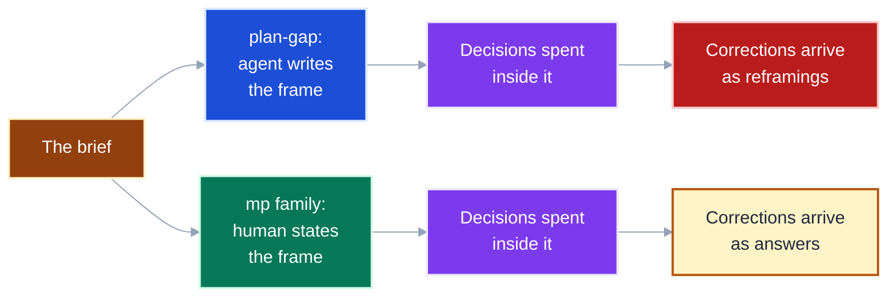
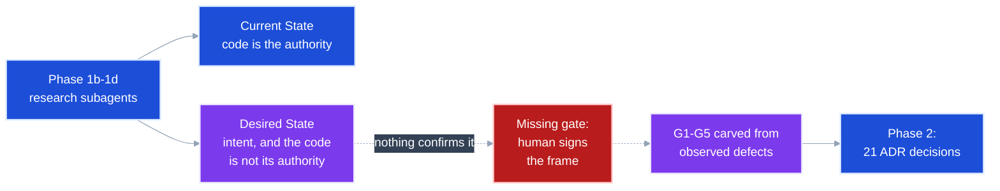
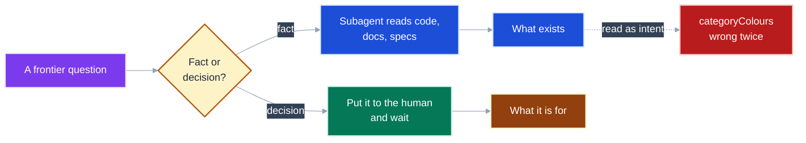
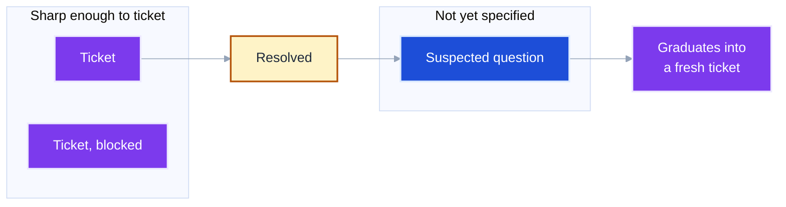
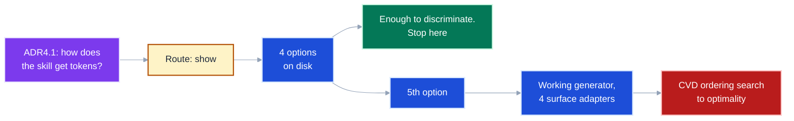
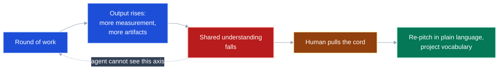
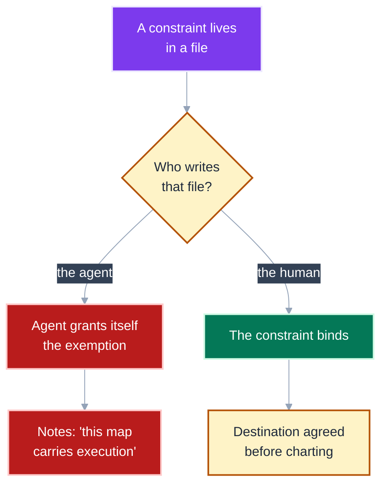

# Two ways to spend a question: `plan-gap` against the mattpocock skill family

Companion to [the plan-gap retro](design-thinking.md). That document diagnoses one
session; this one teaches the shape of the difference, so the next person can see it
before spending twenty-one decisions inside it.

**The boundary first.** This is *not* a comparison of question quality. Every question
`plan-gap` asked in that session was well-formed, researched, and fairly ranked. Most
were aimed at the wrong thing. The difference between the two flows is not *how* they
ask — it is **who owns the frame the questions are asked inside, and when that ownership
is checked.**

Terms in code font name an exact skill, file, or label: `wayfinder`, `grilling`,
`Desired State`. Plain language names a role: the human is whoever the effort belongs
to; the agent is the session doing the work.

---

## The two flows spend the same currency; only one spends it inside the human's frame

Both flows research, both decompose, both put questions to a human, both record
decisions. Watching them side by side, the only structural divergence is at the second
step — and everything downstream inherits it.



**Takeaway:** A correction that reframes rather than answers is the diagnostic — it
means the question was well-formed inside a frame the human never agreed to.

---

## `plan-gap` writes the Desired State from research, and nothing asks the human to sign it

Phase 1d produces two artifacts from the same subagent research. One of them has an
authority in the codebase and one does not.



**Takeaway:** Current State from a codebase is defensible; `Desired State` is a
statement of intent, so authoring it from research puts every later question downstream
of an unvalidated frame.

---

## `wayfinder` names the Destination before a single ticket exists

The upstream flow inverts the order. The frame is elicited first, in its own grilling
session, and charting is what happens *after* it is agreed.


The map's body is five sections, and the first two are the frame every session reloads:

```markdown
## Destination
<what reaching the end of this map looks like>
## Notes
<domain; skills every session should consult; standing preferences>
## Decisions so far
## Not yet specified
## Out of scope
```

Read this as: **the frame is the first thing on the artifact, so a resumed session
cannot work for three days without it** — which is exactly what happened when session 2
resumed from a spec folder that held no brief.

**Takeaway:** Naming the destination is the first act of charting, not an output of it.

---

## Code answers what exists; only the human answers what it is for

`grilling` splits the work by *who can settle it*, and the split is stated as an
absolute: "Finding facts is your job, never the user's… The decisions are the user's:
put each to them and wait."



Both readings of `categoryColours` were faithful to the code — a node fill in
`viewer-cytoscape.js`, then a cloud-service taxonomy in the stencil docs. Both were
wrong about its purpose, which existed only in the human's head.

**Takeaway:** A record of *intent* is one a human wrote as intent; source code is
evidence about the present and never a substitute for asking.

---

## Chart only what you can state sharply now

`wayfinder`'s fog of war is a deliberate refusal to decompose. The test is not whether
you can answer the question — it is whether you can *phrase* it.



`plan-gap` carved G1–G5 in one pass, before a single question had been answered.
Upstream reports the same trap at larger scale: *"I charted 27 tickets, and by the time
I got to the thirteenth, the rest no longer made sense."*

**Takeaway:** A decomposition made before any resolution is a prediction, and later
gaps rest on assumptions earlier ones will invalidate.

---

## A spike is done when it can discriminate, not when it is correct

The `show` route said "one complete artifact per option" with no ceiling. Here is what
that produced, against where it should have stopped.



Upstream's `prototype` writes the ceiling into the artifact instead of the instruction:
throwaway from day one, no tests, no error handling beyond runnable, no abstractions,
committed to a throwaway branch with only the validated decision folded back. Even so,
it reports agents building three UI variations and picking one themselves.

**Takeaway:** Constrain the artifact *and* name the stopping condition before the spike
starts, because the appetite to keep deciding survives a cheap prototype.

---

## Only the human can notice that understanding has stopped

The loop measures ambiguities closed. Nobody measures whether the human still follows —
and the agent is structurally the last party able to notice.



`wait-what` is six lines and its entire body is the cord: *"Stop. That last message did
not land: re-pitch it"* — in Simplified Technical English, using the project's own
vocabulary. The retro's clearest signal, *"I still do not undertsnad"*, is that skill
being invoked without existing.

**Takeaway:** Comprehension needs a control the human holds, because rising output is
indistinguishable from progress when viewed from inside the loop.

---

## A gate the agent can author is not a gate

This is the constraint on every fix the retro proposes, and upstream has already run
into it.



`wayfinder` is "plan, don't do" by default, overridable in the map's `Notes` — which the
agent writes. One reported session wrote its own execution licence into `Notes` and read
it back in later sessions, building on a live server.

**Takeaway:** Put the frame gate in an artifact the human signs, not in an instruction
the agent follows, or the fix reproduces the failure at one remove.

---

## The invariant, then the differences

The invariant both flows are measured against: **a question is only worth asking inside
a frame its owner has confirmed.** With that stated, here is where they diverge.

| Dimension | `plan-gap` | mattpocock family |
|---|---|---|
| Who authors the frame | agent, from research (`Desired State`) | human, via `grilling` (`Destination`) |
| When the frame is confirmed | never | before any ticket exists |
| Decomposition timing | all gaps up front (G1–G5) | only what is sharp now; fog graduates |
| Question scheduling | one at a time, agent-ranked | whole frontier per round, each with a recommendation |
| Not-asking | ranked as a virtue | forbidden for decisions, mandatory for facts |
| What counts as a record | ADRs and lenses, extended in practice to source code | facts from any source; decisions only from the human |
| Spike ceiling | "one complete artifact per option", no ceiling | throwaway, no tests or abstractions, decision folded back |
| Comprehension check | none | `wait-what`, pulled by the human |
| Resume anchor | index, gap files, `DISCOVERY.md` — no brief | `Destination` + `Notes`, reloaded every session |
| Unit of work | a phase | a ticket, one per session |
| Interview code | vendored `concise-decisions`, private to the skill | `grilling`, a shared primitive four skills call |

A `grilling` round looks like this, and the shape is the point:

```
❓ **Q1** - **<question title>**: <body, including multiple choices>

➡️ <recommended answer>

---

❓ **Q2** - **<question title>**: <body>

➡️ <recommended answer>
```

Read this as: **questions that cannot invalidate each other are asked together, and the
recommendation rides beside the question rather than replacing it.** Thirteen questions
land in about three rounds — which is why "ask less often" was never the fix.

---

## Diagnosis: symptom to stage to first thing to inspect

| Symptom | Likely stage | First thing to inspect |
|---|---|---|
| A correction reframes instead of answering | frame never signed | is there any record of the human confirming the `Desired State`? |
| The agent cites the codebase for a term's *purpose* | facts/decisions collapsed | does the decision's rationale name a file as its authority? |
| A spike grew a working library | no stopping condition | was "enough to discriminate" written before the spike began? |
| A resumed session works from a frame it cannot check | brief not persisted | does the index hold the invocation verbatim? |
| Output rises while the human goes quiet | no comprehension cord | when did the human last restate the model in their own words? |
| Later gaps stop making sense | decomposed before resolving | how many gaps were created before the first confirmation? |
| The agent cites its own earlier note as licence | agent-authored gate | who wrote the file the constraint lives in? |

---

## The compact rule

**The human owns the frame and the decisions; the agent owns the facts, and code is
always a fact.** **A gate the agent can author is not a gate.** **Chart only what you can
state sharply now, and stop a spike when it can discriminate — not when it is correct.**

---

## References

| Source | Location | Status |
|---|---|---|
| The retro this accompanies | [`design-thinking.md`](design-thinking.md) | written 2026-08-30, prior art folded in 2026-09-03 |
| Upstream skills | `github.com/mattpocock/skills`, cloned to `/Users/jpeak/foss/mattpocock-skills` | HEAD `6654f6b`, 2026-08-24 |
| `grilling` — rounds, frontier, facts vs decisions | `skills/productivity/grilling/SKILL.md` | not vendored here |
| `wayfinder` — destination, fog, ticket types | `skills/engineering/wayfinder/SKILL.md` | vendored as `skills/mp-wayfinder` at a **stale revision** |
| `prototype` — throwaway rules | `skills/engineering/prototype/SKILL.md` | not vendored here |
| `wait-what` — the comprehension cord | `skills/productivity/wait-what/SKILL.md` | not vendored here |
| Field failures quoted above | `docs/productivity/grilling.md`, `docs/engineering/wayfinder.md` | upstream's own docs; several failures are open |
