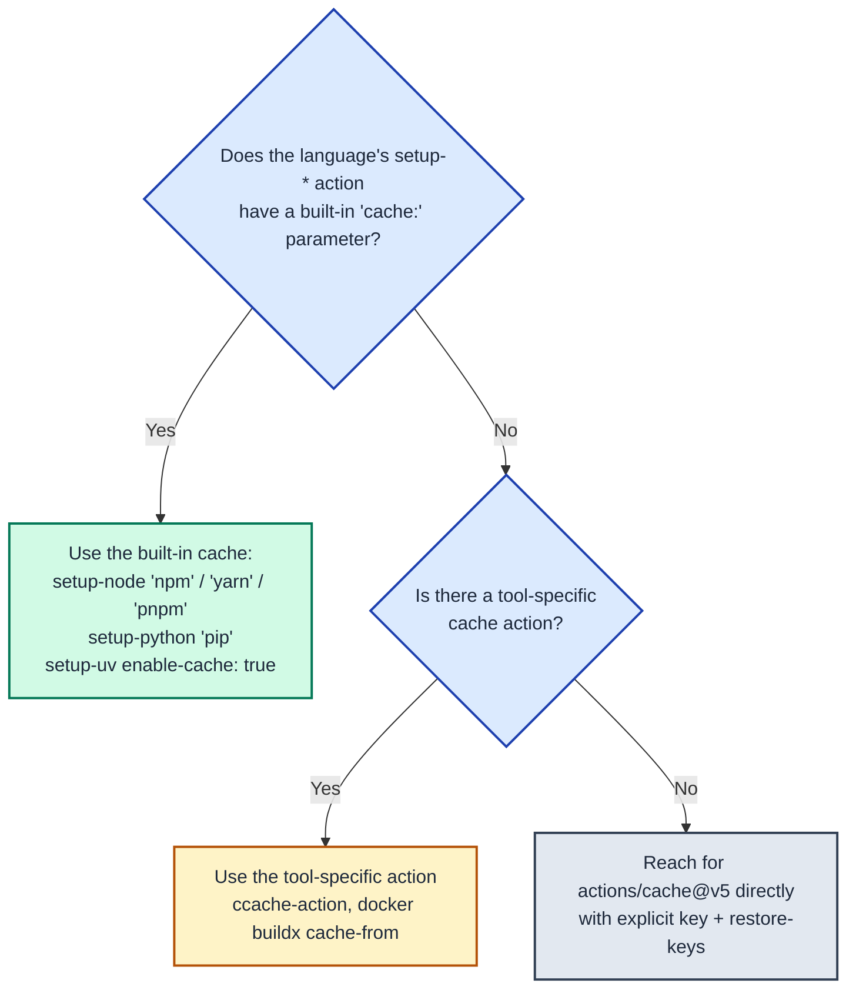

---
paths:
  - ".github/workflows/*.yml"
  - ".github/workflows/*.yaml"
---

# GitHub Actions: Caching

A correct cache turns a 4-minute install into a 10-second restore. A wrong cache silently keeps stale dependencies, hides reproducibility bugs, and eats the repo's 10 GB cache quota until the eviction policy starts trashing useful entries. This file documents the patterns to use and the failure modes to avoid.

For the action versions referenced below, see `latest-versions.md` in this same directory — keep version pins consistent across both files.

## Decision tree: which mechanism

Pick the **topmost option that applies** — earlier options are simpler, less error-prone, and require no key management.



| Scenario | Mechanism |
| --- | --- |
| Node + npm/yarn/pnpm | `actions/setup-node@v6` with `cache:` parameter |
| Python + pip | `actions/setup-python@v6` with `cache: 'pip'` |
| Python + uv | `astral-sh/setup-uv@v8` with `enable-cache: true` |
| Bun | `actions/cache@v5` on `~/.bun/install/cache` (setup-bun has no built-in cache) |
| pnpm with store-path control | `pnpm/action-setup@v6` + explicit `actions/cache@v5` on the store |
| C/C++ compilation | `hendrikmuhs/ccache-action@v1.2.22` |
| Docker images | `cache-from: type=gha` / `type=registry` on `docker/build-push-action@v7` |
| Terraform providers | `actions/cache@v5` on `~/.terraform.d/plugin-cache` |
| Playwright browsers | `actions/cache@v5` on `~/.cache/ms-playwright` |
| Framework build artifacts (`.next/cache`, `.turbo`, `.nuxt`) | `actions/cache@v5` |

## Cache key design

A cache key is a fingerprint of the inputs that produced the cached output. Three rules:

### 1. Hash the lockfile, never the manifest

```yaml
key: ${{ runner.os }}-deps-${{ hashFiles('**/uv.lock') }}      # CORRECT
key: ${{ runner.os }}-deps-${{ hashFiles('**/pyproject.toml') }} # WRONG — manifest changes don't reflect resolved deps
```

Lockfiles capture the fully resolved dependency graph, so the hash changes if and only if the actual installed bytes change. Manifests can change (version bump, new comment) without changing what gets installed, and can stay the same while transitive deps drift.

### 2. Scope by `runner.os`

`${{ runner.os }}` (`Linux`, `macOS`, `Windows`) MUST appear in every cache key for binary or compiled artifacts (Python wheels, Node native modules, ccache output, Playwright browsers). Cross-OS cache restore is undefined behavior at best and a silent break at worst.

### 3. Provide `restore-keys` for graceful degradation

```yaml
key: ${{ runner.os }}-pnpm-store-${{ hashFiles('**/pnpm-lock.yaml') }}
restore-keys: |
  ${{ runner.os }}-pnpm-store-
```

If the exact key misses, GitHub walks `restore-keys` from top to bottom and restores the most recent partial match. This turns a clean `npm install` (60 seconds) into an incremental one (10 seconds), even when the lockfile changes. Without `restore-keys`, every lockfile change pays full install cost.

**Order `restore-keys` from most-specific to least-specific.** Common pattern: include OS, drop the lockfile hash. For multi-axis keys (OS + Node major + lockfile), drop the lockfile first, then the Node version.

## Per-tool patterns

### uv (Python) — preferred

```yaml
- uses: astral-sh/setup-uv@v8
  with:
    enable-cache: true
    cache-dependency-glob: "**/uv.lock"   # default; override only for monorepos with non-standard locations

- run: uv sync --frozen
```

`enable-cache: true` caches `~/.cache/uv` keyed automatically on the lockfile hash. No manual `actions/cache` step needed. Always pair with `uv sync --frozen` so the lockfile is enforced; without `--frozen`, `uv` may resolve fresh and silently invalidate the cache assumption.

For workflows that don't use `setup-uv`'s built-in caching (older projects, exotic layouts), the manual fallback is:

```yaml
- uses: actions/cache@v5
  with:
    path: .venv
    key: venv-${{ runner.os }}-${{ hashFiles('uv.lock') }}
- run: uv sync --frozen
```

This caches the populated `.venv` directly. Faster restore than a fresh resolve, but ties cache validity to the exact `runner.os` and Python minor version.

### Bun (TypeScript) — manual cache required

`oven-sh/setup-bun@v2` does **not** offer a built-in `cache:` parameter (unlike setup-node). Wire it explicitly:

```yaml
- uses: oven-sh/setup-bun@v2
  with:
    bun-version: latest

- uses: actions/cache@v5
  with:
    path: ~/.bun/install/cache
    key: ${{ runner.os }}-bun-${{ hashFiles('**/bun.lock') }}
    restore-keys: |
      ${{ runner.os }}-bun-

- run: bun install --frozen-lockfile
```

`--frozen-lockfile` is the install-time equivalent of `--frozen` in uv: fail fast if `bun.lock` is out of sync with `package.json`, instead of silently re-resolving.

### Node + npm / yarn / pnpm — built-in via setup-node

```yaml
- uses: actions/setup-node@v6
  with:
    node-version-file: '.nvmrc'
    cache: 'npm'                                   # or 'yarn' or 'pnpm'
    cache-dependency-path: '**/package-lock.json'  # only needed for monorepo / non-root lockfile

- run: npm ci
```

`cache:` keys on the lockfile hash automatically. `npm ci` (not `npm install`) enforces the lockfile and refuses to mutate it. Equivalent: `yarn install --frozen-lockfile`, `pnpm install --frozen-lockfile`.

For pnpm with explicit control over the store path (e.g., to share between jobs):

```yaml
- uses: pnpm/action-setup@v6
  with:
    version: 10

- name: Get pnpm store directory
  shell: bash
  run: echo "STORE_PATH=$(pnpm store path --silent)" >> $GITHUB_ENV

- uses: actions/cache@v5
  with:
    path: ${{ env.STORE_PATH }}
    key: ${{ runner.os }}-pnpm-store-${{ hashFiles('**/pnpm-lock.yaml') }}
    restore-keys: |
      ${{ runner.os }}-pnpm-store-

- run: pnpm install --frozen-lockfile
```

### Python pip — built-in via setup-python

```yaml
- uses: actions/setup-python@v6
  with:
    python-version-file: '.python-version'
    cache: 'pip'
    cache-dependency-path: |
      requirements*.txt
      pyproject.toml

- run: pip install -r requirements.txt
```

For projects on `uv`, prefer the `setup-uv` path above — it's faster and the cache key handling is built for `uv.lock`.

### ccache (C/C++ compilation)

```yaml
- name: ccache
  uses: hendrikmuhs/ccache-action@v1.2.22
  with:
    key: ${{ runner.os }}-${{ matrix.arch }}     # one cache per OS/arch combo
    max-size: 200M
    evict-old-files: 1d                          # keep cache fresh; old entries cost more than they save
```

`max-size` keeps a single ccache entry small enough that several variants (debug/release, multiple arches) fit under the 10 GB repo quota. `evict-old-files: 1d` aggressively prunes stale objects — without it, a long-lived ccache fills with rebuilt-once-never-again output and the hit rate falls.

The `ggml-org/ccache-action` fork also exists; it tracks the same upstream and is interchangeable. Prefer `hendrikmuhs/ccache-action` unless a specific patch is needed.

### Docker buildx — three cache backends

```yaml
- uses: docker/setup-buildx-action@v4

- uses: docker/build-push-action@v7
  with:
    cache-from: type=gha
    cache-to: type=gha,mode=max
```

| Backend | When to use | Trade-off |
| --- | --- | --- |
| `type=gha` | Default for most workflows. Backed by GitHub's Actions cache. | Counts against the 10 GB repo cache quota. Per-branch isolation. |
| `type=registry,ref=...` | Sharing cache across repos, branches, or with non-CI builds. No size limit. | Requires registry write credentials. Costs registry storage. |
| `type=local,dest=/tmp/.buildx-cache` | Combined with `actions/cache@v5` on `/tmp/.buildx-cache`. | Two cache layers stacked — usually not worth the complexity. Avoid. |

`mode=max` exports cache layers for **all** stages (intermediate + final). Without it (`mode=min`, the default), only the final stage exports — which means multi-stage builds re-run intermediate stages on every build.

### Terraform plugin cache

```yaml
env:
  TF_PLUGIN_CACHE_DIR: ${{ github.workspace }}/.terraform.d/plugin-cache

steps:
  - run: mkdir -p $TF_PLUGIN_CACHE_DIR

  - uses: actions/cache@v5
    with:
      path: ${{ env.TF_PLUGIN_CACHE_DIR }}
      key: ${{ runner.os }}-tf-plugins-${{ hashFiles('**/.terraform.lock.hcl') }}
      restore-keys: |
        ${{ runner.os }}-tf-plugins-

  - uses: hashicorp/setup-terraform@v4

  - run: terraform init
```

`TF_PLUGIN_CACHE_DIR` makes `terraform init` reuse providers across runs, which is the slow part of `init` (provider downloads can be 50-200 MB each). Key on `.terraform.lock.hcl` — that's where pinned provider versions live.

### Playwright browsers

```yaml
- uses: actions/cache@v5
  id: pw-cache
  with:
    path: ~/.cache/ms-playwright
    key: playwright-${{ runner.os }}-${{ hashFiles('**/bun.lock') }}
    restore-keys: |
      playwright-${{ runner.os }}-

- name: Install Playwright browsers
  if: steps.pw-cache.outputs.cache-hit != 'true'
  run: bunx --bun playwright install --with-deps chromium
```

Browser binaries are 100-300 MB per browser. The conditional `if:` skips the download entirely on cache hit. Replace `bun.lock` with whatever lockfile pins the Playwright version (`package-lock.json`, `pnpm-lock.yaml`, `uv.lock`).

### Framework build caches

```yaml
- uses: actions/cache@v5
  with:
    path: |
      .next/cache
      .turbo
    # Generate a new cache whenever packages or source files change.
    key: nextjs-${{ hashFiles('**/yarn.lock') }}-${{ hashFiles('**/*.{js,jsx,ts,tsx}') }}
    # If source files changed but packages didn't, rebuild from a prior cache.
    restore-keys: |
      nextjs-${{ hashFiles('**/yarn.lock') }}-
```

The two-component key is the canonical pattern for build caches: lockfile hash (rare changes) + source hash (frequent changes). The `restore-keys` fallback strips the source hash so a partial cache is still useful when source changes but deps don't.

## The `cache-hit` conditional install pattern

When restore is expensive but install is also expensive, use the cache step's `id:` and `outputs.cache-hit` to skip install entirely:

```yaml
- uses: actions/cache@v5
  id: deps-cache
  with:
    path: node_modules
    key: nm-${{ runner.os }}-${{ hashFiles('package-lock.json') }}

- name: Install dependencies
  if: steps.deps-cache.outputs.cache-hit != 'true'
  run: npm ci
```

`cache-hit` is `'true'` (string) only on **exact key match**. A `restore-keys` partial match leaves it `'false'`. That's usually what you want — partial restore should still trigger the install step to fix up missing pieces.

## Cache scope and limits

These are the operational realities, not preferences:

| Limit | Value | Implication |
| --- | --- | --- |
| Repo cache quota | **10 GB** | Sum of all cache entries. Oldest entries evicted first when full. |
| Per-cache entry size | **10 GB** | Single entry can't exceed quota. |
| Entry retention | **7 days** unaccessed | Touched on restore; idle entries evicted. |
| Branch scope | Branch + base branch | A `feature/x` branch reads its own cache + the default branch's. Cross-branch pollution does not happen. |
| PR scope | PR + base | A PR cache is readable by the PR and by the base branch's workflows. |

Implications:
- **Don't cache everything.** Caching a 2 GB compiler output that takes 30 seconds to rebuild wastes quota that could hold ten 200 MB entries that take 5 minutes each to rebuild.
- **Don't cache compiled binaries that are platform-specific without including the platform in the key** — restoring a Linux binary on macOS will silently break.
- **Default-branch builds populate the cache for PRs.** A clean main-branch build runs first; PRs benefit. If main is broken, PR caches go stale.

## Anti-patterns

| Anti-pattern | Why it fails | Correct approach |
| --- | --- | --- |
| `key: ${{ hashFiles('package.json') }}` | Manifest hash doesn't reflect resolved versions; cache stale | Hash the lockfile |
| Caching `node_modules` directly | OS-specific, fragile, often slower than re-running `npm ci` from cached `~/.npm` | Cache the package manager's store/cache dir, not `node_modules` |
| Same key across OSes | Restoring a Linux binary on Windows silently breaks | Always include `${{ runner.os }}` |
| No `restore-keys` | Every lockfile change pays full install cost | Always provide a `restore-keys` fallback |
| Setting `key:` to a constant string | Cache never updates; permanently stale | Key MUST include a content hash that changes when inputs change |
| `bun install` (no `--frozen-lockfile`) in CI | Silently re-resolves on lockfile drift; cache assumptions wrong | `bun install --frozen-lockfile` (or `npm ci`, `pnpm install --frozen-lockfile`, `uv sync --frozen`) |
| `cache:` on setup-node + manual `actions/cache` on `node_modules` | Two layers of caching — confusing, often conflicting | Pick one: built-in cache OR explicit |
| Not pinning `cache-dependency-path` in monorepos | Hashes the wrong file or hashes too many files | Set explicit glob to the relevant lockfile(s) |
| `mode=min` on Docker buildx for multi-stage builds | Intermediate stages re-run on every build | `mode=max` to export all stage caches |
| ccache with no `max-size` or `evict-old-files` | Cache grows unbounded, hit rate drops over time | Always set both — `max-size: 200M`, `evict-old-files: 1d` |

## Project-local caches

For caches that live alongside a script (not in CI), follow the project rule in `.claude/rules/caching.md`:

- Default cache TTL: **300 seconds (5 minutes)** for ephemeral local caches.
- Cache location: `tmp/claude_cache/{script_name}/` — never `/tmp/`.
- Cache validity = (cache newer than all inputs) AND (cache not expired).

CI caches are the inverse — long-lived, content-addressed by lockfile hash, not time-bounded. Don't conflate the two regimes.
