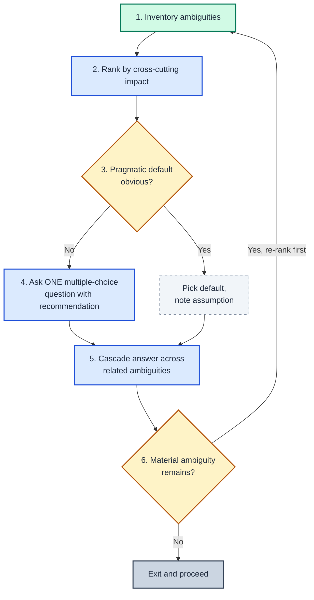

# Attention Is Scarce (AIS)

> Every question to the user is a tax on their attention. Spend it like
> the scarcest resource in the loop — because it is.

When ≥ 2 open decisions are blocking work, run this loop instead of asking a
chain of questions: pick the **single highest-leverage** question, ship it
with a recommended default, then cascade the answer across the rest.

See `SKILL.md` for invocation triggers, pragmatic-default criteria, framing
rules, output template, and anti-patterns.
