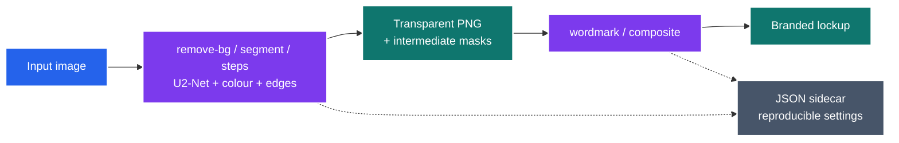
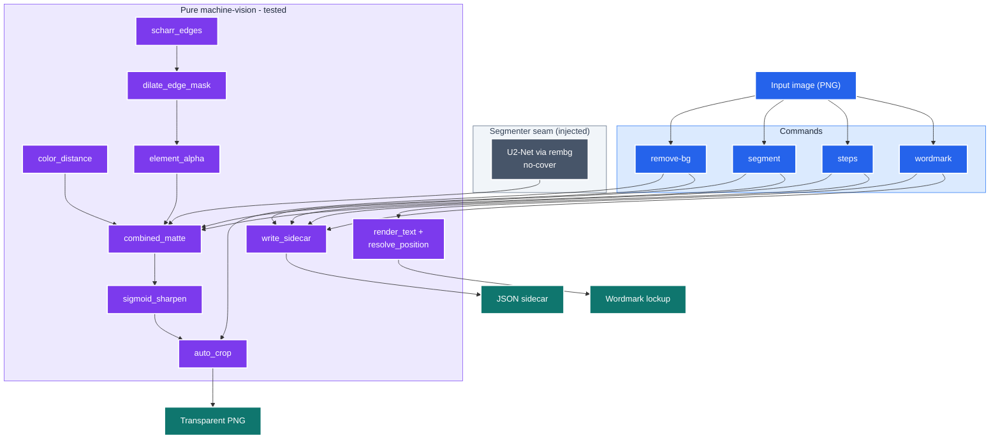

# art-edit

Deterministic, **offline** image post-processing: background removal, multi-signal alpha
matting, a pipeline visual-debugger, and two-tone wordmark composition. Every output is
written with a JSON sidecar recording the exact settings, so any edit is reproducible.

`art-edit` is the offline companion to [`art-gen`](../art-gen/README.md). Once you have a
keeper image (AI-generated or otherwise), `art-edit` does the deterministic work — no API
key, no network, no per-image cost.

---

<details>
<summary><b>Table of Contents</b></summary>
<!--TOC-->

- [art-edit](#art-edit)
  - [Quickstart](#quickstart)
  - [Architecture](#architecture)
  - [Requirements](#requirements)
  - [Commands](#commands)
  - [Command reference](#command-reference)
  - [The matte pipeline (what `segment` / `steps` compute)](#the-matte-pipeline-what-segment--steps-compute)
  - [Sidecars (reproducible edits)](#sidecars-reproducible-edits)
  - [Wordmark & configuration](#wordmark--configuration)
  - [Typical workflow](#typical-workflow)
  - [Troubleshooting](#troubleshooting)
  - [For maintainers](#for-maintainers)

<!--TOC-->
</details>

---

## Quickstart

Install the skill into your project:

```bash
npx skills@latest add neozenith/agentic-dotfiles --skill art-edit
```

Then invoke it in Claude Code with a natural-language brief:

```text
/art-edit cut out the background of art/gen/logo.png and add a "SUMMIT" wordmark
```

Or drive the script directly:

```bash
# Transparent PNG via the U2-Net model, auto-cropped to content
uv run .claude/skills/art-edit/scripts/art_edit.py remove-bg in.png -o logo.png

# Fast, model-free removal (good for clean white backgrounds)
uv run .claude/skills/art-edit/scripts/art_edit.py remove-bg in.png --mode global -o out.png
```

## Architecture

An input image fans into the deterministic commands; background removal and matting share
one pure pipeline, and every command emits a settings sidecar for reproducibility.



*Cut out → matte → brand, with a sidecar at each step.* | VCS: 6.0 ✅

<details>
<summary>Complete diagram (18 nodes) — pure primitives, segmenter seam, commands</summary>



The **segmenter seam** (U2-Net via rembg) is the only model-backed, network-touching part;
the **pure machine-vision** primitives are tested offline on tiny synthetic arrays. See
[`CLAUDE.md`](./CLAUDE.md) for the rationale (ADR-002/003/010).

</details>

## Requirements

| Need | Why |
|------|-----|
| `uv` on `PATH` | Deps (`Pillow`, `numpy`, `rembg`, `onnxruntime`) are declared inline (PEP 723) and built on first run. |
| ~170 MB one-time download | The first `--mode model` / `segment` / `steps` run fetches the U2-Net weights into the rembg cache. Every run after is fully offline. |

No API key. No network for the deterministic paths.

## Commands

| Command | What it does |
|---------|--------------|
| `remove-bg` | Background → transparent PNG, auto-cropped. `--mode model` (U2-Net, preserves white subject detail) or `--mode global` (threshold distance-from-white, no model download). |
| `segment` | Multi-signal alpha matte — U2-Net **+** colour-distance **+** Scharr-edge signals, combined and sigmoid-sharpened, saving every intermediate mask. |
| `steps` | **Visual debugger** for the matte: per stage a mask / this-step / cumulative triple, plus a `README.md` table rendering them side by side. |
| `wordmark` | Compose the icon with a two-tone text wordmark using normalised positioning + anchors. |
| `composite` | Convenience chain: `remove-bg` (model) → `wordmark`. |


## Command reference

All commands share `input`, `-o/--output`, `--config`, `-v/--verbose`, `-q/--quiet`.

```bash
remove-bg  in.png [--mode model|global] [--tolerance 30] [--edge-softness 2] [-o out.png]
segment    in.png [--white-tolerance 15] [--grey-ref 30] [--sharpen 12] [--output-dir D]
steps      in.png [--white-tolerance 15] [--grey-ref 30] [--sharpen 12] [--output-dir D]
wordmark   in.png [--text T] [--split-at N] [--font F] [--font-size N] [--canvas W,H] [--config C]
composite  in.png [--text T] [--config C] [-o out.png]
```

## The matte pipeline (what `segment` / `steps` compute)

Three signals are combined so the matte keeps faint, structural, and white-subject detail
that any single method drops:

1. **U2-Net semantic mask** — finds the foreground subject (keeps white details a colour
   threshold would erase).
2. **Colour distance from white** — keeps any clearly non-white content.
3. **Scharr edges → dilated envelope × `max(grey, warmth, darkness)` alpha** — rescues
   anti-aliased boundary pixels of neutral lines, warm edges, and dark outlines.

`final alpha = sigmoid_sharpen(max(semantic, colour, edge))`, then auto-crop.

| Tuning flag | Effect |
|-------------|--------|
| `--white-tolerance` | How far from white still counts as background |
| `--grey-ref` | Colour distance that maps to full opacity in edge regions |
| `--sharpen` | Sigmoid steepness: `0` off, `12` crisp, `30+` near-binary |

Run **`steps` first to *see* each signal**, then tune those flags on `segment`.

## Sidecars (reproducible edits)

Every command writes a JSON sidecar next to its output — including the `steps`
visualisation — so re-applying an edit is just reading the settings back.

```jsonc
// remove-bg → o.json
{ "command": "remove-bg", "input": "in.png", "timestamp": "20260601_120500",
  "params": { "mode": "model", "tolerance": 30, "edge_softness": 2 }, "outputs": ["o.png"] }

// steps → steps.json
{ "command": "steps", "input": "in.png", "timestamp": "20260601_120730",
  "params": { "white_tolerance": 15, "edge_softness": 2, "grey_reference": 30, "sharpen": 12 },
  "outputs": ["00_original.png", "01_result_u2net.png", "…", "08_result_final.png"] }
```

## Wordmark & configuration

`wordmark` / `composite` read an optional `--config` JSON (canvas, background, icon
placement, two-tone colours, split point, font). Positions are normalised `0.0–1.0` with
an anchor: `(0.0,0.0)` = top-left, `(0.5,0.5)` = centre, `(1.0,1.0)` = bottom-right. A
neutral starting config is in [`reference/config.example.json`](./reference/config.example.json).
CLI flags override config values. Font size is clamped to a renderable minimum, and a
bundled font is used when no system font is found — so it works cross-platform.

```bash
uv run .claude/skills/art-edit/scripts/art_edit.py wordmark logo.png \
    --text MYBRAND --split-at 3 --config .claude/skills/art-edit/reference/config.example.json
```

## Typical workflow

```bash
# 1. Pick a keeper from art-gen, debug the matte visually
uv run .claude/skills/art-edit/scripts/art_edit.py steps art/gen/art_…_0.png --output-dir art/steps
open art/steps/README.md

# 2. Tune and produce the final transparent matte
uv run .claude/skills/art-edit/scripts/art_edit.py segment art/gen/art_…_0.png \
    --output-dir art/seg --white-tolerance 12 --sharpen 16

# 3. Add a wordmark
uv run .claude/skills/art-edit/scripts/art_edit.py wordmark art/seg/final.png --text MYBRAND -o brand.png
```

## Troubleshooting

| Symptom | Cause / fix |
|---------|-------------|
| First model run is slow / downloads | One-time U2-Net fetch (~170 MB); cached afterward. |
| `--mode global` leaves white halo inside the subject | Use `--mode model`, or raise `--tolerance`. |
| Matte too soft / jagged | Raise `--sharpen` (12 → 20). Inspect with `steps`. |
| Wordmark text clipped or tiny | Increase `--canvas` or `--font-size`; size is clamped to a 16px minimum. |

## For maintainers

The development contract and design rationale (ADRs) live in [`CLAUDE.md`](./CLAUDE.md).
The gate is `make -C .claude/skills/art-edit/scripts ci`.
