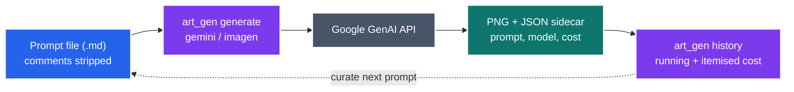
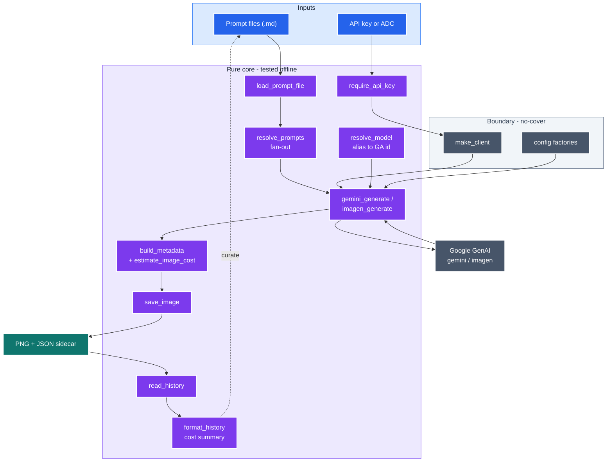

# art-gen

Generate images from curated text prompts using Google's GenAI image models, with a
JSON sidecar recording exactly how each image was made — so an exploration is
reproducible and the next prompt can be curated from the prompts that worked.

`art-gen` is the **online, non-deterministic** half of an image workflow. Its companion,
[`art-edit`](../art-edit/README.md), is the **offline, deterministic** post-processor
(background removal, matting, wordmark). Generate with `art-gen`; refine with `art-edit`
so you don't pay for a fresh generation every time you only need a transparent
background or a text overlay.

---

<details>
<summary><b>Table of Contents</b></summary>
<!--TOC-->

- [art-gen](#art-gen)
  - [Quickstart](#quickstart)
  - [Architecture](#architecture)
  - [Requirements](#requirements)
  - [Backends](#backends)
  - [The prompt file (maximise every token)](#the-prompt-file-maximise-every-token)
  - [Command reference](#command-reference)
    - [`generate`](#generate)
    - [`history`](#history)
  - [Examples](#examples)
  - [Output & sidecars](#output--sidecars)
    - [Estimated cost](#estimated-cost)
  - [The iteration loop](#the-iteration-loop)
  - [Troubleshooting](#troubleshooting)
  - [For maintainers](#for-maintainers)

<!--TOC-->
</details>

---

## Quickstart

Install the skill into your project:

```bash
npx skills@latest add neozenith/agentic-dotfiles --skill art-gen
```

Then invoke it in Claude Code with a natural-language brief:

```text
/art-gen a minimalist flat-vector compass rose icon, charcoal on white, no text — give me 3 variants
```

Or drive the script directly:

```bash
# 1. Write a prompt file (see reference/prompt_template.md for a starting point)
# 2. Generate
uv run .claude/skills/art-gen/scripts/art_gen.py generate --prompt-file prompt.md

# Review the output
ls art/gen/
#   art_20260601_120000_0.png   art_20260601_120000_0.json
```

## Architecture

A prompt file flows through generation to a timestamped PNG and a metadata sidecar; the
`history` view feeds the strongest prior prompts back into the next one.



*Generate → review → curate loop.* | VCS: 5.5 ✅

<details>
<summary>Complete diagram (15 nodes) — pure core, boundary seams, cost</summary>



The injected **boundary** (`make_client`, config factories) is the only part that imports
`google-genai`; everything in the **pure core** is tested offline with fakes. See
[`CLAUDE.md`](./CLAUDE.md) for the rationale (ADR-003/004/008).

</details>

## Requirements

| Need | Why |
|------|-----|
| One of two credentials | Either a non-empty `GOOGLE_API_KEY` (Gemini Developer API) **or** application-default credentials (Vertex AI). `--auth` picks; the default `auto` prefers the key, falls back to ADC, and says which it used. Neither available → it fails fast naming both remedies. |
| `uv` on `PATH` | The script declares its deps inline (PEP 723: `google-genai`, `Pillow`); `uv` builds the venv on first run. |
| Internet access | For the GenAI API call. |

```bash
# Option A — API key
export GOOGLE_API_KEY='…'

# Option B — no key allowed? Use your existing gcloud login (Vertex AI)
gcloud auth application-default login
gcloud auth application-default set-quota-project <PROJECT>
```

For ADC, the project resolves `--project` → `GOOGLE_CLOUD_PROJECT` → the ADC file's
`quota_project_id`; the location resolves `--location` → `GOOGLE_CLOUD_LOCATION` →
`global`. `CLOUDSDK_CONFIG` is honoured when locating the ADC file, so per-project gcloud
configurations work. Whichever mode ran is recorded in each sidecar under `auth`.

## Backends

| Backend | `--model` alias → API id | Best for |
|---------|--------------------------|----------|
| `gemini` (default) | `pro` → `gemini-3-pro-image` (Nano Banana Pro) | 4K, best text rendering, complex layouts |
| | `flash` → `gemini-3.1-flash-image` (Nano Banana 2) | Cheap high-volume iteration; supports 0.5K–4K |
| | `flash-2.5` → `gemini-2.5-flash-image` (Nano Banana) | The original; fast/cheap |
| `imagen` | `standard`/`ultra`/`fast` → `imagen-4.0-*-generate-001` | Photoreal standalone batches (`--count`); 1K/2K |

A raw model id passed to `--model` is forwarded verbatim. Ids are pinned to GA releases
(captured 2026-06-01) and do drift — re-verify against
[Google's model list](https://ai.google.dev/gemini-api/docs/models) when they change.


## The prompt file (maximise every token)

The prompt is the product. Write it in a markdown file. **Lines that begin with `#` (a
markdown heading) or `<!--` (an HTML comment) are stripped before the prompt is sent** —
use them to document concept and iteration history above the curated prompt body without
spending tokens on them.

```markdown
# My Subject — icon only (no text)
# CONCEPT: <what this is and why>
# STYLE NOTES (from iteration): <reinforce / avoid>

<the full curated prompt: subject, pose, style, exact palette with hex codes,
composition, and what to exclude — every word is signal>
```

Copy `reference/prompt_template.md` to start.

## Command reference

### `generate`

| Flag | Default | Description |
|------|---------|-------------|
| `--prompt TEXT` | — | Inline prompt (wins over `--prompt-file`) |
| `--prompt-file FILE` | — | Prompt markdown file; **repeatable** to fan out variants in one run |
| `--backend {gemini,imagen}` | `gemini` | Generation backend |
| `--model ALIAS` | backend default | `pro`/`flash`/`flash-2.5` (gemini) or `standard`/`ultra`/`fast` (imagen), or a raw model id |
| `--aspect RATIO` | `1:1` | gemini: `1:1 2:3 3:2 3:4 4:3 4:5 5:4 9:16 16:9 21:9 4:1 8:1 1:4 1:8`; imagen: only the first five |
| `--size {512,1K,2K,4K}` | model default | `512` is Nano-Banana-2 only; `4K` is gemini-only; imagen clamps to 1K/2K |
| `--count N` | `1` | Variants per prompt (imagen only) |
| `--ref IMG` | — | Reference image (repeatable; gemini only) |
| `--out-dir DIR` | `art/gen` | Output directory |

### `history`

Prints prior prompts/metadata oldest→newest from the sidecars in `--out-dir`, so you can
curate the next prompt from the ones that worked.

```bash
uv run .claude/skills/art-gen/scripts/art_gen.py history --out-dir art/gen
```

## Examples

```bash
# Fan out: one image per prompt file in a single run (e.g. pose variants)
uv run .claude/skills/art-gen/scripts/art_gen.py generate \
    --prompt-file pose_a.md --prompt-file pose_b.md --prompt-file pose_c.md --out-dir art/gen

# Imagen, 4 variants of one prompt at 2K
uv run .claude/skills/art-gen/scripts/art_gen.py generate \
    --backend imagen --model ultra --count 4 --size 2K --prompt-file prompt.md

# Gemini conditioned on a reference image
uv run .claude/skills/art-gen/scripts/art_gen.py generate \
    --prompt-file refine.md --ref art/gen/art_20260601_120000_0.png

# Inline one-shot (no file)
uv run .claude/skills/art-gen/scripts/art_gen.py generate \
    --prompt "A flat-vector compass rose, charcoal on white, no text."
```

## Output & sidecars

Each image is `art_<YYYYMMDD_HHMMSS>_<index>.png` with a matching `.json`:

```json
{
  "prompt": "…the exact text sent…",
  "model": "gemini-3-pro-image",
  "backend": "gemini",
  "timestamp": "20260601_120000",
  "index": 0,
  "dimensions": "1024x1024",
  "aspect": "1:1",
  "requested_size": null,
  "estimated_cost_usd": 0.134,
  "prompt_file": "prompt.md"
}
```

Timestamped filenames sort chronologically, and the sidecars preserve the full
provenance of a sweep.

### Estimated cost

Each sidecar records `estimated_cost_usd` — a budgeting estimate from the model id and the
**actual** output resolution. Gemini models are resolution-tiered (per output token);
Imagen is a flat per-image rate. It's `null` for an unrecognised model. `history` rolls
these up into a running total with a per-model breakdown:

```text
[0] art_20260601_134322_0.png  ($0.067, gemini-3.1-flash-image, 1:1)
    A flat-vector compass rose icon, charcoal on white, no text.
[1] art_20260601_134336_0.png  ($0.134, gemini-3-pro-image, 16:9)
    A flat-vector mountain range banner, charcoal on white, no text.

── Estimated cost summary ──
  gemini-3-pro-image         × 1   $0.134
  gemini-3.1-flash-image     × 1   $0.067
  Total (2 images): $0.201
```

Prices are a dated estimate captured 2026-06-01 from
[Google's pricing page](https://ai.google.dev/gemini-api/docs/pricing) — treat them as a
planning aid, not a billing record.

## The iteration loop

1. **Generate** a small fan-out of prompt-file variants.
2. **Look** at the PNGs; decide what worked.
3. Run **`history`** to re-read the exact prompts behind the good frames.
4. **Curate the next prompt** by grafting the strongest phrasing from one or more prior
   prompts into a new file (keep discarded ideas in `#` comments as a record).
5. Repeat. Hand the keeper to [`art-edit`](../art-edit/README.md) for a transparent
   background, crop, and any text/wordmark overlay.

## Troubleshooting

| Symptom | Cause / fix |
|---------|-------------|
| `No usable credentials` | Neither auth mode is available: export a `GOOGLE_API_KEY`, or run `gcloud auth application-default login`. |
| `GOOGLE_API_KEY is not set (or is empty)` | You passed `--auth api-key` explicitly. Export a non-empty key, or use `--auth adc`/`auto`. |
| `no GCP project could be resolved` | ADC was found but has no project. Pass `--project`, export `GOOGLE_CLOUD_PROJECT`, or run `gcloud auth application-default set-quota-project <PROJECT>`. |
| Wrong credential picked | `auto` prefers the API key. Force the other path with `--auth adc` (the chosen mode is logged and written to the sidecar). |
| `Prompt file is empty after stripping comments` | Every line started with `#`/`<!--`; add a prompt body. |
| 4K rejected on imagen | 4K is gemini-only; use `--size 2K`. |

## For maintainers

The development contract and the design rationale (ADRs) live in
[`CLAUDE.md`](./CLAUDE.md). The gate is `make -C .claude/skills/art-gen/scripts ci`.
