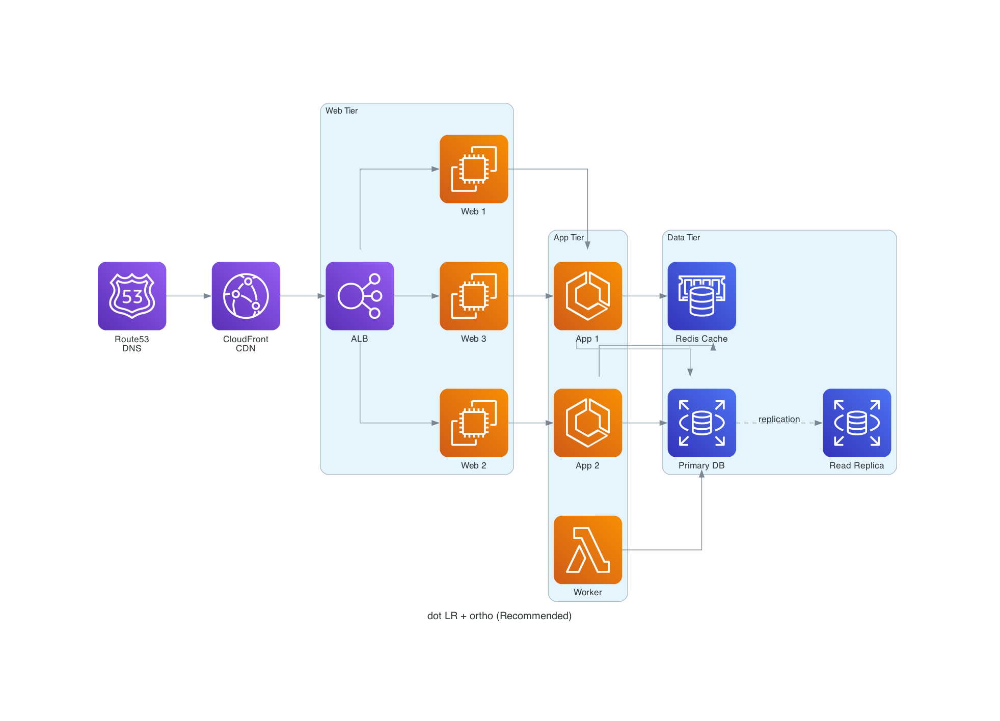
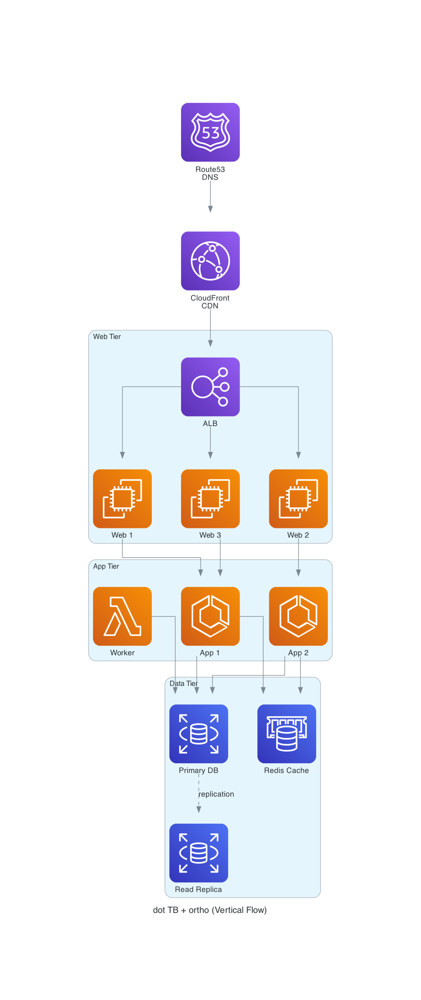

# AWS Architecture Diagrams with mingrammer/diagrams

Generate production-quality AWS architecture diagrams using the Python `diagrams` library with optimal Graphviz layout configuration.

## Quick Start

```python
# /// script
# requires-python = ">=3.9"
# dependencies = ["diagrams>=0.24"]
# ///
from diagrams import Cluster, Diagram, Edge
from diagrams.aws.compute import EC2, ECS, Lambda
from diagrams.aws.database import RDS, Elasticache
from diagrams.aws.network import ELB, CloudFront, Route53

with Diagram(
    "My Architecture",
    filename="my_arch",
    show=False,
    outformat="png",
    graph_attr={
        "rankdir": "LR",
        "splines": "ortho",
        "nodesep": "0.70",
        "ranksep": "0.90",
    },
):
    dns = Route53("DNS")
    cdn = CloudFront("CDN")

    with Cluster("Web Tier"):
        lb = ELB("ALB")
        web = [EC2("Web 1"), EC2("Web 2")]

    with Cluster("Data Tier"):
        db = RDS("Primary")
        cache = Elasticache("Redis")

    dns >> cdn >> lb >> web
    web[0] >> db
    web[1] >> cache
    db >> Edge(label="replication", style="dashed") >> RDS("Replica")
```

Run with: `uv run my_diagram.py`

## Recommended Layout Configurations

All examples below render the same 12-node, 3-tier AWS architecture (DNS -> CDN -> Web -> App -> Data). The source script is at `scripts/my_diagram.py` — to regenerate it, run it with: 

```sh
uv run .claude/skills/aws_diagrams_mingrammer/scripts/my_diagram.py
``` 

### 1. dot LR + ortho (Best for Architecture Diagrams)

**Use this as the default.** Produces clean, professional diagrams with left-to-right hierarchical flow and right-angle edge routing.



```python
graph_attr = {
    "rankdir": "LR",
    "splines": "ortho",
    "nodesep": "0.70",
    "ranksep": "0.90",
}
```

**Why this works best:**
- `rankdir=LR` matches how we read architecture flows (left-to-right: ingress -> compute -> data)
- `splines=ortho` gives clean right-angle edges that look professional and avoid visual clutter
- Default spacing provides good balance between density and readability
- Clusters are visually distinct with clear boundaries

### 2. dot LR + spline (Softer Alternative)

Same hierarchical layout with smoother curved edges. Better when diagrams have many crossing connections.


```python
graph_attr = {
    "rankdir": "LR",
    "splines": "spline",
    "nodesep": "0.70",
    "ranksep": "0.90",
}
```

**When to use:** When ortho edges create too many bends or overlapping right-angle paths. Curved splines handle edge-dense graphs more gracefully.

### 3. dot TB + ortho (Vertical Flow)

Top-to-bottom layout for request lifecycle or waterfall-style diagrams.



```python
graph_attr = {
    "rankdir": "TB",
    "splines": "ortho",
    "nodesep": "0.70",
    "ranksep": "0.75",
}
```

**When to use:** When the architecture has a strong vertical flow (e.g., user request -> API gateway -> service -> database) or when the diagram has few parallel paths.

**Caution:** TB layouts grow very tall with many tiers. Prefer LR for 3+ tier architectures.

## Layout Engine Reference

The `diagrams` library uses Graphviz under the hood. The engine is set via:

```python
with Diagram(...) as diag:
    diag.dot.engine = "dot"  # default
```

### Engine Comparison (Evaluated on 12-node 3-tier AWS Architecture)

| Engine | Best For | Cluster Support | Readability |
|--------|----------|-----------------|-------------|
| **dot** | Hierarchical/layered (directed graphs) | Excellent | Excellent |
| **neato** | Spring-model graphs (undirected) | Poor | Fair |
| **fdp** | Force-directed (undirected) | Poor | Poor |
| **sfdp** | Large force-directed graphs | None | Poor |
| **circo** | Cyclic/circular structures | None | Fair |
| **twopi** | Radial/concentric layouts | None | Poor (overlaps) |
| **osage** | Grid-based cluster packing | Good | Fair |

**Verdict: Always use `dot` for AWS architecture diagrams.** The other engines are designed for undirected graphs and do not respect the hierarchical, clustered structure that makes architecture diagrams readable.

## dot Engine: Graph Attributes Reference

### Direction (`rankdir`)

Controls the primary flow direction of the diagram.

| Value | Flow | Best For |
|-------|------|----------|
| `LR` | Left to Right | Architecture flows, data pipelines (recommended) |
| `TB` | Top to Bottom | Request lifecycles, waterfall flows |
| `RL` | Right to Left | Reverse flows (rare) |
| `BT` | Bottom to Top | Bottom-up compositions (rare) |

### Edge Routing (`splines`)

Controls how edges (arrows) are drawn between nodes.

| Value | Style | Best For |
|-------|-------|----------|
| `ortho` | Right-angle segments | Clean, professional diagrams (recommended) |
| `spline` | Smooth curves | Edge-dense graphs with many crossings |
| `curved` | Curved arcs | Artistic/informal diagrams |
| `polyline` | Straight segments with bends | Moderate complexity |
| `line` | Direct straight lines | Simple graphs, few edges |
| `false` | No edges drawn | Node-only layouts |

### Spacing

Controls the density and breathing room between nodes.

| Attribute | Default | Description |
|-----------|---------|-------------|
| `nodesep` | `0.70` | Space between nodes within the same rank (inches) |
| `ranksep` | `0.90` | Space between ranks/layers (inches) |

**Spacing presets:**

```python
# Compact — fits more on screen, edges may crowd
tight = {"nodesep": "0.25", "ranksep": "0.3"}

# Default — balanced readability
default = {"nodesep": "0.70", "ranksep": "0.90"}

# Breathing room — good for complex diagrams
loose = {"nodesep": "1.5", "ranksep": "2.0"}
```

### Cluster Behavior

| Attribute | Values | Description |
|-----------|--------|-------------|
| `compound` | `true`/`false` | Allow edges between clusters (not just nodes) |
| `newrank` | `true`/`false` | Use single global ranking ignoring cluster boundaries |
| `ordering` | `out`/`in` | Constrain left-to-right ordering of edges at a node |

### Full Recommended Configuration

```python
RECOMMENDED_GRAPH_ATTR = {
    "rankdir": "LR",
    "splines": "ortho",
    "nodesep": "0.70",
    "ranksep": "0.90",
    "fontsize": "12",
    "compound": "true",
}
```

## Diagram Patterns

### Multi-Tier Architecture

```python
with Diagram("3-Tier App", filename="three_tier", show=False,
             graph_attr={"rankdir": "LR", "splines": "ortho"}):

    ingress = Route53("DNS") >> CloudFront("CDN")

    with Cluster("Web Tier"):
        lb = ELB("ALB")
        webs = [EC2(f"Web {i}") for i in range(1, 4)]

    with Cluster("App Tier"):
        apps = [ECS(f"App {i}") for i in range(1, 3)]
        worker = Lambda("Worker")

    with Cluster("Data Tier"):
        db = RDS("Primary")
        replica = RDS("Replica")
        cache = Elasticache("Redis")

    ingress >> lb >> webs
    webs[0] >> apps[0]
    webs[1] >> apps[1]
    webs[2] >> apps[0]
    apps[0] >> [db, cache]
    apps[1] >> [db, cache]
    worker >> db
    db >> Edge(label="replication", style="dashed") >> replica
```

### Nested Clusters

```python
with Cluster("VPC"):
    with Cluster("Public Subnet"):
        lb = ELB("ALB")
    with Cluster("Private Subnet"):
        app = ECS("App")
        db = RDS("DB")
```

### Edge Styling

```python
# Labeled edge
a >> Edge(label="HTTPS") >> b

# Dashed edge (async/replication)
a >> Edge(style="dashed") >> b

# Colored edge
a >> Edge(color="red", label="alert") >> b

# Bidirectional
a >> Edge(label="sync", style="bold") << b
```

## Common Pitfalls

### 1. Using the Wrong Engine

```python
# WRONG — neato/fdp/sfdp scatter nodes, ignore hierarchy
diag.dot.engine = "neato"

# CORRECT — dot respects rank ordering and clusters
# (default, no change needed)
```

### 2. Forgetting `show=False`

```python
# This will try to open the image in your OS viewer — fails in headless/CI
Diagram("Title")

# Always disable for scripted generation
Diagram("Title", show=False)
```

### 3. Node Labels with Newlines

```python
# Multi-line labels for clarity
Route53("Route53\nDNS")
ELB("Application\nLoad Balancer")
```

### 4. TB Layout Gets Too Tall

If a top-to-bottom layout becomes unwieldy with many tiers, switch to LR:
```python
# Before: tall waterfall
graph_attr = {"rankdir": "TB"}

# After: wide pipeline
graph_attr = {"rankdir": "LR"}
```

### 5. Overlapping Edges with ortho

When `splines=ortho` produces overlapping right-angle edges, try:
```python
# Option A: Switch to curved splines
graph_attr = {"splines": "spline"}

# Option B: Increase node separation
graph_attr = {"splines": "ortho", "nodesep": "1.2", "ranksep": "1.5"}
```

## Output Formats

```python
Diagram("Title", outformat="png")   # Default, good for docs
Diagram("Title", outformat="svg")   # Scalable, good for web
Diagram("Title", outformat="pdf")   # Print-ready
Diagram("Title", outformat="dot")   # Raw Graphviz source (for debugging)
```

## Available Node Types

### AWS (most common)

```python
from diagrams.aws.compute import EC2, ECS, EKS, Lambda, Fargate
from diagrams.aws.database import RDS, Aurora, DynamoDB, Elasticache, Neptune
from diagrams.aws.network import ELB, ALB, NLB, CloudFront, Route53, VPC, APIGateway
from diagrams.aws.storage import S3, EFS, FSx
from diagrams.aws.integration import SQS, SNS, EventBridge, StepFunctions
from diagrams.aws.analytics import Kinesis, Athena, Glue, Redshift
from diagrams.aws.security import IAM, Cognito, WAF, KMS
from diagrams.aws.management import Cloudwatch, CloudFormation
from diagrams.aws.ml import Sagemaker, Bedrock
```

### Other Providers

```python
from diagrams.gcp.compute import GCE, GKE
from diagrams.azure.compute import VM, AKS
from diagrams.k8s.compute import Pod, Deployment
from diagrams.onprem.database import PostgreSQL, MySQL, Redis
from diagrams.onprem.queue import Kafka, RabbitMQ
from diagrams.onprem.network import Nginx, HAProxy
from diagrams.generic.compute import Rack
from diagrams.programming.language import Python, Go, Rust
```

## Dependencies

The `diagrams` library requires Graphviz to be installed:

```bash
# macOS
brew install graphviz

# Ubuntu/Debian
sudo apt-get install graphviz

# Check installation
dot -V
```

Python dependency (use PEP-723 inline metadata):

```python
# /// script
# requires-python = ">=3.9"
# dependencies = ["diagrams>=0.24"]
# ///
```

## Self-Describing Output Targets Pattern

Diagram scripts should be **self-describing** — the Python file is the single source of truth for what it produces. This enables Makefiles to query the script for its targets and only rebuild when the source changes.

### How It Works

The script maintains a `DIAGRAMS` registry that maps output paths to generator functions, and derives `OUTPUT_TARGETS` from it:

```python
LAYOUT_CONFIGS = [
    {"name": "dot_lr_ortho", "title": "...", "graph_attr": {...}},
    {"name": "dot_lr_spline", "title": "...", "graph_attr": {...}},
]

# Single source of truth: derive targets from the config registry
DIAGRAMS = [(f"resources/{cfg['name']}", cfg) for cfg in LAYOUT_CONFIGS]
OUTPUT_TARGETS = [f"{name}.png" for name, _ in DIAGRAMS]
```

The `__main__` block responds to `--output-targets` by printing the list and exiting (no diagram generation, no heavy imports needed in Make's `$(shell ...)`):

```python
if __name__ == "__main__":
    if "--output-targets" in sys.argv:
        for target in OUTPUT_TARGETS:
            print(target)
        sys.exit(0)

    main()
```

### Makefile Integration

The Makefile uses `$(shell ...)` to ask the script what it produces, then creates a dependency rule linking all those outputs to the source `.py` file:

```makefile
# ─────────────────────────────────────────────────────────────────────────────
# Diagrams — only rebuild when source changes
# ─────────────────────────────────────────────────────────────────────────────

DIAGRAM_SRC := my_diagram.py
DIAGRAM_TARGETS := $(shell uv run --quiet $(DIAGRAM_SRC) --output-targets)

diagrams: $(DIAGRAM_TARGETS) ## Regenerate architecture diagrams (if source changed)

$(DIAGRAM_TARGETS): $(DIAGRAM_SRC)
	uv run $(DIAGRAM_SRC)
```

**How Make evaluates this:**

1. `$(shell uv run --quiet my_diagram.py --output-targets)` runs at Makefile parse time, producing e.g. `resources/dot_lr_ortho.png resources/dot_lr_spline.png resources/dot_tb_ortho.png`
2. The pattern rule says: all those `.png` files depend on `my_diagram.py`
3. `make diagrams` checks mtimes — if `my_diagram.py` is newer than any target, it runs `uv run my_diagram.py` to regenerate all outputs
4. Because the script generates all PNGs in one invocation, their mtimes all update, satisfying the remaining targets
5. If nothing changed, Make prints "nothing to be done" — zero cost

### Why This Pattern Matters

| Without pattern | With pattern |
|----------------|--------------|
| `make diagrams` always regenerates everything | Only regenerates when source `.py` changes |
| Adding a new diagram requires editing the Makefile | Just add to `LAYOUT_CONFIGS` — Makefile adapts automatically |
| Hard to know what a script produces | `--output-targets` is machine-readable documentation |
| CI wastes time on unchanged diagrams | CI skips diagram generation if source hasn't changed |

### Extending for Multiple Diagram Scripts

For projects with several diagram scripts, repeat the pattern per-file:

```makefile
ARCH_SRC := diagrams/architecture.py
ARCH_TARGETS := $(shell uv run --quiet $(ARCH_SRC) --output-targets)

FLOW_SRC := diagrams/data_flow.py
FLOW_TARGETS := $(shell uv run --quiet $(FLOW_SRC) --output-targets)

diagrams: $(ARCH_TARGETS) $(FLOW_TARGETS)

$(ARCH_TARGETS): $(ARCH_SRC)
	uv run $(ARCH_SRC)

$(FLOW_TARGETS): $(FLOW_SRC)
	uv run $(FLOW_SRC)
```

Each script has its own dependency rule, so changing `architecture.py` only rebuilds architecture diagrams — `data_flow.py` outputs are untouched.

### Functions That Produce Multiple Outputs

When a single generator function produces multiple diagrams (e.g., an A/B comparison), register all outputs but mark the extras with `None`:

```python
DIAGRAMS = [
    ("diagrams/option_a_monolith", diagram_option_comparison),
    ("diagrams/option_b_fanout", None),  # also produced by diagram_option_comparison
    ("diagrams/failure_modes", diagram_failure_modes),
]
OUTPUT_TARGETS = [f"{name}.png" for name, _ in DIAGRAMS]

# In main(), deduplicate function calls:
seen = set()
for name, fn in DIAGRAMS:
    if fn is not None and fn not in seen:
        fn()
        seen.add(fn)
```

This ensures `OUTPUT_TARGETS` is complete (Make knows about all files) while each generator function runs only once.

## Regenerating Example Images

The example images in `resources/` are generated by the script at `scripts/my_diagram.py`. To regenerate after modifying the script:

```bash
uv run .claude/skills/aws_diagrams_mingrammer/scripts/my_diagram.py
```

Query what it produces without generating:

```bash
uv run --quiet .claude/skills/aws_diagrams_mingrammer/scripts/my_diagram.py --output-targets
```

This produces:
- `resources/dot_lr_ortho.png` — LR layout with right-angle edges (recommended)
- `resources/dot_lr_spline.png` — LR layout with smooth curved edges
- `resources/dot_tb_ortho.png` — TB layout with right-angle edges

## File Structure

```
.claude/skills/aws_diagrams_mingrammer/
├── SKILL.md                          # This file — skill documentation
├── scripts/
│   ├── my_diagram.py                 # PEP-723 script to generate example images
│   └── Makefile                      # Build automation with self-describing targets
└── resources/
    ├── dot_lr_ortho.png              # Example: LR + ortho (recommended)
    ├── dot_lr_spline.png             # Example: LR + spline (soft curves)
    └── dot_tb_ortho.png              # Example: TB + ortho (vertical flow)
```
