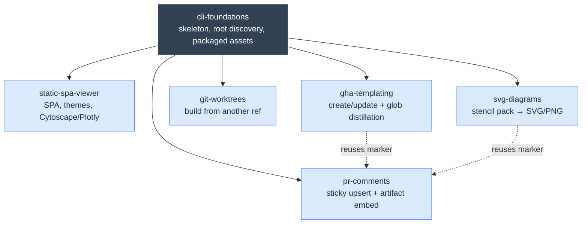
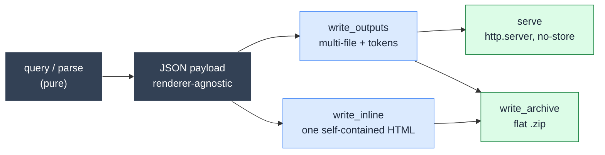

# cli — project-CLI patterns playbook

A field guide for building and extending project-local developer CLIs and the recurring
assets they generate — static HTML viewers, templated GitHub Actions workflows,
autogenerated diagrams, PR-comment automation — so each pattern is implemented **once,
well**, then re-skinned and re-used rather than re-derived. It exists because these same
shapes keep getting rebuilt from scratch across tools; this skill is the distilled,
copy-pasteable memory of how to do them.

<!--TOC-->

- [cli — project-CLI patterns playbook](#cli--project-cli-patterns-playbook)
  - [Quickstart](#quickstart)
  - [Architecture](#architecture)
  - [Reference](#reference)
    - [Pattern catalog](#pattern-catalog)
    - [Troubleshooting](#troubleshooting)
  - [For maintainers](#for-maintainers)

<!--TOC-->

## Quickstart

Three ways in:

```text
# 1. In Claude — route by intent (or just describe the goal):
/cli viewer        # add a generate/serve static-SPA viewer to a CLI
/cli gha           # template a per-slice GitHub Actions workflow
/cli worktree      # build an artifact from another branch/ref
/cli diagrams      # autogenerate SVG/PNG diagrams from a stencil pack
/cli pr-comments   # upsert a sticky PR comment / embed a CI-run image
```

```text
# 2. Direct — open the matching resource and copy its reference skeleton:
.claude/skills/cli/resources/static-spa-viewer.md   # SPA, sidebar, themes, Cytoscape/Plotly, inline, archive
.claude/skills/cli/resources/gha-templating.md      # create/update/validate + 3 glob algorithms
.claude/skills/cli/resources/cli-foundations.md      # argparse/Typer skeleton, root discovery, packaged assets
```

```text
# 3. Escape hatch — re-skin instead of rebuild:
#    a viewer already exists? don't fork the JS — edit design-tokens.json (palette/fonts/brand)
#    and re-serve. See static-spa-viewer.md §"Rebrandable theming".
```

This is a **knowledge skill**: it ships no runnable binary. The "command" is *apply the
pattern* — every resource carries the minimal skeleton to paste and adapt.

## Architecture

The CLI skeleton is the hub; each feature pattern is an independent resource you load on
demand. All patterns inherit the same conventions (fail-loud, root discovery, packaged
assets, stdout/stderr discipline).



<details>
<summary>Detail — the static-SPA-viewer data flow (generate / serve / inline / archive)</summary>



</details>

## Reference

### Pattern catalog

| Pattern | When to reach for it | Resource |
|---------|----------------------|----------|
| CLI foundations | scaffold a CLI, add a subcommand, find the project root, ship data files | [resources/cli-foundations.md](resources/cli-foundations.md) |
| Static SPA viewer | a `generate`/`serve` HTML viewer — SPA routing, sidebar, light/dark + rebrandable themes, Cytoscape graph or Plotly chart, `--inline`, `--archive` | [resources/static-spa-viewer.md](resources/static-spa-viewer.md) |
| GHA templating | create/update/validate a workflow from a base template; derive trigger `paths` via 3 glob algorithms | [resources/gha-templating.md](resources/gha-templating.md) |
| Git worktrees | build an artifact from another branch/ref without disturbing the work tree | [resources/git-worktrees.md](resources/git-worktrees.md) |
| SVG diagrams | autogenerate SVG + PNG diagrams from a stencil icon pack, drift-checked | [resources/svg-diagrams.md](resources/svg-diagrams.md) |
| PR comments | upsert a sticky PR comment; embed a CI-rendered image inline | [resources/pr-comments.md](resources/pr-comments.md) |

The operating contract (triggers, the non-negotiable conventions) lives in
[SKILL.md](SKILL.md); each resource carries the depth + skeletons.

### Troubleshooting

| Symptom | Cause | Fix |
|---------|-------|-----|
| Packaged template "not found" once installed | read by a cwd/repo-relative path | resolve via `importlib.resources` / `Path(__file__).parent` ([cli-foundations.md](resources/cli-foundations.md)) |
| `tool --debug sub` loses `--debug` | shared flag lacks `default=argparse.SUPPRESS` | put global flags on a `parents=[common]` parser with `SUPPRESS` |
| Viewer shows old data after regenerate | fetches not cache-busted | append `?v=<BUILD_ID>` to every JSON/JS fetch |
| Flash of wrong theme on load | theme applied after first paint | inline the `data-theme` bootstrap `<script>` in `<head>` |
| Chart wrong width after sidebar toggle | canvas not resized | `requestAnimationFrame(redraw)` after the class flip |
| `--inline` HTML breaks on a node named `</script>` | unescaped payload | `json.dumps(payload).replace("</", "<\\/")` before embedding |
| `update`-ing a workflow wipes hand-edits | re-stamped the whole file | ruamel round-trip, touch **only** the `paths` block |
| `paths:` stopped triggering CI | hardcoded static path list went stale | derive from membership + run the false-positive audit |
| PNG render dies in CI | system cairo missing | `apt-get install libcairo2`; keep the `cairosvg` import lazy + loud |
| Embedded PR-comment image is a broken zip link | artifact uploaded archived | upload with `archive: false`; resolve the redirect `Location` |
| Sticky comments multiplying | non-unique / missing marker | one unique `<!-- tool:key -->` per logical target |

## For maintainers

See [CLAUDE.md](CLAUDE.md) — the decision lenses behind each pattern, the file map, the
extension checklist, and the known gotchas. Keep every file ≤ 500 lines and
brand-agnostic (no project/client names, generic placeholders only).
