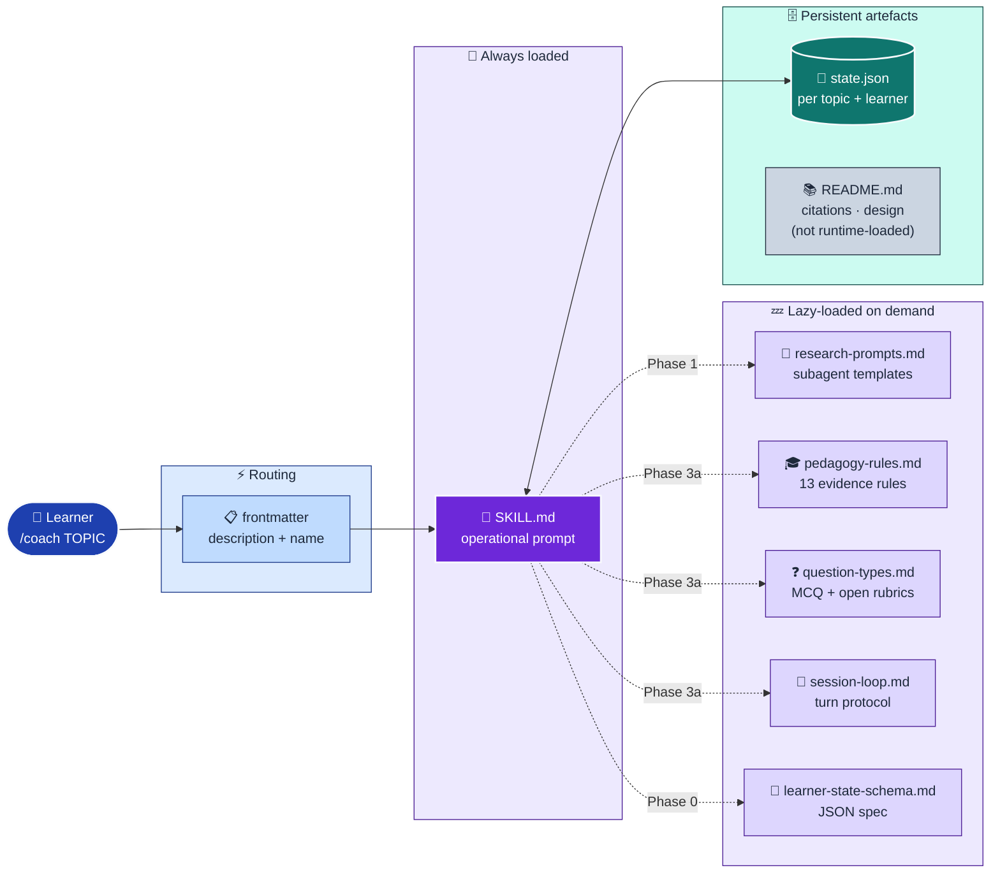
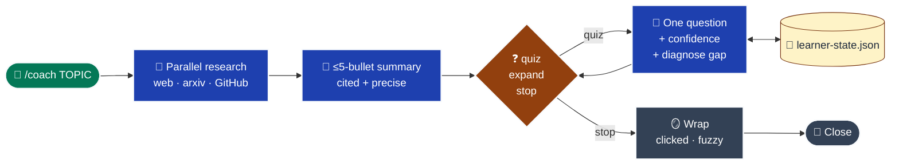
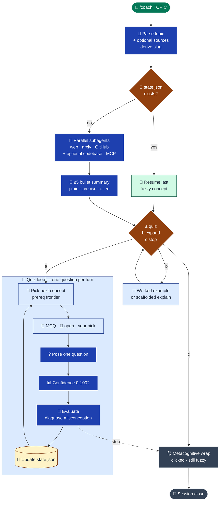

# `/coach` — Evidence-Based AI Tutor Skill

A Claude Code skill that turns any topic into a grounded, Socratic coaching session: parallel research → ≤5-bullet precise summary → one-question-at-a-time adaptive quiz → persistent mental-model tracking across sessions.

This README documents **why** the skill is designed the way it is, with citations. Runtime behaviour lives in [`SKILL.md`](./SKILL.md); supporting rules and templates live in [`resources/`](./resources/).

---

## Table of contents

- [Design intent](#design-intent)
- [Skill architecture](#skill-architecture)
- [File layout](#file-layout)
- [Session flow](#session-flow)
- [Evidence base — learning science](#evidence-base--learning-science)
- [Evidence base — AI tutor prior art](#evidence-base--ai-tutor-prior-art)
- [Key design decisions](#key-design-decisions)
- [Usage](#usage)

---

## Design intent

An agentic coach is only useful if it beats the default chat experience. The default ChatGPT-style "ask a question, get a 600-word explainer" is **passive reading** — which is one of the weakest forms of learning in the evidence base. This skill is built around the opposite defaults:

1. **Retrieval over re-presentation.** The learner talks more than the coach.
2. **Diagnostic over declarative.** Every question must discriminate between correct and a named incorrect mental model.
3. **Grounded over plausible.** Every non-obvious claim cites a source returned from research; no ungrounded facts.
4. **Stateful over stateless.** The coach remembers what you've mastered and where you're fuzzy, across sessions, via a file-backed state artifact.
5. **Adaptive over scripted.** The next concept is picked by prerequisite-satisfaction, not by walking a linear syllabus.

---

## Skill architecture

**Lazy-loading pattern.** Only `SKILL.md` is loaded into the model's context when the skill fires. The resource files are loaded on demand via `Read` calls that `SKILL.md` explicitly issues — so token cost scales with *use*, not with the size of the skill. `README.md` is never loaded at runtime; it's a human-facing design document.



*Blue = entry · violet = logic · teal = data · slate dashed = reference-only*

---

## File layout

```
coach/
├── SKILL.md                              # Operational prompt loaded when skill fires
├── README.md                             # This file — evidence base + design notes
└── resources/
    ├── research-prompts.md               # Prompt templates for parallel research agents
    ├── pedagogy-rules.md                 # Distilled evidence-based teaching rules
    ├── question-types.md                 # MCQ + open-ended design & evaluation rubrics
    ├── learner-state-schema.md           # JSON schema for persistent mental-model file
    └── session-loop.md                   # Turn protocol, concept selection, session close
```

Why split this way:
- `SKILL.md` is loaded into the model's context every time the skill fires — kept lean so invocation is cheap.
- `resources/*.md` are loaded lazily, only when `SKILL.md` explicitly reads them. Detailed rubrics and rationale live here.
- `README.md` is never loaded at runtime. It's a human-facing design document with full citations.

This lazy-loading split is the same pattern used by the `plan-gap` skill in this repo.

---

## Session flow

High-level narrative first — the same flow appears in detail inside the collapsible below.



*Green = entry · blue = active work · amber = decision/waiting · slate = terminal*

<details>
<summary>📋 Full flow — every phase, resume path, and quiz-loop step</summary>



</details>

---

## Evidence base — learning science

Each rule in `resources/pedagogy-rules.md` traces back to at least one of these primary sources.

| Principle | Source | Takeaway for an AI coach |
|---|---|---|
| **Testing effect / retrieval practice** | [Roediger & Karpicke, 2006](https://journals.sagepub.com/doi/10.1111/j.1467-9280.2006.01693.x) | After any explanation, prompt retrieval before re-presenting. |
| **Desirable difficulties** | [Bjork & Bjork, 2011](https://bjorklab.psych.ucla.edu/wp-content/uploads/sites/13/2016/04/EBjork_RBjork_2011.pdf) | Space and interleave; don't block-drill. |
| **Cognitive load & worked examples** | [Sweller et al., Cambridge Handbook](https://www.cambridge.org/core/books/cambridge-handbook-of-expertise-and-expert-performance/cognitive-load-and-expertise-reversal/03F656FD334F23214426ACB4118FEBF9) | For novices, show a worked example before asking for a full solution. |
| **Expertise-reversal effect** | [Kalyuga, 2007](https://www.uky.edu/~gmswan3/EDC608/Kalyuga2007_Article_ExpertiseReversalEffectAndItsI.pdf) | FADE scaffolding once schemas form — heavy guidance hurts experts. |
| **Self-explanation effect** | [Chi et al., 1994](https://onlinelibrary.wiley.com/doi/10.1207/s15516709cog1803_3) | Prompt "why does step N follow from step N-1?" |
| **Illusion of Explanatory Depth** | [Rozenblit & Keil, 2002](https://onlinelibrary.wiley.com/doi/10.1207/s15516709cog2605_1) | Ask for mechanisms to puncture false confidence. |
| **Formative assessment — 5 strategies** | [Wiliam & Leahy](https://webcontent.ssatuk.co.uk/wp-content/uploads/2020/05/01145908/SSAT-Formative-assessment-Five-classroom-strategies.pdf) | Every turn must surface diagnostic evidence. |
| **Hinge questions / diagnostic MCQs** | [Barton — Diagnostic Questions](https://medium.com/eedi/what-makes-a-good-diagnostic-question-b760a65e0320) | Each distractor encodes a specific named misconception. |
| **Bloom's taxonomy (revised)** | [Anderson & Krathwohl](https://www.coloradocollege.edu/other/assessment/how-to-assess-learning/learning-outcomes/blooms-revised-taxonomy.html) | Ladder question difficulty; paraphrase tests understanding, recall does not. |
| **Calibration & Dunning–Kruger** | [McIntosh et al., 2019](https://pubmed.ncbi.nlm.nih.gov/30802096/) | Ask for confidence *before* reveal; track calibration over time. |
| **GROW model (coaching)** | [Whitmore, Performance Consultants](https://www.performanceconsultants.com/grow-model) | Coach asks, learner generates — ownership drives commitment. |
| **Motivational interviewing (OARS)** | [Miller & Rollnick, overview](https://www.servantsuniversity.com/the-growth-model-of-coaching/) | Reflect back before adding content. |
| **ZPD & scaffolding/fading** | [Wood, Bruner & Ross, 1976 — summary](https://www.simplypsychology.org/zone-of-proximal-development.html) | Pick tasks just above independent competence; fade supports. |
| **Concept maps for misconception diagnosis** | [Novak](https://www.scribd.com/document/928967709/Learningtolearn-Novak) | When confused between A and B, ask about the *relationship*. |
| **Knowledge Space Theory (ALEKS)** | [ALEKS — About](https://www.aleks.com/about_aleks/) | Next-to-learn = unmastered node whose prereqs are mastered. |
| **Distractor quality evidence** | [Rao, summarising ETS data](https://medium.com/@geetharao75/enhancing-assessment-accuracy-the-significance-of-distractors-in-multiple-choice-questions-39f6ee2f3a26) | 3 plausible distractors > 4 with a throwaway. |
| **Elaborative interrogation** | [Learning Scientists podcast](https://www.learningscientists.org/learning-scientists-podcast/2017/11/1/episode-6-elaborative-interrogation) | "Why is this true?" only works with enough prior knowledge. |
| **Metacognitive prompting** | [Kim et al., 2025](https://link.springer.com/article/10.1007/s40593-025-00514-5) | Close each session with "what clicked · what's fuzzy." |

---

## Evidence base — AI tutor prior art

### LLM-based tutoring (peer-reviewed / preprints)

- [**SocraticAI** — arxiv 2512.03501](https://arxiv.org/abs/2512.03501). Structured *constraints* (RAG grounding, query validation, usage caps) beat prohibition ("never give answers") for forcing reflective engagement.
- [**From Problem-Solving to Teaching Problem-Solving** — arxiv 2505.15607](https://arxiv.org/abs/2505.15607). Controllable reward weighting between pedagogy and solve-rate; a 7B tuned model matches larger proprietary tutors.
- [**Creating a Customisable Socratic AI Physics Tutor** — arxiv 2507.05795](https://arxiv.org/html/2507.05795). Detailed "role engineering" scripts beat default prompts that leak answers.
- [**QueryQuilt / Mining the Gold** — arxiv 2512.22404](https://arxiv.org/abs/2512.22404). Two-agent split: dialogue agent probes; a *separate* knowledge-gap-identification agent runs post-hoc on the transcript.
- [**Beyond Final Answers** — arxiv 2503.16460](https://arxiv.org/html/2503.16460). 90% of LLM tutor dialogues have high instructional quality; only 56.6% are fully factually correct. **Grounding and citation matter.**
- [**Can LLMs Match Tutoring System Adaptivity?** — arxiv 2504.05570](https://arxiv.org/html/2504.05570). Most LLMs only marginally mimic Intelligent Tutoring System adaptivity; a simple student-model sidecar helps measurably.
- [**Towards Modeling Learner Performance with LLMs** — EDM 2024](https://educationaldatamining.org/edm2024/proceedings/2024.EDM-posters.84/). LLMs **match but don't beat** Bayesian Knowledge Tracing / Deep Knowledge Tracing at picking next item. Keep tracing explicit; let the LLM narrate.
- [**TutorLLM** — arxiv 2502.15709](https://arxiv.org/html/2502.15709). Knowledge tracing + RAG + LLM narrator → +10% satisfaction, +5% quiz scores vs bare LLM.
- [**Adaptive CAT for LLMs** — arxiv 2306.10512](https://arxiv.org/html/2306.10512v1). Item Response Theory applied to dynamically probe ability with fewer items — same loop works in reverse on a human learner.

### Deployed systems

- [**Khanmigo (Khan Academy) — 7-step prompt engineering approach**](https://blog.khanacademy.org/khan-academys-7-step-approach-to-prompt-engineering-for-khanmigo/). Hint toward the next step, never give the answer; persona engineering; safety guardrails; iterate on feedback.
- [**Anthropic — Claude for Education Learning Mode**](https://www.anthropic.com/news/introducing-claude-for-education). Templated system prompts that force Socratic questioning.
- [**Duolingo Max — Roleplay & Explain My Answer**](https://blog.duolingo.com/duolingo-max/). Tight, context-grounded chat rather than open-ended dialogue.

### Open-source Claude Code / LLM tutor skills

- [**JEFF7712/claude-tutor**](https://github.com/JEFF7712/claude-tutor/blob/main/skills/tutor/SKILL.md). 10-mode tutor with auto-selection from learner signals; "require learner production every 2–3 turns" as a hard rule.
- [**RoundTable02/tutor-skills**](https://github.com/RoundTable02/tutor-skills). Splits into `tutor-setup` (ingest/structure) + `tutor` (quiz loop). Persists per-concept mastery state to disk.
- [**GarethManning/claude-education-skills**](https://github.com/GarethManning/claude-education-skills). 108 skills with `evidence_strength` and `evidence_sources` front-matter — the inspiration for citing sources inline.
- [**GiovanniGatti/socratic-llm**](https://github.com/GiovanniGatti/socratic-llm). DPO fine-tuning to reward Socratic over didactic responses.

---

## Key design decisions

### 1. Persistent file-backed state at `.claude/coach/state/<slug>.json`

**Why:** Skills are stateless per invocation. The only way to remember what the learner struggled with last time is to write it to disk.

**Why this path:** Project-local keeps the learning trace with the project's context (the topics you're learning while working on *this* codebase are most relevant *to* this codebase). A learner who wants global memory can symlink or override via `COACH_STATE_DIR`.

**Why JSON not SQLite:** diffable, human-readable, no dependency, trivially portable across devices via `git`.

### 2. Parallel subagents for research, always with citations

**Why:** Ungrounded teaching is worse than no teaching — the factual-correctness gap (Beyond Final Answers, 56.6%) is real. By launching `general-purpose` agents over distinct corpora (web, arxiv, GitHub) in parallel, we get source-cited claims quickly. The summary phase refuses to emit any claim without a traceable source.

### 3. ≤5 bullets, hard constraint

**Why:** Cognitive load theory. A learner's working memory holds ~4 elements. A 12-bullet summary is a lecture; a 5-bullet summary is a *handhold*. If the coach can't reduce the topic to 5, it doesn't understand it well enough to teach it.

### 4. Learner picks question type each turn

**Why:** Learner agency drives motivation (MI/GROW). The two modes also serve different diagnostic purposes (see `resources/question-types.md`):
- **MCQ** is best for rapid misconception screening when the misconceptions are *known*.
- **Open-ended** is best for detecting the Illusion of Explanatory Depth and for Bloom's-Apply-and-above.

### 5. One question per turn, always

**Why:** Multi-question batches are tempting but destroy diagnostic signal — the learner's answer to Q3 is contaminated by seeing Q1 and Q2. Single-turn quiz is measurably better for knowledge tracing (TutorLLM, CAT literature).

### 6. Distractors encode named misconceptions

**Why:** Barton's hinge-question research shows a well-designed distractor tells you *which* mental model the learner holds, not just that they're wrong. This turns a quiz into a diagnosis.

### 7. Confidence rating *before* reveal

**Why:** Dunning–Kruger research. Calibration (confidence vs. correctness) is a better predictor of mastery than raw correctness. Tracking the calibration delta across sessions surfaces "false fluency" that pure score-tracking misses.

### 8. "Default ask; tell only after 2 failed generations"

**Why:** Balance between Socratic method (asking generates learning) and expertise-reversal (asking a novice who cannot yet generate is just guessing). Two failed generations is the empirical sweet spot in the scaffolding literature.

### 9. Next-concept selection by prerequisite satisfaction

**Why:** ALEKS/Knowledge Space Theory. Linear syllabi are pedagogically weak because they ignore the learner's actual readiness. "First unmastered node whose prerequisites are mastered" — the *outer fringe* — is the empirically strongest signal for what to learn next.

### 10. Metacognitive session close

**Why:** Explicit "what clicked / what's still fuzzy" reflection improves self-regulated learning in follow-on sessions (Kim et al., 2025). Also seeds the state file for next time.

---

## Usage

```text
/coach <topic>
```

Examples:
```text
/coach Bayesian knowledge tracing
/coach OAuth 2.1 PKCE flow
/coach cognitive load theory  resources/bjork-2011.pdf  confluence:LEARN/onboarding
```

If you supply trailing sources, they are used as **mandatory grounding** alongside the default public-domain research fan-out. If you don't, the coach does not ask — it proceeds with public research.

Stop any time with `stop`, `done`, `enough`, or `bye`. The coach will run a ~2-line metacognitive wrap and save state.
