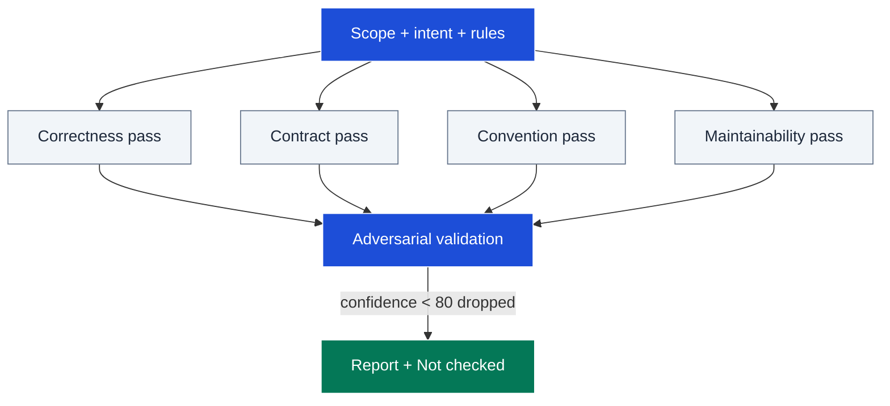

# codereview

Principled, evidence-based code review of a diff, branch, or PR. It runs
parallel single-lens review passes, then adversarially validates every
candidate finding before anything is reported — because deployed-systems data
shows unfiltered LLM review comments achieve ~7-10% acceptance while validated,
filtered ones reach ~75% precision. Few findings, high confidence, honest
severity.

## Table of Contents

<details><summary>Click to expand</summary>

<!--TOC-->

- [codereview](#codereview)
  - [Table of Contents](#table-of-contents)
  - [Quickstart](#quickstart)
  - [Architecture](#architecture)
  - [Reference](#reference)
    - [Troubleshooting](#troubleshooting)
  - [For maintainers](#for-maintainers)

<!--TOC-->

</details>

## Quickstart

In Claude Code:

```text
/codereview              # review current branch vs merge-base + uncommitted
/codereview 11           # review PR #11
```

Driving the scope resolution directly — what would be reviewed:

```sh
MERGE_BASE=$(git merge-base origin/main HEAD)
git diff --shortstat $MERGE_BASE..HEAD
git diff --name-only $MERGE_BASE..HEAD
```

Escape hatch — size check that triggers the reduced-confidence warning
(>400 changed LOC excluding lockfiles/generated):

```sh
git diff --numstat $MERGE_BASE..HEAD | grep -vE '(lock|generated|dist/)' \
  | awk '{a+=$1+$2} END {print a+0 " changed LOC"}'
```

## Architecture



Generation is deliberately aggressive (four parallel lenses over-generate
candidates); precision lives entirely in the validation stage, which attempts
to disprove each finding and silently drops everything under the confidence
threshold.

## Reference

- Operating manual (phases, confidence rubric, denylist, output format):
  [SKILL.md](SKILL.md)
- Research evidence and citations: [EVIDENCE.md](EVIDENCE.md)

Requirements: `git` (and `gh` for PR-number invocations); subagent support for
the parallel passes.

### Troubleshooting

| Symptom | Cause / fix |
|---------|-------------|
| Review flags style nits a linter owns | Denylist not applied — linter/formatter territory is never reported; re-check the What-NOT-to-Flag list. |
| Findings blame pre-existing code | Diff-scoped attribution lost; pre-existing issues go in the separate 🟣 section (max 2), never as Important. |
| Review floods with low-value comments | Confidence threshold skipped; only ≥80 on the anchored rubric is reportable, nits cap at 5. |
| "No issues found" feels wrong | A clean short review is a successful review — check the Not-checked section for what wasn't covered rather than lowering the threshold. |
| Second review surfaces fresh nits | Re-review contract violated: after round one, only new Important findings are reportable. |

## For maintainers

Design rationale, decision log, and extension checklist: [CLAUDE.md](CLAUDE.md).
