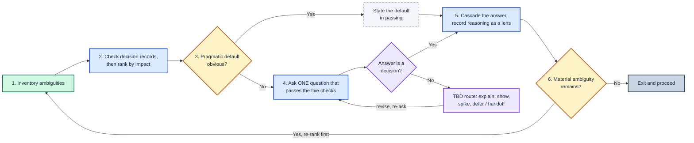
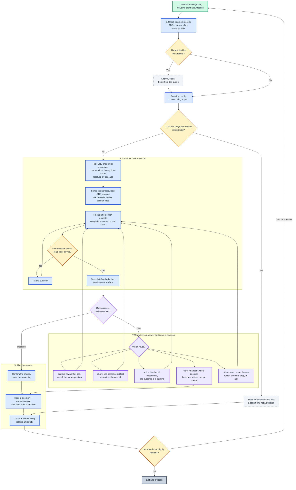

# Concise Decisions

Human attention is the scarcest resource. 
 
- Reduce cognitive fatigue and leverage the decisions we are already making. 
- Force the agent to leverage existing ADRs to self answer questions.
- Guide the agent extract your reasoning and apply it to all open questions before asking the next question.
- Use a checklist for the agent to **ask better questions** so you can make **informed decisions**.
- There is also a difference between **answering a question**, and **making a decision**.

----

## Asking Better Questions Framework

  1. Can I make an **informed decision** from what is presented?
  2. Do I understand why **this** question is being asked **now**? 
      - Why is it **the next most impactful question** worthy of my attention?
  3. Do I understand why prior decisions do **not** already answer it?
      - Have you checked existing decision records and knowledge bases?
  4. Can I attach my reasoning to whichever option I pick? 
      - Multichoice and Multi-select without space for freetext is a failure.
  5. Can I give a _**To Be Decided (TBD) answer**_ - an **answer** that is **not a decision**?
     - `explain` - Despite best efforts, I need part of the existing explanation expanded and revised before I can make an informed decision.
     - `show` - The question is visual or interactive in nature and needs real prototypes before an **informed decision** can be made. Create artifacts for each option and revise the question.
     - `spike` - We can not blindly trust performance metrics. We need to empirically collect data to make an **informed decision**. Run a timeboxed `spike` where the outcome is a `learning`. 
     - `defer` or `handoff` - The question is **valid** but it is **not important right now**. Log the entire question and recommendations as a ticket for a backlog. Mark this seam as a scope boundary for now.

----


<details>
<summary><b>Table of Contents</b></summary>
<!--TOC-->

- [Concise Decisions](#concise-decisions)
  - [Asking Better Questions Framework](#asking-better-questions-framework)
  - [Quickstart](#quickstart)
  - [Architecture](#architecture)
  - [For maintainers](#for-maintainers)

<!--TOC-->
</details>

## Quickstart

In an agent session, when there are decisions blocking work:

```text
/concise-decisions
```

## Architecture

The loop, at a glance: one question per turn, and every answer is cascaded
before the next question is even ranked.




<details>
<summary>📋 Complete loop: decision records, composing the question, the TBD routes, and the cascade (25 nodes)</summary>



</details>

## For maintainers

Rationale and the extension checklist are in [CLAUDE.md](CLAUDE.md); the ADR
log with lenses is one file per decision in [docs/adrs/](docs/adrs/README.md).
