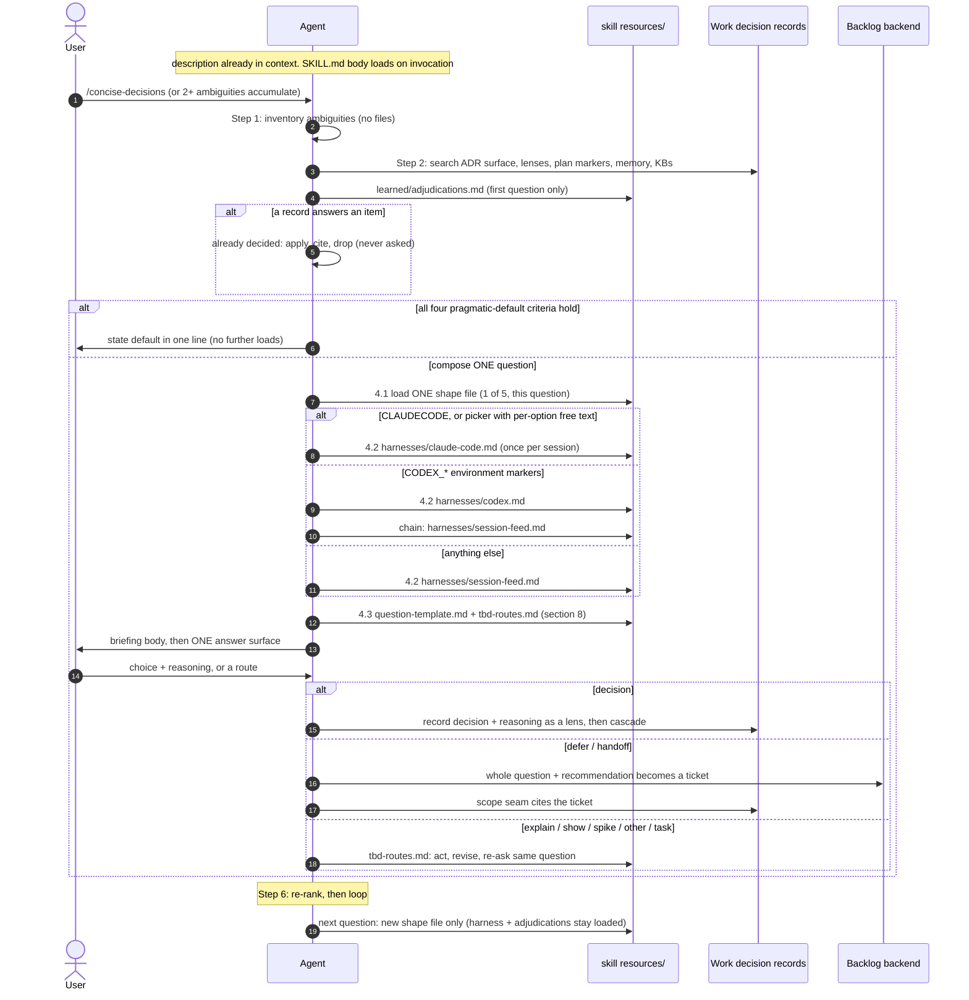

# concise-decisions: runtime file-loading map

A development-support document for debugging what gets loaded, when, and on
which condition, during a live run of the skill. Generated 2026-08-24 from
the current `SKILL.md`. This file, like `README.md` and `CLAUDE.md`, is
never loaded at runtime.

## Load classes

| Class | Files | Loaded when | Cardinality |
|-------|-------|-------------|-------------|
| Always in context | `SKILL.md` frontmatter `description` | every session, before any invocation | always |
| Entry | `SKILL.md` body | on `/concise-decisions` or when the trigger conditions in the description match | once per session |
| External role | the work's own decision records (ADR surface, `CLAUDE.md` lenses, plan markers, memory, knowledge bases) | loop step 2, before ranking, every loop | whatever exists |
| First question | `resources/learned/adjudications.md` | first question of a session | once per session |
| Per question | one of five `resources/shapes/*.md` | step 4.1, chosen by question shape | exactly 1 of 5, each question |
| Per session | one of three `resources/harnesses/*.md` | step 4.2, chosen by environment sensing | exactly 1 of 3, once per session (`codex.md` chains to `session-feed.md`) |
| Shared composition | `resources/question-template.md`, `resources/tbd-routes.md` | step 4.3 while composing; `tbd-routes.md` again when acting on a TBD answer | each question |
| External role | backlog backend (tracker tool, `gh issue`, plan backlog section, local markdown ticket) | only on a `defer`/`handoff` answer | first available |
| Development only | `README.md`, `CLAUDE.md`, `docs/adrs/**`, `docs/*` | never at runtime | 0 |

Debug signals to look for in a transcript:

- Two shape files open for one question: step 4.1 violated.
- Harness re-sensed on a later question: step 4.2 is once per session.
- A question sent with no `Checked:` line: step 2 was skipped.
- `README.md` or `CLAUDE.md` read during a run: a development file leaked
  into the runtime path.

## Dependency graph (what can load what)

Colour encodes load class: green always, blue entry, slate external roles,
violet per question, amber per session, teal shared composition, rose
development-only (must never appear at runtime).

```cytoscape
{
  "elements": [
    { "data": { "id": "desc", "label": "description\n(frontmatter)", "colour": "#10b981" } },
    { "data": { "id": "skill", "label": "SKILL.md body", "colour": "#3b82f6" } },

    { "data": { "id": "records", "label": "Work decision records\nADRs / lenses / plan / memory / KBs", "colour": "#64748b" } },
    { "data": { "id": "adjud", "label": "learned/adjudications.md\n(first question)", "colour": "#64748b" } },

    { "data": { "id": "shapes", "label": "shapes/ (pick ONE per question)" } },
    { "data": { "id": "sh_ex", "label": "exclusive-choice.md", "parent": "shapes", "colour": "#8b5cf6" } },
    { "data": { "id": "sh_perm", "label": "subset-as-permutations.md", "parent": "shapes", "colour": "#8b5cf6" } },
    { "data": { "id": "sh_bin", "label": "binary.md", "parent": "shapes", "colour": "#8b5cf6" } },
    { "data": { "id": "sh_low", "label": "low-stakes.md", "parent": "shapes", "colour": "#8b5cf6" } },
    { "data": { "id": "sh_cas", "label": "resolved-by-cascade.md", "parent": "shapes", "colour": "#8b5cf6" } },

    { "data": { "id": "harn", "label": "harnesses/ (pick ONE per session)" } },
    { "data": { "id": "h_cc", "label": "claude-code.md", "parent": "harn", "colour": "#f59e0b" } },
    { "data": { "id": "h_cx", "label": "codex.md", "parent": "harn", "colour": "#f59e0b" } },
    { "data": { "id": "h_sf", "label": "session-feed.md", "parent": "harn", "colour": "#f59e0b" } },

    { "data": { "id": "tmpl", "label": "question-template.md", "colour": "#14b8a6" } },
    { "data": { "id": "tbd", "label": "tbd-routes.md", "colour": "#14b8a6" } },

    { "data": { "id": "backlog", "label": "Backlog backend\ntracker / gh / plan / local ticket", "colour": "#64748b" } },

    { "data": { "id": "dev", "label": "development only (never at runtime)" } },
    { "data": { "id": "d_rm", "label": "README.md\n(human documentation)", "parent": "dev", "colour": "#f43f5e" } },
    { "data": { "id": "d_cl", "label": "CLAUDE.md\n(maintainer lens)", "parent": "dev", "colour": "#f43f5e" } },
    { "data": { "id": "d_adr", "label": "docs/adrs/**\n(skill's own ADRs)", "parent": "dev", "colour": "#f43f5e" } },

    { "data": { "source": "desc", "target": "skill", "label": "trigger matches -> invoke" } },
    { "data": { "source": "skill", "target": "records", "label": "step 2: search before ranking (every loop)" } },
    { "data": { "source": "skill", "target": "adjud", "label": "step 2: first question of session" } },

    { "data": { "source": "skill", "target": "sh_ex", "label": "4.1: 2-3 mutually exclusive" } },
    { "data": { "source": "skill", "target": "sh_perm", "label": "4.1: options compose" } },
    { "data": { "source": "skill", "target": "sh_bin", "label": "4.1: exactly two real" } },
    { "data": { "source": "skill", "target": "sh_low", "label": "4.1: reversible, lens worth recording" } },
    { "data": { "source": "skill", "target": "sh_cas", "label": "4.1: prior decision narrowed it" } },

    { "data": { "source": "skill", "target": "h_cc", "label": "4.2: CLAUDECODE or picker with free text" } },
    { "data": { "source": "skill", "target": "h_cx", "label": "4.2: CODEX_* markers" } },
    { "data": { "source": "skill", "target": "h_sf", "label": "4.2: anything else" } },
    { "data": { "source": "h_cx", "target": "h_sf", "label": "routes to (chain load)" } },

    { "data": { "source": "skill", "target": "tmpl", "label": "4.3: every question" } },
    { "data": { "source": "sh_ex", "target": "tmpl", "label": "selects variant" } },
    { "data": { "source": "h_cc", "target": "tmpl", "label": "binds section 9" } },
    { "data": { "source": "h_sf", "target": "tmpl", "label": "binds section 9" } },
    { "data": { "source": "tmpl", "target": "tbd", "label": "section 8: routes table" } },
    { "data": { "source": "skill", "target": "tbd", "label": "after a TBD answer: act on the route" } },
    { "data": { "source": "tbd", "target": "backlog", "label": "defer/handoff: whole question -> ticket" } },
    { "data": { "source": "skill", "target": "records", "label": "step 5: record decision + lens" } }
  ],
  "layout": { "name": "dagre", "rankDir": "LR" },
  "height": 640
}
```

The `dev` group has no inbound runtime edge by construction. If a trace shows
one, that edge is the defect.

## Session timeline (when each load happens)

Two questions in one session make the cardinalities visible: the harness
adapter and `adjudications.md` load once; the shape, template and routes
load per question.



## Reading the map

- The description is the only surface paid for in every session. Everything
  else is behind the invocation.
- A full question costs at most five resource files: one shape, one or two
  harness files (two only on the Codex chain), the template, and the routes.
- The external roles (decision records, backlog) are senses over the host
  project, not files of this skill. They vary per repository by design.
- `README.md`, `CLAUDE.md` and `docs/` support development and review. They
  describe the skill; they do not participate in it.
