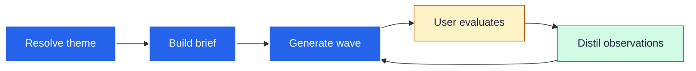
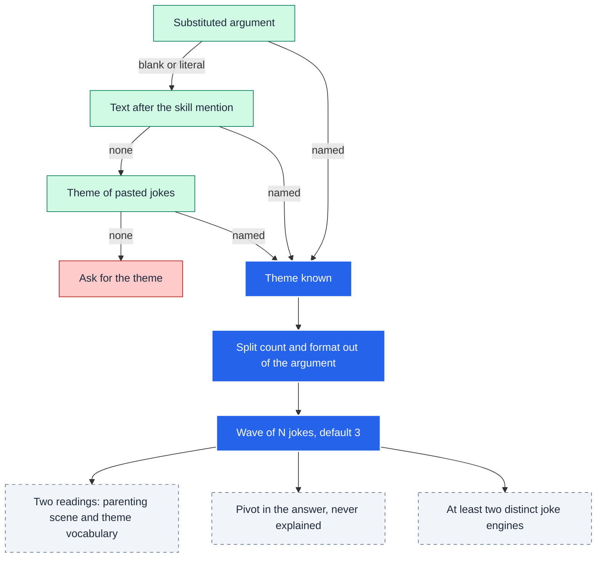

# dadjoke

Turns a theme into a short wave of dad jokes, then turns your reaction to that wave into
the next one. It exists because one-shot joke requests produce three synonyms of the same
pun; a feedback-led loop with a stated theme produces options worth choosing between.

<details>
<summary>Table of Contents</summary>

<!--TOC-->

- [dadjoke](#dadjoke)
  - [Quickstart](#quickstart)
  - [Architecture](#architecture)
  - [Reference](#reference)
    - [Requirements](#requirements)
    - [Invocation](#invocation)
    - [Examples](#examples)
    - [Troubleshooting](#troubleshooting)
  - [For maintainers](#for-maintainers)

<!--TOC-->

</details>

## Quickstart

The theme is the invocation argument. Three ways in:

```text
/dadjoke kubernetes
```

```text
$dadjoke five Q&A jokes about kubernetes
```

The first form is Claude Code (the argument is substituted into the skill); the second is
Codex (the words after the mention are the argument). Headless, from any directory whose
`.claude/skills/` contains this skill:

```sh
claude -p "/dadjoke kubernetes" --output-format json --setting-sources project
```

Escape hatch: after a wave, reply with your verdicts and the skill re-plans from them.

```text
Keep 2. Number 1 explains the pun. More like 2, and make them all Q&A.
```

## Architecture

The skill is a loop. The theme enters once; every later wave is driven by feedback.



<details>
<summary>Detail: where the theme comes from, and what a wave must satisfy</summary>



</details>

## Reference

### Requirements

None. The skill is prose only: no scripts, no network, no package installs. It runs on
any harness that loads `SKILL.md`, including Claude Code, Codex, and headless `claude -p`
or `codex exec`.

### Invocation

`SKILL.md` is the operating manual: theme resolution order, brief fields, wave rules,
the Q&A form, the quality bar, and how feedback is folded into the next wave. The
argument shape is `<theme> [count] [Q&A]`; count and format are read out of the same
string as the theme.

### Examples

Q&A form, theme "product management":

```text
Q: Why did the product manager bring a stroller to sprint planning?
A: Because the Epic was expecting more child issues.
```

A feedback turn that the skill treats as evidence about you, not as a comedy law:

```text
Forced word surgery is fine when it still sounds clear aloud. Bring that back.
```

### Troubleshooting

| Symptom | Cause / fix |
|---------|-------------|
| The skill asks "what theme?" | No theme reached it: the argument was empty and the message named none. Invoke with the theme as the argument. |
| The reply shows the literal text `$ARGUMENTS` | Expected on Codex, which does not substitute arguments; the skill's resolution ladder falls through to the words after the mention. Nothing to fix. |
| Jokes are generic, not about the theme | Give the domain vocabulary you want used ("use kubectl, pods, helm") in the argument; the quality bar requires the second reading to depend on the named theme. |
| Three jokes with the same mechanism | Say which one landed; the next wave reuses that engine with a new scene and varies the rest. |
| A preamble appears before the jokes | Weaker model tiers sometimes narrate. Reply "jokes only" once; the rule is already in `SKILL.md`. |

## For maintainers

Design rationale, the decision log, and the extension checklist live in
[`CLAUDE.md`](CLAUDE.md). Read its ADRs before changing `SKILL.md`; each carries a Lens
for the next decision.
