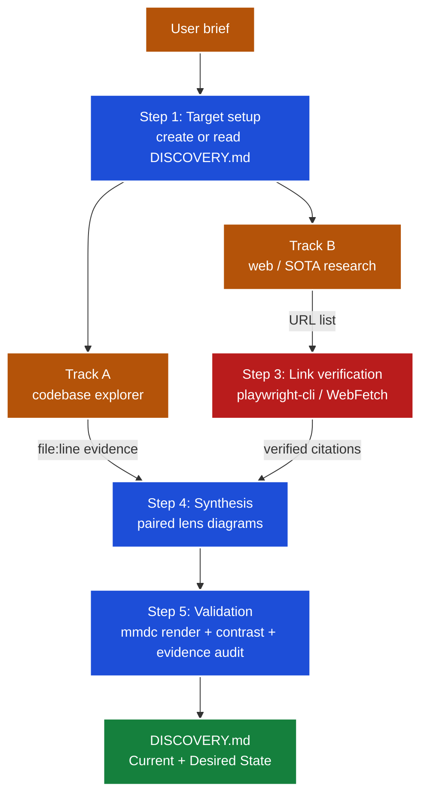

# Discovery — Current & Desired State Research `/discovery`

Turns a one-line initiative brief into a review-only **discovery document**: the Current State of
your system researched from the codebase (every claim cited `file:line`) and the Desired State
researched from the verified external landscape (every claim cited to a checked URL), drawn as
paired before/after Mermaid lens diagrams. It exists so a human — or a downstream planning
workflow — can see the as-is and the to-be side by side before any plan is written.

<details><summary>Table of Contents</summary>

<!--TOC-->

- [Discovery — Current & Desired State Research `/discovery`](#discovery--current--desired-state-research-discovery)
  - [Quickstart](#quickstart)
  - [Architecture](#architecture)
  - [Reference](#reference)
    - [Troubleshooting](#troubleshooting)
  - [For maintainers](#for-maintainers)

<!--TOC-->

</details>

## Quickstart

In Claude Code, point the skill at a folder (creates `<folder>/DISCOVERY.md`) or an existing file:

```text
/discovery docs/plans/auth-migration/

"Migrate our session-based auth middleware to OAuth2 + PKCE, replacing the custom token store."
```

Refresh an existing document after the codebase or landscape moved:

```text
/discovery docs/plans/auth-migration/DISCOVERY.md
```

Escape hatch — validate the document's diagrams yourself with mmdc (the same gate the skill runs):

```bash
npx -p @mermaid-js/mermaid-cli mmdc -i docs/plans/auth-migration/DISCOVERY.md \
  -a .mmdc_cache/dark_transparent_png/docs/plans/auth-migration/ \
  -o .mmdc_cache/dark_transparent_png/docs/plans/auth-migration/DISCOVERY.md \
  --scale 4 -e png -t dark -b transparent
```

## Architecture

Two parallel research tracks feed one synthesized document; nothing is cited without evidence.



Key properties:

- **Dual-track research** — Track A (codebase) and Track B (web/SOTA) run as parallel subagents.
- **Anti-hallucination** — every external URL is verified (browser → HTTP fetch → explicit
  unverified marker) before it may stand as a citation.
- **Paired lenses** — Current and Desired State use the same 2–3 diagram lenses and the same node
  IDs, so the pair reads as a visual diff.
- **Section ownership** — the skill owns only `## Current State` and `## Desired State`; sections a
  caller workflow appends after them are preserved verbatim on refresh.

## Reference

- Operating detail (workflow, evidence contract, markers): [`SKILL.md`](SKILL.md)
- Document template and style rules: [`resources/discovery-template.md`](resources/discovery-template.md)
- Link verification tiers and commands: [`resources/playwright-cli.md`](resources/playwright-cli.md)
- Lens menu, rendering, color theming: [`resources/mermaidjs-diagrams.md`](resources/mermaidjs-diagrams.md)

### Troubleshooting

| Symptom | Cause / fix |
|---------|-------------|
| Links all marked `LINK_NOT_VERIFIED` | No verification tool available — install `playwright-cli` (`brew install playwright-cli`, then `playwright-cli install`) and re-run |
| mmdc exits non-zero on a diagram | Non-ASCII characters or `\n` in node labels — see the pitfalls section of `resources/mermaidjs-diagrams.md` |
| Diagram text invisible in one theme | A `fill:` without an explicit `color:` — always pair them |
| Current/Desired diagrams don't read as before/after | Different lenses or node IDs on each side — re-synthesize with shared lenses and IDs |
| A caller's section disappeared on refresh | It sat *between* the two state sections — caller-owned sections belong after `## Desired State` |

## For maintainers

Design rationale, the ADR log, and the extraction history live in [`CLAUDE.md`](CLAUDE.md).
