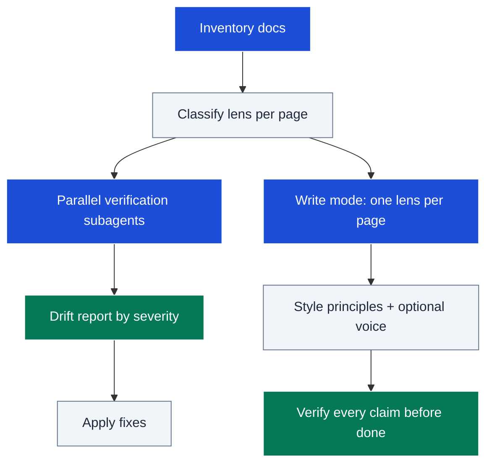

# gooddocs

Keeps documentation true, well-shaped, and great. Audit mode fans out parallel
subagents that corroborate every checkable claim in the docs against the actual
code (commands, paths, signatures, env vars, links) and emits a severity-ranked
drift report; write mode authors or rewrites docs under a strict lens taxonomy
distilled from 23 of the most respected open-source documentation sets —
optionally in the maintainer's personal voice; restructure mode reorganizes
existing docs, specs, and plan files for scannability (heading hierarchy, BLUF,
list/table discipline, whitespace rhythm) without changing their claims.

## Table of Contents

<details><summary>Click to expand</summary>

<!--TOC-->

- [gooddocs](#gooddocs)
  - [Table of Contents](#table-of-contents)
  - [Quickstart](#quickstart)
  - [Architecture](#architecture)
  - [Reference](#reference)
    - [Troubleshooting](#troubleshooting)
  - [For maintainers](#for-maintainers)

<!--TOC-->

</details>

## Quickstart

In Claude Code:

```text
/gooddocs                                  # audit all docs, drift report
/gooddocs write frontend/README.md         # lens-guided (re)write
/gooddocs write docs/architecture.md voice # same, in the maintainer's voice
/gooddocs restructure docs/spec/plan.md    # reshape for scannability, claims untouched
```

Driving the simplest drift checks directly — doc age vs the code it describes:

```sh
git log -1 --format='%cs README.md' -- README.md
git log -1 --format='%cs frontend/' -- frontend/
```

Escape hatch — internal link rot across all markdown:

```sh
bunx --bun markdown-link-check README.md
```

## Architecture



Both modes share the same spine: classify each page's lens, then either verify
its claims (audit) or author under that lens's rules (write) — with verification
mandatory in both directions.

## Reference

- Operating manual (modes, claim-check table, drift report format):
  [SKILL.md](SKILL.md)
- Lens taxonomy + 15 style principles + the OSS survey:
  [resources/lenses.md](resources/lenses.md)
- Markdown structure rules, structure smells, spec/plan skeletons:
  [resources/structure.md](resources/structure.md)
- The maintainer's voice fingerprint (opt-in via `voice`):
  [resources/voice.md](resources/voice.md)

Requirements: `git`; `bunx` for link checking; subagent support for audit
fan-out and for diagram curation (delegated to the `mermaidjs_diagrams`
skill, which owns palette and the contrast/complexity gates). Audit never
runs mutating commands — read-only verification only.

### Troubleshooting

| Symptom | Cause / fix |
|---------|-------------|
| Audit reports everything as `unverifiable` | Subagents got the doc but not repo access context — re-launch with explicit paths to the code the doc describes. |
| Drift report flags intentional divergence | The doc is the contract and the code drifted; the skill asks which is authoritative when ambiguous — answer it, don't suppress the finding. |
| Rewritten page mixes teaching into reference | Lens discipline lost; split the page — one lens per page is non-negotiable. |
| Voice output feels like parody | Voice rules layered without the lens base; voice changes register only — re-read lenses.md first, voice.md second. |
| TOC out of date after a rewrite | Run the `mdtoc` skill (docs >100 lines get a generated TOC, never hand-maintained). |
| Restructure changed a doc's meaning | Mode contract violated — restructure preserves claims verbatim; anything that looked wrong should have been flagged for audit, not reworded. |
| Inbound links broke after restructuring | Renamed headings change anchors; grep for old anchors across the repo before renaming (SKILL.md restructure step 5). |

## For maintainers

Design rationale, decision log, and extension checklist: [CLAUDE.md](CLAUDE.md).
