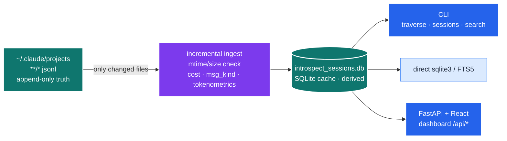
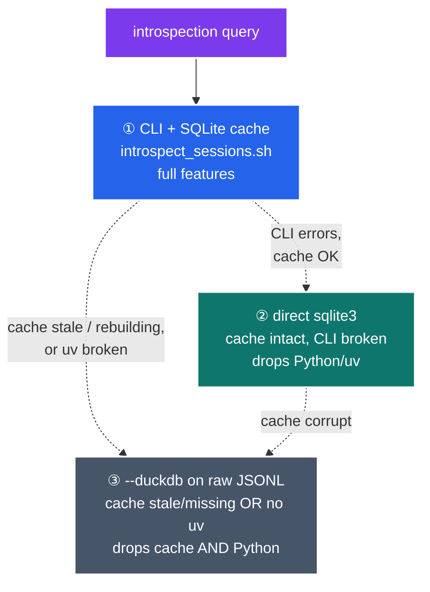
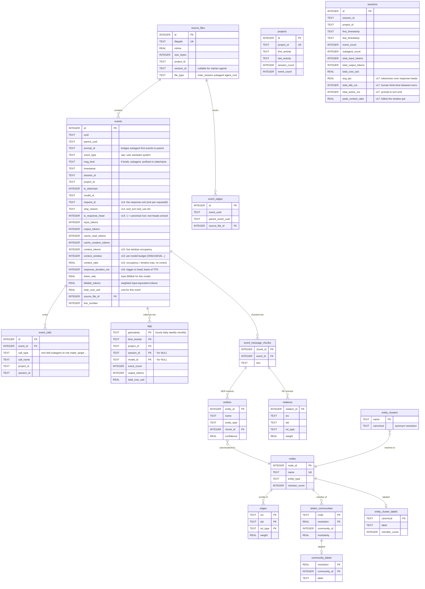

# Introspect — Claude Code session analytics

A self-introspection toolkit for Claude Code. It turns the raw JSONL transcripts
that Claude Code writes under `~/.claude/projects/` into a queryable SQLite cache,
so you can ask questions about your own sessions: what was said, which tools ran,
how the event tree branches across subagents, what it cost, how fast the model
generated, and how much of the context window each response consumed.

> This README is the **human-facing explainer** — the *why* and the *shape* of the
> data. For the operating manual (commands, flags, query recipes) the agent uses,
> see [SKILL.md](SKILL.md); the design rationale (ADRs + decision lenses) lives in
> [CLAUDE.md](CLAUDE.md).

---

<details>
<summary><b>Table of Contents</b></summary>
<!--TOC-->

- [Introspect — Claude Code session analytics](#introspect--claude-code-session-analytics)
  - [Quickstart](#quickstart)
  - [What it's for](#what-its-for)
  - [How it works](#how-it-works)
    - [The fallback cascade](#the-fallback-cascade)
    - [Schema migrations](#schema-migrations)
  - [Data model](#data-model)
    - [The `is_response_head` invariant (read this before summing)](#the-is_response_head-invariant-read-this-before-summing)
  - [Analytics fields (tokenometrics)](#analytics-fields-tokenometrics)
    - [Subagent labeling](#subagent-labeling)
  - [Cost model](#cost-model)
  - [Knowledge graph](#knowledge-graph)
  - [Relationship to the dashboard](#relationship-to-the-dashboard)
  - [Pointers](#pointers)
  - [For maintainers](#for-maintainers)

<!--TOC-->
</details>

---

## Quickstart

Invoke it in Claude Code with a natural-language brief:

```text
/introspect summarise what I worked on in this session and what it cost
```

Or drive the script directly (the bash wrapper boots `uv` for you):

```bash
SH=.claude/skills/introspect/scripts/introspect_sessions.sh

# Most recently-updated session for the current project (inferred from CWD)
$SH sessions -n 1

# Every event in a session, flat + chronological
$SH traverse <SESSION_ID> --all -n 20

# Per-agent cost / token / event rollup (includes subagents)
$SH traverse <SESSION_ID> --summary

# Cross-session full-text search
$SH search "rate limit" -n 20
```

**Cache stale, mid-migration, or `uv` unavailable?** Use the dependency-free DuckDB
fallback — it reads the raw JSONL directly (no cache, no Python), so you keep a subset of
introspection even while the cache is being rebuilt:

```bash
DB=.claude/skills/introspect/scripts/introspect_duckdb.sh

$DB sessions -n 10              # recent sessions for the CWD project
$DB prompts <SESSION_ID>        # genuine human prompts (post-compaction recovery)
$DB search "duckdb" --human     # search only what YOU typed
$DB cost                        # requestId-deduped cost by model family
```

See [SKILL.md › DuckDB Fallback Mode](SKILL.md#duckdb-fallback-mode---duckdb) and
[resources/duckdb-fallback.md](resources/duckdb-fallback.md).

## What it's for

- **Review past sessions** — reconstruct a conversation, flat or as an event tree.
- **Debug failures** — walk ancestors/descendants of a specific event across agents.
- **Recover intent post-compaction** — search the full transcript history (FTS5).
- **Account for cost & performance** — every event carries pre-computed cost,
  throughput, and context-utilization figures.
- **Explore structure** — a resolved-entity knowledge graph over the prompt history.

## How it works

Append-only JSONL transcripts are incrementally ingested into a SQLite cache; the CLI, a
direct `sqlite3` shell, and the FastAPI dashboard all read that one cache.



*Ingest → cache → many readers.* The cache is **derived state** — it can be deleted and
rebuilt from the JSONL at any time. Every query checks file mtimes and incrementally
re-ingests only what changed, so reads are normally instant. Two ingesters share one on-disk
schema (`SCHEMA_VERSION`): the dashboard backend (`src/claude_code_sessions/database/sqlite/`)
and this skill's standalone script — kept in lockstep and guarded by
`tests/test_introspect_parity.py`.

### The fallback cascade

When the primary path breaks, escalate through three rungs — **each rung drops a dependency
of the one above it**, so the deepest rung survives every failure of the others. The motivating
case: a schema-changing feature forces a long full reingest, and you still want a subset of
introspection *while the cache is mid-rebuild*.



Rung ③ is pure `bash` + `duckdb` *by design* — a Python helper would share the broken
toolchain it is meant to rescue. It is read-only and reproduces `msg_kind` / genuine-human
filtering in SQL (parity-checked against the cache). See [CLAUDE.md ADR-009](CLAUDE.md).

### Schema migrations

The schema is versioned by `SCHEMA_VERSION`. **Adding columns requires bumping it**
— `CREATE TABLE IF NOT EXISTS` can't add columns to an existing table, so a bump is
what triggers the DROP+recreate (and a one-time reingest). The current version is
**`17`**; it grew through the tokenometrics initiative (v14 response accounting,
v15 context, v16 duration, v17 session-timing rollups).

## Data model

The core ingestion + analytics tables. The knowledge-graph tables are a separate
subsystem (listed under [Knowledge graph](#knowledge-graph) below).



### The `is_response_head` invariant (read this before summing)

A single model response (one `requestId`) is logged as **N content-block events**
(thinking + text + each tool_use), and **every block repeats the same request-level
usage**. Summing per event over-counts ~2.4×. The ingest pass marks exactly one
**head** per `requestId` (the last block, which carries the final `stop_reason`)
and **zeroes the duplicated token/cost columns on the non-heads**. So:

- `SUM(output_tokens)`, `SUM(total_cost_usd)`, etc. are **correct as-is** — no
  `WHERE is_response_head = 1` needed; the non-heads contribute zero.
- `context_tokens` / `context_window` / `context_ratio` are **not** zeroed (they're
  a *level*, not an additive measure, and are genuinely true of every block). If you
  count responses, filter `is_response_head = 1` to avoid double-counting.

## Analytics fields (tokenometrics)

Beyond raw tokens, every event and session carries derived analytics, computed
once at ingest:

| Field | Grain | Meaning |
|-------|-------|---------|
| `token_rate`, `billable_tokens`, `total_cost_usd` | event | Cost (see [Cost model](#cost-model)) |
| `context_tokens` | event (assistant) | Live window occupancy = `input + cache_read + cache_creation` |
| `context_window` | event | The model's advertised window (curated map: opus-4.6/4.7/4.8 + sonnet-4.6 = 1M; *-4.5 = 200k; qwen2.5-coder = 32k; …). `NULL` for unknown/synthetic models |
| `context_ratio` | event | `context_tokens / context_window` — raw utilization fraction, `NULL` when window unknown. **No categorical "zones"** — utilization is reported quantitatively |
| `response_duration_ms` | head | Triggering-event → head timestamp (the JSONL has no per-assistant duration) |
| `tps` | head (derived) | `output_tokens / (response_duration_ms / 1000)` — model throughput |
| `avg_tps` | session | Σ output ÷ Σ duration over heads |
| `total_active_ms` / `total_idle_ms` | session | Working time (prompt → turn-end) vs. human think-time (turn-end → next prompt). Subagent/tool gaps are excluded — idle is human-only |
| `peak_context_ratio` | session | The fullest the window got in the session |
| `too_fast` | turn (API) | Heuristic flag: the human replied faster than even a fast skim (`< output / 8 tok·s⁻¹`) of a ≥200-token response could be read |

These feed the dashboard's **Performance** page (TPS by model, a context-utilization
histogram, idle-vs-active split) and the SessionDetail occupancy/TPS/idle markers.

### Subagent labeling

Events in a subagent context (`is_sidechain = 1` **or** the source file is a
`subagent`/`agent_root` file) get their `msg_kind` prefixed with `subagent-`
(e.g. `subagent-tool_use`). The base kind is recovered by stripping the prefix, so a
filter on `tool_use` matches both main-thread and subagent tool calls unless a scope
is applied. This fixes ~1,335 subagent prompts that previously masqueraded as
main-thread `human` events.

## Cost model

Costs are denormalized onto every event at ingest, so cost queries are plain `SUM()`s
— no per-query pricing joins.

```
billable_tokens = input_tokens
                + output_tokens         × 5.0
                + cache_read_tokens     × 0.1
                + cache_creation_tokens × 1.25
total_cost_usd  = billable_tokens × token_rate / 1_000_000
```

`token_rate` ($/Mtok input) is by model **family**, detected from `model_id` by
substring (`fable` 10.0, `opus` 5.0, `sonnet` 3.0, `haiku` 1.0, unknown 0.0) — so new model
versions price automatically. All families share the relative multipliers above.

## Knowledge graph

The cache also hosts a resolved-entity knowledge graph (the eight `entities`…
`community_labels` tables in the diagram above). The pipeline runs incrementally
during a cache update:

```mermaid
flowchart LR
    EV["events"]:::dataPrimary
    CH["event_message<br/>_chunks"]:::dataPrimary
    ER["entities / relations<br/>NER · RE"]:::computePrimary
    CL["entity_clusters<br/>synonym resolution"]:::computePrimary
    NE["nodes / edges<br/>canonical"]:::dataPrimary
    CO["leiden_communities"]:::computePrimary
    LB["*_labels<br/>binary LLM classify"]:::computeSecondary

    EV --> CH --> ER --> CL --> NE --> CO --> LB

    classDef dataPrimary      fill:#0f766e,stroke:#fff,color:#fff,stroke-width:2px
    classDef computePrimary   fill:#7c3aed,stroke:#fff,color:#fff,stroke-width:2px
    classDef computeSecondary fill:#ede9fe,stroke:#8b5cf6,color:#1e293b,stroke-width:1px
```



Labels use **binary/pairwise** LLM classification, never a numeric rating scale (see
[CLAUDE.md ADR-010](CLAUDE.md)). It's an independent SQL surface — any introspection query can read it directly.
Tables, query recipes, and the update command are in
[resources/kg.md](resources/kg.md).

## Relationship to the dashboard

This skill and the FastAPI + React dashboard (`src/claude_code_sessions/`,
`frontend/`) read the **same** schema. The skill is the CLI/SQL surface; the
dashboard is the visual surface. `tests/test_introspect_parity.py` asserts both
ingesters produce byte-identical event rows at the same `SCHEMA_VERSION`.

## Pointers

- [SKILL.md](SKILL.md) — agent operating manual (commands, message kinds, output formats)
- [resources/cache.md](resources/cache.md) — cache flags, management commands, SQL fallback recipes
- [resources/duckdb-fallback.md](resources/duckdb-fallback.md) — DuckDB-on-JSONL fallback recipes
- [resources/kg.md](resources/kg.md) — knowledge-graph tables, query recipes, update commands
- [resources/commands.md](resources/commands.md) — full command reference
- [resources/use-cases.md](resources/use-cases.md) — workflows, post-compaction recovery
- [resources/reflect.md](resources/reflect.md) — reflection workflow

## For maintainers

The development contract (`make … fix` / `ci`) and the design rationale — the ADR log with a
**decision Lens** for each call — live in [CLAUDE.md](CLAUDE.md). Read it before changing ingest,
schema, pricing, or the fallback.
