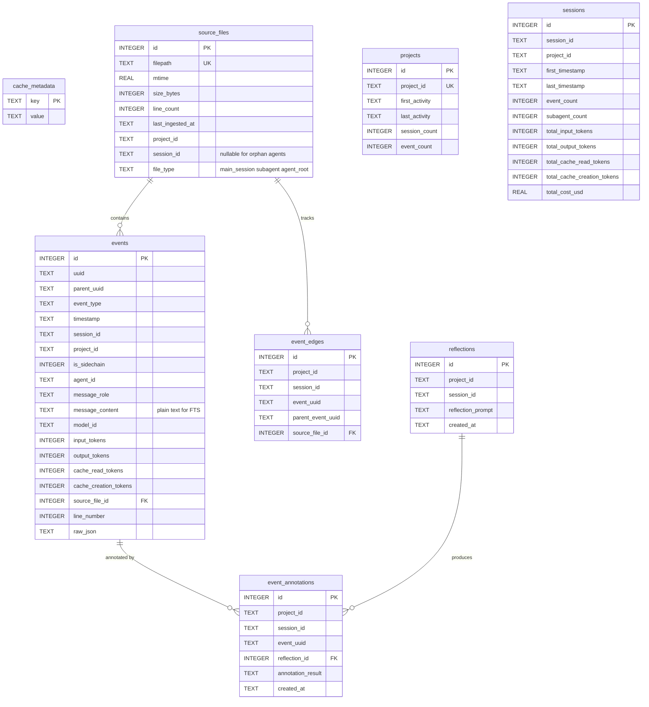

# Claude Code Introspection

A skill for self-introspection and analysis of Claude Code sessions, memory files, skills, hooks, and plugins.

## Current Session ID

The current session ID is automatically available:

```
${CLAUDE_SESSION_ID}
```

Use this to query the current session directly without needing to look it up.

## Quick Start

Use the bash wrapper script to query session data:

```bash
# Get summary of the CURRENT session
.claude/skills/introspect/scripts/introspect_sessions.sh summary ${CLAUDE_SESSION_ID}

# Show recent turns in the CURRENT session
.claude/skills/introspect/scripts/introspect_sessions.sh turns ${CLAUDE_SESSION_ID} -n 20

# Get tool usage for the CURRENT session
.claude/skills/introspect/scripts/introspect_sessions.sh tools ${CLAUDE_SESSION_ID}

# Get a specific event by UUID
.claude/skills/introspect/scripts/introspect_sessions.sh event ${CLAUDE_SESSION_ID} EVENT_UUID

# Traverse event tree from a UUID
.claude/skills/introspect/scripts/introspect_sessions.sh traverse ${CLAUDE_SESSION_ID} EVENT_UUID

# List all projects with session counts
.claude/skills/introspect/scripts/introspect_sessions.sh projects

# Get help
.claude/skills/introspect/scripts/introspect_sessions.sh --help
```

**Note:** For project IDs that start with hyphens (e.g., `-Users-joshpeak-...`), use `--` before the argument to prevent argparse from interpreting it as an option flag.

## Session Data Location

Claude Code stores session logs at:
```
~/.claude/projects/{project-path-kebab-cased}/{session_uuid}.jsonl
~/.claude/projects/{project-path-kebab-cased}/{session_uuid}/*.jsonl  # subagent files
```

Each JSONL file contains events with these types:
- `user` - User messages
- `assistant` - Claude's responses
- `tool_use` - Tool call requests (name, input, id)
- `tool_result` - Tool execution results
- `thinking` - Claude's thinking blocks
- `summary` - Session summary
- `progress` - Progress updates
- `file-history-snapshot` - File backup information

## SQLite Cache

The introspect script maintains a SQLite cache for fast queries. The cache is stored in the **current working directory** at:

```
.claude/cache/introspect_sessions.db
```

This project-local cache enables:
- Fast queries without re-parsing JSONL files
- FTS5 full-text search on message content
- Incremental updates (only process changed files)
- Source file tracking with mtime and line numbers

### Automatic Cache Updates

**By default, every query command automatically checks for stale files and updates the cache before executing.** This ensures you always see the latest session data, including events from the current conversation.

You can control this behavior with global flags:

```bash
# Default: Auto-check staleness and incrementally update
.claude/skills/introspect/scripts/introspect_sessions.sh summary ${CLAUDE_SESSION_ID}

# Skip auto-update (use existing cache as-is, faster)
.claude/skills/introspect/scripts/introspect_sessions.sh --cache-frozen summary ${CLAUDE_SESSION_ID}

# Wipe and rebuild cache from scratch before query
.claude/skills/introspect/scripts/introspect_sessions.sh --cache-rebuild summary ${CLAUDE_SESSION_ID}
```

| Flag | Behavior |
|------|----------|
| *(default)* | Check file mtimes, incrementally update changed files |
| `--cache-frozen` | Skip all cache updates, use existing data |
| `--cache-rebuild` | Wipe cache and re-ingest all files from scratch |

### Manual Cache Management Commands

For explicit cache control without running a query:

```bash
# Initialize a new cache database
.claude/skills/introspect/scripts/introspect_sessions.sh cache init

# Show cache status (file count, event count, size)
.claude/skills/introspect/scripts/introspect_sessions.sh cache status

# Incremental update - only process new/changed files
.claude/skills/introspect/scripts/introspect_sessions.sh cache update

# Full rebuild - clear and re-ingest all files
.claude/skills/introspect/scripts/introspect_sessions.sh cache rebuild

# Clear all cached data
.claude/skills/introspect/scripts/introspect_sessions.sh cache clear
```

### Cache Schema



**FTS5 virtual tables** (auto-synced via triggers):
- `events_fts` — full-text search on `events.message_content`
- `reflections_fts` — full-text search on `reflections.reflection_prompt`

**Key relationships:**
- `events.source_file_id` → `source_files.id` (CASCADE delete)
- `event_edges` links `event_uuid` → `parent_event_uuid` for tree traversal
- `event_annotations.(project_id, session_id, event_uuid)` → `events` (composite FK)
- `event_annotations.reflection_id` → `reflections.id` (CASCADE delete)

## Available Commands

### Session Summary (Current Session)

```bash
# Get comprehensive metrics for THIS session
.claude/skills/introspect/scripts/introspect_sessions.sh summary ${CLAUDE_SESSION_ID}
```

Returns:
- Total events, user/assistant message counts
- Tool calls count
- Duration
- Token usage breakdown (input, output, cache read, cache creation, total billable)
- Models used

### Show Turns (Current Session)

```bash
# Show last 20 turns in THIS session
.claude/skills/introspect/scripts/introspect_sessions.sh turns ${CLAUDE_SESSION_ID} -n 20

# Show only user and assistant messages
.claude/skills/introspect/scripts/introspect_sessions.sh turns ${CLAUDE_SESSION_ID} -t user assistant

# Show turns from the last hour
.claude/skills/introspect/scripts/introspect_sessions.sh turns ${CLAUDE_SESSION_ID} --since 1h
```

Options:
- `-t, --types TYPE [TYPE...]` - Filter event types (user, assistant, tool_use, etc.)
- `--since TIME` - Filter events after this time
- `--until TIME` - Filter events before this time
- `-n, --limit N` - Max turns to show (default: 100)
- `--offset N` - Skip first N turns
- `--no-content` - Exclude message content (faster)
- `-p, --project PROJECT` - Specify project for faster queries

Time filters support:
- ISO format: `2025-01-14T10:00:00`
- Relative: `1h` (1 hour ago), `30m`, `7d`, `2w`

### Tool Usage (Current Session)

```bash
# Summary of tools used in THIS session
.claude/skills/introspect/scripts/introspect_sessions.sh tools ${CLAUDE_SESSION_ID}

# Detailed tool calls
.claude/skills/introspect/scripts/introspect_sessions.sh tools ${CLAUDE_SESSION_ID} --detail

# Filter to specific tool
.claude/skills/introspect/scripts/introspect_sessions.sh tools ${CLAUDE_SESSION_ID} --tool Bash
```

### Cost Estimation

```bash
# Estimate cost for a session (defaults to Opus pricing)
.claude/skills/introspect/scripts/introspect_sessions.sh cost ${CLAUDE_SESSION_ID}

# Use Sonnet pricing
.claude/skills/introspect/scripts/introspect_sessions.sh cost ${CLAUDE_SESSION_ID} --model sonnet

# Use Haiku pricing
.claude/skills/introspect/scripts/introspect_sessions.sh cost ${CLAUDE_SESSION_ID} --model haiku
```

Returns:
- Token counts (input, output, cache read, cache creation)
- Cost breakdown by category (input, output, cache read/write)
- Total estimated cost in USD

Pricing (per 1M tokens):
- **Claude Opus 4.5**: $15 input, $75 output
- **Claude Sonnet 4.5**: $3 input, $15 output
- **Claude Haiku**: $1 input, $5 output
- **Cache reads**: 90% discount (0.1x input price)
- **Cache writes**: 25% premium (1.25x input price)

### Extract Messages

```bash
# Get all user messages from a session (useful for distilling prompts)
.claude/skills/introspect/scripts/introspect_sessions.sh messages SESSION_ID --role user

# Get all assistant responses
.claude/skills/introspect/scripts/introspect_sessions.sh messages SESSION_ID --role assistant

# Get both (default)
.claude/skills/introspect/scripts/introspect_sessions.sh messages SESSION_ID

# JSON format for full content (table truncates)
.claude/skills/introspect/scripts/introspect_sessions.sh -f json messages SESSION_ID --role user

# Filter to specific subagent
.claude/skills/introspect/scripts/introspect_sessions.sh messages SESSION_ID --agent AGENT_ID
```

Useful for:
- Reviewing what was asked in a session
- Distilling multi-turn conversations into single prompts
- Debugging conversation flow
- Creating reproducible prompts from exploratory sessions

### List Subagents

```bash
# List all subagents (Task tool spawns) within a session
.claude/skills/introspect/scripts/introspect_sessions.sh agents SESSION_ID
```

Returns for each subagent:
- `agent_id` - Unique identifier (e.g., `a4a6e3b`)
- `slug` - Human-readable name (e.g., `adaptive-snuggling-starlight`)
- `is_sidechain` - Whether it's a subagent (true) or main session (false)
- `event_count` - Total events in the agent's stream
- `tool_calls` - Number of tool invocations
- Token usage breakdown (input, output, cache read, cache creation)
- `total_billable_tokens` - Sum of billable tokens

**Understanding Subagents:**

When you use the `Task` tool, Claude Code spawns a subagent that:
- Shares the same `sessionId` as the parent
- Has its own unique `agentId`
- Is marked with `isSidechain: true`
- Events are linked via `parentUuid` for traceability

This allows analyzing token usage per subagent for cost attribution.

### List Projects

```bash
.claude/skills/introspect/scripts/introspect_sessions.sh projects
```

Shows all projects with:
- Project ID (kebab-cased path)
- Session count
- First/last activity timestamps

### List Sessions

```bash
.claude/skills/introspect/scripts/introspect_sessions.sh sessions -n LIMIT --since TIME -- PROJECT_ID
```

Options:
- `-n, --limit` - Max sessions to show (default: 20)
- `--since` - Filter sessions since timestamp (ISO or relative like '7d', '1h')

### Search Sessions

```bash
.claude/skills/introspect/scripts/introspect_sessions.sh search "error pattern" [-p PROJECT] [-t TYPES] [-n LIMIT]
```

Searches across all sessions for content matching the pattern (case-insensitive).

## UUID-Based Commands

### Get Specific Event

```bash
# Get a specific event by its UUID
.claude/skills/introspect/scripts/introspect_sessions.sh event SESSION_ID EVENT_UUID

# With JSON output for full details
.claude/skills/introspect/scripts/introspect_sessions.sh -f json event SESSION_ID EVENT_UUID
```

Returns the complete event data including:
- UUID and parent UUID
- Event type and timestamp
- Message content (text, thinking, tool_use, etc.)
- Token usage
- Source file info
- Raw message JSON

### Traverse Event Tree

```bash
# Get ancestors AND descendants of an event (default)
.claude/skills/introspect/scripts/introspect_sessions.sh traverse SESSION_ID EVENT_UUID

# Get only ancestors (parent chain)
.claude/skills/introspect/scripts/introspect_sessions.sh traverse SESSION_ID EVENT_UUID --direction ancestors

# Get only descendants (children tree)
.claude/skills/introspect/scripts/introspect_sessions.sh traverse SESSION_ID EVENT_UUID --direction descendants
```

Useful for:
- Understanding the conversation path that led to a specific response
- Finding all follow-up responses to a user question
- Tracing tool call chains

### Session Trajectory

```bash
# Get entire session event trajectory
.claude/skills/introspect/scripts/introspect_sessions.sh trajectory SESSION_ID

# Get trajectory from a specific UUID onwards
.claude/skills/introspect/scripts/introspect_sessions.sh trajectory SESSION_ID --start START_UUID

# Get trajectory between two UUIDs
.claude/skills/introspect/scripts/introspect_sessions.sh trajectory SESSION_ID --start START_UUID --end END_UUID

# Filter by event type and role
.claude/skills/introspect/scripts/introspect_sessions.sh trajectory SESSION_ID -t user assistant --role user -n 50
```

Returns an ordered sequence of events that can be:
- Filtered by event type (`-t user assistant`)
- Filtered by role (`--role user`)
- Sliced by UUID range (`--start`, `--end`)
- Limited (`-n 50`)

## Meta-Prompt Reflection

The `reflect` command enables running a meta-prompt against session events using `claude -p`. This is powerful for:
- Analyzing conversation quality
- Extracting patterns from past sessions
- Self-evaluation and improvement
- Building training data

### Basic Usage

```bash
# Rate each message
.claude/skills/introspect/scripts/introspect_sessions.sh reflect SESSION_ID \
    --prompt "Rate the quality of this message on a scale of 1-10 and explain why: {{content}}"

# Summarize assistant responses
.claude/skills/introspect/scripts/introspect_sessions.sh reflect SESSION_ID \
    --role assistant \
    --prompt "Summarize the key points in this response: {{content}}"
```

### Placeholders

The meta-prompt can use these placeholders:
- `{{content}}` - The message content (text from assistant/user messages)
- `{{event_type}}` - The event type (user, assistant, etc.)
- `{{uuid}}` - The event UUID
- `{{timestamp}}` - The event timestamp

### Options

```bash
.claude/skills/introspect/scripts/introspect_sessions.sh reflect SESSION_ID \
    --prompt "Analyze: {{content}}" \      # The meta-prompt
    --prompt-file prompt.txt \              # Or read from file
    --types user assistant \                # Filter event types
    --role assistant \                      # Filter by role
    --start UUID1 \                         # Start from UUID
    --end UUID2 \                           # End at UUID
    --limit 10 \                            # Max events to process
    --schema '{"rating": "number"}'         # Expected JSON output schema
```

### Structured Output

Request structured JSON output by providing a schema:

```bash
.claude/skills/introspect/scripts/introspect_sessions.sh -f json reflect SESSION_ID \
    --prompt "Analyze this message for sentiment and key topics: {{content}}" \
    --schema '{"sentiment": "string", "topics": ["string"], "confidence": "number"}'
```

### Example: Self-Evaluation

```bash
# Evaluate your own responses in the current session
.claude/skills/introspect/scripts/introspect_sessions.sh reflect ${CLAUDE_SESSION_ID} \
    --role assistant \
    --limit 5 \
    --prompt "Evaluate this assistant response:

1. Was it helpful? (yes/no)
2. Was it accurate? (yes/no)
3. Was it concise? (yes/no)
4. What could be improved?

Response to evaluate:
{{content}}"
```

### ML Text Analysis (Local Models)

The `reflect` command also supports local HuggingFace models via `--engine`, providing a cheap, fast alternative to `--prompt` (which calls `claude -p`). ML dependencies are injected at runtime only when `--engine` is used.

```bash
# Sentiment analysis on user messages
.claude/skills/introspect/scripts/introspect_sessions.sh reflect $SESSION \
    --engine sentiment --role user

# Named Entity Recognition
.claude/skills/introspect/scripts/introspect_sessions.sh reflect $SESSION \
    --engine ner --role user -n 50

# Zero-shot classification with custom labels
.claude/skills/introspect/scripts/introspect_sessions.sh reflect $SESSION \
    --engine zero-shot --labels "frustrated,satisfied,confused,neutral"

# Summarize all messages into one
.claude/skills/introspect/scripts/introspect_sessions.sh reflect $SESSION \
    --engine summarize --concatenate

# Override default model
.claude/skills/introspect/scripts/introspect_sessions.sh reflect $SESSION \
    --engine sentiment --ml-model "cardiffnlp/twitter-roberta-base-sentiment"
```

#### Available Engines

| Engine | HF Task | Default Model | Notes |
|--------|---------|---------------|-------|
| `sentiment` | sentiment-analysis | distilbert-base-uncased-finetuned-sst-2-english | Binary +/- |
| `zero-shot` | zero-shot-classification | facebook/bart-large-mnli | Requires `--labels` |
| `ner` | ner | dslim/bert-base-NER | Named Entity Recognition |
| `summarize` | summarization | facebook/bart-large-cnn | Supports `--concatenate` |

#### ML Engine Options

- `--engine {sentiment,zero-shot,ner,summarize}` — Use local ML model
- `--ml-model MODEL` — Override default HuggingFace model
- `--batch-size N` — Batch size for ML processing (default: 8)
- `--max-chars N` — Max chars per message for ML models (default: 2000)
- `--labels "a,b,c"` — Comma-separated labels for zero-shot engine
- `--concatenate` — Concatenate all messages for summarize engine

Results are persisted to the SQLite cache (`reflections` + `event_annotations` tables) and can be queried later.

## Output Formats

**Output defaults to JSON** for easy programmatic consumption and `jq` piping. All commands support multiple output formats via `-f/--format`:

```bash
# JSON format (default) - ideal for jq and programmatic use
.claude/skills/introspect/scripts/introspect_sessions.sh summary ${CLAUDE_SESSION_ID}
.claude/skills/introspect/scripts/introspect_sessions.sh summary ${CLAUDE_SESSION_ID} | jq '.user_messages'

# Table format - human-readable output
.claude/skills/introspect/scripts/introspect_sessions.sh -f table summary ${CLAUDE_SESSION_ID}

# JSONL format (one JSON object per line) - streaming/batch processing
.claude/skills/introspect/scripts/introspect_sessions.sh -f jsonl turns ${CLAUDE_SESSION_ID} -n 10
```

### Common jq Patterns

```bash
# Extract just the cost
introspect_sessions.sh cost ${CLAUDE_SESSION_ID} | jq -r '.total_cost_usd'

# Get user message count
introspect_sessions.sh summary ${CLAUDE_SESSION_ID} | jq -r '.user_messages'

# Filter tools with high usage
introspect_sessions.sh tools ${CLAUDE_SESSION_ID} | jq '.[] | select(.call_count > 10)'

# Get token breakdown
introspect_sessions.sh summary ${CLAUDE_SESSION_ID} | jq '{input: .input_tokens, output: .output_tokens, cache: .cache_read_tokens}'
```

## Common Use Cases

### Introspect This Session

```bash
# How many turns have we had?
.claude/skills/introspect/scripts/introspect_sessions.sh summary ${CLAUDE_SESSION_ID}

# What tools have been used?
.claude/skills/introspect/scripts/introspect_sessions.sh tools ${CLAUDE_SESSION_ID}

# Show the conversation flow
.claude/skills/introspect/scripts/introspect_sessions.sh turns ${CLAUDE_SESSION_ID} -t user assistant
```

### Debug a Previous Session

```bash
# Find recent sessions for this project
.claude/skills/introspect/scripts/introspect_sessions.sh sessions -n 5 -- PROJECT_ID

# Get summary of a specific session
.claude/skills/introspect/scripts/introspect_sessions.sh summary OTHER_SESSION_ID

# View tool results (often where errors appear)
.claude/skills/introspect/scripts/introspect_sessions.sh turns OTHER_SESSION_ID -t tool_result
```

### Analyze Tool Patterns Across Sessions

```bash
# Search for specific tool usage across all sessions
.claude/skills/introspect/scripts/introspect_sessions.sh search "Edit" -t assistant

# Search for errors
.claude/skills/introspect/scripts/introspect_sessions.sh search "error" -n 20
```

### Trace a Conversation Thread

```bash
# Find all events related to a specific UUID
.claude/skills/introspect/scripts/introspect_sessions.sh traverse SESSION_ID TARGET_UUID

# Get just the response chain (descendants)
.claude/skills/introspect/scripts/introspect_sessions.sh traverse SESSION_ID TARGET_UUID --direction descendants
```

### Analyze Token Usage by Agent

```bash
# See which subagents used the most tokens
.claude/skills/introspect/scripts/introspect_sessions.sh -f json agents SESSION_ID | jq 'sort_by(-.total_billable_tokens)'
```

## Technical Details

### Architecture

```
introspect_sessions.sh (bash wrapper)
       │
       └── uv run introspect_sessions.py (PEP-723 script)
                    │
                    └── Pure Python parsing of ~/.claude/projects/**/*.jsonl
```

The bash wrapper is needed because Claude Code skills cannot directly invoke `uv`. The wrapper simply calls `uv run` on the Python script.

### String Substitution

Claude Code provides `${CLAUDE_SESSION_ID}` which is automatically substituted with the current session's UUID when the skill is invoked. This enables self-introspection without manual lookup.

### PEP-723 Inline Dependencies

The Python script uses PEP-723 for inline dependency declaration:

```python
# /// script
# requires-python = ">=3.12"
# dependencies = []
# ///
```

This is a **zero-dependency script** using only Python 3.12+ standard library. No external packages like DuckDB are required.

### Data Schema

The script parses JSONL files with this structure:

```json
{
  "type": "user|assistant|tool_use|tool_result|thinking|progress|...",
  "timestamp": "2025-01-14T10:00:00.000Z",
  "uuid": "unique-event-id",
  "parentUuid": "parent-event-id",
  "sessionId": "session-uuid",
  "agentId": "agent-id-for-subagents",
  "isSidechain": true,
  "slug": "human-readable-agent-name",
  "message": {
    "role": "user|assistant",
    "content": "...",
    "model": "claude-opus-4-5-20251101",
    "usage": {
      "input_tokens": 1000,
      "output_tokens": 500,
      "cache_read_input_tokens": 200,
      "cache_creation_input_tokens": 100,
      "cache_creation": {
        "ephemeral_5m_input_tokens": 50
      }
    }
  },
  "name": "ToolName",
  "input": {},
  "id": "tool-call-id"
}
```

### Pure Python Advantages

Using pure Python instead of DuckDB provides:
- **Zero dependencies** - No need to install DuckDB or other packages
- **Faster startup** - No database initialization overhead
- **Better nested JSON handling** - Python naturally handles deeply nested structures
- **UUID-based traversal** - Native support for event tree navigation
- **subprocess integration** - Easy to spawn `claude -p` for reflection

### Requirements

- Python 3.12+
- `uv` (for running with PEP-723 scripts)

Install uv if not present:
```bash
curl -LsSf https://astral.sh/uv/install.sh | sh
```

## Deprecated: DuckDB Implementation

The previous DuckDB-based implementation (`query_sessions.py`) is now deprecated. While it remains available for backward compatibility, new features will only be added to `introspect_sessions.py`.

Migration is straightforward - the command interface is identical:
```bash
# Old (deprecated)
.claude/skills/introspect/scripts/query_sessions.sh summary SESSION_ID

# New (recommended)
.claude/skills/introspect/scripts/introspect_sessions.sh summary SESSION_ID
```

## Future Capabilities (Planned)

- **Memory file management**: List, analyze, and organize CLAUDE.md files
- **Skill discovery**: Analyze and catalog available skills
- **Hook inspection**: View configured hooks and their triggers
- **Plugin management**: List and analyze installed plugins
- **Session comparison**: Compare two sessions to understand differences
- **Batch reflection**: Process multiple sessions with the same meta-prompt
- **Reflection reports**: Generate insights about Claude's behavior patterns
