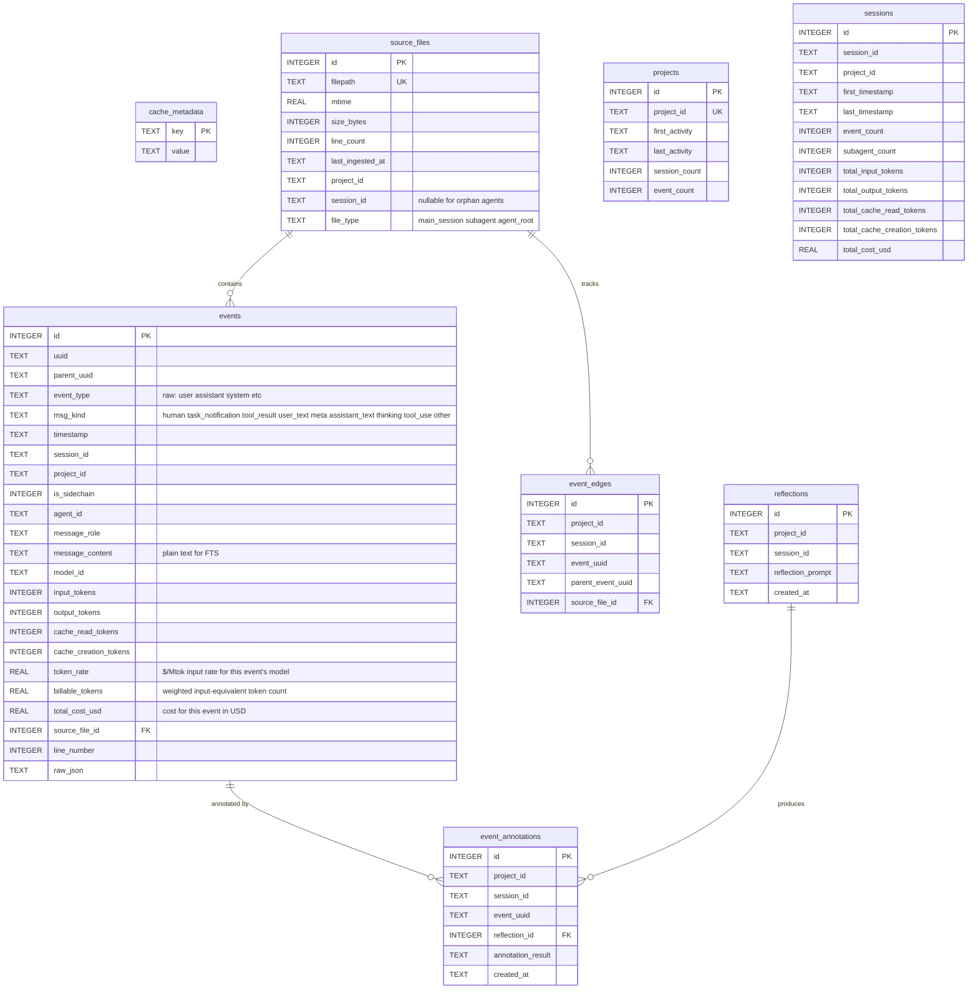

# Cache Reference

## Automatic Cache Updates

Every query command checks file mtimes and incrementally updates before executing. Control with global flags:

```bash
# Default: check staleness, incrementally update changed files
.claude/skills/introspect/scripts/introspect_sessions.sh turns ${CLAUDE_SESSION_ID}

# Skip auto-update (use existing cache as-is, faster)
.claude/skills/introspect/scripts/introspect_sessions.sh --cache-frozen turns ${CLAUDE_SESSION_ID}

# Wipe and rebuild cache from scratch before query
.claude/skills/introspect/scripts/introspect_sessions.sh --cache-rebuild turns ${CLAUDE_SESSION_ID}
```

| Flag | Behavior |
|------|----------|
| *(default)* | Check file mtimes, incrementally update changed files |
| `--cache-frozen` | Skip all cache updates, use existing data |
| `--cache-rebuild` | Wipe cache and re-ingest all files from scratch |

## Manual Cache Management

```bash
.claude/skills/introspect/scripts/introspect_sessions.sh cache init      # Initialize new cache DB
.claude/skills/introspect/scripts/introspect_sessions.sh cache status    # File count, event count, size
.claude/skills/introspect/scripts/introspect_sessions.sh cache update    # Incremental update only
.claude/skills/introspect/scripts/introspect_sessions.sh cache rebuild   # Clear and re-ingest all
.claude/skills/introspect/scripts/introspect_sessions.sh cache clear     # Clear all cached data
```

Cache is stored at `~/.claude/cache/introspect_sessions.db`.

## Schema



**FTS5 virtual tables** (auto-synced via triggers):
- `events_fts` — full-text search on `events.message_content`
- `reflections_fts` — full-text search on `reflections.reflection_prompt`

**Key relationships:**
- `events.source_file_id` → `source_files.id` (CASCADE delete)
- `event_edges` links `event_uuid` → `parent_event_uuid` for tree traversal
- `event_annotations.(project_id, session_id, event_uuid)` → `events` (composite FK)
- `event_annotations.reflection_id` → `reflections.id` (CASCADE delete)

## Event Cost Enrichment

Three cost fields are computed at ingestion time and **stored** in the `events` table. They are available on every event-returning command (`turns`, `traverse`, `event`) directly from the database without any per-query computation.

| Field | Type | Description |
|-------|------|-------------|
| `token_rate` | `float` | Input $/Mtok for the event's model family |
| `billable_tokens` | `float` | Weighted input-equivalent token count |
| `total_cost_usd` | `float` | Cost for this event in USD |

### Token Rate by Model Family

| Family | `token_rate` ($/Mtok) |
|--------|-----------------------|
| `opus` | 15.0 |
| `sonnet` | 3.0 |
| `haiku` | 1.0 |
| unknown | 0.0 |

Model family is detected from `model_id` via substring match (`opus`, `sonnet`, `haiku`). New model versions are handled automatically without config changes.

### Billable Tokens Formula

```
billable_tokens = input_tokens
                + output_tokens        × 5.0
                + cache_read_tokens    × 0.1
                + cache_creation_tokens × 1.25
```

All model families share identical relative multipliers, so a single formula covers all events regardless of which model was active.

### Cost Formula

```
total_cost_usd = billable_tokens × token_rate / 1_000_000
```

### Example jq Queries

```bash
# Total cost for a session
turns SESSION_ID | jq '[.[].total_cost_usd] | add'

# Most expensive events (tool_use calls)
turns SESSION_ID -t tool_use | jq 'sort_by(-.total_cost_usd) | .[:5]'

# Cost breakdown by msg_kind
turns SESSION_ID | jq 'group_by(.msg_kind) | map({kind: .[0].msg_kind, cost: ([.[].total_cost_usd] | add)})'

# Events where model switched mid-session
turns SESSION_ID | jq '[.[] | {uuid, model_id, token_rate}] | unique_by(.model_id)'
```
