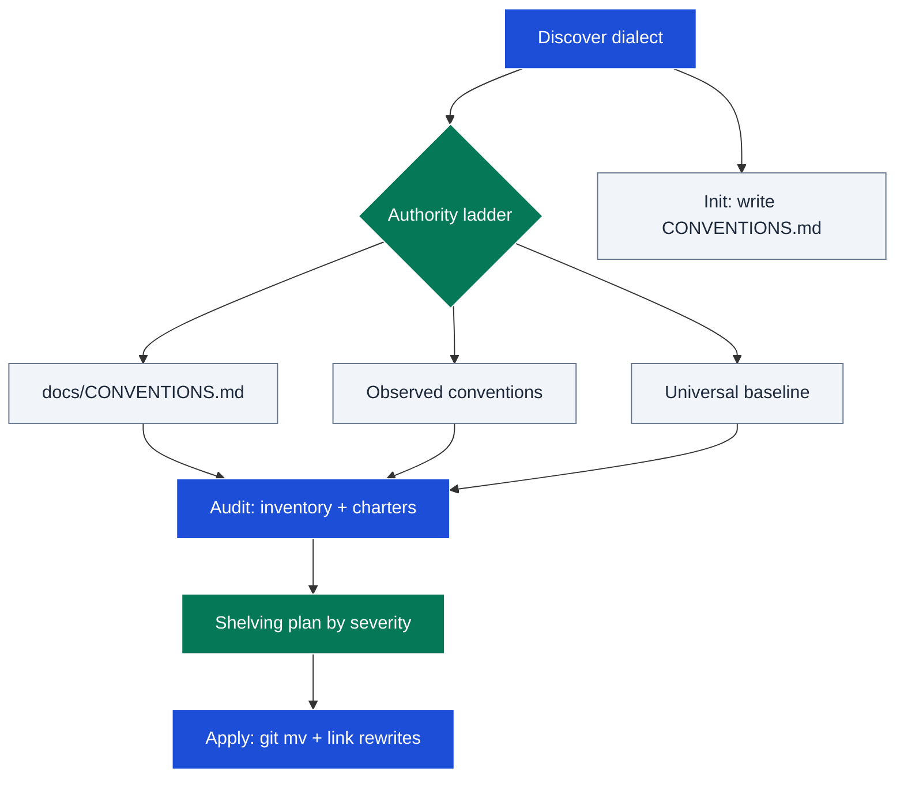

# librarian

Keeps a repository's documentation *organised*: the canonical documents exist
(README, CONTRIBUTING, an agent file, an ADR surface), carry the right names,
live in the right locations, and cross-link as required — including spotting
sections that semantically belong in a different file. It judges placement
only, never prose quality or staleness; content moves verbatim, so
organisation passes compose cleanly with independent content-quality tooling.

## Table of Contents

<details><summary>Click to expand</summary>

<!--TOC-->

- [librarian](#librarian)
  - [Table of Contents](#table-of-contents)
  - [Quickstart](#quickstart)
  - [Architecture](#architecture)
  - [Reference](#reference)
    - [Troubleshooting](#troubleshooting)
  - [For maintainers](#for-maintainers)

<!--TOC-->

</details>

## Quickstart

In Claude Code:

```text
/librarian                      # audit the whole repo, get a shelving plan
/librarian audit docs/          # audit one subtree (dialect still repo-rooted)
/librarian init                 # bootstrap docs/CONVENTIONS.md from observed practice
/librarian init standard        # scaffold a named flavour (minimal|standard|rigorous)
/librarian apply                # execute the approved shelving plan
```

Driving the cheapest existence checks directly — required set + link wiring:

```sh
ls README.md CONTRIBUTING.md CLAUDE.md AGENTS.md ADRs.md 2>/dev/null
grep -rn "ADRs.md\|adrs/" CLAUDE.md      # agent file must route to the ADR surface
```

Escape hatch — find docs nothing links to (orphan candidates):

```sh
for f in $(git ls-files '*.md'); do grep -rql --include='*.md' "$(basename "$f")" . | grep -qv "^./$f$" || echo "orphan? $f"; done
```

## Architecture



Every mode starts by resolving what "compliant" means for *this* repo — a
declared `docs/CONVENTIONS.md` dialect beats observed conventions, which beat
the researched baseline — then audits against document charters and executes
only loss-free, history-preserving operations.

## Reference

- Operating manual (modes, authority ladder, audit steps, apply invariants):
  [SKILL.md](SKILL.md)
- Universal compliance baseline (required set, locations, naming, ADR and
  agent-file rules): [resources/baseline.md](resources/baseline.md)
- Misplacement smell catalog (M1-M10 whole-doc, P1-P6 within-file):
  [resources/misplacement_smells.md](resources/misplacement_smells.md)
- docs/CONVENTIONS.md template + bootstrapping guidance:
  [resources/conventions_template.md](resources/conventions_template.md)
- Flavour presets (minimal / standard / rigorous) + graduation triggers:
  [resources/flavours.md](resources/flavours.md)
- Research citations and counter-evidence (dated):
  [resources/evidence.md](resources/evidence.md)

Requirements: `git` (history-preserving moves, inbound-link greps); subagent
support for partial-misplacement reading on large repos. Audit and init are
cheap; apply mutates files and should run on a branch.

### Troubleshooting

| Symptom | Cause / fix |
|---------|-------------|
| Audit flags a deliberate local layout as wrong | The authority ladder was skipped — a consistently-observed convention outranks the baseline; declare it in `docs/CONVENTIONS.md` to end the argument. |
| Same finding reappears after you rejected it | The ruling wasn't recorded — rejections belong in `resources/learned/adjudications.md`; add it and audits treat it as decided. |
| Apply broke inbound links | The rewrite grep missed non-markdown referrers — re-grep the old path/anchors across agent files, configs, and code comments. |
| Moved section reads as stale/wrong in its new home | Correct behaviour — cargo moves verbatim; run a content-quality pass separately. |
| `git status` shows delete + add instead of a rename | Move wasn't done with `git mv` (or the file changed too much in the same step) — move first, commit, then let other tooling edit. |
| Audit reports only whole-file findings on a big repo | Partial smells need section-level reading — re-run with subagent fan-out or scope the audit to one subtree at a time. |
| Init produced dialect lines the maintainer disagrees with | Defaulted lines are marked for veto — edit `docs/CONVENTIONS.md`; the declared dialect wins all future audits. |

## For maintainers

Design rationale, decision log, and extension checklist: [CLAUDE.md](CLAUDE.md).
