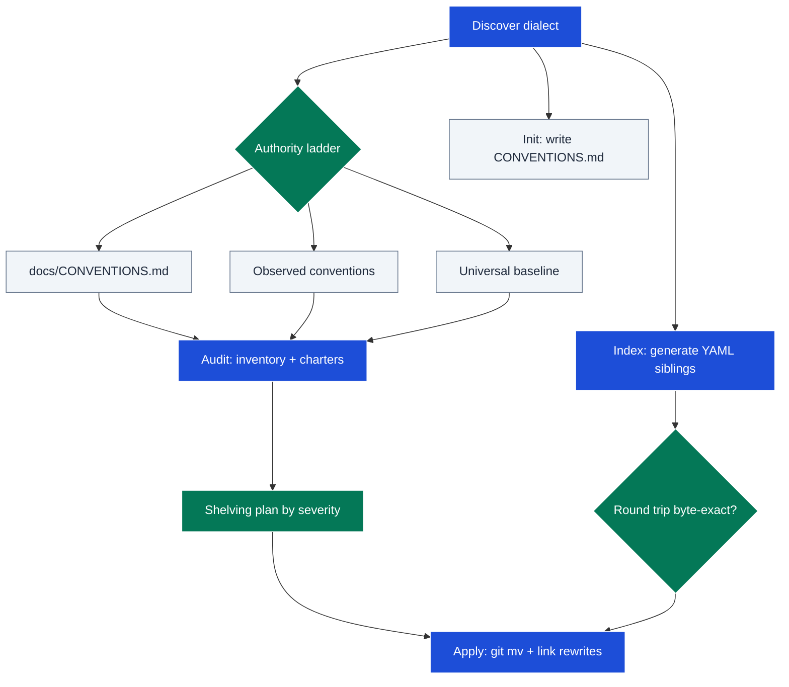

# librarian

Keeps a repository's documentation *organised*

- the canonical documents exist (README, CONTRIBUTING, an agent file, an ADR surface),
- carry the right names,
- live in the right locations, and
- cross-link as required — including spotting sections that semantically belong in a different file.

This skill is about _**curation**_ not _**content**_.

## Table of Contents

<details><summary>Click to expand</summary>

<!--TOC-->

- [librarian](#librarian)
  - [Table of Contents](#table-of-contents)
  - [Quickstart](#quickstart)
  - [Architecture](#architecture)
  - [Reference](#reference)
    - [Troubleshooting](#troubleshooting)
  - [For maintainers](#for-maintainers)

<!--TOC-->

</details>

## Quickstart

In Claude Code:

```text
/librarian                      # audit the whole repo, get a shelving plan
/librarian audit docs/          # audit one subtree (dialect still repo-rooted)
/librarian init                 # bootstrap docs/CONVENTIONS.md from observed practice
/librarian init standard        # scaffold a named flavour (minimal|standard|rigorous)
/librarian apply                # execute the approved shelving plan
/librarian index docs/          # curate queryable YAML siblings for a document set
/librarian index okf-yaml adrs/ # adopt or migrate to the named okf-yaml ADR surface
```

Driving the indexer directly (no agent needed):

```sh
# index one document into a queryable YAML sibling
bun run .claude/skills/librarian/scripts/md2yaml.ts docs/guide.md --out docs/guide.yml

# the gate: reconstruct the markdown from the index and fail on any drift
bun run .claude/skills/librarian/scripts/md2yaml.ts docs/guide.md --check

# the other direction: render an okf-yaml bundle from its authored YAML records
uv run --no-project --with PyYAML --with Jinja2 --with jsonschema \
  .claude/skills/librarian/scripts/okf_render.py \
  .claude/skills/librarian/resources/okf_yaml/example
```

The escape hatch — query a whole corpus with `jq`, because `--json` emits the same index:

```sh
for f in docs/*.md; do
  bun run .claude/skills/librarian/scripts/md2yaml.ts "$f" --json
done > corpus.ndjson

# every fenced code block and its language, with the document it came from
jq -r '.file as $f | [..|objects|select(.type=="code")]|.[]|"\($f): \(.lang // "none")"' corpus.ndjson
```


## Architecture


```mermaid
flowchart TD
    D[Discover dialect] --> L{Authority ladder}
    L --> C[docs/CONVENTIONS.md]
    L --> O[Observed conventions]
    L --> B[Universal baseline]
    C --> A[Audit: inventory + charters]
    O --> A
    B --> A
    A --> S[Shelving plan by severity]
    S --> AP[Apply: git mv + link rewrites]
    D --> I[Init: write CONVENTIONS.md]
    D --> X[Index: generate YAML siblings]
    X --> V{Round trip byte-exact?}
    V --> AP

    classDef primary fill:#1d4ed8,stroke:#fff,color:#fff
    classDef secondary fill:#f1f5f9,stroke:#64748b,color:#1e293b
    classDef accent fill:#047857,stroke:#fff,color:#fff
    class D,A,AP,X primary
    class C,O,B,I secondary
    class L,S,V accent
```

Every mode starts by resolving what "compliant" means for *this* repo — a declared `docs/CONVENTIONS.md` dialect beats observed conventions, which beat the researched baseline — then audits against document charters and executes only loss-free, history-preserving operations.
Index mode is the one mode that writes without touching a source document: it emits generated siblings and refuses to ship any it cannot reconstruct the original from, byte for byte.

## Reference

- Operating manual (modes, authority ladder, audit steps, apply invariants): [SKILL.md](SKILL.md)
- Universal compliance baseline (required set, locations, naming, ADR and agent-file rules): [resources/baseline.md](resources/baseline.md)
- Misplacement smell catalog (M1-M10 whole-doc, P1-P6 within-file): [resources/misplacement_smells.md](resources/misplacement_smells.md)
- docs/CONVENTIONS.md template + bootstrapping guidance: [resources/conventions_template.md](resources/conventions_template.md)
- Flavour presets (minimal / standard / rigorous) + graduation triggers: [resources/flavours.md](resources/flavours.md)
- Preferred shape of one ADR (metadata, Lens, Problem / Decision / Consequences): [resources/adr_template.md](resources/adr_template.md)
- Machine-readable layouts in general, adoption triggers, output shape and gotchas: [resources/structured_siblings.md](resources/structured_siblings.md)
- The named `okf-yaml` ADR surface (record schema, relation vocabulary, finding table, migration): [resources/adr_okf_yaml.md](resources/adr_okf_yaml.md)
- Its shipped artifacts: [`resources/okf_yaml/record.schema.json`](resources/okf_yaml/record.schema.json) (the contract), [`resources/okf_yaml/example/`](resources/okf_yaml/example) (a worked bundle, doubling as the golden fixture), `scripts/okf_render.py` + `scripts/templates/`
- Research citations and counter-evidence (dated): [resources/evidence.md](resources/evidence.md)

Requirements: `git` (history-preserving moves, inbound-link greps); subagent support for partial-misplacement reading on large repos. Index mode adds toolchains, and only index mode: `bun` for the markdown indexer (`make -C .claude/skills/librarian/scripts install`), and `uv` for the `okf-yaml` generator, whose dependencies are declared inline via PEP-723 and resolved on first run.
No network calls and no paid API usage in any mode.
Audit and init are cheap; apply mutates source files and should run on a branch; index writes only generated artifacts.

### Troubleshooting

| Symptom | Cause / fix |
|---------|-------------|
| Audit flags a deliberate local layout as wrong | The authority ladder was skipped — a consistently-observed convention outranks the baseline; declare it in `docs/CONVENTIONS.md` to end the argument. |
| Same finding reappears after you rejected it | The ruling wasn't recorded — rejections belong in `resources/learned/adjudications.md`; add it and audits treat it as decided. |
| Apply broke inbound links | The rewrite grep missed non-markdown referrers — re-grep the old path/anchors across agent files, configs, and code comments. |
| Moved section reads as stale/wrong in its new home | Correct behaviour — cargo moves verbatim; run a content-quality pass separately. |
| `git status` shows delete + add instead of a rename | Move wasn't done with `git mv` (or the file changed too much in the same step) — move first, commit, then let other tooling edit. |
| Audit reports only whole-file findings on a big repo | Partial smells need section-level reading — re-run with subagent fan-out or scope the audit to one subtree at a time. |
| Init produced dialect lines the maintainer disagrees with | Defaulted lines are marked for veto — edit `docs/CONVENTIONS.md`; the declared dialect wins all future audits. |
| `--check` reports DIFFERS on a document | The reconstruction doesn't model a construct it uses (raw HTML blocks, setext headings). Report it; never edit the document to suit the tool. |
| A later audit flags the generated `.yml` files as duplication | The arrangement wasn't recorded — add it and the generated-path glob to `docs/CONVENTIONS.md`, and audits treat them as build artifacts. |
| `bun: command not found` on index mode | Index mode is the only mode needing bun — install it, or use the other three modes, which are prose-only. |
| Generated siblings drifted from their sources | Regeneration wasn't wired to a make target — a command someone has to remember is a stale index. |
| `okf_render.py` exits 1 with "records did not validate" | Working as designed: an invalid record stops the build rather than producing markdown nothing checked. Fix the `.yml`, never the generated `.md`. |
| A generated frontmatter field reads `None` | A null value reached a template without a guard. Omit the key when the value is null; `plan_id: None` parses as the *string* `'None'`. |

## For maintainers

Design rationale, decision log, and extension checklist: [CLAUDE.md](CLAUDE.md).
