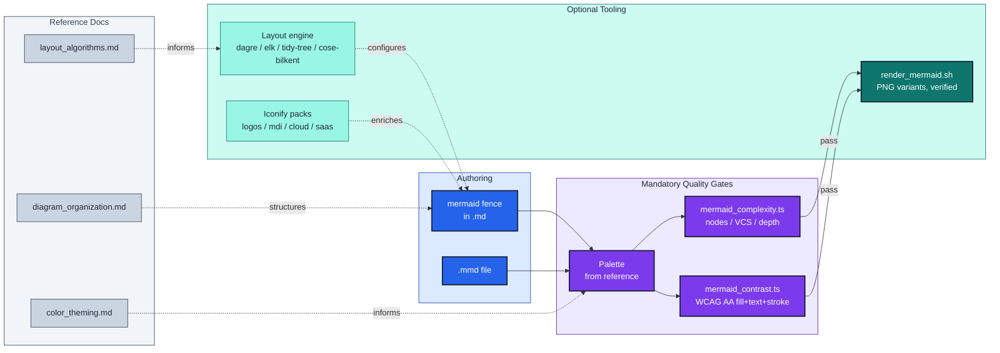

# mermaidjs-diagrams

Render and maintain Mermaid.JS diagrams with **visual-clarity enforcement**.

## Features

- **Render** `.md` files containing ```` ```mermaid ```` fences to PNG. Two
  variants by default, dark+transparent and default+white, because a diagram
  has to read on a dark host and a light host and one image cannot do both.
  Every artifact is verified as a decodable PNG: a renderer exiting 0 without
  writing an image is a failure, not a pass.
- **Self-triaging renders**: Chromium failures are classified (npm cache,
  missing browser, sandbox denial, network, diagram syntax, or unknown), the
  two mechanically remediable classes are retried once, and only one class
  ever means "edit the diagram."
- **Complexity lint**: ruff-style findings on node count, visual-complexity
  score, and subgraph depth. Cognitive-load-calibrated thresholds (Huang
  2020; 50 nodes at the default preset). Uses Mermaid's canonical parser.
- **Contrast audit (required, not optional)**: every diagram with custom
  colors MUST derive its palette from `resources/color_theming.md` and pass
  `scripts/mermaid_contrast.ts` (WCAG 2.x gate; APCA Lc reported in `--json`).
  `SKILL.md` "Why this is mandatory" carries the reasoning. An ad-hoc pair
  checker also ships for sampling (hex, rgb, oklch, named).
- **Layout engines**: dagre, elk, tidy-tree and cose-bilkent (mindmap only),
  selectable per diagram via YAML frontmatter. `look: classic | handDrawn | neo`.
- **Icon packs**: Iconify (logos, mdi, cloud, saas) for `architecture-beta`;
  Font Awesome for flowcharts.

## How it fits together



*Mermaid source flows left-to-right through two mandatory gates, structural
complexity and color contrast, before rendering. Reference docs (dotted)
supply the rules each stage enforces.*

## Quick start

```bash
make -C .claude/skills/mermaidjs-diagrams/scripts install-ts      # once: bun deps for the gate scripts
bash .claude/skills/mermaidjs-diagrams/scripts/render_mermaid.sh path/to/doc.md
make -C .claude/skills/mermaidjs-diagrams/scripts cli-demo
```

See [`SKILL.md`](SKILL.md) for usage, [`resources/`](resources/) for deep dives,
[render triage](resources/render_troubleshooting.md) when a render fails for
reasons that aren't the diagram, and [`scripts/CLAUDE.md`](scripts/CLAUDE.md)
for the maintenance guide.
