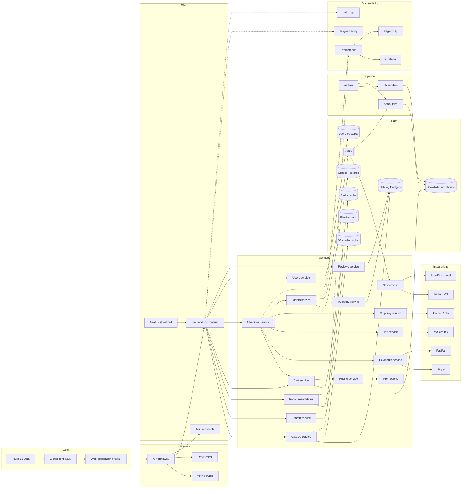

# Storefront platform architecture

This document describes the production topology of the storefront platform: the
edge, the API layer, the domain services, the data stores, the third-party
integrations, the asynchronous pipeline, and the observability stack. The
diagram below was exported from the infrastructure inventory and has grown with
every service that was added; it is complete but no longer readable at a glance.

The diagram is used in onboarding, in architecture reviews, and in incident
retrospectives. Each audience needs a different amount of it.
