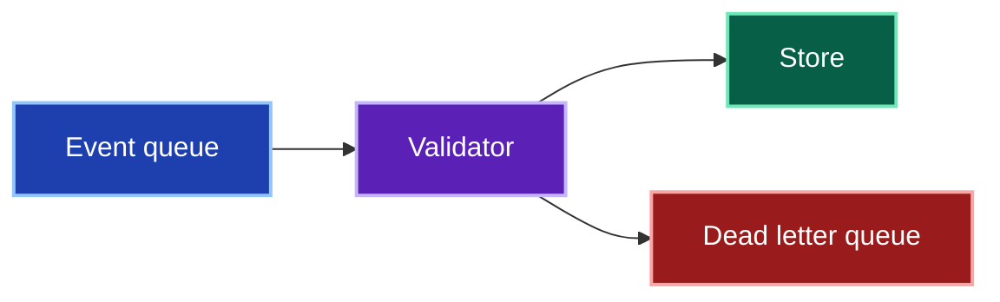

# Ingest pipeline

The ingest service pulls events from the queue, validates them, and writes
them to the store. Failures land on a dead-letter queue.

```mermaid
flowchart LR
    Q[Event queue] --> V[Validator]
    V --> S[Store]
    V --> D[Dead letter queue]

    classDef source  fill:#1e40af,stroke:#93c5fd,color:#fff,stroke-width:2px
    classDef process fill:#5b21b6,stroke:#c4b5fd,color:#fff,stroke-width:2px
    classDef sink    fill:#065f46,stroke:#6ee7b7,color:#fff,stroke-width:2px
    classDef failure fill:#991b1b,stroke:#fca5a5,color:#fff,stroke-width:2px

    class Q source
    class V process
    class S sink
    class D failure
```
