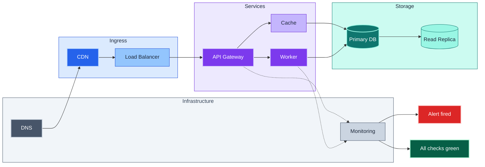
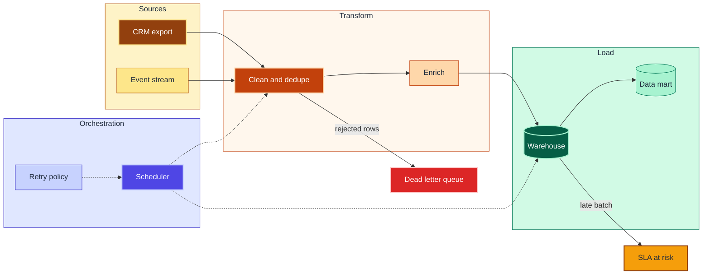
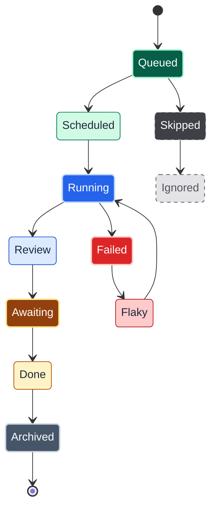
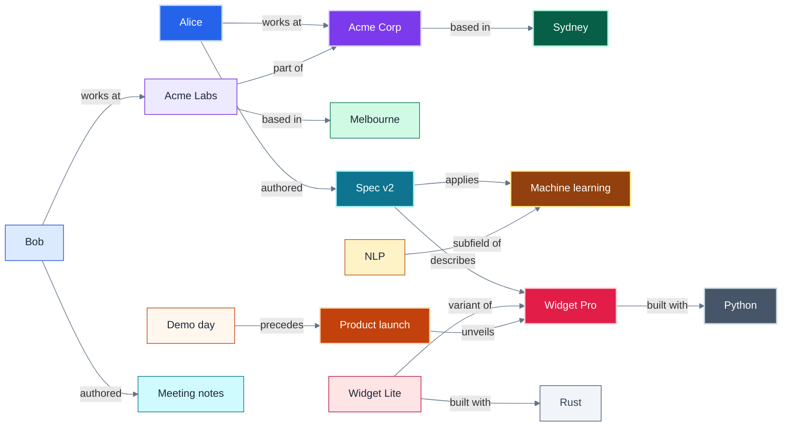

# Mermaid Color Palette Recipes & Hex Reference

Part of the **Mermaid color theming** family; see
[`color_theming.md`](color_theming.md) for the principles (HSL encoding,
dark/light-mode safety, visual hierarchy, subgraph coloring). This file is the
**copy-paste catalog**: four ready-made palette recipes, a worked example for
each one, and the Tailwind v3 hex lookup that backs them all.

All palettes below use Tailwind v3 hex values. Each includes primary (dark fill,
white text, light stroke), secondary (light fill, dark text, dark stroke), and
subgraph variants. Every `classDef` passes both gates in `mermaid_contrast.ts`:
text on fill at 4.5:1 or better and stroke on fill at 3:1 or better. The rules
that make that hold are in "Stroke and fill rules" at the end of this file.

## Palette Recipes

### Recipe A: Software Architecture (Cool Tones)

For layered architecture, microservices, deployment diagrams.

```
%% --- Architecture palette: blue/violet/teal/slate ---

%% Entrypoint / Ingress (Blue family)
classDef ingressPrimary    fill:#2563eb,stroke:#bfdbfe,color:#fff,stroke-width:2px
classDef ingressSecondary  fill:#93c5fd,stroke:#1d4ed8,color:#1e293b,stroke-width:1px
classDef sgIngress         fill:#dbeafe,stroke:#1d4ed8,color:#1e293b

%% Business Logic / Compute (Violet family)
classDef computePrimary    fill:#7c3aed,stroke:#ddd6fe,color:#fff,stroke-width:2px
classDef computeSecondary  fill:#c4b5fd,stroke:#6d28d9,color:#1e293b,stroke-width:1px
classDef sgCompute         fill:#ede9fe,stroke:#6d28d9,color:#1e293b

%% Data / Storage (Teal family)
classDef dataPrimary       fill:#0f766e,stroke:#99f6e4,color:#fff,stroke-width:2px
classDef dataSecondary     fill:#99f6e4,stroke:#0f766e,color:#1e293b,stroke-width:1px
classDef sgData            fill:#ccfbf1,stroke:#0f766e,color:#1e293b

%% External / Infrastructure (Slate family)
classDef infraPrimary      fill:#475569,stroke:#cbd5e1,color:#fff,stroke-width:2px
classDef infraSecondary    fill:#cbd5e1,stroke:#475569,color:#1e293b,stroke-width:1px
classDef sgInfra           fill:#f1f5f9,stroke:#475569,color:#334155

%% Accent: Danger / Alert
classDef danger            fill:#dc2626,stroke:#fecaca,color:#fff,stroke-width:2px
%% Accent: Success / Healthy
classDef success           fill:#065f46,stroke:#a7f3d0,color:#fff,stroke-width:2px
```

### Recipe B: Data Flow / ETL Pipeline (Warm Tones)

For data pipelines, ETL, stream processing, ML workflows.

```
%% --- Data Flow palette: amber/orange/emerald/indigo ---

%% Source / Input (Amber family)
classDef sourcePrimary     fill:#92400e,stroke:#fde68a,color:#fff,stroke-width:2px
classDef sourceSecondary   fill:#fde68a,stroke:#b45309,color:#1e293b,stroke-width:1px
classDef sgSource          fill:#fef3c7,stroke:#b45309,color:#1e293b

%% Transform / Process (Orange family)
classDef transformPrimary  fill:#c2410c,stroke:#fed7aa,color:#fff,stroke-width:2px
classDef transformSecondary fill:#fed7aa,stroke:#c2410c,color:#1e293b,stroke-width:1px
classDef sgTransform       fill:#fff7ed,stroke:#c2410c,color:#1e293b

%% Load / Output (Emerald family)
classDef loadPrimary       fill:#065f46,stroke:#a7f3d0,color:#fff,stroke-width:2px
classDef loadSecondary     fill:#a7f3d0,stroke:#047857,color:#1e293b,stroke-width:1px
classDef sgLoad            fill:#d1fae5,stroke:#047857,color:#1e293b

%% Orchestration / Control (Indigo family)
classDef orchPrimary       fill:#4f46e5,stroke:#c7d2fe,color:#fff,stroke-width:2px
classDef orchSecondary     fill:#c7d2fe,stroke:#4338ca,color:#1e293b,stroke-width:1px
classDef sgOrch            fill:#e0e7ff,stroke:#4338ca,color:#1e293b

%% Accent: Failed / Error
classDef error             fill:#dc2626,stroke:#fecaca,color:#fff,stroke-width:2px
%% Accent: Warning / Slow
classDef warning           fill:#f59e0b,stroke:#92400e,color:#1e293b,stroke-width:2px
```

### Recipe C: State / Workflow Diagram (Semantic Colors)

For state machines, CI/CD pipelines, approval workflows.

```
%% --- Workflow palette: semantic roles ---

%% Start / Entry state (Green family)
classDef stateStart        fill:#065f46,stroke:#a7f3d0,color:#fff,stroke-width:2px
classDef stateStartLight   fill:#d1fae5,stroke:#047857,color:#1e293b,stroke-width:1px

%% In-Progress / Active (Blue family)
classDef stateActive       fill:#2563eb,stroke:#bfdbfe,color:#fff,stroke-width:2px
classDef stateActiveLight  fill:#dbeafe,stroke:#1d4ed8,color:#1e293b,stroke-width:1px

%% Review / Waiting (Amber family)
classDef stateWaiting      fill:#92400e,stroke:#fde68a,color:#fff,stroke-width:2px
classDef stateWaitingLight fill:#fef3c7,stroke:#b45309,color:#1e293b,stroke-width:1px

%% End / Complete (Slate family)
classDef stateEnd          fill:#475569,stroke:#cbd5e1,color:#fff,stroke-width:2px
classDef stateEndLight     fill:#e2e8f0,stroke:#475569,color:#1e293b,stroke-width:1px

%% Error / Rejected (Red family)
classDef stateError        fill:#dc2626,stroke:#fecaca,color:#fff,stroke-width:2px
classDef stateErrorLight   fill:#fecaca,stroke:#b91c1c,color:#1e293b,stroke-width:1px

%% Cancelled / Skipped (Zinc family -- true neutral)
classDef stateSkipped      fill:#3f3f46,stroke:#d4d4d8,color:#fff,stroke-width:1px,stroke-dasharray:5 5
classDef stateSkippedLight fill:#e4e4e7,stroke:#52525b,color:#52525b,stroke-width:1px,stroke-dasharray:5 5
```

### Recipe D: High-Density Knowledge Graph (Maximum Distinction)

For ER diagrams, knowledge graphs, ontologies with many entity types.

```
%% --- Knowledge Graph palette: 8 maximally distinct hues ---

classDef kgPerson          fill:#2563eb,stroke:#bfdbfe,color:#fff,stroke-width:2px
classDef kgOrganization    fill:#7c3aed,stroke:#ddd6fe,color:#fff,stroke-width:2px
classDef kgLocation        fill:#065f46,stroke:#a7f3d0,color:#fff,stroke-width:2px
classDef kgEvent           fill:#c2410c,stroke:#fed7aa,color:#fff,stroke-width:2px
classDef kgDocument        fill:#0e7490,stroke:#a5f3fc,color:#fff,stroke-width:2px
classDef kgConcept         fill:#92400e,stroke:#fde68a,color:#fff,stroke-width:2px
classDef kgProduct         fill:#e11d48,stroke:#fecdd3,color:#fff,stroke-width:2px
classDef kgTechnology      fill:#475569,stroke:#cbd5e1,color:#fff,stroke-width:2px

%% Lighter variants for secondary/mention nodes
classDef kgPersonLight     fill:#dbeafe,stroke:#1d4ed8,color:#1e293b,stroke-width:1px
classDef kgOrgLight        fill:#ede9fe,stroke:#6d28d9,color:#1e293b,stroke-width:1px
classDef kgLocationLight   fill:#d1fae5,stroke:#047857,color:#1e293b,stroke-width:1px
classDef kgEventLight      fill:#fff7ed,stroke:#c2410c,color:#1e293b,stroke-width:1px
classDef kgDocumentLight   fill:#cffafe,stroke:#0e7490,color:#1e293b,stroke-width:1px
classDef kgConceptLight    fill:#fef3c7,stroke:#b45309,color:#1e293b,stroke-width:1px
classDef kgProductLight    fill:#ffe4e6,stroke:#be123c,color:#1e293b,stroke-width:1px
classDef kgTechLight       fill:#f1f5f9,stroke:#475569,color:#334155,stroke-width:1px

%% Relation edge (use linkStyle for edges)
%% linkStyle default stroke:#64748b,stroke-width:1px
```

## Worked Examples

One per recipe. Each example uses **every** class its recipe defines, so the
live render (GitHub, GitLab, MkDocs) is the visual check for the whole palette
on whichever host theme you are viewing in.

### Recipe A: software architecture



### Recipe B: ETL pipeline



### Recipe C: CI pipeline states



`Done` takes `stateWaitingLight` only to put every class on screen; in a real
pipeline it would be `stateEnd` and `Archived` the light variant.

### Recipe D: knowledge graph



## Tailwind v3 Hex Reference (Subset for Diagrams)

Quick lookup for the hex values used throughout the color theming family.

| Tailwind class | Hex | Typical role |
|---------------|-----|-------------|
| blue-100 | `#dbeafe` | Subgraph fill, tertiary node |
| blue-200 | `#bfdbfe` | AA-border stroke on blue-600 |
| blue-300 | `#93c5fd` | Secondary node fill |
| blue-500 | `#3b82f6` | Stroke, accent |
| blue-600 | `#2563eb` | Primary node fill |
| blue-800 | `#1e40af` | Primary stroke |
| blue-900 | `#1e3a8a` | Deep stroke |
| violet-100 | `#ede9fe` | Subgraph fill |
| violet-200 | `#ddd6fe` | AA-border stroke on violet-600 |
| violet-300 | `#c4b5fd` | Secondary fill |
| violet-500 | `#8b5cf6` | Stroke |
| violet-600 | `#7c3aed` | Primary fill |
| violet-700 | `#6d28d9` | Primary stroke |
| emerald-100 | `#d1fae5` | Subgraph fill |
| emerald-200 | `#a7f3d0` | AA-border stroke on emerald-800 |
| emerald-300 | `#6ee7b7` | Secondary fill |
| emerald-500 | `#10b981` | Stroke |
| emerald-600 | `#059669` | Primary fill |
| emerald-700 | `#047857` | Primary stroke |
| emerald-800 | `#065f46` | AA-text primary fill (white text) |
| teal-100 | `#ccfbf1` | Subgraph fill |
| teal-200 | `#99f6e4` | AA-border stroke on teal-700 |
| teal-300 | `#5eead4` | Secondary fill |
| teal-500 | `#14b8a6` | Stroke |
| teal-600 | `#0d9488` | Primary fill |
| teal-700 | `#0f766e` | AA-text primary fill (white text) |
| amber-100 | `#fef3c7` | Subgraph fill |
| amber-200 | `#fde68a` | AA-border stroke on amber-800 |
| amber-300 | `#fcd34d` | Secondary fill |
| amber-500 | `#f59e0b` | Stroke, warning accent |
| amber-600 | `#d97706` | Primary fill |
| amber-800 | `#92400e` | AA-text primary fill (white text) |
| orange-100 | `#fff7ed` | Subgraph fill |
| orange-300 | `#fdba74` | Secondary fill |
| orange-500 | `#f97316` | Stroke |
| orange-600 | `#ea580c` | Primary fill |
| red-100 | `#fee2e2` | Error subgraph fill |
| red-200 | `#fecaca` | Error secondary fill |
| red-500 | `#ef4444` | Error stroke |
| red-600 | `#dc2626` | Error primary fill |
| red-700 | `#b91c1c` | Error stroke |
| indigo-100 | `#e0e7ff` | Subgraph fill |
| indigo-500 | `#6366f1` | Stroke |
| indigo-600 | `#4f46e5` | Primary fill |
| cyan-100 | `#cffafe` | Subgraph fill |
| cyan-500 | `#06b6d4` | Stroke |
| cyan-600 | `#0891b2` | Primary fill |
| rose-500 | `#f43f5e` | Stroke |
| rose-600 | `#e11d48` | Primary fill |
| slate-100 | `#f1f5f9` | Neutral subgraph fill |
| slate-200 | `#e2e8f0` | Neutral secondary fill |
| slate-300 | `#cbd5e1` | Neutral secondary fill |
| slate-400 | `#94a3b8` | Neutral stroke, muted text |
| slate-500 | `#64748b` | Neutral stroke |
| slate-600 | `#475569` | Neutral primary fill |
| slate-700 | `#334155` | Neutral primary stroke |
| slate-800 | `#1e293b` | Dark text color, deep fill |
| slate-900 | `#0f172a` | Deepest neutral |
| zinc-100 | `#f4f4f5` | True-neutral light fill |
| zinc-200 | `#e4e4e7` | True-neutral secondary |
| zinc-700 | `#3f3f46` | True-neutral dark fill |
| zinc-800 | `#27272a` | True-neutral deep fill |
| zinc-900 | `#18181b` | True-neutral darkest |

Standard text colors used in all palettes:
- White text: `#fff`
- Dark text: `#1e293b` (slate-800)
- Muted text: `#475569` (slate-600)

## Stroke and fill rules

`mermaid_contrast.ts` scores two pairs per class: text on fill (4.5:1) and
stroke on fill (3:1). A dark fill with a *darker same-family stroke* cannot
reach 3:1, so the recipes follow three rules:

| Class role | Fill | Stroke | Text |
|------------|------|--------|------|
| Primary | family 600, or 700/800 where white text fails on 600 (teal, orange, cyan go to 700; emerald, amber to 800) | family 200 (slate, zinc use 300) | `#fff` |
| Secondary | family 200/300 | family 700 (slate, zinc use 600) | `#1e293b` |
| Subgraph | family 100 | family 700 (slate uses 600) | `#1e293b` |

Every recipe above was run through `mermaid_contrast.ts` after the last edit.
Re-run it when you change a hex; a 600 fill that passes for one hue fails for
the next.

Earlier versions of these recipes pre-dated the stroke gate (added in #101) and
failed it on every primary (darker-same-hue strokes scored 1.25 to 1.69 against
their fills); teal, emerald, amber, orange and cyan-600 also failed the text
gate with white (3.19 to 3.77). The light stroke on a dark fill is therefore a
correction, not a style preference.
