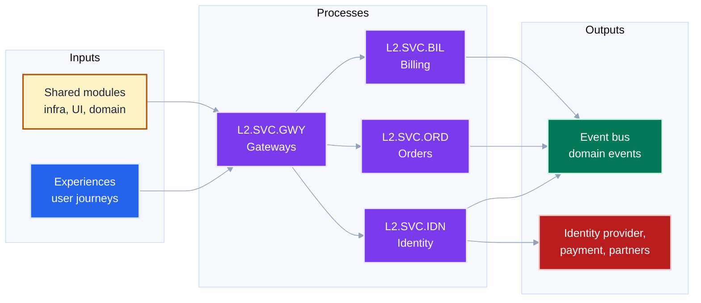

# Document Type: Architectural

A **navigable map of one system**, built by recursive zoom. Every level shows
the same shape — inputs, processes, outputs — at a coarser or finer grain, so a
reader can descend from the whole platform to a single service without ever
relearning how to read the picture.

Where [`educational.md`](educational.md) advances through *concepts*, this type
recurses through *levels of detail*. A reader finishes able to locate a
component, trace a call, and predict what a change touches.

## 1. Trigger

Select this type when the request contains any of:

- "architecture doc" / "system overview" / "how it all fits together"
- "document this codebase" / "map the system" / "C4-ish"
- "zoom into subsystem X" / "add the security lens" / "next level of detail"
- an existing architecture document plus "go deeper" or "add a lens"

The tell against Educational: this document is about *this* system, and it
changes when the system changes.

## 2. Contract

| # | Invariant | Test |
|---|---|---|
| A1 | **Every tile has an address.** No unaddressed diagram. | Grep for a fence whose section has no `L{n}.…` heading. |
| A2 | **Every tile's primary fence is an IPO three-box.** | Does each level's main diagram read inputs → processes → outputs? |
| A3 | **A tile's processes are exactly its children.** The centre column of tile T's IPO is the list of T's child tiles. | Do child headings match the parent's centre boxes 1:1? |
| A4 | **Boundary closure.** Every edge in a child's IPO either appears in the parent's IPO or connects to a sibling. | See §5 — this is the load-bearing check. |
| A5 | **Lens is orthogonal to address.** The same tile may be drawn through many lenses; the lens never changes the tile's identity. | Does any address contain a lens code in a tile position? |
| A6 | **Evidence is marked.** Anything inferred rather than corroborated carries the `unverified` modifier. | Is every dashed node justified in the evidence table? |
| A7 | **3–7 processes per tile.** | Count the centre boxes. |

A6 is what separates an architecture document from architecture fiction. A
diagram that mixes what you read in the code with what you assume about
deployment, without distinguishing them, is worse than no diagram — it launders
a guess into a reference.

## 3. The address convention

An address names a **tile**: one bounded region of the system at one level of
detail. Addresses are the spine of the whole document — headings, node IDs,
filenames, and cross-references all use the identical string.

### Grammar

```
tile  := "L" level ( "." code ){level}
level := 0 | 1 | 2 | 3 | ...
code  := exactly three uppercase letters, unique among siblings
view  := tile [ "/" lens ]
lens  := three-letter code from the lens registry (§6)
```

The count of dot-segments after `L{n}` **equals** `n`. This makes an address
self-checking: `L2.SVC.SUB` is well-formed; `L2.SVC` and `L2.SVC.SUB.PLN` are
not. A malformed address is detectable without consulting the tree.

| Address | Reads as |
|---|---|
| `L0` | The whole system. Exactly one exists. |
| `L1.SVC` | Level 1, the Services concern. |
| `L2.SVC.SUB` | Level 2, Subscription, inside Services. |
| `L3.SVC.SUB.PLN` | Level 3, Plans, inside Subscription. |
| `L2.SVC.SUB/SEC` | The Subscription tile viewed through the security lens. |

`L0` is the fixed root — the system boundary. There is no fixed maximum depth;
the tree stops where §7 says to stop.

### Why dots, and why they are safe

Dots are the most concise readable separator, and **they are valid in Mermaid
flowchart node IDs** — verified by rendering `L2.SVC.SUB[Subscription] -->
L2.SVC.ACC[Account]`, which yields two distinct nodes. This is what buys the
convention its value: one string serves every purpose with no translation layer.

| Use | Form |
|---|---|
| Heading | `### L2.SVC.SUB - Subscription domain` |
| Mermaid node ID | `L2.SVC.SUB[Subscription<br/>domain]:::service` |
| Filename | `L2.SVC.SUB.md` |
| Prose cross-reference | ``Zoom into `L2.SVC.SUB` for renewal state.`` |

The lens never appears in a node ID, because **one fence is one lens** — the
lens is the diagram's caption, not a node's identity. This keeps `/` out of
Mermaid entirely, where it would not be safe.

### The code registry

Every document declares its codes once, at `L0`. Codes are mnemonic, not
positional — inserting a sibling never renumbers anything, which is the failure
mode of a purely numeric tile scheme.

Codes must be unique among siblings. Prefer globally unique within a document
so that grepping a code finds every mention; where a code must repeat under two
parents, the registry has to say so explicitly.

Illustrative registry shape (substitute your own system's concerns and codes):

| Address | Code means | Scope |
|---|---|---|
| `L1.EXP` | Experiences | User-facing applications and journeys |
| `L1.SVC` | Services | Domain and integration services |
| `L1.EVT` | Events | Event and data movement |
| `L1.LIB` | Libraries | Shared platform modules and defaults |
| `L1.TOO` | Tooling | Testing and engineering tooling |
| `L2.SVC.GWY` | Gateways | Backend-for-frontend and API composition |
| `L2.SVC.IDN` | Identity | Accounts, authentication, entitlements |
| `L2.SVC.ORD` | Orders | Order capture and fulfilment |
| `L2.SVC.BIL` | Billing | Pricing, invoicing, payment coordination |
| `L3.SVC.BIL.PLN` | Plans | Plan catalogue |
| `L3.SVC.BIL.PRM` | Promotions | Discount and promotion rules |
| `L3.SVC.BIL.INV` | Invoicing | Invoice generation and dispatch |

Reserve `XXX` for a tile you know exists but have not yet mapped. It renders as
a normal child with the `unverified` modifier, which keeps the parent's IPO
honest instead of silently complete.

## 4. The IPO fence

At **every** tile, the always-visible fence is the three-box
Inputs–Processes–Outputs diagram. This is the constant that makes the zoom
learnable: the reader learns to read one picture and then reads it at every
depth.

| Column | Contains |
|---|---|
| **Inputs** | What crosses this tile's boundary inward: actors, upstream systems, feeds, schedules. |
| **Processes** | This tile's children, each labelled with its full address. Exactly the `L{n+1}` tiles. |
| **Outputs** | What crosses the boundary outward: downstream systems, stores written, events published, artifacts produced. |

The Processes column is not a summary of the children — it **is** the children.
That identity (A3) is what makes the recursion mechanical rather than editorial.

````markdown
## L1.SVC - Domain and integration services

**Boundary:** owns domain state and integration behaviour.
**Parent:** [`L0`](#l0---platform)



*Four children; edges to `L1.EXP`, `L1.LIB`, `L1.EVT` cross the boundary.*
````

### Dual density at a tile

The IPO fence is the overview and stays inline. The collapsed detail fence
shows the same tile with its **grandchildren visible inside each process box**
— one level of lookahead, so a reader can decide whether to descend before
paying the cost of a page change.

````markdown
<details>
<summary>L1.SVC with one level of lookahead (28 nodes)</summary>

```mermaid
{same tile, each process expanded to its L2 children as a subgraph}
```

</details>
````

Do not use the detail fence to show two levels of lookahead. That is what the
child's own page is for, and it breaks A7 on sight.

### Sizing

| Fence | Preset | Nodes | VCS |
|---|---|---|---|
| IPO overview (inline) | `low` | ≤12 | ≤25 |
| One-level lookahead (collapsed) | `high` | ≤35 | ≤60 |

A1–A7 plus these budgets are mutually reinforcing: 3–7 processes, plus inputs
and outputs, lands naturally inside 12 nodes. If the IPO overview will not fit,
the tile has too many children — insert a level (§7).

## 5. Boundary closure

The rule that makes zoom trustworthy. **Every edge in child C's IPO must be
one of:**

- **(a)** an edge that also appears in parent P's IPO — it crosses P's boundary
  too; or
- **(b)** an edge to a sibling of C inside P.

There is no third case. An edge to something that is neither in P's IPO nor a
sibling means one of exactly three things, and all three are bugs:

| What you found | What it means | Fix |
|---|---|---|
| C talks to an external system P never mentions | P's IPO is missing an input or output | Add it to P |
| C talks to something under a different parent | C is misfiled, or the boundary is wrong | Move C, or redraw the boundary |
| C talks to something you cannot place at all | The tile boundary does not reflect reality | Redraw the level |

Run this check when you finish each tile, against its parent. It is cheap, it
catches boundary errors while they are still local, and it is the reason a
reader can trust that zooming in never contradicts what they saw zoomed out.

A leaked edge is not a licence to draw a long arrow across the document. Fix
the boundary.

## 6. Lens registry

A **lens** is a question asked of a tile. The same tile has as many lenses as it
has interesting questions; the tile's address never changes.

Not every tile needs every lens. Most need one or two. Add a lens when a
stakeholder question is going unanswered, not to fill a matrix.

| Lens | Question | Primary diagram | Notes |
|---|---|---|---|
| `CTX` | Who is outside the boundary, and what crosses it? | IPO `flowchart LR` | The default at `L0`. |
| `APP` | What components exist and how do they compose? | IPO `flowchart LR` | The default at `L1`+. |
| `DAT` | What information exists, in what shape? | `erDiagram` | Entities and cardinality only; no attribute dumps. |
| `FLW` | Where does information move, and how much? | `sankey-beta` | Use only when volume or proportion is the point. |
| `INF` | What is deployed where? | `architecture-beta` | Iconify packs give real provider icons — see `../iconify/`. |
| `SEC` | Where are the trust boundaries? | `flowchart` with zone subgraphs | Colour subgraphs by trust level, not by team. |
| `SEQ` | Who calls whom, in what order? | `sequenceDiagram` | One journey per fence. |
| `STA` | What may legally happen next? | `stateDiagram-v2` | Include terminal and error states. |
| `EVT` | What facts are published and consumed? | `flowchart LR`, swimlanes | See below. |
| `UIX` | What does a person experience? | `journey` | Scores are a claim; cite the research or drop them. |
| `OPS` | How is it observed, deployed, recovered? | `stateDiagram-v2` or `timeline` | Failure and recovery paths. |
| `SIZ` | Where does mass or cost concentrate? | `treemap-beta` | Magnitude comparison only. |

All of `architecture-beta`, `treemap-beta`, `journey`, `block-beta`, and
`sankey-beta` render under this skill's `mmdc` toolchain, and
`mermaid_complexity.ts` counts their nodes — verified. The density budget in §4
applies to them exactly as it does to a flowchart.

### `-beta` types do not survive GFM

`architecture-beta`, `sankey-beta`, `treemap-beta`, and `block-beta` carry a
`-beta` suffix, and **host renderers pin an older Mermaid version than your
local toolchain.** A `-beta` fence that renders here will frequently show as a
raw code block on GitHub or GitLab. Local render success proves nothing about
the host.

Ship any `-beta` diagram as a rendered PNG or SVG with the `.mmd` kept as a
sibling source file, not as a live fence. The `INF`, `FLW`, and `SIZ` lenses are
the ones this bites, because their primary types are all beta. Full pattern and
commands: [`../gfm_beta_diagrams.md`](../gfm_beta_diagrams.md).

### Event modelling has no native Mermaid type

Mermaid has no event-modelling notation. Do not claim one. Emulate it with a
left-to-right `flowchart` carrying three subgraph swimlanes — Commands, Events,
Read models — with time running left to right:

```
subgraph CMD[Commands]   ... end
subgraph EVT[Events]     ... end
subgraph RM[Read models] ... end
```

`block-beta` is the alternative when the grid alignment matters more than the
edges. Both render; neither is real event-modelling notation, and the document
should say so rather than imply a standard it is not following.

## 7. Recursion: when to zoom, when to stop

**Insert a level** when a tile's IPO would need more than 7 processes. Group the
children into 3–7 coherent groups and make those the new children. Grouping is
by responsibility, never by repository layout or team org chart.

**Merge a level up** when a tile has fewer than 3 processes. A tile with one
child is a rename, not a level.

**Stop descending** — the tile is a leaf — when any of these holds:

| Stop condition | Instead of a child IPO, provide |
|---|---|
| The children would be individual classes or functions | A pointer to the code; diagrams lose to a language server here |
| Another team owns it and you only consume its contract | A contract table: endpoints/topics in, guarantees out |
| It is a third-party service | A single node with the `external` role, and its failure modes |
| You have not mapped it yet | A child coded `XXX` with the `unverified` modifier |

The last row matters most. An unmapped region marked `XXX` keeps the parent
honest. Quietly omitting it makes the parent look complete when it is not — and
a reader has no way to tell the difference.

Depth is not a quality target. Most systems are well served by `L0`–`L2`, with
`L3` on the two or three subsystems that actually carry the risk. Uniform depth
across the whole tree is a sign the document was generated rather than authored.

## 8. Palette

Roles encode a component's **plane**, not its technology. A queue is
`transport` whether it is Kafka, SNS, or SQS — the reader is learning the shape
of the system, not a vendor list.

All pairs below pass `mermaid_contrast.ts` at WCAG AA or better; values are
drawn from [`../color_theming.md`](../color_theming.md).

| Role | Meaning | fill | stroke | color |
|---|---|---|---|---|
| `actor` | People or systems outside the boundary | `#334155` | `#f1f5f9` | `#ffffff` |
| `edge` | Entry point: gateway, BFF, API surface | `#2563eb` | `#dbeafe` | `#ffffff` |
| `service` | Compute this system owns | `#7c3aed` | `#ede9fe` | `#ffffff` |
| `store` | Persistent state | `#1e40af` | `#dbeafe` | `#ffffff` |
| `transport` | Movement: queue, topic, bus, file drop | `#047857` | `#d1fae5` | `#ffffff` |
| `external` | Third-party; not ours to change | `#b91c1c` | `#fecaca` | `#ffffff` |
| `platform` | Shared libraries, modules, defaults | `#fef3c7` | `#b45309` | `#1e293b` |

### `unverified` is a modifier, not a role

Evidence quality is orthogonal to plane, so it must not consume a colour slot.
Declare it with no `fill:` and apply it as a **second class** on top of the base
role:

```
classDef unverified stroke-dasharray:6 4,stroke:#f59e0b,stroke-width:3px
```

```
L2.SVC.EXT[Partner API]:::external
class L2.SVC.EXT unverified
```

Mermaid accumulates classes, so the node keeps its `external` fill *and* gains
the dashed amber border — verified by render. `mermaid_contrast.ts` reports it
as `skipped: no fill declared`, which is correct and expected: a modifier that
declares no fill has no text pair to audit.

Use it for anything the source does not prove: an inferred binding, an assumed
deployment, a topic subscription you found declared but never confirmed wired.
Every dashed element must appear in the evidence table (§9).

`platform` is the only light fill. Keep it that way — a second light role
inverts the hierarchy and the shared-defaults layer stops receding.

## 9. Document skeleton

```
L0  Title, system boundary, and what this document does NOT prove
    Code registry (§3)
    Lens index: which tiles have which lenses
    L0 IPO fence  (lens: CTX)
    Evidence boundary table

L1.AAA  Boundary, parent link, IPO fence, lookahead <details>
        Additional lenses for this tile
        Child index
L1.BBB  ...

L2.AAA.XXX  ...

Appendix  Evidence table: every unverified element, why, how to confirm
```

### The evidence boundary table

Directly under `L0`, before any child. It is the document's warrant:

| Lens | Scope | Evidence boundary |
|---|---|---|
| Landscape | Every repository, grouped once by concern | Grouping is not deployment or org topology. |
| Runtime | HTTP, queues, topics, files, RPC | Only source-corroborated edges appear. |
| Infrastructure | Checked-in IaC across the repositories | Declared intent is not deployed state. |

State what the document does **not** prove as prominently as what it does. "The
deployed queue binding is not proven" is more useful to a reader than a
confident arrow, and it is the sentence that stops someone paging an on-call
engineer based on a diagram.

## 10. Anti-patterns

| Anti-pattern | Why it fails | Instead |
|---|---|---|
| One giant diagram of everything | No level of detail; unreadable at every zoom | `L0` IPO with 3–7 children |
| Children that are repositories | Repo layout is not architecture; it changes for unrelated reasons | Group by responsibility |
| Uniform depth everywhere | Generated, not authored; wastes the reader on low-risk areas | Deepen where risk lives |
| Lens folded into the address | Multiplies the tree; breaks zoom as one navigation axis | Lens after `/`, never a tile segment |
| Inferred edges drawn like proven ones | Launders a guess into a reference | `unverified` modifier + evidence table |
| Silently omitting an unmapped region | Parent looks complete when it is not | `XXX` child, marked unverified |
| Long arrows across the tree | A leaked edge dressed as a feature | Fix the boundary (§5) |
| Numeric tiles (`L2.3.1`) | Inserting a sibling renumbers the tree; diffs become unreadable | Mnemonic three-letter codes |
| Colour by team or vendor | Reader learns the org chart, not the system | Colour by plane |
| ERD with every attribute | It is a schema dump, not a lens | Entities and cardinality only |

## 11. Done checklist

Structural:

- [ ] Exactly one `L0`; its boundary sentence says what is outside.
- [ ] Code registry at `L0` covers every code used, with sibling uniqueness.
- [ ] Every tile heading is a well-formed address (segments after `L{n}` == `n`).
- [ ] Every tile has an IPO fence; processes are exactly its children (A3).
- [ ] Every tile has 3–7 processes (A7).
- [ ] Boundary closure verified for every child against its parent (A4).
- [ ] Every leaf states which stop condition applies.
- [ ] Unmapped regions appear as `XXX` children, not omissions.
- [ ] Lens codes come from the registry; none appears in a tile position.
- [ ] Evidence boundary table sits under `L0`.
- [ ] Every `unverified` element is listed in the evidence table with how to confirm it.
- [ ] Node IDs use the address verbatim; no second form anywhere.

Mechanical, from the skill directory:

```bash
bun run scripts/mermaid_complexity.ts --preset low path/to/doc.md  # IPO fences
bun run scripts/mermaid_complexity.ts             path/to/doc.md  # detail fences
bun run scripts/mermaid_contrast.ts               path/to/doc.md
bash  scripts/render_mermaid.sh                   path/to/doc.md
```

All must exit 0, except that `mermaid_contrast.ts` will report the `unverified`
modifier as `skipped: no fill declared` — that is correct, not a failure.

## 12. Authoring prompt

> Map **[system]** as a levelled architecture document. Start at `L0` with the
> system boundary, a code registry, and an evidence boundary table stating what
> the document does not prove. Give every tile an address of the form
> `L{n}.{TLA}.{TLA}` where the segment count equals the level, and use that
> exact string as the heading, the Mermaid node ID, and the filename. Every
> tile's primary fence is an Inputs–Processes–Outputs flowchart whose Processes
> column *is* the list of its children, 3–7 of them, within the `low` density
> preset. Verify boundary closure for every child against its parent. Add a
> lens from the registry only where a stakeholder question is going unanswered,
> and note that Mermaid has no event-modelling notation if you emulate one.
> Colour by plane, not by vendor or team; mark every inferred element with the
> `unverified` modifier and list it in the evidence table with how to confirm
> it. Stop descending at code, contracts, third parties, or unmapped regions —
> marking unmapped regions `XXX` rather than omitting them.
