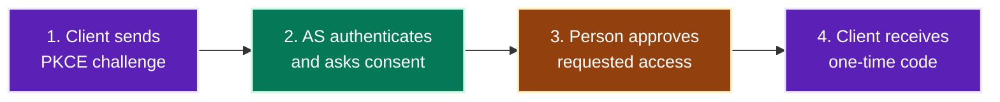

# Document Type: Educational / Illustrative Guide

A **visual one-pager that distils a topic into its concepts and the
relationships between them.** The diagrams carry the explanation; the prose
connects them. A reader who scrolls through only the diagrams and their bolded
takeaways should still finish with a correct mental model.

This is the type to reach for when the deliverable is *understanding*, not
*navigation*.

## 1. Trigger

Select this type when the request contains any of:

- "educational" / "educational markdown" / "explainer"
- "illustrative guide" / "illustrate"
- "one-pager on X" / "distil X" / "visual guide to X"
- "explain X visually" / "teach me X" / "help me understand X"
- an existing document plus "make this teachable" or "add diagrams"

The tell: an educational guide is about a *topic* that exists independently of
the reader's codebase — OAuth 2.1, MCP, CRDTs, Kafka semantics. It has a
natural teaching order, and that order is what this type encodes.

## 2. Contract

Six invariants define the type. A document missing any of them is not of this
type — it is a wiki page with pictures.

| # | Invariant | Test |
|---|---|---|
| C1 | **One concept per diagram.** Each fence introduces exactly one new idea and reuses everything already introduced. | Can you name the single idea in five words? |
| C2 | **Monotonic build.** Diagram *n* may only use vocabulary established by diagrams 1…*n*−1 plus the one new idea. | Read fence *n* cold; is any label unexplained? |
| C3 | **Shared palette across the whole document.** One `classDef` set, defined identically in every fence, never re-coloured. | Does role `token` have the same fill in fences 2 and 7? |
| C4 | **Minimal prose.** ≤2 short paragraphs of lead-in per beat, one bolded takeaway after. Tables and JSON carry detail, not paragraphs. | Is any prose block longer than the diagram it explains? |
| C5 | **Every fence has a lead-in question and a takeaway.** | Grep for a fence with no bolded sentence after it. |
| C6 | **The overview fence is the whole thesis.** The first diagram, alone, states the document's central claim. | Could you delete every other fence and still be *correct*, just shallower? |

### The concept beat

The atomic unit of the document. Everything is a sequence of these.

````markdown
## {Heading that states the claim, not the topic}

{One or two sentences: the question this beat answers, and any exact term
introduced here in `code font`.}

```mermaid
{fence — <=12 nodes, shared classDef set}
```

**Takeaway:** {one sentence saying what to notice and what it rules out.}
````

Headings state a claim or a warning, not a noun. Compare:

| Weak (noun) | Strong (claim) |
|---|---|
| "Token exchange" | "RFC 8693: the request separates identities from constraints" |
| "Discovery" | "Begin with `server_url`, not a guessed `token_endpoint`" |
| "Refresh tokens" | "Refresh does not mean re-authentication" |

A reader skimming only the headings should get the argument. This is what makes
the document work as a one-pager.

### Dual density is per beat, and conditional

`diagram_organization.md` describes dual density as the default for architecture
lenses. **In an educational document it is the exception.** Most beats are a
single ≤12-node fence, because a concept that needs 35 nodes to state is two
concepts.

Add a collapsed detail fence to a beat only when **both** hold:

1. The overview fence deliberately omits something a practitioner will need at
   the keyboard (every field, every branch, every error path); and
2. Showing it inline would break C1 by smuggling in a second concept.

````markdown
```mermaid
{overview — the concept, <=12 nodes}
```

**Takeaway:** {…}

<details>
<summary>Complete field-level reference ({N} nodes)</summary>

```mermaid
{detail — <=35 nodes, same classDef set}
```

</details>
````

Budget: **at most one collapsed fence per three beats.** More than that means
the document is trying to be a reference manual, and the one-pager is lost. If
a practitioner reference is genuinely needed, write it as a table — tables
survive skimming better than a 35-node graph.

## 3. Sequence

The order follows the reader's questions in causal order. It does not follow the
structure of the source specification, API, or codebase.

| Beat | Purpose | Fence? | Density |
|---|---|---|---|
| **0. Title + boundary** | Name the useful outcome. State in one sentence what this is *not* — the single most common misconception. | No | — |
| **1. Mental model** | The whole thesis in one picture. Introduces the palette. | Yes | `low`, aim ≤8 nodes |
| **2…n. Concept beats** | One new idea each, in causal order. | Yes | `low` |
| **n+1. Comparison** | Only after the invariant is stated: how real implementations differ. | Table, not a fence | — |
| **n+2. Diagnosis** | Symptom → likely stage → first value to inspect. | Table | — |
| **n+3. Compact rule** | Two or three bolded sentences a reader can carry away. | No | — |
| **n+4. References** | Authoritative sources, with status where a spec is a draft. | No | — |

Target **5 to 9 concept beats**. Fewer than 5 and the topic did not need a
visual guide; more than 9 and it is two guides — split by reader task.

### Beat 0 does real work

Open by correcting the misconception the reader most likely arrived with. This
is what makes the rest land:

> You were close, but one boundary matters: **OAuth 2.1 does not itself define
> an AI-agent identity or promise that every access token carries both
> identities.** It standardises a safer OAuth baseline.

Naming the boundary up front means every later beat is read as evidence for a
claim the reader now cares about, rather than as trivia.

### Beat n+3 is not a summary

The compact rule is three sentences that survive without the document:

> **OAuth 2.1 secures the grant.** **Token Exchange can express delegation.**
> **Your authorization server and resource server must choose, validate, and
> audit the agent identity.**

A recap of headings is not a compact rule. If the sentences do not decide
anything, cut the section.

## 4. Diagram selection

Pick the type that exposes the *relationship* the beat teaches. One fence, one
reader question.

| The beat teaches | Use | Keep the focus on |
|---|---|---|
| Which parts exist and how they connect | `flowchart LR` | Roles and the direction of dependency |
| An ordered pipeline the reader will follow | `flowchart LR` with numbered labels (`1. …`) | Stage order; number the labels so prose can reference them |
| A fan-in of independent inputs to one decision | `flowchart LR`, inputs left, decision right | That the inputs are *evaluated*, not merged |
| A fork into mutually exclusive outcomes | `flowchart TB` with a `{diamond}` | That the branch is a policy choice, not a default |
| Who talks to whom, and when | `sequenceDiagram` | Actors, messages, and the moment to inspect on failure |
| What may legally happen next | `stateDiagram-v2` | Transitions and terminal states |
| Stable domain relationships and cardinality | `erDiagram` | Entities and the crow's feet, not attributes |
| Classification or containment of terms | `mindmap` | Categories; use once, near the vocabulary beat |
| Relative size or proportion of categories | `treemap-beta` | Magnitude comparison only |
| Time-ordered phases of a rollout or history | `timeline` | Sequence, not duration |

`treemap-beta` is the only `-beta` type in that table. Host renderers pin an
older Mermaid version, so a `-beta` fence that renders locally often shows as a
raw code block on GitHub — ship it as a rendered PNG or SVG with the `.mmd` as a
sibling source file, never as a live fence. See
[`../gfm_beta_diagrams.md`](../gfm_beta_diagrams.md). For a one-pager, a sorted
table usually beats paying that cost.

Two rules that prevent most bad fences:

- **Never draw a table.** If the content is rows of parallel attributes, it is a
  table. Diagrams show relationships; tables show attributes.
- **Never draw a list.** A linear sequence with no branching and no actors is a
  numbered list. Use a flowchart only when the *shape* — a fork, a join, a
  cycle, a crossing boundary — carries meaning.

### Numbered-stage flowcharts

When a beat teaches an ordered protocol, number the labels so prose can point at
a step without re-describing it:



Prefer this over a `sequenceDiagram` when the reader needs the *shape* of the
flow at a glance. Prefer `sequenceDiagram` when the lesson is about ordering,
round trips, or who waits on whom.

## 5. Palette

Declare the role set once, in the mental-model beat, then repeat the identical
`classDef` block in every fence that uses those roles. Mermaid has no
cross-fence style inheritance — the repetition is the mechanism, and it must be
byte-identical so a reader never sees a role shift colour.

Derive values from [`../color_theming.md`](../color_theming.md). This role set
covers most conceptual topics:

| Role | Meaning | fill | stroke | color |
|---|---|---|---|---|
| `person` | A human whose authority or attention matters | `#92400e` | `#fef3c7` | `#ffffff` |
| `agent` | Autonomous or machine actor | `#1d4ed8` | `#dbeafe` | `#ffffff` |
| `client` | The calling software / requester | `#5b21b6` | `#ede9fe` | `#ffffff` |
| `auth` | Authority that decides or issues | `#047857` | `#d1fae5` | `#ffffff` |
| `exchange` | Transformation or negotiation step | `#7c3aed` | `#ede9fe` | `#ffffff` |
| `token` | Credential, artifact, or payload in flight | `#1e40af` | `#dbeafe` | `#ffffff` |
| `resource` | The thing being protected or acted on | `#065f46` | `#d1fae5` | `#ffffff` |
| `policy` | Constraint or configuration input | `#fef3c7` | `#b45309` | `#1e293b` |
| `warning` | The unsafe or discouraged outcome | `#b91c1c` | `#fecaca` | `#ffffff` |

Rename roles to fit the topic — a CRDT guide wants `replica`, `op`, `merge`,
`converged` — but keep the *count* between five and eight. Below five, colour
stops encoding anything; above eight, the reader cannot hold the legend.

Two mandatory mechanics:

- Every fence that uses custom colour needs the `%%{init: …}%%` header setting
  `primaryTextColor`, `textColor`, `lineColor`, **and `edgeLabelBackground`**:

  ```
  %%{init: {"theme":"base","flowchart":{"htmlLabels":false},"themeVariables":{"primaryTextColor":"#ffffff","textColor":"#ffffff","lineColor":"#94a3b8","edgeLabelBackground":"#334155"}}}%%
  ```

  **`edgeLabelBackground` is not optional whenever the diagram has edge labels
  (`-->|text|`).** `textColor:#ffffff` colours edge label text as well as node
  text, and an edge label sits on the page background, not on a node — so in the
  light theme it renders white on near-white and disappears completely.
  `mermaid_contrast.ts` cannot catch this: it audits `classDef` fill×color pairs
  and never sees edge labels. Verified by render — the gate reported 4 pass / 0
  fail on a diagram whose every edge label was invisible. **Look at the light
  render before declaring any diagram with edge labels done.**

- `policy` is the only light-fill role in the set. That asymmetry is deliberate:
  it makes constraints visually recede from the actors and artifacts. Keep at
  most one light-fill role, or the hierarchy inverts.

For Material for MkDocs and other host-themed renderers, the host overrides
label colour — use the translucent-fill pattern in
[`../color_host_themed_renderers.md`](../color_host_themed_renderers.md) and
audit with `--profile mkdocs-material` instead of setting `color:`.

## 6. Prose discipline

The prose exists to make diagrams legible. It is not a parallel explanation.

**Code font names an exact thing; plain language names its role.** Establish
this convention explicitly near the top, then hold it:

> Terms in code font name an exact protocol field, parameter, header, endpoint,
> or stored value. For example, `server_url` is a configuration term, while an
> MCP resource server is the server that hosts the tools.

**One term per concept, forever.** Never introduce a synonym for something the
document already named. Diagram labels, prose, table headers, and JSON keys must
agree exactly — a reader who searches the page for a node label must find its
explanation.

**Pair each load-bearing claim with the smallest artifact that proves it.**
Choose one:

- a JSON fragment for a data contract (5–10 lines, not a full payload);
- a request/response pair for a protocol interaction;
- a config excerpt for a starting value;
- a command with its expected output.

Introduce the artifact before showing it and interpret it after. Never make the
reader decode a payload to find the one field that matters:

> Read this as: **the user is the subject, the agent is the current actor, and
> this token is intended for one API with limited scope.**

**Teach boundaries beside the happy path.** Put the tempting wrong action next
to the correct one, at the beat where the reader would take it — not in a
"gotchas" section at the end.

## 7. Anti-patterns

| Anti-pattern | Why it fails here | Instead |
|---|---|---|
| One big diagram at the top, prose below | Violates C1 and C2 — the reader must hold every concept at once | Split into beats; the top fence is the thesis only |
| A `<details>` on every beat | Turns the one-pager into a manual; nobody expands ten of them | ≤1 collapsed fence per 3 beats |
| Palette drift between fences | The reader relearns the legend each time | Byte-identical `classDef` blocks |
| A fence that restates the table above it | Duplicated maintenance, no new information | Delete the fence |
| Headings that are nouns | The skim path carries no argument | Headings state a claim |
| Prose paragraph longer than its diagram | The diagram is decorative, the prose is the real doc | Cut the prose or cut the diagram |
| Comparison table before the invariant | The reader memorises provider trivia instead of the rule | State the invariant, *then* compare |
| Sequence diagram for a 3-step linear flow | Ceremony without information | Numbered `flowchart LR`, or a numbered list |
| Emoji or Unicode inside node labels | Renderer-dependent breakage in `mmdc` | ASCII only; `<br/>` for breaks |
| `\n` in a node label | Renders literally | `<br/>` |

## 8. Done checklist

Structural — verify by reading:

- [ ] Beat 0 names the boundary or misconception in its first paragraph.
- [ ] The mental-model fence, alone, states the document's thesis.
- [ ] 5–9 concept beats; each introduces exactly one new idea.
- [ ] Every fence has a lead-in and a bolded **Takeaway:**.
- [ ] Every heading states a claim, decision, or warning.
- [ ] The `classDef` role set is identical in every fence that uses it.
- [ ] ≤1 collapsed detail fence per 3 beats.
- [ ] Each load-bearing claim has one small artifact, introduced and interpreted.
- [ ] A diagnosis table maps symptom → stage → first value to inspect.
- [ ] The compact rule decides something; it is not a recap.
- [ ] References state status where a source is a draft or may change.

Mechanical — verify by running, from the skill directory:

```bash
bun run scripts/mermaid_complexity.ts path/to/document.md   # every fence within budget
bun run scripts/mermaid_contrast.ts   path/to/document.md   # every classDef WCAG AA
bash  scripts/render_mermaid.sh       path/to/document.md   # both themes, syntax + layout
```

All three must exit 0. A `DIAGRAM_SYNTAX` render failure is the only class that
means edit the diagram — see `SKILL.md` → *When a render fails* for the others.

## 9. Authoring prompt

Use verbatim when commissioning one:

> Write a standalone educational one-pager on **[topic]** for **[reader]**.
> Open by naming the boundary or misconception they most likely arrive with.
> Give one mental-model diagram that states the whole thesis in ≤8 nodes, then
> 5–9 concept beats that each introduce exactly one new idea in causal order,
> reusing only vocabulary already established. Every fence: a lead-in question,
> ≤12 nodes, an identical shared `classDef` palette, and a bolded one-sentence
> takeaway. Keep prose to ≤2 short paragraphs per beat; put detail in tables and
> small JSON or request/response artifacts that you introduce and interpret. Add
> a collapsed detail fence only where a practitioner needs field-level reference,
> at most one per three beats. Close with a comparison table (only after stating
> the invariant), a symptom→stage diagnosis table, a two-or-three-sentence
> compact rule, and dated authoritative references. Headings state claims, not
> nouns. ASCII labels, `<br/>` for breaks. Both `mermaid_complexity.ts` and
> `mermaid_contrast.ts` must exit 0.

## 10. Reference implementation

[`../examples/educational_braze_content_cards.md`](../examples/educational_braze_content_cards.md)
is a complete guide written to this contract. Study in it:

- Beat 0 naming the misconception before anything else — the reader expects an
  API that returns shelves, and there isn't one. Every later beat follows from
  that boundary.
- Nine single-density beats, each ≤12 nodes, with no `<details>` at all.
- One `classDef` role set repeated byte-identically across every fence.
- Headings that state claims, so the skim path carries the argument.
- A symptom→stage diagnosis table and a compact rule that decides something.
