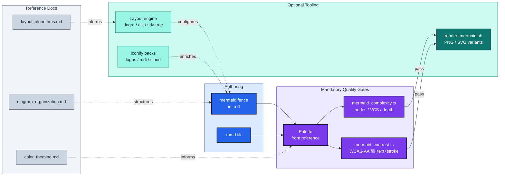

# mermaidjs_diagrams

Render and maintain Mermaid.JS diagrams with **visual-clarity enforcement**.

## Features

- **Render** `.md` files containing ```` ```mermaid ```` fences to PNG/SVG
  (dark+transparent and default+white variants by default).
- **Complexity lint** — ruff-style findings on node count, visual-complexity
  score, and subgraph depth. Cognitive-load-calibrated thresholds (Huang
  2020, 50-node cap). Uses Mermaid's canonical parser.
- **Contrast audit (required, not optional)** — every diagram with custom
  colors MUST derive its palette from `resources/color_theming.md` and pass
  `scripts/mermaid_contrast.ts` (WCAG 2.x + APCA). Ad-hoc pair checker also
  ships for sampling (hex, rgb, oklch, named).
- **Layout engines** — dagre / elk / tidy-tree / cose-bilkent, selectable per
  diagram via YAML frontmatter. `look: classic | handDrawn | neo`.
- **Icon packs** — Iconify (logos, mdi, cloud, saas) for `architecture-beta`;
  Font Awesome for flowcharts.

## How it fits together



*Mermaid source flows left-to-right through two mandatory gates — structural
complexity and color contrast — before rendering. Reference docs (dotted)
supply the rules each stage enforces.*

## Quick start

```bash
bash .claude/skills/mermaidjs_diagrams/scripts/render_mermaid.sh path/to/doc.md
make -C .claude/skills/mermaidjs_diagrams/scripts cli-demo
```

See [`SKILL.md`](SKILL.md) for usage, [`resources/`](resources/) for deep dives,
and [`scripts/CLAUDE.md`](scripts/CLAUDE.md) for the maintenance guide.
