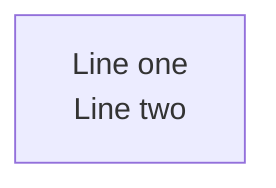
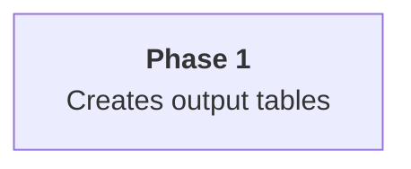

# Context

Render and maintain Mermaid.JS diagrams with **visual clarity enforcement**.
Works for ANY project. Cognitive load research (Huang et al., 2020) shows 50 nodes
is the difficulty threshold — this skill enforces limits via automated complexity analysis.

Diagrams live as ` ```mermaid ` code fences inside `.md` files.

---

# Required for every diagram

Two requirements apply to **every** diagram this skill authors or reviews.
Not "consider," not "when time permits" — **mandatory, enforced, verifiable**.

## 1. Apply the color theory reference

Every diagram that uses custom colors (via `classDef`, `style`, theme
frontmatter, or node-level styles) MUST derive its palette from
`resources/color_theming.md`. That file covers:

- WCAG-aware palettes that work in both dark and light viewer themes.
- HSL encoding conventions so sibling nodes stay visually coherent.
- Subgraph-coloring patterns that don't clash with node fills.

Do not ad-hoc pick `#random` hex values. If the palette you need isn't in
`color_theming.md`, add it there first (with the same contrast-verified
shape as existing entries), then use it — don't fork the convention per
diagram.

## 2. Run `mermaid_contrast.ts` before declaring the diagram done

Every diagram that defines style directives MUST pass a WCAG contrast
audit. The skill ships the tool; use it:

```bash
bun run .claude/skills/mermaidjs_diagrams/scripts/mermaid_contrast.ts path/to/doc.md
```

Exit code 0 means every `fill × color` pair passes WCAG AA (≥ 4.5:1 for
text) and every `fill × stroke` pair passes AA (≥ 3:1 for borders). Any
non-zero exit is a **blocker** — fix the palette or drop the custom
styling.

For ad-hoc color-pair checks (picking from a screenshot, validating a
theme token pair before committing):

```bash
bun run .claude/skills/mermaidjs_diagrams/scripts/color_contrast.ts "<fg>" "<bg>"
```

## Why this is mandatory

A diagram that's illegible to a low-vision reader, or that melts into the
background under a dark GitHub theme, **fails its job** — it communicates
nothing. The cost of the audit is seconds; the cost of shipping
unreadable documentation is repeated across every reader for the life of
the project. The failure mode of skipping this check is silent (the
author can read it fine on their screen; readers quietly give up). That's
the same Type-2-silent-failure pattern the complexity linter was built to
prevent — the contrast check is its twin, gating the **color** axis of
visual clarity the way complexity checks gate the **structural** axis.

Wire both into any `make ci` / pre-commit pipeline that touches docs.

> Deep-dive references:
> - `resources/color_theming.md` — palette catalog, HSL encoding, dark/light mode safety
> - `scripts/mermaid_contrast.ts` — diagram-aware WCAG audit (scans `classDef`/`style` directives in `.md` / `.mmd`)
> - `scripts/color_contrast.ts` — generic WCAG + APCA calculator for ad-hoc pairs

---

# Rendering

## Quick render (recommended)

Use the bundled script to render both standard variants (dark+transparent and default+white PNGs) in one command:

```bash
bash .claude/skills/mermaidjs_diagrams/scripts/render_mermaid.sh path/to/document.md
```

Output lands in `.mmdc_cache/{variant}/path/to/document-*.png`.

`mmdc` reads the markdown file, extracts every mermaid fence, and renders each as a
numbered image artefact. Exit code 0 = all fences valid. Non-zero = render failure
(see stderr for the offending fence).

## Custom variants

For formats beyond the two defaults, use `mmdc` directly. Three parameters form a
**variant tuple** that determines the output folder name:

| Parameter | Flag | Values | Default |
|-----------|------|--------|---------|
| Theme | `-t` | `default`, `dark` | **`dark`** |
| Background | `-b` | `white`, `black`, `transparent` | **`transparent`** |
| Format | `-e` | `png`, `svg` | **`png`** |

Output folder: `{theme}_{backgroundColor}_{format}` (e.g. `dark_transparent_png`)

```bash
INPUT="path/to/document.md"
INPUT_PATH="path/to/"
OUTPUT_FORMAT="png"
THEME=dark
BGCOLOR=transparent
VARIANT="${THEME}_${BGCOLOR}_${OUTPUT_FORMAT}"
OUTPUT_BASE=".mmdc_cache"
OUTPUT_TARGET="${OUTPUT_BASE}/${VARIANT}/${INPUT_PATH}/"
OUTPUT="${OUTPUT_BASE}/${VARIANT}/${INPUT}"

npx -p @mermaid-js/mermaid-cli mmdc \
  -i "${INPUT}" \
  -a "${OUTPUT_TARGET}" \
  -o "${OUTPUT}" \
  --scale 4 -e "${OUTPUT_FORMAT}" -t "${THEME}" -b "${BGCOLOR}"
```

> Full variant documentation: `resources/pattern_render_markdown.md`

## Icon packs

```bash
# Iconify icons (architecture-beta diagrams)
--iconPacks @iconify-json/logos @iconify-json/mdi

# Custom URL-based packs
--iconPacksNamesAndUrls "vendor#https://example.com/icons.json"
```

Flowchart diagrams with Font Awesome (`fa:fa-icon`) need no `--iconPacks` flag.

---

# Complexity Analysis

Analyze diagrams to ensure they stay within cognitive load thresholds. Runs
against `.mmd` and `.md` files (and directories of either) via Mermaid's
canonical parser — `architecture-beta`, nested subgraphs, and edge decorators
all parse correctly.

```bash
bun run .claude/skills/mermaidjs_diagrams/scripts/mermaid_complexity.ts path/to/docs/
bun run .claude/skills/mermaidjs_diagrams/scripts/mermaid_complexity.ts path/to/diagram.mmd --preset low
bun run .claude/skills/mermaidjs_diagrams/scripts/mermaid_complexity.ts path/to/docs/ --json
```

## Output format

Ruff-style: one finding per line, **silent on clean runs**:

```
path/to/file.md:100-108: NodeCountExceedsAcceptable nodes=24 preset=high
```

| Code | Severity | Meaning |
|------|----------|---------|
| `ParserFailure` | error | Multi-line diagram yielded 0 nodes |
| `ParserDegraded` | warn | Regex fallback used (no canonical parser available for this diagram type) |
| `NodeCountExceedsHardLimit` | error | Nodes above absolute cap |
| `NodeCountExceedsCognitiveLimit` | error | Nodes > 50 (Huang 2020 threshold) |
| `NodeCountExceedsAcceptable` | warn | Nodes above readability threshold for preset |
| `VisualComplexityExceedsCritical` | error | VCS above critical threshold |
| `VisualComplexityExceedsAcceptable` | warn | VCS above readability threshold |
| `SubgraphNestingTooDeep` | warn | Subgraph depth >= 3 |

**Short-circuit behavior:** `ParserFailure` suppresses all other codes for that
diagram — complexity is not evaluated against unparseable input.

## Density presets

| Preset | Nodes | VCS | Typical Use |
|--------|-------|-----|-------------|
| Low (`low` / `l`) | <=12 | <=25 | Overview diagrams |
| Medium (`med` / `m`) | <=20 | <=40 | README diagrams |
| High (`high` / `h`) | <=35 | <=60 | Detail diagrams (default) |

## Complexity formula

```
VCS = (nodes + edges*0.5 + subgraphs*3) * (1 + depth*0.1)
```

Ratings: **ideal** / **acceptable** / **complex** / **critical**

When a diagram is rated **complex** or **critical**, split it into simplified and
detailed versions. See `resources/diagram_organization.md` for the dual-density
approach and naming conventions.

---

# Contrast Analysis

Contrast checking is **mandatory**, not optional — see "Required for every
diagram" above. This section covers the full toolchain surface (flags,
output formats, exit-code contract) for authors who need more than the
recipe block at the top of the file.

Two complementary tools:

| Script | Scope | Use when |
|--------|-------|---------|
| `scripts/mermaid_contrast.ts` | Audits every `classDef`/`style` directive inside `.mmd`/`.md` files — scores `fill × color` (text on fill) at AA ≥ 4.5:1 and `fill × stroke` (border on fill) at AA ≥ 3:1 | Catching low-contrast custom color palettes before they land in docs |
| `scripts/color_contrast.ts` | Generic WCAG + APCA calculator for any two CSS colors (hex, rgb, oklch, named, etc.) | Ad-hoc pair checks — e.g. sampling colors from a screenshot or comparing theme tokens |

```bash
# Audit every diagram in a directory tree
bun run .claude/skills/mermaidjs_diagrams/scripts/mermaid_contrast.ts docs/
bun run .claude/skills/mermaidjs_diagrams/scripts/mermaid_contrast.ts docs/ --summary
bun run .claude/skills/mermaidjs_diagrams/scripts/mermaid_contrast.ts docs/ --json

# Ad-hoc pair
bun run .claude/skills/mermaidjs_diagrams/scripts/color_contrast.ts "#ffffff" "#2563eb"
bun run .claude/skills/mermaidjs_diagrams/scripts/color_contrast.ts "rgb(55 65 81)" "oklch(0.98 0 0)" --json

# Batch pairs via stdin
echo '[["#fff","#777"],["red","blue"]]' | bun run .claude/skills/mermaidjs_diagrams/scripts/color_contrast.ts --stdin --json
```

**Exit semantics** (both scripts): `0` if every pair passes AA, `1` if any
fail, `2` on usage error. The non-zero exit makes both tools dropin-suitable
for `make ci`-style gates.

Output fields (per pair / per directive):

- `ratio` — WCAG 2.x contrast ratio, 1.0 – 21.0, rounded to 2dp
- `rating` — pass tier (`AAA`, `AA`, `AA Large`, or `fail`)
- `apca_lc` — signed APCA Lightness contrast (-108..+106), rounded to 1dp.
  APCA is the next-gen algorithm driving WCAG 3.0 and handles dark-mode
  colors more accurately than the ratio metric.

---

# Layout Algorithms

Mermaid supports several layout engines (`dagre` default, `elk`, `tidy-tree`,
`cose-bilkent`) selected via YAML frontmatter inside the diagram source:

```yaml
---
config:
  layout: elk
  look: classic
  elk:
    mergeEdges: true
    nodePlacementStrategy: BRANDES_KOEPF
---
flowchart LR
    ...
```

Use `elk` for dense architecture diagrams (cleaner orthogonal routing), stick
with `dagre` for simple flows. The `layout` key is only honored by **flowchart**,
**state**, and **mindmap** diagrams — others use their own built-in algorithms.

> Full documentation: `resources/layout_algorithms.md`
> Rendered comparison gallery (dagre vs. elk vs. tidy-tree): `resources/examples/README.md`

---

# Diagram Organization

For projects with multiple architectural diagrams, organize around **lenses**
(perspectives) and **dual-density** fences inlined in the project README.

> Full documentation: `resources/diagram_organization.md`

## Primary pattern: inline dual-density

Each lens gets a README section with **two** mermaid fences: a simplified
overview (always visible, <=12 nodes) and a detailed reference (wrapped in
`<details>` collapsible, <=35 nodes). Both fences live in the markdown prose —
no separate `.mmd` files, no pre-rendered PNG pipeline (GitHub and GitLab
render mermaid fences natively).

````markdown
### System Overview

```mermaid
{simplified — <=12 nodes}
```

*Caption* | VCS: X.X ✅

<details>
<summary>📋 Complete diagram (N nodes)</summary>

```mermaid
{detailed — <=35 nodes}
```

</details>
````

## Workflow for codebase exploration

When invoked as "generate architecture diagrams for this codebase," do **not**
try to hold the whole codebase in the main agent's context. Delegate the
enumeration step to subagents so the diagram-authoring agent keeps a clean
context to reason in. Loop per lens:

1. **Enumerate components — via subagents and LSP, not raw grep.**

   Dispatch **one `Agent(subagent_type="Explore")` per lens** in parallel.
   Each subagent reports back only the structured component list for its
   lens, keeping the main agent's context clean for diagram authoring.

   Inside each subagent, prefer the **`lsp` skill** when available — it
   provides language-server-backed symbol enumeration, cross-references
   (which map directly to diagram edges), and impact analysis (which
   surfaces coupling strength). Fall back to `Grep` / `Glob` only where the
   LSP can't reach (shell scripts, config files, IaC):

   | Lens | Primary LSP queries | Fallback |
   |------|---------------------|---------|
   | `architecture` | Top-level symbols, module boundaries, public exports | `Glob` for directory tree |
   | `data-flow` | References for each I/O helper (DB client, HTTP client, event bus) | `Grep` for `fetch`/`requests`/SQL strings |
   | `deployment` | — | `Glob` + read for Dockerfiles, Terraform, `*.yaml` manifests |
   | `security` | References to auth/crypto helpers, middleware symbols | `Grep` for decorators, middleware wiring |
   | `sequence` | Call graph for an entry-point symbol | `Grep` for route/handler decorators |
   | `state` | Enum / state-machine symbols and their transition call sites | `Grep` for state-constant usage |

   The subagent returns **a ≤500-word structured report** — a component list,
   edge list, and any notable external integrations. No raw code.

2. **Draft the detailed fence first** (<=35 nodes, subgraphs by
   responsibility, edge labels for what travels between nodes). Work from the
   subagent reports — do not re-explore the code yourself.

3. **Collapse to the simplified fence** — replace each subgraph with a single
   node, drop internal wiring, keep the top-level narrative.

4. **Validate — both gates are mandatory**, neither may be skipped:
   ```bash
   # Complexity gate (structural clarity)
   bun run .claude/skills/mermaidjs_diagrams/scripts/mermaid_complexity.ts README.md

   # Contrast gate (color clarity) — REQUIRED; see "Required for every diagram"
   bun run .claude/skills/mermaidjs_diagrams/scripts/mermaid_contrast.ts README.md
   ```
   Non-zero exit from either is a **blocker**. Fix by shrinking,
   splitting, or recoloring — do not relax the budget, do not skip the
   audit. If you added custom colors, their palette must come from
   `resources/color_theming.md`, not from ad-hoc hex picks.

5. **Render PNGs only if needed** for PDFs / slides / non-mermaid viewers via
   `scripts/render_mermaid.sh`. Do not re-link them from the README that
   already holds the fences.

### Why subagents + LSP over direct exploration

- **Context hygiene.** Exploration pulls huge amounts of code into context;
  diagram authoring needs a clean slate to reason about naming, layout, and
  layering. Subagents return structured summaries, not raw files.
- **Parallelism.** Dispatching one subagent per lens in a single message runs
  them concurrently — the six-lens survey takes ~one wall-clock lens-time.
- **Cross-reference accuracy.** LSP's `find references` produces a *real*
  call graph; grep produces a text-match approximation that misses method
  dispatch, dynamic imports, and renames. For edges labeled "calls" or
  "invokes," LSP is authoritative.
- **Failure modes to watch.** If the LSP skill reports no server is
  available for the codebase's primary language, don't pretend — tell the
  user, and fall back to `Explore` + `Grep` with the caveat that edges may
  be undercounted.

## Key concepts

- **Lenses**: architecture, data-flow, deployment, security, sequence, state.
- **Density tiers**: simplified (overview, always-visible) vs detailed
  (reference, collapsed).
- **Split, don't relax** — if the detail fence exceeds 35 nodes, break the
  lens into per-subsystem sections rather than loosening the budget.
- **Legacy file-per-diagram** pattern (`docs/diagrams/{lens}--{scope}.md` +
  PNG links) remains supported for wikis/static sites that can't inline
  mermaid — see `resources/diagram_organization.md`.

---

# Common Pitfalls

## Multiline Text in Node Labels

**`\n` does NOT work** in flowchart node labels — renders as garbled characters.
Use `<br/>` instead:



Alternative for Mermaid v10.7+: markdown strings with real newlines:


| Feature | `<br/>` tags | Markdown strings |
|---------|-------------|-----------------|
| Mermaid version | All versions | v10.7+ |
| Inline formatting | No | Bold, italic |
| Auto-wrap | No | Yes |

### Where `<br/>` does NOT work

- **Subgraph labels** — use short single-line titles
- **erDiagram** — uses different syntax

## Avoid Unicode in Node Labels

Characters like U+21B3, U+2192, U+00B7 can cause rendering failures in mmdc even
when they display in browser previews. Stick to **ASCII-only text** in node labels.

---

# Quick Reference

## Variant Tuples

| Variant | Flags | Best For |
|---------|-------|----------|
| `dark_transparent_png` | `-e png -t dark -b transparent` | Dark UIs, slides (default) |
| `default_white_png` | `-e png -t default -b white` | README, light docs, print |
| `dark_transparent_svg` | `-e svg -t dark -b transparent` | Scalable dark docs |
| `default_white_svg` | `-e svg -t default -b white` | Scalable light docs |

## Exit Codes

| Tool | 0 | 1 | 2 |
|------|---|---|---|
| `mermaid_complexity.ts` | No findings above threshold | Any warn or error finding | Usage error (bad flag / missing file) |
| `mermaid_contrast.ts` | All pairs pass WCAG AA | Any pair fails | Usage error |
| `color_contrast.ts` | All pairs pass WCAG AA (>=4.5:1) | Any pair fails | Usage error |
| `mmdc` | All rendered | Render failure (see stderr) | — |

## Resources

| File | Content |
|------|---------|
| `resources/color_theming.md` | Color palettes, HSL encoding, dark/light mode safety, subgraph coloring |
| `resources/diagram_organization.md` | Lens naming, dual-density approach, README sync |
| `resources/layout_algorithms.md` | `layout` + `look` config for dagre / elk / tidy-tree / cose-bilkent, ELK tuning keys, per-diagram-type support |
| `resources/pattern_render_markdown.md` | Full render-from-markdown documentation |
| `resources/examples/` | Sample `.mmd` files and rendered PNG output (includes layout comparison gallery) |
| `resources/iconify/` | Iconify icon-pack reference (subdirectory — see files below) |
| `resources/iconify/iconify_setup.md` | Iconify icon pack setup guide |
| `resources/iconify/iconify_logos.md` | Available Iconify logo icons |
| `resources/iconify/iconify_mdi.md` | Available Material Design icons |
| `resources/iconify/iconify_cloud.md` | Cloud-provider icon catalogue |
| `resources/iconify/iconify_saas.md` | SaaS / product icon catalogue |
| `scripts/render_mermaid.sh` | Render both default variants for a markdown file |
| `scripts/mermaid_complexity.ts` | Complexity analyzer — canonical parser, `.mmd` + `.md`, ruff-style output |
| `scripts/mermaid_contrast.ts` | WCAG contrast audit for `classDef` / `style` directives inside diagrams |
| `scripts/color_contrast.ts` | WCAG + APCA contrast calculator for arbitrary CSS color pairs (ad-hoc / stdin batch) |
| `scripts/Makefile` | `make fix` + `make ci` SDLC loop plus `cli-demo` target showing every analyzer |
