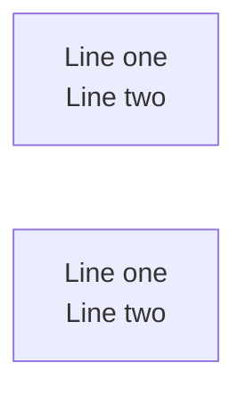
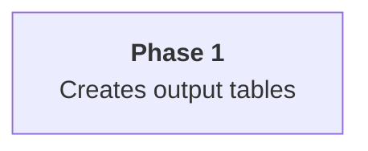

# Context

Setup and maintain automatic project diagrams using Mermaid.JS with **visual clarity enforcement**.
This is a **generalizable command** that works for ANY project by analyzing YOUR codebase.

**Research basis**: Cognitive load research (Huang et al., 2020) shows 50 nodes is the difficulty threshold for graph comprehension. This workflow enforces these limits through automated complexity analysis.

# Workflow

## Step 1: Setup Infrastructure

Run the setup script to ensure docs/diagrams/ exists with proper Makefile:

```bash
uv run .claude/skills/mermaidjs_diagrams/scripts/setup_diagrams.py
```

This creates:
- `docs/diagrams/` directory
- `docs/diagrams/Makefile` (with proper tabs)
- `docs/diagrams/.gitattributes`
- `docs/diagrams/README.md`

## Step 2: Identify Diagram Lenses

Before creating diagrams, identify the key **lenses** (perspectives/views) needed for the project:

| Lens | Purpose | Typical Content |
|------|---------|-----------------|
| `architecture` | System structure | Components, services, modules |
| `data-flow` | Information movement | Data paths, transformations |
| `deployment` | Infrastructure | Servers, containers, cloud services |
| `security` | Trust boundaries | Auth flows, encryption, access control |
| `sequence` | Interactions | API calls, user flows, processes |
| `state` | State machines | Statuses, transitions, workflows |

### File Organization Pattern

Use **lens prefix + density suffix** for clear organization:

**Naming Convention**: `{lens}--[{subsystem}--]{scope}.mmd`
- `{lens}`: architecture, data-flow, deployment, security, sequence, state.
- `{subsystem}`: Optional subsystem lens to break down larger details based on their subgraphs.
- `{scope}`: overview (low-density), detail (high-density). 
- `--`: double hyphen used as a separator to allow multiword `lens` or `subsystem` like `data-flow` to be distinguished separate to the naming convention markers.

```
docs/diagrams/
├── architecture--overview.mmd        # Low-density bird's eye view
├── architecture--detail.mmd          # High-density full system
├── architecture--api--detail.mmd     # High-density subsystem focus
├── architecture--agents--detail.mmd  # High-density subsystem focus
├── data-flow--overview.mmd           # Low-density data paths
├── data-flow--detail.mmd             # High-density transformations
├── deployment--overview.mmd          # Low-density infrastructure
├── security--overview.mmd            # Low-density trust boundaries
└── sequence--auth--detail.mmd        # Specific interaction flow
```


## Step 3: Analyze Existing Diagram Complexity

**BEFORE updating any diagrams**, run the complexity analyzer:

```bash
# Default analysis (high-density preset - research-backed limits)
uv run .claude/skills/mermaidjs_diagrams/scripts/mermaid_complexity.py docs/diagrams/

# With detailed calculation breakdown
uv run .claude/skills/mermaidjs_diagrams/scripts/mermaid_complexity.py docs/diagrams/ --show-working

# Analyze overview diagrams with stricter thresholds
uv run .claude/skills/mermaidjs_diagrams/scripts/mermaid_complexity.py docs/diagrams/*--overview.mmd --preset low

# Analyze detail diagrams with permissive thresholds
uv run .claude/skills/mermaidjs_diagrams/scripts/mermaid_complexity.py docs/diagrams/*--detail.mmd --preset high
```

### Output Includes:

- Visual Complexity Score (VCS) for each diagram
- Node and edge counts with threshold comparisons
- Rating: ideal/acceptable/complex/critical
- Subdivision recommendations with step-by-step calculation (`--show-working`)
- Recursive analysis warning if recommended splits would still exceed thresholds

### Density Presets

Choose a preset based on diagram purpose:

| Preset | Nodes (acceptable/complex) | VCS (acceptable/complex) | Use Case |
|--------|---------------------------|-------------------------|----------|
| `low-density` (low/l) | ≤12 / ≤20 | ≤25 / ≤40 | Overview diagrams, executive summaries |
| `medium-density` (med/m) | ≤20 / ≤35 | ≤40 / ≤70 | README diagrams, component docs |
| `high-density` (high/h) | ≤35 / ≤50 | ≤60 / ≤100 | Detailed architecture (default) |

### Configuration Options

**CLI arguments** (highest precedence):
```bash
uv run .claude/skills/mermaidjs_diagrams/scripts/mermaid_complexity.py docs/diagrams/ --preset med --node-target=18
```

**Environment variables** (prefix `MERMAID_COMPLEXITY_`):
```bash
MERMAID_COMPLEXITY_PRESET=low uv run .claude/skills/mermaidjs_diagrams/scripts/mermaid_complexity.py docs/diagrams/
```

**.env file** (in project root):
```
MERMAID_COMPLEXITY_PRESET=medium-density
MERMAID_COMPLEXITY_NODE_TARGET=20
```

## Step 4: Handle Complex Diagrams (Subdivision)

For any diagram rated **complex** or **critical**, apply the hierarchical subdivision pattern:

### 4a. Review Working Out

First, understand why subdivision is recommended:

```bash
uv run .claude/skills/mermaidjs_diagrams/scripts/mermaid_complexity.py docs/diagrams/complex_diagram.mmd --show-working
```

This shows:
1. **Threshold checks**: Which limits are exceeded
2. **Node-based splits**: `ceil(nodes / node_target)`
3. **VCS-based splits**: `ceil(vcs / vcs_target)`
4. **Subgraph adjustment**: Using existing subgraphs as natural boundaries
5. **Recursive analysis**: Estimated complexity per split with warnings if still too complex

### 4b. Create Dual-Density Versions

For each lens, maintain both density levels:

**Low-density overview** (`{lens}--overview.mmd`):
- Top-level components as single nodes
- Only major relationships
- Target: ≤12 nodes, VCS ≤25
- Perfect for: README, presentations, onboarding

**High-density detail** (`{lens}--detail.mmd`):
- All significant components
- Complete relationships
- Target: ≤35 nodes, VCS ≤60
- Perfect for: technical deep-dives, debugging

### 4c. Example Dual-Density Pattern

Original: `backend_architecture.mmd` (50 nodes, VCS=159 - CRITICAL)

Subdivide into:
```
docs/diagrams/
├── architecture--overview.mmd          # Low-density: 4 boxes (API, Agents, Storage, External)
├── architecture--detail.mmd            # High-density: Full system (~35 nodes)
├── architecture--api--detail.mmd       # High-density subsystem: FastAPI routes
├── architecture--agents--detail.mmd    # High-density subsystem: Agent system
└── architecture--storage--detail.mmd   # High-density subsystem: Database layer
```

### 4d. Subdivision Agent Prompt Template

For each subdivision, launch a Task agent with:

```
Create a focused diagram at docs/diagrams/{lens}--{scope}.mmd

Purpose: {describe the view this diagram provides}
Density: {low-density for overview, high-density for detail}
Source: Extract from {original_diagram} focusing on {subgraph_name}

1. Read the original diagram at docs/diagrams/{original}.mmd
2. Identify all nodes and edges within scope
3. Create a new focused diagram that:
   - Contains ONLY nodes appropriate for this density level
   - Shows external connections as simplified boundary nodes (e.g., "→ Storage Layer")
   - Preserves the styling (classDef, linkStyle) from original
   - Uses consistent node IDs for cross-referencing
4. Verify complexity is within thresholds for the density preset

Report:
- Node count and VCS
- Density preset used for validation
- Which nodes were extracted
- What boundary connections were simplified
```

## Step 5: Update Each Diagram (Parallel Execution)

For EACH `.mmd` file in `docs/diagrams/` (after subdivision), launch a Task subagent to update it.

**Use the Task tool with these parameters:**
- `subagent_type`: "general-purpose"
- `description`: "Update [diagram-name] diagram"
- `prompt`: Detailed instructions for that specific diagram

**Important:** Launch ALL agents in PARALLEL (single message with multiple Task tool calls).

### Example Agent Prompts (Adapt to Actual Diagrams):

For an overview diagram like `architecture--overview.mmd`:
```
Update the diagram at docs/diagrams/architecture--overview.mmd to reflect current system architecture.

This is a LOW-DENSITY overview diagram. Requirements:
- Maximum 12 nodes (show only top-level components)
- Group subsystems into single boxes
- Show only primary relationships between major components
- This should fit on a single slide/README section

1. Read the existing diagram to understand its structure
2. Analyze the codebase for major architectural components
3. Update the .mmd file with current high-level structure
4. Verify complexity: run analyzer with --preset low
5. Report what you changed

Only update this diagram, don't modify other files.
```

For a detail diagram like `architecture--detail.mmd`:
```
Update the diagram at docs/diagrams/architecture--detail.mmd to reflect current system architecture.

This is a HIGH-DENSITY detail diagram. Requirements:
- Up to 35 nodes showing significant components
- Include important relationships and data flows
- Use subgraphs to organize related components
- This is for technical deep-dives

1. Read the existing diagram to understand its structure
2. Analyze the codebase comprehensively
3. Update the .mmd file with all significant components
4. Verify complexity: run analyzer with --preset high
5. Report what you changed

Only update this diagram, don't modify other files.
```

## Step 6: Validate Complexity Post-Update

After all updates complete, validate each density level separately:

```bash
# Validate overview diagrams (low-density)
uv run .claude/skills/mermaidjs_diagrams/scripts/mermaid_complexity.py docs/diagrams/*--overview.mmd --preset low

# Validate detail diagrams (high-density)
uv run .claude/skills/mermaidjs_diagrams/scripts/mermaid_complexity.py docs/diagrams/*--detail.mmd --preset high

# Validate all diagrams with default (high-density)
uv run .claude/skills/mermaidjs_diagrams/scripts/mermaid_complexity.py docs/diagrams/
```

**Overview diagrams should be "ideal" with low-density preset.**
**Detail diagrams should be "ideal" or "acceptable" with high-density preset.**

If any remain "complex" or "critical", repeat Step 4 for those diagrams.

## Step 7: Verify Diagrams in Markdown Documentation

`mmdc` natively handles `.md` input — pass the markdown file directly. It extracts every
` ```mermaid ` fence, renders each one, and writes output images to the artefacts directory.
No separate verifier script is needed.

```bash
# Verify and extract all mermaid blocks from a markdown file (SVG output by default)
npx -p @mermaid-js/mermaid-cli mmdc \
  -i docs/plans/my_plan.md \
  -o docs/diagrams/mmdc/my_plan.md \
  -a docs/diagrams/mmdc/

# With icon packs (required for architecture-beta diagrams using Iconify icons)
npx -p @mermaid-js/mermaid-cli mmdc \
  -i docs/plans/my_plan.md \
  -o docs/diagrams/mmdc/my_plan.md \
  -a docs/diagrams/mmdc/ \
  --iconPacks @iconify-json/logos @iconify-json/mdi

# With custom icon pack from a URL (e.g. Azure icons not on npm)
npx -p @mermaid-js/mermaid-cli mmdc \
  -i docs/plans/my_plan.md \
  -o docs/diagrams/mmdc/my_plan.md \
  -a docs/diagrams/mmdc/ \
  --iconPacksNamesAndUrls "azure#https://raw.githubusercontent.com/NakayamaKento/AzureIcons/refs/heads/main/icons.json"
```

**Outputs:**
- `-o` path — markdown with `` links replacing each mermaid fence
- `-a` directory — one SVG/PNG per diagram block, named `{filename}-{N}.svg`

**Failure signal:** mmdc exits non-zero and prints the offending diagram + error to stderr.
Fix the fence and re-run until exit code is `0`.

## Step 8: Generate PNG Images

After all agents complete and complexity is validated:

```bash
# Generate all PNGs from .mmd files (flowchart diagrams need no icon packs — Font Awesome is built-in)
make -C docs/diagrams

# Only set ICON_PACKS if using architecture-beta diagrams with Iconify icons
make -C docs/diagrams ICON_PACKS="@iconify-json/logos @iconify-json/mdi"
```

Or generate a single diagram directly:

```bash
npx -p @mermaid-js/mermaid-cli mmdc \
  -i docs/diagrams/architecture--overview.mmd \
  -o docs/diagrams/architecture--overview.png \
  --scale 4 --backgroundColor white \
  --iconPacks @iconify-json/logos @iconify-json/mdi
```

**Working example:** See `.claude/skills/mermaidjs_diagrams/resources/my_flowchart.mmd` (flowchart
with Font Awesome `fa:fa-icon` icons — no `--iconPacks` flag needed) and its rendered output
`resources/my_flowchart.png`. Generated with:
```bash
npx -p @mermaid-js/mermaid-cli mmdc \
  -i .claude/skills/mermaidjs_diagrams/resources/my_flowchart.mmd \
  -o .claude/skills/mermaidjs_diagrams/resources/my_flowchart.png \
  --scale 4 --backgroundColor white
```

## Step 9: Sync README

Update the project README.md with organized diagram sections:

```markdown
## Architecture Diagrams

### Quick Overview

*High-level system components* | [Source](docs/diagrams/architecture--overview.mmd)
```

# Common Pitfalls

## Multiline Text in Flowchart Node Labels

**`\n` does NOT work** in Mermaid flowchart node labels. It renders as literal garbled characters
in SVG/PNG output. Use `<br/>` instead:



Both `<br>` and `<br/>` work, but `<br/>` is preferred for SVG validity.

### Alternative: Markdown Strings (Mermaid v10.7+)

For richer formatting (bold, italic, auto-wrap), use the `` ["`...`"] `` syntax with real
newlines in the source file:



| Feature | `<br/>` tags | Markdown strings |
|---------|-------------|-----------------|
| Mermaid version | All versions | v10.7+ |
| Inline formatting | No | Bold, italic |
| Auto-wrap | No | Yes |
| Source readability | Single line | Multi-line |

### Where `<br/>` does NOT work

- **Subgraph labels**: `subgraph title` does not support `<br/>` — use short single-line titles
- **Edge labels**: `-->|label|` supports `<br/>` but readability suffers at small scale
- **erDiagram**: Entity-relationship diagrams use a different syntax and do not support `<br/>`

### Avoid Unicode Special Characters in Node Labels

Characters like `↳` (U+21B3), `→` (U+2192), `·` (U+00B7), and other Unicode symbols can cause
rendering failures or garbled output in mmdc PNG/SVG generation, even when they display correctly
in browser-based Mermaid previews. Stick to **ASCII-only text** in node labels and use standard
punctuation (`-`, `+`, `>`, `*`, `:`) instead of Unicode arrows, bullets, or decorative characters.

# Quick Reference

## Complexity Formula
```
Visual Complexity Score (VCS) = (nodes + edges×0.5 + subgraphs×3) × (1 + depth×0.1)
```

## Density Targets
| Density | Nodes | VCS | Typical Use |
|---------|-------|-----|-------------|
| Low | ≤12 | ≤25 | Overview diagrams |
| Medium | ≤20 | ≤40 | README diagrams |
| High | ≤35 | ≤60 | Detail diagrams |

## File Naming Convention
```
{lens}--[{subsystem}--]{scope}.mmd

Lenses: architecture, data-flow, deployment, security, sequence, state
Subsystem: optional, names a subgraph/component focus
Scopes: overview (low-density), detail (high-density)
```

## CLI Quick Reference

### Complexity Analysis (`mermaid_complexity.py`)
```bash
# Analyze with different density presets
uv run .claude/skills/mermaidjs_diagrams/scripts/mermaid_complexity.py docs/diagrams/ -p low
uv run .claude/skills/mermaidjs_diagrams/scripts/mermaid_complexity.py docs/diagrams/ -p med
uv run .claude/skills/mermaidjs_diagrams/scripts/mermaid_complexity.py docs/diagrams/ -p high

# Show detailed calculation working
uv run .claude/skills/mermaidjs_diagrams/scripts/mermaid_complexity.py docs/diagrams/ --show-working

# JSON output for programmatic use
uv run .claude/skills/mermaidjs_diagrams/scripts/mermaid_complexity.py docs/diagrams/ --json

# Summary only (skip individual reports)
uv run .claude/skills/mermaidjs_diagrams/scripts/mermaid_complexity.py docs/diagrams/ --summary-only

# Validate by pattern
uv run .claude/skills/mermaidjs_diagrams/scripts/mermaid_complexity.py docs/diagrams/*--overview.mmd -p low
uv run .claude/skills/mermaidjs_diagrams/scripts/mermaid_complexity.py docs/diagrams/*--detail.mmd -p high
```

### Markdown Rendering (`mmdc` native MD input)

`mmdc` handles `.md` files directly — no wrapper script needed:

```bash
# Render all mermaid fences in a markdown file → SVG artefacts
npx -p @mermaid-js/mermaid-cli mmdc \
  -i docs/plans/my_plan.md \
  -o docs/diagrams/mmdc/my_plan.md \
  -a docs/diagrams/mmdc/

# With icon packs (npm packages, downloaded from unpkg.com)
npx -p @mermaid-js/mermaid-cli mmdc \
  -i docs/plans/my_plan.md \
  -o docs/diagrams/mmdc/my_plan.md \
  -a docs/diagrams/mmdc/ \
  --iconPacks @iconify-json/logos @iconify-json/mdi

# With custom icon packs via URL (prefix#url format)
npx -p @mermaid-js/mermaid-cli mmdc \
  -i docs/plans/my_plan.md \
  -o docs/diagrams/mmdc/my_plan.md \
  -a docs/diagrams/mmdc/ \
  --iconPacksNamesAndUrls "azure#https://raw.githubusercontent.com/NakayamaKento/AzureIcons/refs/heads/main/icons.json"
```

### .mmd File Rendering

```bash
# Single .mmd → PNG with icon packs
npx -p @mermaid-js/mermaid-cli mmdc \
  -i docs/diagrams/my_diagram.mmd \
  -o docs/diagrams/my_diagram.png \
  --scale 4 --backgroundColor white \
  --iconPacks @iconify-json/logos @iconify-json/mdi

# Via Makefile (handles all .mmd → .png with ICON_PACKS variable)
make -C docs/diagrams
make -C docs/diagrams ICON_PACKS="@iconify-json/logos @iconify-json/mdi @iconify-json/carbon"
```

### Per-Project Diagram Makefile Target

For subprojects that have mermaid blocks in their own `README.md`, add a `diagrams` target
that renders all fences into a local `diagrams/` folder. mmdc's markdown input mode extracts
each mermaid fence as a separate SVG artefact and generates a `README.md` copy with
`` links replacing the fences:

```makefile
# ── Diagrams ─────────────────────────────────────────────────────
DIAGRAMS_DIR = diagrams
MMDC = npx -p @mermaid-js/mermaid-cli mmdc
MMDC_FLAGS = --scale 4 --backgroundColor white

diagrams:                ## Render README Mermaid diagrams to SVG
	@mkdir -p $(DIAGRAMS_DIR)
	$(MMDC) -i README.md -o $(DIAGRAMS_DIR)/README.md -a $(DIAGRAMS_DIR)/ $(MMDC_FLAGS)

diagrams-clean:          ## Remove rendered diagram artefacts
	rm -rf $(DIAGRAMS_DIR)
```

**Output format**: markdown mode always produces SVG artefacts (vector format — scalable, text-selectable,
smaller than PNG). For PNG output, render standalone `.mmd` files instead (see `.mmd File Rendering` above).

## Exit Codes

### `mermaid_complexity.py`
- `0`: All diagrams are ideal or acceptable for their density level
- `1`: One or more diagrams are complex or critical (needs attention)

### `mmdc` (mermaid-cli)
- `0`: All diagrams rendered successfully
- `1`: One or more diagrams failed to render (error printed to stderr)
