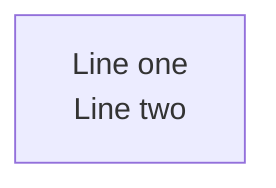

# Context

Render and maintain Mermaid.JS diagrams with **visual clarity enforcement**.
Works for ANY project. Cognitive load research (Huang et al., 2020) shows 50 nodes
is the difficulty threshold — this skill enforces limits via automated complexity analysis.

Diagrams live as ` ```mermaid ` code fences inside `.md` files.

# Rendering

## Quick render (recommended)

Use the bundled script to render both standard variants (dark+transparent and default+white PNGs) in one command:

```bash
bash .claude/skills/mermaidjs_diagrams/scripts/render_mermaid.sh path/to/document.md
```

Output lands in `.mmdc_cache/{variant}/path/to/document-*.png`.

`mmdc` reads the markdown file, extracts every mermaid fence, and renders each as a
numbered image artefact. Exit code 0 = all fences valid. Non-zero = render failure
(see stderr for the offending fence).

## Custom variants

For formats beyond the two defaults, use `mmdc` directly. Three parameters form a
**variant tuple** that determines the output folder name:

| Parameter | Flag | Values | Default |
|-----------|------|--------|---------|
| Theme | `-t` | `default`, `dark` | **`dark`** |
| Background | `-b` | `white`, `black`, `transparent` | **`transparent`** |
| Format | `-e` | `png`, `svg` | **`png`** |

Output folder: `{theme}_{backgroundColor}_{format}` (e.g. `dark_transparent_png`)

```bash
INPUT="path/to/document.md"
INPUT_PATH="path/to/"
OUTPUT_FORMAT="png"
THEME=dark
BGCOLOR=transparent
VARIANT="${THEME}_${BGCOLOR}_${OUTPUT_FORMAT}"
OUTPUT_BASE=".mmdc_cache"
OUTPUT_TARGET="${OUTPUT_BASE}/${VARIANT}/${INPUT_PATH}/"
OUTPUT="${OUTPUT_BASE}/${VARIANT}/${INPUT}"

npx -p @mermaid-js/mermaid-cli mmdc \
  -i "${INPUT}" \
  -a "${OUTPUT_TARGET}" \
  -o "${OUTPUT}" \
  --scale 4 -e "${OUTPUT_FORMAT}" -t "${THEME}" -b "${BGCOLOR}"
```

> Full variant documentation: `resources/pattern_render_markdown.md`

## Icon packs

```bash
# Iconify icons (architecture-beta diagrams)
--iconPacks @iconify-json/logos @iconify-json/mdi

# Custom URL-based packs
--iconPacksNamesAndUrls "vendor#https://example.com/icons.json"
```

Flowchart diagrams with Font Awesome (`fa:fa-icon`) need no `--iconPacks` flag.

---

# Complexity Analysis

Analyze diagrams to ensure they stay within cognitive load thresholds.

> **Note:** The complexity analyzer currently operates on `.mmd` files. A future
> update will add support for extracting and analyzing individual mermaid code fences
> from markdown files directly.

```bash
uv run .claude/skills/mermaidjs_diagrams/scripts/mermaid_complexity.py path/to/diagrams/
uv run .claude/skills/mermaidjs_diagrams/scripts/mermaid_complexity.py path/to/diagrams/ --show-working
uv run .claude/skills/mermaidjs_diagrams/scripts/mermaid_complexity.py path/to/diagram.mmd --preset low
```

## Density presets

| Preset | Nodes | VCS | Typical Use |
|--------|-------|-----|-------------|
| Low (`low` / `l`) | <=12 | <=25 | Overview diagrams |
| Medium (`med` / `m`) | <=20 | <=40 | README diagrams |
| High (`high` / `h`) | <=35 | <=60 | Detail diagrams (default) |

## Complexity formula

```
VCS = (nodes + edges*0.5 + subgraphs*3) * (1 + depth*0.1)
```

Ratings: **ideal** / **acceptable** / **complex** / **critical**

When a diagram is rated **complex** or **critical**, split it into simplified and
detailed versions. See `resources/diagram_organization.md` for the dual-density
approach and naming conventions.

---

# Layout Algorithms

Mermaid supports several layout engines (`dagre` default, `elk`, `tidy-tree`,
`cose-bilkent`) selected via YAML frontmatter inside the diagram source:

```yaml
---
config:
  layout: elk
  look: classic
  elk:
    mergeEdges: true
    nodePlacementStrategy: BRANDES_KOEPF
---
flowchart LR
    ...
```

Use `elk` for dense architecture diagrams (cleaner orthogonal routing), stick
with `dagre` for simple flows. The `layout` key is only honored by **flowchart**,
**state**, and **mindmap** diagrams — others use their own built-in algorithms.

> Full documentation: `resources/layout_algorithms.md`
> Rendered comparison gallery (dagre vs. elk vs. tidy-tree): `resources/examples/README.md`

---

# Diagram Organization

For projects with multiple architectural diagrams, use lenses (perspectives) and
dual-density versions to keep diagrams focused and navigable.

> Full documentation: `resources/diagram_organization.md`

Key concepts:
- **Lenses**: architecture, data-flow, deployment, security, sequence, state
- **Density levels**: overview (simplified, <=12 nodes) vs detail (comprehensive, <=35 nodes)
- **Naming convention**: `{lens}--[{subsystem}--]{scope}.md`
- **README sync**: Link rendered diagrams from project README

---

# Common Pitfalls

## Multiline Text in Node Labels

**`\n` does NOT work** in flowchart node labels — renders as garbled characters.
Use `<br/>` instead:



Alternative for Mermaid v10.7+: markdown strings with real newlines:


| Feature | `<br/>` tags | Markdown strings |
|---------|-------------|-----------------|
| Mermaid version | All versions | v10.7+ |
| Inline formatting | No | Bold, italic |
| Auto-wrap | No | Yes |

### Where `<br/>` does NOT work

- **Subgraph labels** — use short single-line titles
- **erDiagram** — uses different syntax

## Avoid Unicode in Node Labels

Characters like U+21B3, U+2192, U+00B7 can cause rendering failures in mmdc even
when they display in browser previews. Stick to **ASCII-only text** in node labels.

---

# Quick Reference

## Variant Tuples

| Variant | Flags | Best For |
|---------|-------|----------|
| `dark_transparent_png` | `-e png -t dark -b transparent` | Dark UIs, slides (default) |
| `default_white_png` | `-e png -t default -b white` | README, light docs, print |
| `dark_transparent_svg` | `-e svg -t dark -b transparent` | Scalable dark docs |
| `default_white_svg` | `-e svg -t default -b white` | Scalable light docs |

## Exit Codes

| Tool | 0 | 1 |
|------|---|---|
| `mermaid_complexity.py` | All ideal/acceptable | Complex or critical found |
| `mmdc` | All rendered | Render failure (see stderr) |

## Resources

| File | Content |
|------|---------|
| `resources/color_theming.md` | Color palettes, HSL encoding, dark/light mode safety, subgraph coloring |
| `resources/diagram_organization.md` | Lens naming, dual-density approach, README sync |
| `resources/layout_algorithms.md` | `layout` + `look` config for dagre / elk / tidy-tree / cose-bilkent, ELK tuning keys, per-diagram-type support |
| `resources/pattern_render_markdown.md` | Full render-from-markdown documentation |
| `resources/examples/` | Sample `.mmd` files and rendered PNG output (includes layout comparison gallery) |
| `resources/iconify/` | Iconify icon-pack reference (subdirectory — see files below) |
| `resources/iconify/iconify_setup.md` | Iconify icon pack setup guide |
| `resources/iconify/iconify_logos.md` | Available Iconify logo icons |
| `resources/iconify/iconify_mdi.md` | Available Material Design icons |
| `resources/iconify/iconify_cloud.md` | Cloud-provider icon catalogue |
| `resources/iconify/iconify_saas.md` | SaaS / product icon catalogue |
| `scripts/render_mermaid.sh` | Render both default variants for a markdown file |
| `scripts/mermaid_complexity.py` | Complexity analyzer script |
