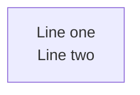

# Context

Render and maintain Mermaid.JS diagrams with **visual clarity enforcement**.
Works for ANY project. Cognitive load research (Huang et al., 2020) shows 50 nodes
is the difficulty threshold -- this skill enforces limits via automated complexity analysis.

# Workflow

Two usage patterns. Choose based on where your diagrams live:

| Pattern | When to Use | Setup |
|---------|-------------|-------|
| **Render from Markdown** | Diagrams are ` ```mermaid ` fences in `.md` files | None |
| **Managed `.mmd` Files** | Standalone `.mmd` files in a dedicated directory | One-time |

These patterns can be combined: use "Managed `.mmd`" for your diagram collection,
then "Render from Markdown" as a verification step on documentation files.

---

## Pattern 1: Render from Markdown

> Full documentation: `resources/pattern_render_markdown.md`

Render mermaid fences from any `.md` file using `mmdc`'s markdown input mode.

### Rendering Variants

Three parameters form a **variant tuple** that determines the output folder name:

| Parameter | Flag | Values | Default |
|-----------|------|--------|---------|
| Theme | `-t` | `default`, `dark` | **`dark`** |
| Background | `-b` | `white`, `black`, `transparent` | **`transparent`** |
| Format | `-e` | `png`, `svg` | **`png`** |

Output folder: `{theme}_{backgroundColor}_{format}` (e.g. `dark_transparent_png`)

### Render a single variant

The `VARIANT` tuple is computed from `THEME`, `BGCOLOR`, and `OUTPUT_FORMAT`:

```bash
INPUT="path/to/document.md"
INPUT_PATH="path/to/"
OUTPUT_FORMAT="png"
THEME=dark
BGCOLOR=transparent
VARIANT="${THEME}_${BGCOLOR}_${OUTPUT_FORMAT}"
OUTPUT_BASE=".mmdc_cache"
OUTPUT_TARGET="${OUTPUT_BASE}/${VARIANT}/${INPUT_PATH}/"
OUTPUT="${OUTPUT_BASE}/${VARIANT}/${INPUT}"

npx -p @mermaid-js/mermaid-cli mmdc \
  -i "${INPUT}" \
  -a "${OUTPUT_TARGET}" \
  -o "${OUTPUT}" \
  --scale 4 -e "${OUTPUT_FORMAT}" -t "${THEME}" -b "${BGCOLOR}"
```

### Render multiple variants (common use case)

```bash
INPUT="path/to/document.md"
INPUT_PATH="path/to/"
OUTPUT_BASE=".mmdc_cache"

# Variant 1: dark + transparent + PNG (default)
OUTPUT_FORMAT="png"
THEME=dark
BGCOLOR=transparent
VARIANT="${THEME}_${BGCOLOR}_${OUTPUT_FORMAT}"
OUTPUT_TARGET="${OUTPUT_BASE}/${VARIANT}/${INPUT_PATH}/"
OUTPUT="${OUTPUT_BASE}/${VARIANT}/${INPUT}"
npx -p @mermaid-js/mermaid-cli mmdc \
  -i "${INPUT}" \
  -a "${OUTPUT_TARGET}" \
  -o "${OUTPUT}" \
  --scale 4 -e "${OUTPUT_FORMAT}" -t "${THEME}" -b "${BGCOLOR}"

# Variant 2: default + white + PNG (for README, light-mode docs)
OUTPUT_FORMAT="png"
THEME=default
BGCOLOR=white
VARIANT="${THEME}_${BGCOLOR}_${OUTPUT_FORMAT}"
OUTPUT_TARGET="${OUTPUT_BASE}/${VARIANT}/${INPUT_PATH}/"
OUTPUT="${OUTPUT_BASE}/${VARIANT}/${INPUT}"
npx -p @mermaid-js/mermaid-cli mmdc \
  -i "${INPUT}" \
  -a "${OUTPUT_TARGET}" \
  -o "${OUTPUT}" \
  --scale 4 -e "${OUTPUT_FORMAT}" -t "${THEME}" -b "${BGCOLOR}"
```

### Verification use

mmdc exits non-zero if any fence fails. Use as a validation step:
```bash
INPUT="document.md"
OUTPUT_FORMAT="png"
THEME=dark
BGCOLOR=transparent
VARIANT="${THEME}_${BGCOLOR}_${OUTPUT_FORMAT}"
OUTPUT_BASE="tmp/mmdc-verify"
OUTPUT_TARGET="${OUTPUT_BASE}/${VARIANT}/"
OUTPUT="${OUTPUT_BASE}/${VARIANT}/${INPUT}"

npx -p @mermaid-js/mermaid-cli mmdc \
  -i "${INPUT}" \
  -a "${OUTPUT_TARGET}" \
  -o "${OUTPUT}" \
  --scale 4 -e "${OUTPUT_FORMAT}" -t "${THEME}" -b "${BGCOLOR}"
```

### Icon packs

```bash
# Iconify icons (architecture-beta diagrams)
--iconPacks @iconify-json/logos @iconify-json/mdi

# Custom URL-based packs
--iconPacksNamesAndUrls "vendor#https://example.com/icons.json"
```

Flowchart diagrams with Font Awesome (`fa:fa-icon`) need no `--iconPacks` flag.

---

## Pattern 2: Managed `.mmd` Files

> Full documentation: `resources/pattern_managed_mmd.md`

For maintaining a dedicated diagram collection with complexity analysis,
dual-density management, and Makefile-based batch rendering.

### Setup (one-time)

```bash
uv run .claude/skills/mermaidjs_diagrams/scripts/setup_diagrams.py
# Or target a custom directory:
uv run .claude/skills/mermaidjs_diagrams/scripts/setup_diagrams.py --target-folder path/to/diagrams
```

### File naming convention

```
{lens}--[{subsystem}--]{scope}.mmd

Lenses: architecture, data-flow, deployment, security, sequence, state
Scopes: overview (low-density), detail (high-density)
```

### Complexity analysis

```bash
uv run .claude/skills/mermaidjs_diagrams/scripts/mermaid_complexity.py docs/diagrams/
uv run .claude/skills/mermaidjs_diagrams/scripts/mermaid_complexity.py docs/diagrams/ --show-working
uv run .claude/skills/mermaidjs_diagrams/scripts/mermaid_complexity.py docs/diagrams/*--overview.mmd -p low
uv run .claude/skills/mermaidjs_diagrams/scripts/mermaid_complexity.py docs/diagrams/*--detail.mmd -p high
```

### Density targets

| Density | Nodes | VCS | Typical Use |
|---------|-------|-----|-------------|
| Low | <=12 | <=25 | Overview diagrams |
| Medium | <=20 | <=40 | README diagrams |
| High | <=35 | <=60 | Detail diagrams |

### Batch rendering

```bash
make -C docs/diagrams
make -C docs/diagrams ICON_PACKS="@iconify-json/logos @iconify-json/mdi"
```

### Workflow summary

1. **B1** Setup infrastructure (one-time)
2. **B2** Identify diagram lenses
3. **B3** Analyze complexity (`--show-working`)
4. **B4** Subdivide complex diagrams into dual-density versions
5. **B5** Update each diagram (parallel Task agents)
6. **B6** Validate complexity post-update
7. **B7** Generate PNG images
8. **B8** Sync README with diagram links

See `resources/pattern_managed_mmd.md` for full step details, agent prompt templates,
and subdivision examples.

---

# Common Pitfalls

## Multiline Text in Node Labels

**`\n` does NOT work** in flowchart node labels -- renders as garbled characters.
Use `<br/>` instead:



Alternative for Mermaid v10.7+: markdown strings with real newlines:


| Feature | `<br/>` tags | Markdown strings |
|---------|-------------|-----------------|
| Mermaid version | All versions | v10.7+ |
| Inline formatting | No | Bold, italic |
| Auto-wrap | No | Yes |

### Where `<br/>` does NOT work

- **Subgraph labels** -- use short single-line titles
- **erDiagram** -- uses different syntax

## Avoid Unicode in Node Labels

Characters like U+21B3, U+2192, U+00B7 can cause rendering failures in mmdc even
when they display in browser previews. Stick to **ASCII-only text** in node labels.

---

# Quick Reference

## Complexity Formula
```
VCS = (nodes + edges*0.5 + subgraphs*3) * (1 + depth*0.1)
```

## Variant Tuples

| Variant | Flags | Best For |
|---------|-------|----------|
| `dark_transparent_png` | `-e png -t dark -b transparent` | Dark UIs, slides (default) |
| `default_white_png` | `-e png -t default -b white` | README, light docs, print |
| `dark_transparent_svg` | `-e svg -t dark -b transparent` | Scalable dark docs |
| `default_white_svg` | `-e svg -t default -b white` | Scalable light docs |

## Exit Codes

| Tool | 0 | 1 |
|------|---|---|
| `mermaid_complexity.py` | All ideal/acceptable | Complex or critical found |
| `mmdc` | All rendered | Render failure (see stderr) |

## Resources

| File | Content |
|------|---------|
| `resources/pattern_render_markdown.md` | Full render-from-markdown documentation |
| `resources/pattern_managed_mmd.md` | Full managed `.mmd` workflow documentation |
| `resources/examples/` | Sample `.mmd` files and rendered PNG output |
| `resources/iconify_setup.md` | Iconify icon pack setup guide |
| `resources/iconify_logos.md` | Available Iconify logo icons |
| `resources/iconify_mdi.md` | Available Material Design icons |
| `scripts/setup_diagrams.py` | Infrastructure setup script |
| `scripts/mermaid_complexity.py` | Complexity analyzer script |
