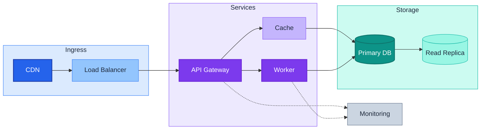

# Mermaid Color Palette Recipes & Hex Reference

Part of the **Mermaid color theming** family — see
[`color_theming.md`](color_theming.md) for the principles (HSL encoding,
dark/light-mode safety, visual hierarchy, subgraph coloring). This file is the
**copy-paste catalog**: four ready-made palette recipes, a worked example that
applies one, and the Tailwind v3 hex lookup that backs them all.

All palettes below use Tailwind v3 hex values. Each includes primary (dark fill,
white text), secondary (light fill, dark text), and subgraph variants.

## Palette Recipes

### Recipe A: Software Architecture (Cool Tones)

For layered architecture, microservices, deployment diagrams.

```
%% --- Architecture palette: blue/violet/teal/slate ---

%% Entrypoint / Ingress (Blue family)
classDef ingressPrimary    fill:#2563eb,stroke:#1e40af,color:#fff,stroke-width:2px
classDef ingressSecondary  fill:#93c5fd,stroke:#3b82f6,color:#1e293b,stroke-width:1px
classDef sgIngress         fill:#dbeafe,stroke:#3b82f6,color:#1e293b

%% Business Logic / Compute (Violet family)
classDef computePrimary    fill:#7c3aed,stroke:#6d28d9,color:#fff,stroke-width:2px
classDef computeSecondary  fill:#c4b5fd,stroke:#8b5cf6,color:#1e293b,stroke-width:1px
classDef sgCompute         fill:#ede9fe,stroke:#8b5cf6,color:#1e293b

%% Data / Storage (Teal family)
classDef dataPrimary       fill:#0d9488,stroke:#0f766e,color:#fff,stroke-width:2px
classDef dataSecondary     fill:#99f6e4,stroke:#14b8a6,color:#1e293b,stroke-width:1px
classDef sgData            fill:#ccfbf1,stroke:#14b8a6,color:#1e293b

%% External / Infrastructure (Slate family)
classDef infraPrimary      fill:#475569,stroke:#334155,color:#fff,stroke-width:2px
classDef infraSecondary    fill:#cbd5e1,stroke:#64748b,color:#1e293b,stroke-width:1px
classDef sgInfra           fill:#f1f5f9,stroke:#94a3b8,color:#334155

%% Accent: Danger / Alert
classDef danger            fill:#dc2626,stroke:#b91c1c,color:#fff,stroke-width:2px
%% Accent: Success / Healthy
classDef success           fill:#059669,stroke:#047857,color:#fff,stroke-width:2px
```

### Recipe B: Data Flow / ETL Pipeline (Warm Tones)

For data pipelines, ETL, stream processing, ML workflows.

```
%% --- Data Flow palette: amber/orange/emerald/indigo ---

%% Source / Input (Amber family)
classDef sourcePrimary     fill:#d97706,stroke:#b45309,color:#fff,stroke-width:2px
classDef sourceSecondary   fill:#fde68a,stroke:#f59e0b,color:#1e293b,stroke-width:1px
classDef sgSource          fill:#fef3c7,stroke:#f59e0b,color:#1e293b

%% Transform / Process (Orange family)
classDef transformPrimary  fill:#ea580c,stroke:#c2410c,color:#fff,stroke-width:2px
classDef transformSecondary fill:#fed7aa,stroke:#f97316,color:#1e293b,stroke-width:1px
classDef sgTransform       fill:#fff7ed,stroke:#f97316,color:#1e293b

%% Load / Output (Emerald family)
classDef loadPrimary       fill:#059669,stroke:#047857,color:#fff,stroke-width:2px
classDef loadSecondary     fill:#a7f3d0,stroke:#10b981,color:#1e293b,stroke-width:1px
classDef sgLoad            fill:#d1fae5,stroke:#10b981,color:#1e293b

%% Orchestration / Control (Indigo family)
classDef orchPrimary       fill:#4f46e5,stroke:#4338ca,color:#fff,stroke-width:2px
classDef orchSecondary     fill:#c7d2fe,stroke:#6366f1,color:#1e293b,stroke-width:1px
classDef sgOrch            fill:#e0e7ff,stroke:#6366f1,color:#1e293b

%% Accent: Failed / Error
classDef error             fill:#dc2626,stroke:#b91c1c,color:#fff,stroke-width:2px
%% Accent: Warning / Slow
classDef warning           fill:#f59e0b,stroke:#d97706,color:#1e293b,stroke-width:2px
```

### Recipe C: State / Workflow Diagram (Semantic Colors)

For state machines, CI/CD pipelines, approval workflows.

```
%% --- Workflow palette: semantic roles ---

%% Start / Entry state (Green family)
classDef stateStart        fill:#059669,stroke:#047857,color:#fff,stroke-width:2px
classDef stateStartLight   fill:#d1fae5,stroke:#10b981,color:#1e293b,stroke-width:1px

%% In-Progress / Active (Blue family)
classDef stateActive       fill:#2563eb,stroke:#1e40af,color:#fff,stroke-width:2px
classDef stateActiveLight  fill:#dbeafe,stroke:#3b82f6,color:#1e293b,stroke-width:1px

%% Review / Waiting (Amber family)
classDef stateWaiting      fill:#d97706,stroke:#b45309,color:#fff,stroke-width:2px
classDef stateWaitingLight fill:#fef3c7,stroke:#f59e0b,color:#1e293b,stroke-width:1px

%% End / Complete (Slate family)
classDef stateEnd          fill:#475569,stroke:#334155,color:#fff,stroke-width:2px
classDef stateEndLight     fill:#e2e8f0,stroke:#64748b,color:#1e293b,stroke-width:1px

%% Error / Rejected (Red family)
classDef stateError        fill:#dc2626,stroke:#b91c1c,color:#fff,stroke-width:2px
classDef stateErrorLight   fill:#fecaca,stroke:#ef4444,color:#1e293b,stroke-width:1px

%% Cancelled / Skipped (Zinc family -- true neutral)
classDef stateSkipped      fill:#3f3f46,stroke:#27272a,color:#fff,stroke-width:1px,stroke-dasharray:5 5
classDef stateSkippedLight fill:#e4e4e7,stroke:#a1a1aa,color:#52525b,stroke-width:1px,stroke-dasharray:5 5
```

### Recipe D: High-Density Knowledge Graph (Maximum Distinction)

For ER diagrams, knowledge graphs, ontologies with many entity types.

```
%% --- Knowledge Graph palette: 8 maximally distinct hues ---

classDef kgPerson          fill:#2563eb,stroke:#1e40af,color:#fff,stroke-width:2px
classDef kgOrganization    fill:#7c3aed,stroke:#6d28d9,color:#fff,stroke-width:2px
classDef kgLocation        fill:#059669,stroke:#047857,color:#fff,stroke-width:2px
classDef kgEvent           fill:#ea580c,stroke:#c2410c,color:#fff,stroke-width:2px
classDef kgDocument        fill:#0891b2,stroke:#0e7490,color:#fff,stroke-width:2px
classDef kgConcept         fill:#d97706,stroke:#b45309,color:#fff,stroke-width:2px
classDef kgProduct         fill:#e11d48,stroke:#be123c,color:#fff,stroke-width:2px
classDef kgTechnology      fill:#475569,stroke:#334155,color:#fff,stroke-width:2px

%% Lighter variants for secondary/mention nodes
classDef kgPersonLight     fill:#dbeafe,stroke:#3b82f6,color:#1e293b,stroke-width:1px
classDef kgOrgLight        fill:#ede9fe,stroke:#8b5cf6,color:#1e293b,stroke-width:1px
classDef kgLocationLight   fill:#d1fae5,stroke:#10b981,color:#1e293b,stroke-width:1px
classDef kgEventLight      fill:#fff7ed,stroke:#f97316,color:#1e293b,stroke-width:1px
classDef kgDocumentLight   fill:#cffafe,stroke:#06b6d4,color:#1e293b,stroke-width:1px
classDef kgConceptLight    fill:#fef3c7,stroke:#f59e0b,color:#1e293b,stroke-width:1px
classDef kgProductLight    fill:#ffe4e6,stroke:#f43f5e,color:#1e293b,stroke-width:1px
classDef kgTechLight       fill:#f1f5f9,stroke:#94a3b8,color:#334155,stroke-width:1px

%% Relation edge (use linkStyle for edges)
%% linkStyle default stroke:#64748b,stroke-width:1px
```

## Worked Example

A software architecture diagram using Recipe A:



## Tailwind v3 Hex Reference (Subset for Diagrams)

Quick lookup for the hex values used throughout the color theming family.

| Tailwind class | Hex | Typical role |
|---------------|-----|-------------|
| blue-100 | `#dbeafe` | Subgraph fill, tertiary node |
| blue-300 | `#93c5fd` | Secondary node fill |
| blue-500 | `#3b82f6` | Stroke, accent |
| blue-600 | `#2563eb` | Primary node fill |
| blue-800 | `#1e40af` | Primary stroke |
| blue-900 | `#1e3a8a` | Deep stroke |
| violet-100 | `#ede9fe` | Subgraph fill |
| violet-300 | `#c4b5fd` | Secondary fill |
| violet-500 | `#8b5cf6` | Stroke |
| violet-600 | `#7c3aed` | Primary fill |
| violet-700 | `#6d28d9` | Primary stroke |
| emerald-100 | `#d1fae5` | Subgraph fill |
| emerald-300 | `#6ee7b7` | Secondary fill |
| emerald-500 | `#10b981` | Stroke |
| emerald-600 | `#059669` | Primary fill |
| emerald-700 | `#047857` | Primary stroke |
| teal-100 | `#ccfbf1` | Subgraph fill |
| teal-300 | `#5eead4` | Secondary fill |
| teal-500 | `#14b8a6` | Stroke |
| teal-600 | `#0d9488` | Primary fill |
| amber-100 | `#fef3c7` | Subgraph fill |
| amber-300 | `#fcd34d` | Secondary fill |
| amber-500 | `#f59e0b` | Stroke, warning accent |
| amber-600 | `#d97706` | Primary fill |
| orange-100 | `#fff7ed` | Subgraph fill |
| orange-300 | `#fdba74` | Secondary fill |
| orange-500 | `#f97316` | Stroke |
| orange-600 | `#ea580c` | Primary fill |
| red-100 | `#fee2e2` | Error subgraph fill |
| red-200 | `#fecaca` | Error secondary fill |
| red-500 | `#ef4444` | Error stroke |
| red-600 | `#dc2626` | Error primary fill |
| red-700 | `#b91c1c` | Error stroke |
| indigo-100 | `#e0e7ff` | Subgraph fill |
| indigo-500 | `#6366f1` | Stroke |
| indigo-600 | `#4f46e5` | Primary fill |
| cyan-100 | `#cffafe` | Subgraph fill |
| cyan-500 | `#06b6d4` | Stroke |
| cyan-600 | `#0891b2` | Primary fill |
| rose-500 | `#f43f5e` | Stroke |
| rose-600 | `#e11d48` | Primary fill |
| slate-100 | `#f1f5f9` | Neutral subgraph fill |
| slate-200 | `#e2e8f0` | Neutral secondary fill |
| slate-300 | `#cbd5e1` | Neutral secondary fill |
| slate-400 | `#94a3b8` | Neutral stroke, muted text |
| slate-500 | `#64748b` | Neutral stroke |
| slate-600 | `#475569` | Neutral primary fill |
| slate-700 | `#334155` | Neutral primary stroke |
| slate-800 | `#1e293b` | Dark text color, deep fill |
| slate-900 | `#0f172a` | Deepest neutral |
| zinc-100 | `#f4f4f5` | True-neutral light fill |
| zinc-200 | `#e4e4e7` | True-neutral secondary |
| zinc-700 | `#3f3f46` | True-neutral dark fill |
| zinc-800 | `#27272a` | True-neutral deep fill |
| zinc-900 | `#18181b` | True-neutral darkest |

Standard text colors used in all palettes:
- White text: `#fff`
- Dark text: `#1e293b` (slate-800)
- Muted text: `#475569` (slate-600)

## AA-Border Variant (fill x stroke >= 3:1)

The primary classes above pair a dark fill with a *darker same-family stroke* —
that pair cannot reach the 3:1 border contrast `mermaid_contrast.ts` enforces.
When the border gate applies, swap the stroke to the family's LIGHT shade
(Tailwind 200) and, where white text was marginal, darken the fill one step:

```
classDef ingressPrimary fill:#2563eb,stroke:#bfdbfe,color:#fff,stroke-width:2px
classDef computePrimary fill:#7c3aed,stroke:#ddd6fe,color:#fff,stroke-width:2px
classDef dataPrimary    fill:#0f766e,stroke:#99f6e4,color:#fff,stroke-width:2px
classDef infraPrimary   fill:#475569,stroke:#cbd5e1,color:#fff,stroke-width:2px
classDef ingressSecondary fill:#93c5fd,stroke:#1e40af,color:#1e293b,stroke-width:1px
classDef sgData         fill:#ccfbf1,stroke:#0f766e,color:#1e293b
classDef sgInfra        fill:#f1f5f9,stroke:#475569,color:#334155
classDef stateStart     fill:#065f46,stroke:#a7f3d0,color:#fff,stroke-width:2px
classDef stateEnd       fill:#475569,stroke:#cbd5e1,color:#fff,stroke-width:2px
classDef stateWaiting   fill:#92400e,stroke:#fde68a,color:#fff,stroke-width:2px
```

All pairs verified with `color_contrast.ts` (text >= 4.5:1, border >= 3:1).
