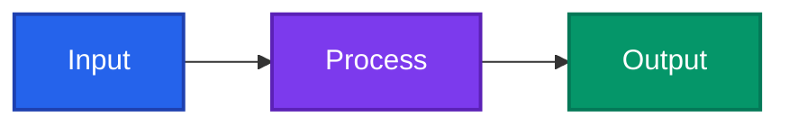
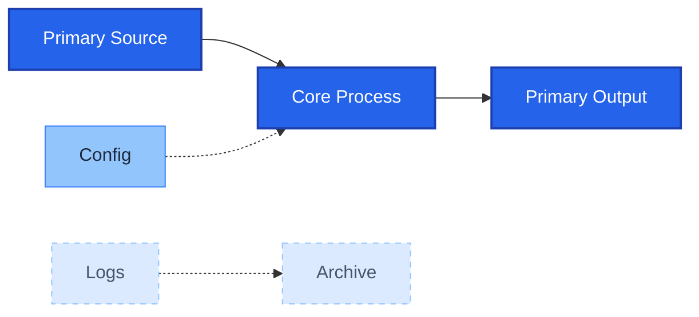
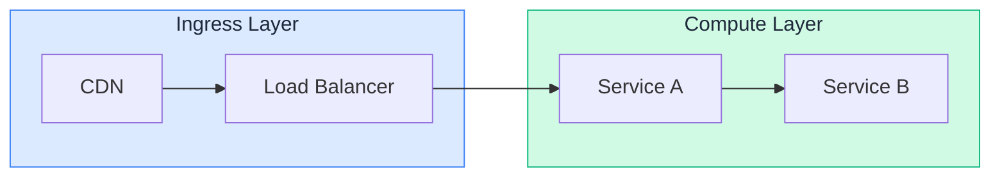

# Mermaid Color Theming Reference

Techniques for creating visually rich, information-dense Mermaid diagrams using
systematic color encoding. Covers HSL-based category systems, dual-theme safety,
visual hierarchy, and subgraph coloring.

> **This file is the conceptual core of the color-theming family.** Two
> companions hold the depth, split out to keep each file navigable:
> - [`color_palette_recipes.md`](color_palette_recipes.md) — the copy-paste
>   catalog: four palette recipes, a worked example, and the Tailwind hex lookup.
> - [`color_host_themed_renderers.md`](color_host_themed_renderers.md) — the
>   translucent dual-theme technique for host-themed renderers (e.g. Material
>   for MkDocs).

---

## 1. Core Syntax Recap

### classDef + class



### Shorthand `:::` operator

Apply during node declaration: `A:::className`

### Direct `style` directive

```
style nodeId fill:#f9f,stroke:#333,stroke-width:4px
```

### Available style properties

| Property | Purpose | Example |
|----------|---------|---------|
| `fill` | Node background color | `fill:#2563eb` |
| `color` | Text/label color | `color:#fff` |
| `stroke` | Border color | `stroke:#1e40af` |
| `stroke-width` | Border thickness | `stroke-width:2px` |
| `stroke-dasharray` | Dashed borders | `stroke-dasharray:5 5` |
| `font-weight` | Text weight | `font-weight:bold` |
| `font-size` | Text size | `font-size:14px` |

**Format rule**: Mermaid only recognizes hex colors (`#rrggbb` or `#rrggbbaa`), not
named colors. Named colors (e.g., `red`, `blue`) work in some renderers but fail in
others. Always use hex.

---

## 2. HSL-Based Color Encoding System

### Theory: Three Visual Channels

Color has three perceptual dimensions that can encode different data types:

| Channel | Encodes | Perception |
|---------|---------|------------|
| **Hue** (H) | Category/type (nominal) | "What kind?" -- no inherent order |
| **Saturation** (S) | Importance/prominence (ordinal) | Higher = more important |
| **Lightness** (L) | Rank/depth within category (ordinal) | Darker = primary/deeper |

### Mapping to Diagram Roles

Assign each **category** (input, process, output, storage, external) a distinct
**hue family**. Within each family, vary saturation and lightness to encode
**prominence** (primary vs. secondary vs. background):

```
Category        Hue Family     Primary (high-S, low-L)    Secondary (mid-S, mid-L)    Background (low-S, high-L)
-------         ----------     -----------------------    ------------------------    --------------------------
Input/Source    Blue (210-220)  hsl(217, 91%, 60%)         hsl(217, 60%, 68%)          hsl(217, 30%, 85%)
Process/Logic   Violet (270)    hsl(271, 81%, 56%)         hsl(271, 55%, 68%)          hsl(271, 30%, 85%)
Output/Sink     Emerald (160)   hsl(160, 84%, 39%)         hsl(160, 55%, 55%)          hsl(160, 25%, 82%)
Storage/Data    Amber (38-45)   hsl(38, 92%, 50%)          hsl(38, 65%, 62%)           hsl(38, 30%, 85%)
Error/Danger    Red (0-4)       hsl(0, 84%, 60%)           hsl(0, 60%, 68%)            hsl(0, 30%, 85%)
External/API    Slate (215)     hsl(215, 14%, 34%)         hsl(215, 14%, 50%)          hsl(215, 14%, 75%)
```

### Converting to Hex for classDef

HSL values must be converted to hex for Mermaid. The Tailwind CSS palette provides
pre-converted values that follow this HSL progression naturally. Throughout this
document, all hex values are sourced from Tailwind v3 for consistency.

---

## 3. Light Mode + Dark Mode Safety

### The Core Problem

Mermaid's default `color` (text) changes with the active theme:
- **Light theme**: dark text on light backgrounds
- **Dark theme**: light text on dark backgrounds

When you set a custom `fill:` without setting `color:`, the theme's default text
color may clash with your chosen background. A dark fill + dark default text (light
mode) or a light fill + light default text (dark mode) becomes unreadable.

### The Rule: Always Pair `fill:` with `color:`

Never rely on the theme's default text color. Every `classDef` should explicitly
declare both `fill` and `color`:

```
%% WRONG -- text color depends on theme, may become invisible
classDef bad fill:#1e40af

%% CORRECT -- explicit text color, safe in any theme
classDef good fill:#1e40af,color:#fff,stroke:#1e3a8a
```

> **Exception — host-themed renderers (Material for MkDocs).** Some integrations
> *force* the label text colour from the page theme and **ignore your `color:`**
> (re-theming it when the reader flips light/dark). There, pairing a `color:` is
> futile — you must instead anchor to the host's text and make the **fill
> translucent** so the page background tints it. See
> [host-themed renderers](color_host_themed_renderers.md).

### Safe Background + Text Pairings

**Dark backgrounds with white text** (works in both themes):

| Fill | Stroke | Color | Notes |
|------|--------|-------|-------|
| `#1e40af` (blue-800) | `#1e3a8a` (blue-900) | `#fff` | Deep blue, high contrast |
| `#2563eb` (blue-600) | `#1e40af` (blue-800) | `#fff` | Medium blue, vivid |
| `#047857` (emerald-700) | `#065f46` | `#fff` | Forest green |
| `#b91c1c` (red-700) | `#991b1b` | `#fff` | Deep red |
| `#7c3aed` (violet-600) | `#6d28d9` (violet-700) | `#fff` | Purple |
| `#334155` (slate-700) | `#1e293b` (slate-800) | `#fff` | Neutral dark |

**Light backgrounds with dark text** (works in both themes):

| Fill | Stroke | Color | Notes |
|------|--------|-------|-------|
| `#dbeafe` (blue-100) | `#3b82f6` (blue-500) | `#1e293b` | Pale blue |
| `#d1fae5` (emerald-100) | `#10b981` (emerald-500) | `#1e293b` | Pale green |
| `#fef3c7` (amber-100) | `#f59e0b` (amber-500) | `#1e293b` | Pale amber |
| `#fecaca` (red-100) | `#ef4444` (red-500) | `#1e293b` | Pale red |
| `#f1f5f9` (slate-100) | `#94a3b8` (slate-400) | `#1e293b` | Neutral light |

**The "safe middle ground" range**: Fill colors in the 400-600 Tailwind shade range
with `color:#fff` maintain readable contrast in both light and dark themes. Shades
lighter than 300 need `color:#1e293b` (dark text). Shades darker than 700 always
work with `color:#fff`.

### WCAG Contrast Minimums

- **Normal text on fill**: 4.5:1 contrast ratio minimum (WCAG AA)
- **Large text (18px+ or 14px bold)**: 3:1 minimum
- **Non-text elements** (borders, icons): 3:1 against adjacent colors

White (`#fff`) on `#2563eb` (blue-600) = ~4.6:1 -- passes AA.
White (`#fff`) on `#3b82f6` (blue-500) = ~3.1:1 -- fails AA for normal text.
Dark (`#1e293b`) on `#93c5fd` (blue-300) = ~5.2:1 -- passes AA.

**Rule of thumb**: For white text, use Tailwind shade 600+ fills. For dark text,
use Tailwind shade 300 or lighter fills.

---

## 4. Visual Hierarchy Techniques

### Prominent vs. Background Elements

The key to information-dense diagrams is making primary flow elements "pop" while
supporting elements recede:



### Emphasis Channels Beyond Color

| Technique | Effect | classDef syntax |
|-----------|--------|-----------------|
| Thick border | Draws eye to node | `stroke-width:3px` |
| Thin border | Node recedes | `stroke-width:1px` |
| Dashed border | "Optional" or "async" | `stroke-dasharray:5 5` |
| Bold text | Emphasizes label | `font-weight:bold` |
| Larger text | Heading nodes | `font-size:16px` |

### Three-Tier Hierarchy Pattern

Every category should have three tiers:

```
classDef bluePrimary   fill:#2563eb,stroke:#1e40af,color:#fff,stroke-width:2px,font-weight:bold
classDef blueSecondary fill:#93c5fd,stroke:#3b82f6,color:#1e293b,stroke-width:1px
classDef blueTertiary  fill:#dbeafe,stroke:#93c5fd,color:#475569,stroke-width:1px,stroke-dasharray:5 5
```

| Tier | Fill shade | Stroke shade | Text | Border | Use for |
|------|-----------|-------------|------|--------|---------|
| Primary | 600 | 800 | `#fff` | 2px solid | Main flow nodes |
| Secondary | 300 | 500 | `#1e293b` | 1px solid | Supporting nodes |
| Tertiary | 100 | 300 | `#475569` | 1px dashed | Background/config nodes |

---

## 5. Subgraph Coloring

### Method 1: classDef + class (recommended)



### Method 2: Direct `style` directive

```
style ingress fill:#dbeafe,stroke:#3b82f6,color:#1e293b
style compute fill:#d1fae5,stroke:#10b981,color:#1e293b
```

### Method 3: Transparent backgrounds via 8-digit hex

The last two hex digits control alpha/opacity. `00` = fully transparent, `ff` = fully
opaque. Intermediate values create semi-transparent overlays:

```
classDef sgTransparent fill:#3b82f620,stroke:#3b82f6,color:#1e293b
%%                              ^^ 20 = ~12% opacity -- very subtle tint
```

| Alpha suffix | Opacity | Use case |
|-------------|---------|----------|
| `00` | 0% | Invisible background (border only) |
| `10` | ~6% | Barely visible tint |
| `20` | ~12% | Subtle grouping hint |
| `33` | 20% | Light wash, good default |
| `66` | 40% | Visible but nodes still prominent |
| `99` | 60% | Strong tint, may overwhelm nodes |
| `ff` | 100% | Fully opaque (default) |

### Subgraph Best Practices

1. **Use pastel/light fills** -- shade 50-200 range or semi-transparent. Subgraph
   backgrounds should never compete with node fills for attention.

2. **Match stroke to the category hue** -- e.g., blue subgraph border with blue-500
   stroke while interior nodes use blue-600 fills.

3. **Subgraph label color** -- the `color` property in a subgraph classDef controls
   the subgraph title text. Use `#1e293b` (dark) for light subgraph fills or `#fff`
   for the rare dark subgraph fill.

4. **Invisible subgraph for pure grouping** (no visual border):
   ```
   classDef sgInvisible fill:#00000000,stroke-width:0
   class mySubgraph sgInvisible
   ```

---

## 6. Color Palette Recipes

Four ready-to-use palette recipes — **A** Software Architecture (cool tones),
**B** Data Flow / ETL (warm tones), **C** State / Workflow (semantic colors), and
**D** High-Density Knowledge Graph (8 distinct hues) — now live in
**[`color_palette_recipes.md`](color_palette_recipes.md)**. Each includes primary,
secondary, and subgraph variants in Tailwind v3 hex.

---

## 7. Complete Worked Example

A full software-architecture diagram applying Recipe A lives alongside the recipes
in **[`color_palette_recipes.md`](color_palette_recipes.md#worked-example)**.

---

## 8. Gotchas and Renderer Differences

### GitHub Markdown Rendering

- GitHub synchronizes Mermaid light/dark theme with the user's GitHub appearance
  setting. Custom `fill:` colors are static and do not adapt.
- **All Mermaid themes have contrast issues on GitHub**. The safest approach is to
  always set explicit `color:` on every `classDef` rather than relying on the theme.
- GitHub renders Mermaid inside iframes. External CSS cannot reach the diagram.
- Arrow colors default to dark gray in the "default" theme, which vanishes against
  GitHub's dark background. Avoid relying on edge visibility without `linkStyle`.

### VS Code Preview

- The `markdown-mermaid` extension allows separate theme configuration for VS Code
  light and dark modes (unlike GitHub, which auto-detects).
- Colors render identically to the Mermaid Live Editor in most cases.
- `htmlLabels: true` may be needed in some VS Code setups for `classDef` `color:`
  to apply correctly (especially in Quarto documents).

### mmdc (CLI)

- `mmdc` uses Puppeteer for headless rendering. Output closely matches browser
  rendering but is a static snapshot.
- Use `-t dark -b transparent` for dark-theme PNGs, `-t default -b white` for
  light-theme PNGs. Render both variants to verify colors.
- Long labels and wide diagrams are more likely to clip or wrap incorrectly in
  mmdc than in browser-based previews.

### Obsidian

- Obsidian uses its own Mermaid integration. `classDef` `color:` (text color)
  has historically had issues with dark mode. Always verify if text remains
  readable after theme changes.

### Material for MkDocs

- **The host theme forces the label text colour and overrides your `classDef`
  `color:`** — and re-themes it on every light/dark toggle. The "always pair
  `fill:` with `color:`" rule (§3) does **not** apply here; setting `color:` is a
  no-op. Use the translucent-fill technique in
  [`color_host_themed_renderers.md`](color_host_themed_renderers.md)
  instead, and audit with `mermaid_contrast.ts --profile mkdocs-material`.
- Material renders Mermaid as **inline SVG re-rendered on theme switch**, so the
  same diagram must read in both themes from one static source — exactly what the
  bleed-through palette guarantees.

### General Cross-Renderer Rules

1. **Only use hex colors** (`#rrggbb` or `#rrggbbaa`). Named colors (`red`, `blue`)
   may work in some renderers but silently fail in others.
2. **Always pair `fill:` with `color:`**. Never rely on theme-default text color.
3. **Test in both light and dark themes** before committing. Render with
   `mmdc -t default -b white` AND `mmdc -t dark -b transparent`.
4. **`stroke-dasharray` uses spaces, not commas** -- commas are property delimiters
   in classDef. Use `stroke-dasharray:5 5` not `stroke-dasharray:5,5`.
5. **8-digit hex opacity** (`#rrggbbaa`) works in modern Mermaid for transparent
   subgraph fills but may not render correctly in older integrations.
6. **Subgraph classDef** was fixed in Mermaid PR #1245 (Feb 2020) and PR #1730
   (Oct 2020). Older Mermaid versions (pre-8.9) may not support it. Use the `style`
   directive as a fallback for ancient renderers.

---

## 9. Tailwind v3 Hex Reference (Subset for Diagrams)

The Tailwind v3 hex lookup table (every shade used across this family, with its
typical diagram role) lives with the recipes it backs in
**[`color_palette_recipes.md`](color_palette_recipes.md#tailwind-v3-hex-reference-subset-for-diagrams)**.

The standard text colors used in all palettes:
- White text: `#fff`
- Dark text: `#1e293b` (slate-800)
- Muted text: `#475569` (slate-600)

---

## 10. linkStyle for Edge Coloring

Edges (arrows/connections) can be styled by index or as defaults:

```
%% Style a single edge (0-indexed, in order of appearance)
linkStyle 0 stroke:#3b82f6,stroke-width:2px

%% Style multiple edges
linkStyle 1,2,5 stroke:#ef4444,stroke-width:2px

%% Style all edges (default)
linkStyle default stroke:#94a3b8,stroke-width:1px
```

For visual hierarchy, make primary-flow edges thicker and colored, while
secondary/monitoring edges are thinner and gray:

```
%% Primary data flow (thick, colored)
linkStyle 0,1,2 stroke:#2563eb,stroke-width:2px

%% Secondary/monitoring edges (thin, muted)
linkStyle 3,4 stroke:#94a3b8,stroke-width:1px
```

---

## 11. Host-Themed Renderers: Translucent Dual-Theme Fills

Sections 1–10 assume **you** control the text colour (the GitHub/`mmdc` model: opaque
`fill` + explicit `color:`). Some integrations break that assumption — the **host page
theme controls the Mermaid label text** and re-themes it when the reader flips light/dark
(**Material for MkDocs** is the common case). There, pairing a `color:` is a no-op; the fix
is a **translucent fill** that the page background bleeds through, with the hue carried by an
opaque stroke.

The full method — compositing math, anchoring the host's text/bg via CSS variables, and the
verification gotchas — lives in
**[`color_host_themed_renderers.md`](color_host_themed_renderers.md)**.

## Sources

Research compiled from:
- [Mermaid Theme Configuration](https://mermaid.js.org/config/theming.html)
- [Mermaid Flowchart Syntax](https://mermaid.ai/open-source/syntax/flowchart.html)
- [beautiful-mermaid library](https://github.com/lukilabs/beautiful-mermaid) -- CSS `color-mix()` derivation system
- [Mermaid GitHub dark mode discussion](https://github.com/orgs/community/discussions/35733)
- [Accessible Mermaid Charts in GitHub](https://pulibrary.github.io/2023-03-29-accessible-mermaid)
- [Tailwind CSS v3 Colors](https://v3.tailwindcss.com/docs/customizing-colors)
- [WCAG Contrast Requirements](https://www.w3.org/WAI/WCAG21/Understanding/contrast-minimum.html)
- [Data Visualization Color Palettes Guide](https://www.datylon.com/blog/a-guide-to-data-visualization-color-palette)
- [Perceptually Uniform Color Spaces](https://programmingdesignsystems.com/color/perceptually-uniform-color-spaces/)
