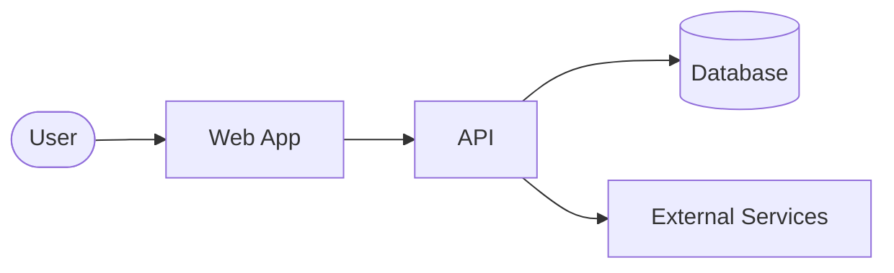
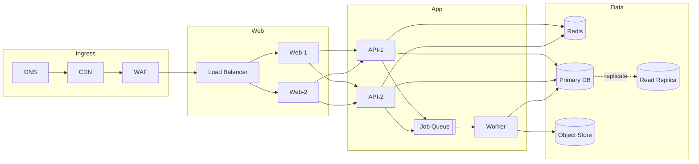

# Diagram Organization

Guidelines for generating and maintaining architecture diagrams across a
project. The primary pattern is **dual-density mermaid fences inlined into a
documentation markdown file** (typically `README.md` or a dedicated
`docs/architecture.md`), organized by **lens**.

## TL;DR

1. Pick **lenses** that answer real stakeholder questions
   (architecture / data-flow / deployment / security / sequence / state — not
   every project needs all of them).
2. For each lens, author **two** mermaid fences: a **simplified** overview
   (<=12 nodes, VCS <=25) that stays inline, and a **detailed** technical
   reference (<=35 nodes, VCS <=60) wrapped in `<details>` collapsible.
3. Validate both fences with `mermaid_complexity.ts path/to/readme.md` —
   treat any finding above the density budget as a split-the-lens signal.
4. GitHub and GitLab render mermaid fences natively — no PNG pre-render step
   is needed for the markdown-hosted case. Rendered PNGs are an optional
   export for slides / print / non-mermaid-aware viewers.

## Lenses (what to draw)

A **lens** is a perspective or view of the system. Each lens answers a
different question about the architecture:

| Lens | Purpose | Typical Content |
|------|---------|-----------------|
| `architecture` | System structure | Components, services, modules |
| `data-flow` | Information movement | Data paths, transformations |
| `deployment` | Infrastructure | Servers, containers, cloud services |
| `security` | Trust boundaries | Auth flows, encryption, access control |
| `sequence` | Interactions | API calls, user flows, processes |
| `state` | State machines | Statuses, transitions, workflows |

Choose lenses based on what stakeholders need to understand. Start with
`architecture` and add others as complexity demands — not every project needs
all six.

## The Inline Dual-Density Pattern (primary)

Each lens gets a README section containing both fences side-by-side. The
simplified fence is always visible; the detailed one is behind a collapsible:

````markdown
### System Overview



*High-level system components — user → web → api → db* | VCS: 8.5 ✅

<details>
<summary>📋 Complete diagram (32 nodes)</summary>



</details>
````

### Why this shape

- **Single source of truth.** Editing the fence updates the render
  immediately. No file → render → commit → link loop.
- **GitHub / GitLab render inline.** No PNG pre-render step is needed to make
  the README readable.
- **Density budget is visible.** The `VCS: 8.5 ✅` and `N nodes` annotations
  make the cognitive-load contract explicit.
- **Graceful disclosure.** The simplified fence is the narrative; the detailed
  fence is the reference. Readers self-select depth via the `<details>`
  toggle.
- **Skill tooling just works.** `mermaid_complexity.ts` and `mermaid_contrast.ts`
  both accept `.md` files and report per-fence line ranges.

### Section template

Copy this as the starting point for each lens section:

````markdown
### {Lens Name or Subsystem}

```mermaid
{simplified mermaid — <=12 nodes, narrative story}
```

*{One-line caption of what this shows}* | VCS: {X.X} ✅

<details>
<summary>📋 Complete diagram ({N} nodes)</summary>

```mermaid
{detailed mermaid — <=35 nodes, technical reference}
```

</details>
````

## Density Budgets

| Tier | Target nodes | Target VCS | Preset flag | Role |
|------|--------------|-----------|-------------|------|
| Simplified (overview) | <=12 | <=25 | `--preset low` | Always-visible narrative. README-friendly, readable in presentations and onboarding docs. |
| Detailed (reference) | <=35 | <=60 | `--preset high` *(default)* | Hidden behind `<details>`. Used for architecture reviews, debugging, deep-dive explanations. |

If either fence exceeds its tier's budget, **split the lens** rather than
relax the budget. See "When to split" below.

## Workflow: Generating Diagrams from a Codebase

Invoking this skill as part of codebase exploration. The loop per lens:

### 1. Enumerate components — via subagents and LSP

**Do not hold the whole codebase in the main agent's context.** Delegate
enumeration so the diagram-authoring agent can stay focused on layout,
naming, and layering.

Dispatch **one `Agent(subagent_type="Explore")` per lens in parallel** (single
message, multiple `Agent` tool uses). Each subagent returns a structured
≤500-word report — a component list, edge list, and external integrations —
**not raw code**.

Inside each subagent, prefer the **`lsp` skill** when available. LSP gives
language-server-backed symbol enumeration, cross-references (which map
directly to diagram edges), and impact analysis (which surfaces coupling
strength). Fall back to `Grep` / `Glob` only where LSP can't reach (shell,
config, IaC).

| Lens | Primary LSP queries | Fallback |
|------|---------------------|---------|
| `architecture` | Top-level symbols, module boundaries, public exports | `Glob` for directory tree |
| `data-flow` | References for each I/O helper (DB client, HTTP client, event bus) | `Grep` for `fetch`/`requests`/SQL strings |
| `deployment` | — | `Glob` + read for Dockerfiles, Terraform, `*.yaml` manifests |
| `security` | References to auth/crypto helpers, middleware symbols | `Grep` for decorators, middleware wiring |
| `sequence` | Call graph for an entry-point symbol | `Grep` for route/handler decorators |
| `state` | Enum / state-machine symbols and their transition call sites | `Grep` for state-constant usage |

Report categories to extract:

- Entry points (CLI commands, HTTP routes, message handlers)
- Core services / modules / packages
- Data stores (DBs, caches, queues, object stores)
- External integrations (SaaS APIs, cloud services)
- Infrastructure boundaries (trust zones, network segments)

**When LSP is unavailable for the language**, the `lsp` skill will say so
explicitly — surface that to the user and note that grep-based fallback may
undercount edges (method dispatch, dynamic imports, and renames are the
usual misses). Do not silently proceed as if the grep result is
authoritative.

### 2. Draft the detailed fence first

Aim for <=35 nodes. Techniques:

- Group with `subgraph` blocks by responsibility (e.g. `Ingress`, `App`,
  `Data`), not by file-system layout.
- Use edge labels (`-->|label|`) for what travels between nodes (HTTP
  request, Kafka event, SQL query, gRPC call).
- Add `classDef` styles to color-code by lifecycle or ownership tier.
- Use the `elk` layout for dense graphs:
  ```mermaid
  ---
  config:
    layout: elk
    elk: { mergeEdges: true, nodePlacementStrategy: BRANDES_KOEPF }
  ---
  ```
  (See `resources/layout_algorithms.md` for full layout/look config.)

### 3. Collapse to the simplified fence

Drop from ~35 nodes to <=12 by:

- Replacing each `subgraph` with a single representative node.
- Keeping only edges that cross subgraph boundaries — internal wiring
  disappears.
- Removing labels on redundant edges (multi-edges between same pair collapse
  to one).
- Keeping the top-level **narrative**: which actor initiates, which systems
  are primary, what the output is.

### 4. Validate

From project root:

```bash
# Complexity — both fences must stay within their density budget
bun run .claude/skills/mermaidjs_diagrams/scripts/mermaid_complexity.ts README.md

# If you used custom classDef/style color schemes, audit WCAG contrast
bun run .claude/skills/mermaidjs_diagrams/scripts/mermaid_contrast.ts README.md
```

Either command exiting non-zero means "stop and fix" — either shrink the
fence, split the lens further, or adjust the color palette. Findings surface
per-fence with line ranges, so fixes land on the right block.

### 5. Render PNGs (optional)

Only needed for contexts that can't display mermaid (PDFs, slide decks,
wikis without mermaid support):

```bash
bash .claude/skills/mermaidjs_diagrams/scripts/render_mermaid.sh README.md
```

Output lands in `.mmdc_cache/{variant}/`. Do **not** link these PNGs from
the README that contains the fences — you'd end up with doubled renders.

## When to Split a Lens

If the detailed fence of a single lens exceeds 35 nodes or VCS 60, subdivide
it into multiple sub-diagrams. Example: an architecture diagram that would
naturally have 50 nodes (VCS≈159, **critical**) becomes:

| Section | Nodes | Role |
|---------|-------|------|
| **Architecture — Overview** | ~8 | Always-visible, <=12 nodes, `low` preset |
| **Architecture — API subsystem (detail)** | ~15 | One section, collapsed, `high` preset |
| **Architecture — Agents subsystem (detail)** | ~12 | One section, collapsed, `high` preset |
| **Architecture — Storage subsystem (detail)** | ~10 | One section, collapsed, `high` preset |

Each subsystem gets its own `### Architecture — {subsystem}` section in the
README with the same dual-density template. The top-level architecture
overview shows each subsystem as a single node and links (via anchor) to its
subsection.

## Placement Guidance

- **Primary home**: the top-level `README.md` of the project, in a
  `## Architecture` or `## Diagrams` section.
- **Alternative home**: a dedicated `docs/architecture.md` linked from the
  README when the README is already long.
- **Avoid**: splitting diagrams across many tiny files under `docs/diagrams/`
  (the old pattern — see "Legacy" below). It fragments the narrative and
  makes `mermaid_complexity.ts` less useful as a single-file gate.

## Legacy: File-per-Diagram Pattern

The prior pattern — one `.mmd` file per diagram under `docs/diagrams/` with
PNG renders linked from the README — is still supported when:

- The renderer hosting the documentation cannot handle inline mermaid fences
  (some static-site generators, some corporate wikis).
- You need binary PNG artifacts as the canonical, version-controlled
  rendered form (e.g. for embedding in review PDFs).
- Different audiences need different per-diagram landing pages.

File naming convention:

```
docs/diagrams/
├── architecture--overview.md
├── architecture--detail.md
├── architecture--api--detail.md
├── data-flow--overview.md
└── sequence--auth--detail.md
```

Format: `{lens}--[{subsystem}--]{scope}.md` where `{scope}` is `overview` or
`detail`. The README then links **rendered PNGs**, not the source `.md`
files:

```markdown

*High-level components* | [Source](docs/diagrams/architecture--overview.md)
```

This pattern still interoperates with `mermaid_complexity.ts` (point it at
`docs/diagrams/`). It's just noisier to maintain than the inline approach.
