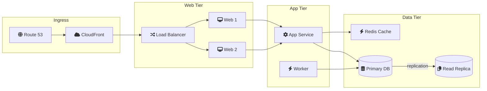

```mermaid
architecture-beta
    group ingress(logos:aws)[Ingress]
        service dns(logos:aws-route53)[Route 53] in ingress
        service cdn(logos:aws-cloudfront)[CloudFront] in ingress

    group web(logos:aws-elb)[Web Tier]
        service alb(logos:aws-elb)[Load Balancer] in web
        service server(logos:aws-ec2)[Web Servers] in web

    group app(logos:aws-ecs)[App Tier]
        service worker(logos:aws-lambda)[Worker] in app
        service api(logos:aws-ecs)[App Service] in app

    group data(logos:aws-rds)[Data Tier]
        service cache(logos:aws-elasticache)[Redis Cache] in data
        service db(logos:aws-rds)[Primary DB] in data
        service replica(logos:aws-rds)[Read Replica] in data

    dns:R -[request]-> L:cdn
    cdn:R -[route]-> L:alb
    alb:R -[forward]-> L:server
    server:R -[dispatch]-> L:worker
    worker:R -[process]-> L:api
    api:R -[read]-> L:cache
    cache:R -[query]-> L:db
    db:R -[replicate]-> L:replica
```

# Examples

<!--TOC-->

- [Examples](#examples)
  - [architecture_beta_iconify_logos](#architecture_beta_iconify_logos)
    - [Code](#code)
    - [Mermaid](#mermaid)
    - [Image (PNG)](#image-png)
  - [flowchart_fontawesome_icons](#flowchart_fontawesome_icons)
    - [Code](#code-1)
    - [Mermaid](#mermaid-1)
    - [Image (PNG)](#image-png-1)
  - [Mermaid Version Information Debugging](#mermaid-version-information-debugging)
    - [Code](#code-2)
    - [Mermaid](#mermaid-2)

<!--TOC-->

## architecture_beta_iconify_logos

### Code

```text
architecture-beta
    group ingress(logos:aws)[Ingress]
        service dns(logos:aws-route53)[Route 53] in ingress
        service cdn(logos:aws-cloudfront)[CloudFront] in ingress

    group web(logos:aws-elb)[Web Tier]
        service alb(logos:aws-elb)[Load Balancer] in web
        service server(logos:aws-ec2)[Web Servers] in web

    group app(logos:aws-ecs)[App Tier]
        service worker(logos:aws-lambda)[Worker] in app
        service api(logos:aws-ecs)[App Service] in app

    group data(logos:aws-rds)[Data Tier]
        service cache(logos:aws-elasticache)[Redis Cache] in data
        service db(logos:aws-rds)[Primary DB] in data
        service replica(logos:aws-rds)[Read Replica] in data

    dns:R -[request]-> L:cdn
    cdn:R -[route]-> L:alb
    alb:R -[forward]-> L:server
    server:R -[dispatch]-> L:worker
    worker:R -[process]-> L:api
    api:R -[read]-> L:cache
    cache:R -[query]-> L:db
    db:R -[replicate]-> L:replica
```

### Mermaid



### Image (PNG)


---

## flowchart_fontawesome_icons

### Code

```text
flowchart LR
    subgraph Ingress
        dns["fa:fa-globe Route 53"]
        cdn["fa:fa-cloud CloudFront"]
    end
    subgraph web["Web Tier"]
        alb["fa:fa-random Load Balancer"]
        web1["fa:fa-desktop Web 1"]
        web2["fa:fa-desktop Web 2"]
    end
    subgraph app["App Tier"]
        api["fa:fa-cog App Service"]
        worker["fa:fa-bolt Worker"]
    end
    subgraph data["Data Tier"]
        cache["fa:fa-bolt Redis Cache"]
        db[("fa:fa-database Primary DB")]
        replica[("fa:fa-copy Read Replica")]
    end

    dns --> cdn
    cdn --> alb
    alb --> web1
    alb --> web2
    web1 --> api
    web2 --> api
    api --> cache
    api --> db
    worker --> db
    db -- replication --> replica
```

### Mermaid



### Image (PNG)


---
## Mermaid Version Information Debugging

### Code


````
```mermaid
    info
```
````


### Mermaid

```mermaid
  info
```