# Examples

---

<details>
<summary><b>Table of Contents</b></summary>
<!--TOC-->

- [Examples](#examples)
  - [architecture_beta_iconify_logos](#architecture_beta_iconify_logos)
    - [Code](#code)
    - [Mermaid](#mermaid)
    - [Image (PNG)](#image-png)
  - [flowchart_fontawesome_icons](#flowchart_fontawesome_icons)
    - [Code](#code-1)
    - [Mermaid](#mermaid-1)
    - [Image (PNG)](#image-png-1)
  - [layout_dagre_classic](#layout_dagre_classic)
    - [Code](#code-2)
    - [Mermaid](#mermaid-2)
    - [Image (PNG)](#image-png-2)
  - [layout_dagre_handdrawn](#layout_dagre_handdrawn)
    - [Code](#code-3)
    - [Mermaid](#mermaid-3)
    - [Image (PNG)](#image-png-3)
  - [layout_dagre_neo](#layout_dagre_neo)
    - [Code](#code-4)
    - [Mermaid](#mermaid-4)
    - [Image (PNG)](#image-png-4)
  - [layout_elk_default](#layout_elk_default)
    - [Code](#code-5)
    - [Mermaid](#mermaid-5)
    - [Image (PNG)](#image-png-5)
  - [layout_elk_tuned](#layout_elk_tuned)
    - [Code](#code-6)
    - [Mermaid](#mermaid-6)
    - [Image (PNG)](#image-png-6)
  - [layout_tidytree_mindmap](#layout_tidytree_mindmap)
    - [Code](#code-7)
    - [Mermaid](#mermaid-7)
    - [Image (PNG)](#image-png-7)
  - [Mermaid Version Information Debugging](#mermaid-version-information-debugging)
    - [Code](#code-8)
    - [Mermaid](#mermaid-8)

<!--TOC-->
</details>

---

## architecture_beta_iconify_logos

### Code

```text
architecture-beta
    group ingress(logos:aws)[Ingress]
        service dns(logos:aws-route53)[Route 53] in ingress
        service cdn(logos:aws-cloudfront)[CloudFront] in ingress

    group web(logos:aws-elb)[Web Tier]
        service alb(logos:aws-elb)[Load Balancer] in web
        service server(logos:aws-ec2)[Web Servers] in web

    group app(logos:aws-ecs)[App Tier]
        service worker(logos:aws-lambda)[Worker] in app
        service api(logos:aws-ecs)[App Service] in app

    group data(logos:aws-rds)[Data Tier]
        service cache(logos:aws-elasticache)[Redis Cache] in data
        service db(logos:aws-rds)[Primary DB] in data
        service replica(logos:aws-rds)[Read Replica] in data

    dns:R -[request]-> L:cdn
    cdn:R -[route]-> L:alb
    alb:R -[forward]-> L:server
    server:R -[dispatch]-> L:worker
    worker:R -[process]-> L:api
    api:R -[read]-> L:cache
    cache:R -[query]-> L:db
    db:R -[replicate]-> L:replica
```

### Mermaid

```mermaid
architecture-beta
    group ingress(logos:aws)[Ingress]
        service dns(logos:aws-route53)[Route 53] in ingress
        service cdn(logos:aws-cloudfront)[CloudFront] in ingress

    group web(logos:aws-elb)[Web Tier]
        service alb(logos:aws-elb)[Load Balancer] in web
        service server(logos:aws-ec2)[Web Servers] in web

    group app(logos:aws-ecs)[App Tier]
        service worker(logos:aws-lambda)[Worker] in app
        service api(logos:aws-ecs)[App Service] in app

    group data(logos:aws-rds)[Data Tier]
        service cache(logos:aws-elasticache)[Redis Cache] in data
        service db(logos:aws-rds)[Primary DB] in data
        service replica(logos:aws-rds)[Read Replica] in data

    dns:R -[request]-> L:cdn
    cdn:R -[route]-> L:alb
    alb:R -[forward]-> L:server
    server:R -[dispatch]-> L:worker
    worker:R -[process]-> L:api
    api:R -[read]-> L:cache
    cache:R -[query]-> L:db
    db:R -[replicate]-> L:replica
```

### Image (PNG)

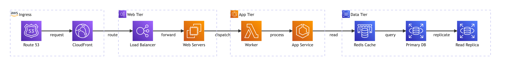

---

## flowchart_fontawesome_icons

### Code

```text
flowchart LR
    subgraph Ingress
        dns["fa:fa-globe Route 53"]
        cdn["fa:fa-cloud CloudFront"]
    end
    subgraph web["Web Tier"]
        alb["fa:fa-random Load Balancer"]
        web1["fa:fa-desktop Web 1"]
        web2["fa:fa-desktop Web 2"]
    end
    subgraph app["App Tier"]
        api["fa:fa-cog App Service"]
        worker["fa:fa-bolt Worker"]
    end
    subgraph data["Data Tier"]
        cache["fa:fa-bolt Redis Cache"]
        db[("fa:fa-database Primary DB")]
        replica[("fa:fa-copy Read Replica")]
    end

    dns --> cdn
    cdn --> alb
    alb --> web1
    alb --> web2
    web1 --> api
    web2 --> api
    api --> cache
    api --> db
    worker --> db
    db -- replication --> replica
```

### Mermaid

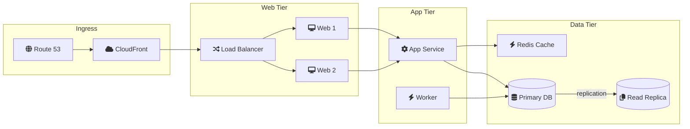

### Image (PNG)

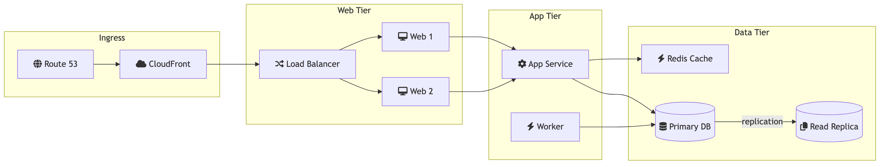

---

## layout_dagre_classic

### Code

```text
---
config:
  layout: dagre
  look: classic
  theme: default
---
flowchart LR
    user([User]) --> edge[CDN / Edge]
    edge --> lb[Load Balancer]
    lb --> api1[API Server 1]
    lb --> api2[API Server 2]
    api1 --> cache[(Cache)]
    api2 --> cache
    api1 --> db[(Primary DB)]
    api2 --> db
    api1 --> queue[[Job Queue]]
    api2 --> queue
    queue --> worker[Worker]
    worker --> db
    worker --> store[(Object Store)]
    db -. replicate .-> replica[(Read Replica)]
```

### Mermaid

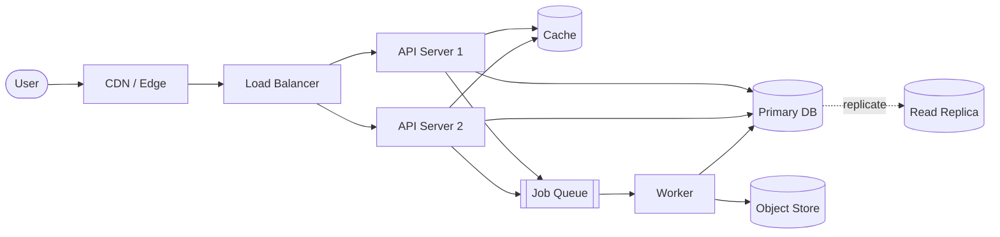

### Image (PNG)

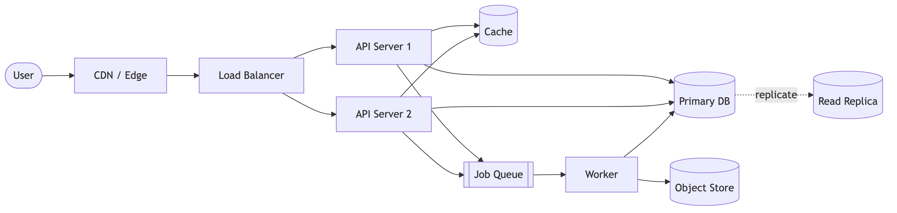

---

## layout_dagre_handdrawn

### Code

```text
---
config:
  layout: dagre
  look: handDrawn
  handDrawnSeed: 1
  theme: default
---
flowchart LR
    user([User]) --> edge[CDN / Edge]
    edge --> lb[Load Balancer]
    lb --> api1[API Server 1]
    lb --> api2[API Server 2]
    api1 --> cache[(Cache)]
    api2 --> cache
    api1 --> db[(Primary DB)]
    api2 --> db
    api1 --> queue[[Job Queue]]
    api2 --> queue
    queue --> worker[Worker]
    worker --> db
    worker --> store[(Object Store)]
    db -. replicate .-> replica[(Read Replica)]
```

### Mermaid

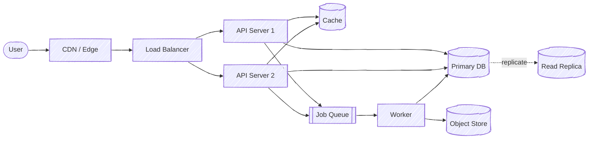

### Image (PNG)

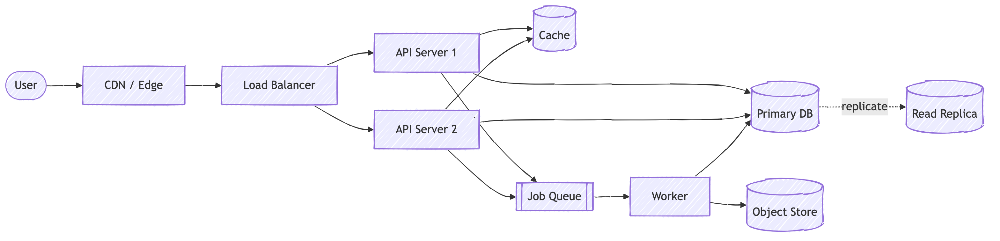

---

## layout_dagre_neo

### Code

```text
---
config:
  layout: dagre
  look: neo
  theme: default
  useGradient: true
  gradientStart: "#ede9fe"
  gradientStop: "#a78bfa"
  dropShadow: true
---
flowchart LR
    user([User]) --> edge[CDN / Edge]
    edge --> lb[Load Balancer]
    lb --> api1[API Server 1]
    lb --> api2[API Server 2]
    api1 --> cache[(Cache)]
    api2 --> cache
    api1 --> db[(Primary DB)]
    api2 --> db
    api1 --> queue[[Job Queue]]
    api2 --> queue
    queue --> worker[Worker]
    worker --> db
    worker --> store[(Object Store)]
    db -. replicate .-> replica[(Read Replica)]
```

### Mermaid

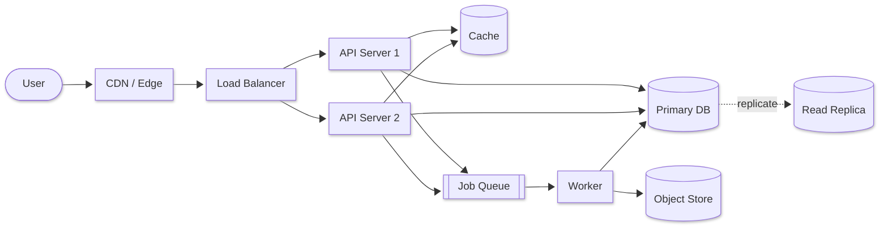

### Image (PNG)


---

## layout_elk_default

### Code

```text
---
config:
  layout: elk
  look: classic
  theme: default
---
flowchart LR
    user([User]) --> edge[CDN / Edge]
    edge --> lb[Load Balancer]
    lb --> api1[API Server 1]
    lb --> api2[API Server 2]
    api1 --> cache[(Cache)]
    api2 --> cache
    api1 --> db[(Primary DB)]
    api2 --> db
    api1 --> queue[[Job Queue]]
    api2 --> queue
    queue --> worker[Worker]
    worker --> db
    worker --> store[(Object Store)]
    db -. replicate .-> replica[(Read Replica)]
```

### Mermaid

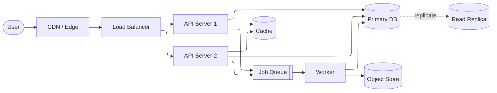

### Image (PNG)


---

## layout_elk_tuned

### Code

```text
---
config:
  layout: elk
  look: classic
  theme: default
  elk:
    mergeEdges: true
    nodePlacementStrategy: LINEAR_SEGMENTS
---
flowchart LR
    user([User]) --> edge[CDN / Edge]
    edge --> lb[Load Balancer]
    lb --> api1[API Server 1]
    lb --> api2[API Server 2]
    api1 --> cache[(Cache)]
    api2 --> cache
    api1 --> db[(Primary DB)]
    api2 --> db
    api1 --> queue[[Job Queue]]
    api2 --> queue
    queue --> worker[Worker]
    worker --> db
    worker --> store[(Object Store)]
    db -. replicate .-> replica[(Read Replica)]
```

### Mermaid

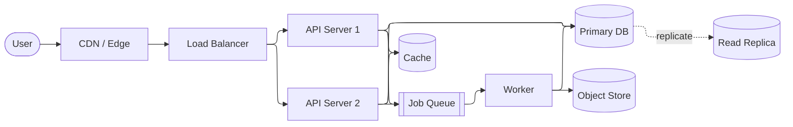

### Image (PNG)

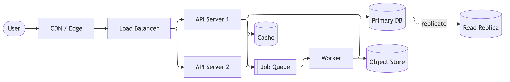

---

## layout_tidytree_mindmap

### Code

```text
---
config:
  layout: tidy-tree
  look: classic
  theme: default
---
mindmap
  root((System))
    Ingress
      CDN
      Load Balancer
    Compute
      API
      Worker
    Data
      Cache
      Primary DB
        Read Replica
      Object Store
```

### Mermaid

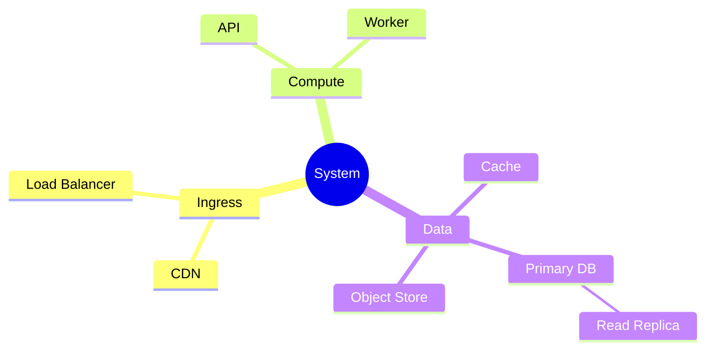

### Image (PNG)

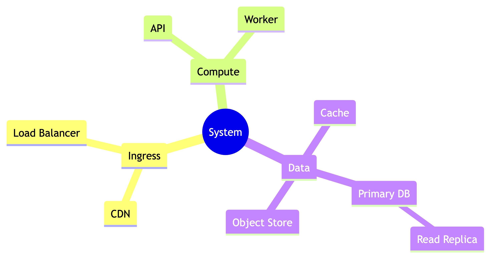

---
## Mermaid Version Information Debugging

### Code


````
```mermaid
    info
```
````


### Mermaid

```mermaid
  info
```