# Mermaid Complexity — Lint Test Fixtures

Each ```mermaid fence below is a named scenario designed to exercise one
specific `LintCode` produced by `scripts/mermaid_complexity.ts`. Run with the
**high-density preset** (the default) to see the expected findings:

```bash
bun run .claude/skills/mermaidjs_diagrams/scripts/mermaid_complexity.ts \
  .claude/skills/mermaidjs_diagrams/resources/examples/test_complexity.md
```

## Expected lint output

Under the default (high-density) preset — `node_acceptable=35`,
`node_complex=50`, `node_hard_limit=100`, `vcs_acceptable=60`,
`vcs_complex=100`:

| Scenario                            | Expected code                          | Severity |
|-------------------------------------|----------------------------------------|----------|
| Clean flowchart                     | *(no finding)*                         | —        |
| Clean architecture-beta             | *(no finding)*                         | —        |
| Nodes just over acceptable (36)     | `NodeCountExceedsAcceptable`           | warning  |
| Nodes at cognitive limit (51)       | `NodeCountExceedsCognitiveLimit`       | error    |
| Nodes beyond hard limit (120)       | `NodeCountExceedsHardLimit`            | error    |
| VCS over acceptable (edge-heavy)    | `VisualComplexityExceedsAcceptable`    | warning  |
| VCS beyond critical (very dense)    | `VisualComplexityExceedsCritical`      | error    |
| Subgraph nested 3 deep              | `SubgraphNestingTooDeep`               | warning  |
| JISON diagram with no DOM (block)   | `ParserFailure`                        | error    |
| Subdivision with named boundaries   | `NodeCountExceedsCognitiveLimit` +     | error    |
|                                     | boundaries populated                   |          |

Short-circuit rule: when `ParserFailure` fires on a diagram, no other codes
are emitted for that diagram — the parser couldn't read it, so threshold
checks against garbage metrics would be misleading.

---

## Canonical diagram-kind support matrix

Every Mermaid diagram kind the canonical parser supports has a clean fixture
in the file:

- **§1–§2** and **§11–§30**: clean, below-threshold — the linter MUST emit
  **no findings** for these fences. If any of them start flagging, either
  the upstream parser regressed or our extraction adapter drifted.
- **§3–§10**: threshold-violation scenarios — each is designed to trigger
  one specific `LintCode`. Expected findings are enumerated in the "Expected
  lint output" table above.

| Fence | Diagram kind | Parser path | Extraction adapter |
|-------|--------------|-------------|--------------------|
| §1    | `flowchart`          | mermaid-core | `adaptFlowchart` |
| §2    | `architecture-beta`  | langium      | `extractLangiumStats` |
| §11   | `classDiagram`       | mermaid-core | `adaptClass` |
| §12   | `sequenceDiagram`    | mermaid-core | `adaptSequence` |
| §13   | `stateDiagram-v2`    | mermaid-core | `adaptState` |
| §14   | `erDiagram`          | mermaid-core | `adaptEr` |
| §15   | `journey`            | mermaid-core | `adaptJourney` |
| §16   | `mindmap`            | mermaid-core | `adaptMindmap` |
| §17   | `gantt`              | mermaid-core | `adaptGantt` |
| §18   | `pie`                | langium      | `extractLangiumStats` |
| §19   | `timeline`           | mermaid-core | `adaptTimeline` |
| §20   | `xychart-beta`       | mermaid-core | `adaptXychart` |
| §21   | `sankey-beta`        | mermaid-core | `adaptSankey` |
| §22   | `quadrantChart`      | mermaid-core | `adaptQuadrantChart` |
| §23   | `block-beta`         | mermaid-core | `adaptBlock` |
| §24   | `C4Context`          | mermaid-core | `adaptC4` |
| §25   | `kanban`             | mermaid-core | `adaptKanban` |
| §26   | `gitGraph`           | langium      | `extractLangiumStats` |
| §27   | `packet-beta`        | langium      | `extractLangiumStats` |
| §28   | `radar-beta`         | langium      | `extractLangiumStats` |
| §29   | `treemap-beta`       | langium      | `extractLangiumStats` |
| §30   | `requirementDiagram` | mermaid-core | `adaptRequirement` |

---

## 1. Clean flowchart (no findings)

A small, readable diagram well under every threshold. The linter should emit
no findings for this fence.

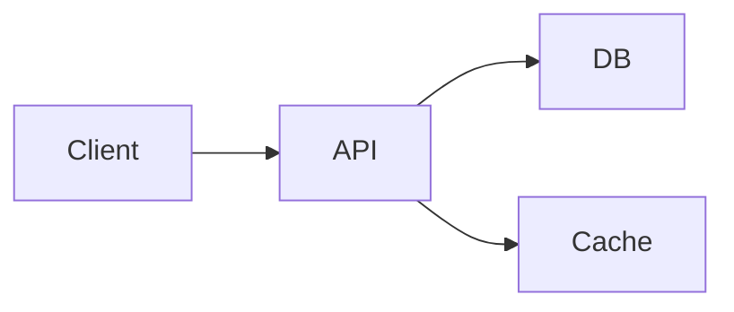

## 2. Clean architecture-beta (no findings)

Langium-parsed, small. Proves the architecture-beta path is quiet when the
diagram is within limits.

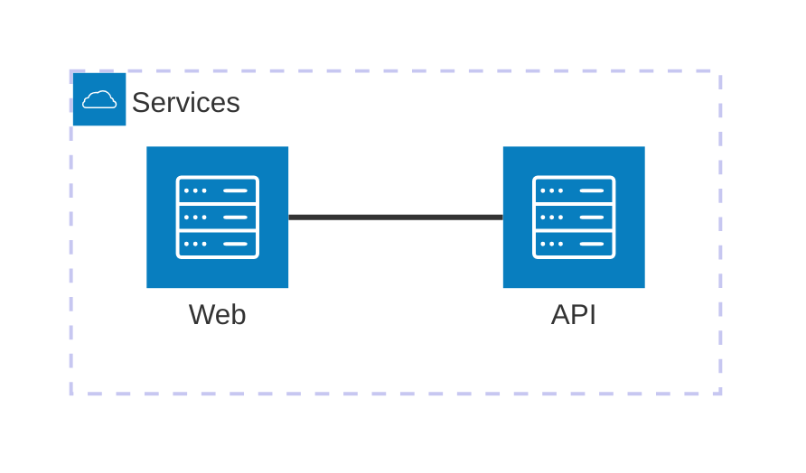

## 3. NodeCountExceedsAcceptable — 36 nodes, loosely connected

Just above the `node_acceptable=35` threshold. Expected: one
`NodeCountExceedsAcceptable` (warning). No VCS finding because edges are
sparse enough to keep VCS under `vcs_acceptable=60`.

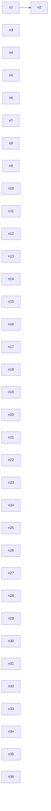

## 4. NodeCountExceedsCognitiveLimit — 51 nodes

Just above the 50-node Huang 2020 cognitive limit. Expected: one
`NodeCountExceedsCognitiveLimit` (error). Note the waterfall rule —
`NodeCountExceedsAcceptable` is NOT also emitted.

```mermaid
flowchart LR
  N1[n1]
  N2[n2]
  N3[n3]
  N4[n4]
  N5[n5]
  N6[n6]
  N7[n7]
  N8[n8]
  N9[n9]
  N10[n10]
  N11[n11]
  N12[n12]
  N13[n13]
  N14[n14]
  N15[n15]
  N16[n16]
  N17[n17]
  N18[n18]
  N19[n19]
  N20[n20]
  N21[n21]
  N22[n22]
  N23[n23]
  N24[n24]
  N25[n25]
  N26[n26]
  N27[n27]
  N28[n28]
  N29[n29]
  N30[n30]
  N31[n31]
  N32[n32]
  N33[n33]
  N34[n34]
  N35[n35]
  N36[n36]
  N37[n37]
  N38[n38]
  N39[n39]
  N40[n40]
  N41[n41]
  N42[n42]
  N43[n43]
  N44[n44]
  N45[n45]
  N46[n46]
  N47[n47]
  N48[n48]
  N49[n49]
  N50[n50]
  N51[n51]
```

## 5. NodeCountExceedsHardLimit — 120 nodes

Beyond any comprehensible diagram size. Expected:
`NodeCountExceedsHardLimit` (error) with remediation "split immediately".
Also fires `VisualComplexityExceedsCritical` because VCS = 120 > 100.


## 6. VisualComplexityExceedsAcceptable — edge-heavy, node-light

Node count (10) is fine, but 40 interconnecting edges push VCS past 60.
Expected: one `VisualComplexityExceedsAcceptable` (warning). No node-count
finding.

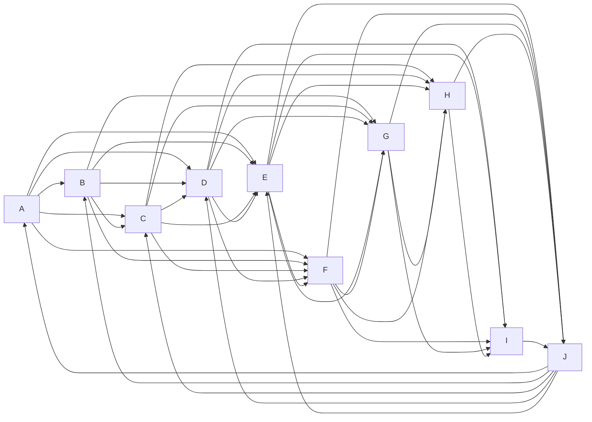

## 7. VisualComplexityExceedsCritical — very dense graph

Many nodes plus many edges. Expected: `VisualComplexityExceedsCritical`
(error), probably alongside `NodeCountExceedsCognitiveLimit` and
`NodeCountExceedsHardLimit` depending on size.

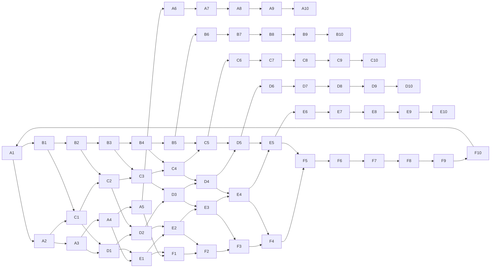

## 8. SubgraphNestingTooDeep — 3 levels deep

Structure is small (node count under any threshold) but subgraphs are
nested 3 deep. Expected: one `SubgraphNestingTooDeep` (warning).

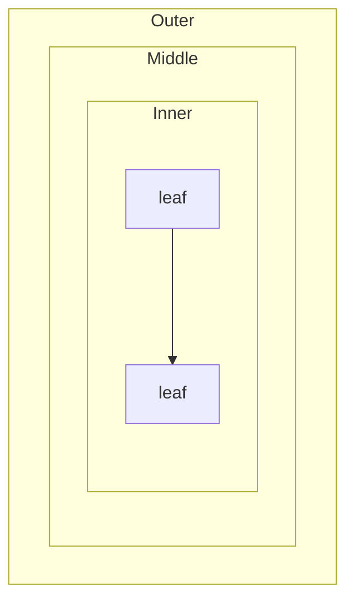

## 9. ParserFailure — JISON block diagram without DOM

`block` is a JISON-parsed diagram type that needs a real DOM to extract
structure. Headless Bun + happy-dom can't parse it → 0 nodes → ParserFailure.
Expected: one `ParserFailure` (error) and **no other codes** for this fence
(short-circuit rule).

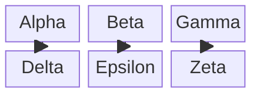

## 10. Subdivision with named boundaries — NodeCountExceedsCognitiveLimit + boundaries[]

Large flowchart with 4 named subgraphs. Expected:
`NodeCountExceedsCognitiveLimit` (error) where `boundaries` contains
["Ingress", "Web", "App", "Data"] so an LLM receiving the JSON can pick
split anchors by name, not by guesswork.

```mermaid
flowchart LR
  subgraph Ingress
    I1[i1] --> I2[i2] --> I3[i3] --> I4[i4]
    I4 --> I5[i5] --> I6[i6] --> I7[i7]
    I7 --> I8[i8] --> I9[i9] --> I10[i10]
    I10 --> I11[i11] --> I12[i12] --> I13[i13]
  end
  subgraph Web
    W1[w1] --> W2[w2] --> W3[w3] --> W4[w4]
    W4 --> W5[w5] --> W6[w6] --> W7[w7]
    W7 --> W8[w8] --> W9[w9] --> W10[w10]
    W10 --> W11[w11] --> W12[w12] --> W13[w13]
  end
  subgraph App
    P1[p1] --> P2[p2] --> P3[p3] --> P4[p4]
    P4 --> P5[p5] --> P6[p6] --> P7[p7]
    P7 --> P8[p8] --> P9[p9] --> P10[p10]
    P10 --> P11[p11] --> P12[p12] --> P13[p13]
  end
  subgraph Data
    D1[d1] --> D2[d2] --> D3[d3] --> D4[d4]
    D4 --> D5[d5] --> D6[d6] --> D7[d7]
    D7 --> D8[d8] --> D9[d9] --> D10[d10]
    D10 --> D11[d11] --> D12[d12] --> D13[d13]
  end
  I13 --> W1
  W13 --> P1
  P13 --> D1
```

---

## 11. Clean classDiagram (no findings)

`adaptClass` reads `db.classes` (Map) and `db.relations` (Array).

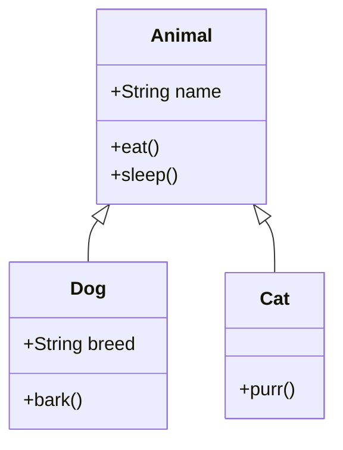

## 12. Clean sequenceDiagram (no findings)

`adaptSequence` reads `db.state.records.actors` (Map) and `db.state.records.messages` (Array).

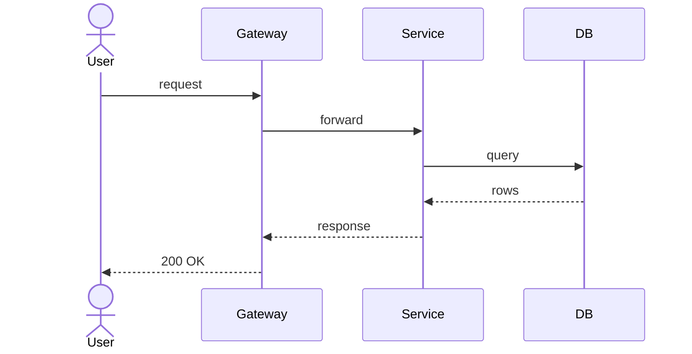

## 13. Clean stateDiagram-v2 (no findings)

`adaptState` reads the stateDiagram DB's nodes and links.

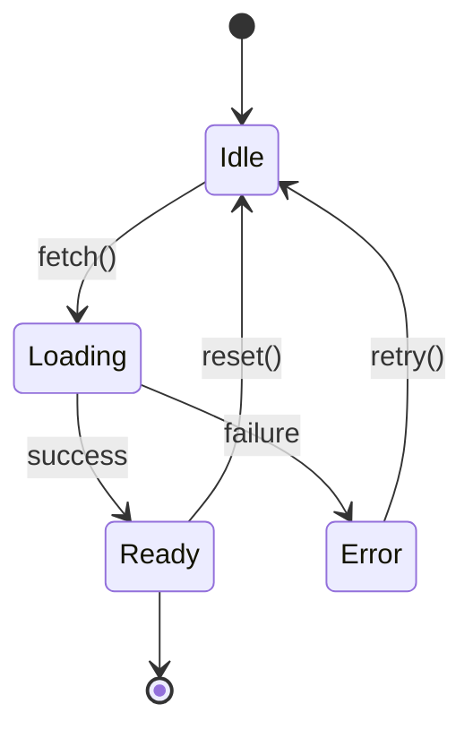

## 14. Clean erDiagram (no findings)

`adaptEr` reads `db.entities` (Map) and `db.relationships` (Array). ERDs parse
cleanly under headless Bun + happy-dom — the adapter extracts the entities
directly from the populated DB.

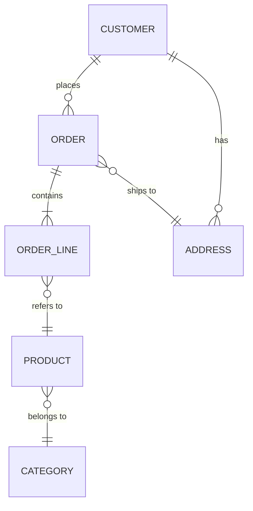

## 15. Clean journey diagram (no findings)

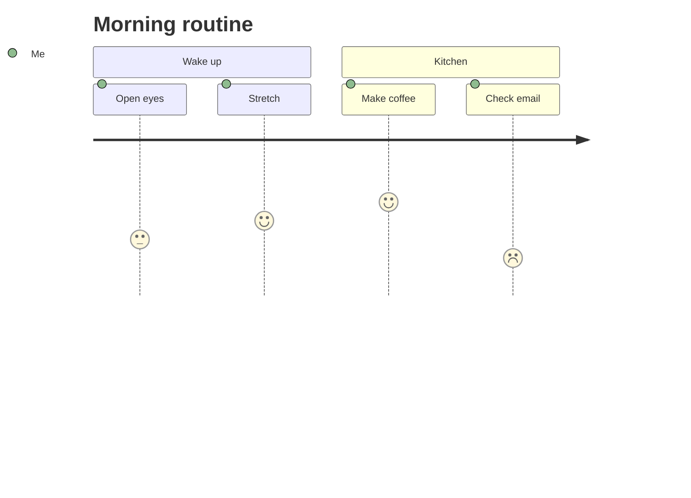

## 16. Clean mindmap (no findings)

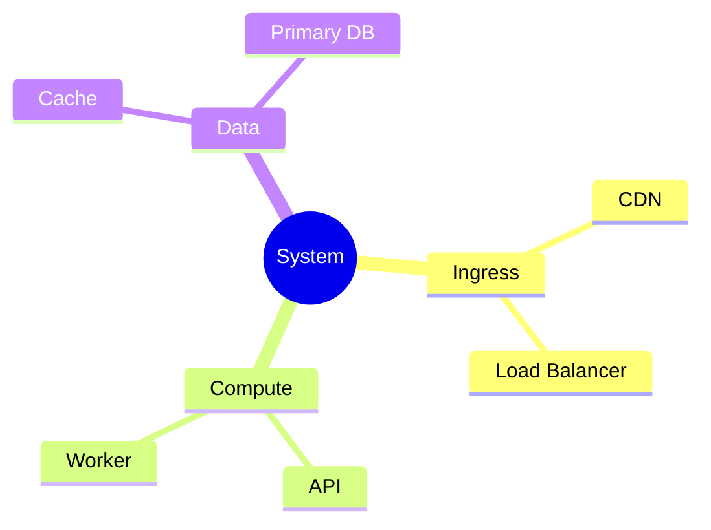

## 17. Clean gantt (no findings)

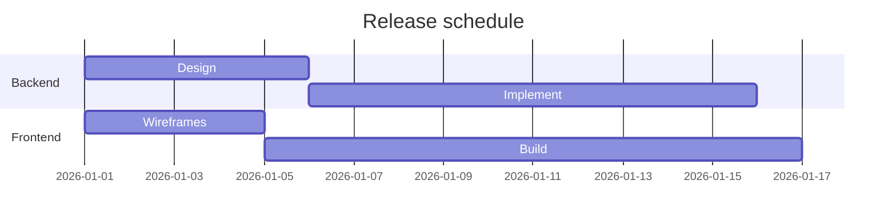

## 18. Clean pie (no findings)

Langium-parsed.

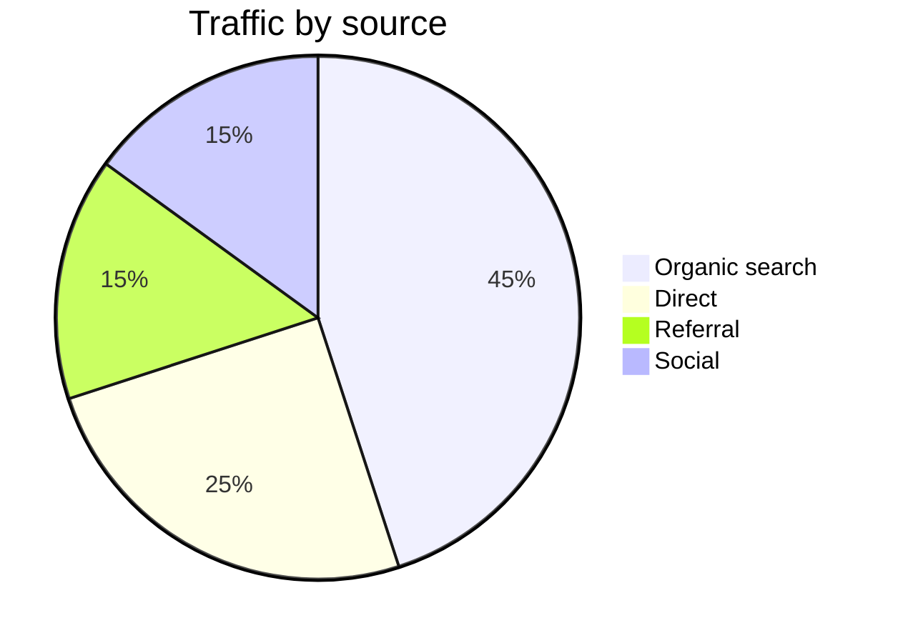

## 19. Clean timeline (no findings)

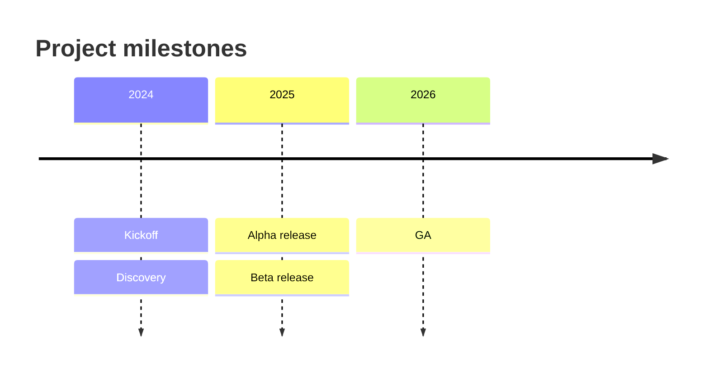

## 20. Clean xychart-beta (no findings)

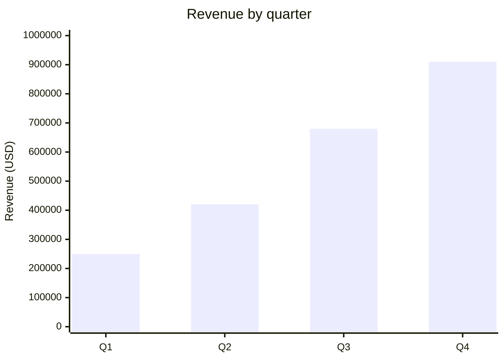

## 21. Clean sankey-beta (no findings)

```mermaid
sankey-beta

source,target,value
Revenue,Salaries,400
Revenue,Infrastructure,150
Revenue,Marketing,120
Revenue,Reserves,80
```

## 22. Clean quadrantChart (no findings)

```mermaid
quadrantChart
  title Effort vs impact
  x-axis Low effort --> High effort
  y-axis Low impact --> High impact
  quadrant-1 Do now
  quadrant-2 Plan
  quadrant-3 Defer
  quadrant-4 Reconsider
  "Feature A": [0.7, 0.8]
  "Feature B": [0.3, 0.6]
  "Feature C": [0.2, 0.2]
  "Feature D": [0.8, 0.3]
```

## 23. Clean block-beta (no findings)

`adaptBlock` walks the block tree recursively; synthetic `space`/`composite`
wrappers are excluded from the user-visible node count.

```mermaid
block-beta
  columns 3
  a["Alpha"]
  b["Beta"]
  c["Gamma"]
  d["Delta"]
  e["Epsilon"]
  f["Zeta"]
  a --> d
  b --> e
  c --> f
```

## 24. Clean C4Context (no findings)

`adaptC4` excludes the synthetic top-level `global` boundary.

```mermaid
C4Context
  title System context — Acme Platform
  Person(customer, "Customer", "Uses the web and mobile apps")
  System(platform, "Acme Platform", "Core offering")
  System_Ext(payments, "Stripe", "Payment processor")
  Rel(customer, platform, "Browses & purchases")
  Rel(platform, payments, "Charges via API", "HTTPS/JSON")
```

## 25. Clean kanban (no findings)

```mermaid
kanban
  Todo
    task1[Task 1]
    task2[Task 2]
  Doing
    task3[Task 3]
  Done
    task4[Task 4]
    task5[Task 5]
```

## 26. Clean gitGraph (no findings)

Langium-parsed.

```mermaid
gitGraph
  commit id: "initial"
  commit id: "add tests"
  branch feature
  commit id: "draft impl"
  commit id: "polish"
  checkout main
  merge feature
  commit id: "release"
```

## 27. Clean packet-beta (no findings)

Langium-parsed.

```mermaid
packet-beta
  title TCP segment header (simplified)
  0-15: "Source port"
  16-31: "Destination port"
  32-63: "Sequence number"
  64-95: "Acknowledgement number"
```

## 28. Clean radar-beta (no findings)

Langium-parsed.

```mermaid
radar-beta
  axis Speed, Reliability, Cost, Security, UX
  curve baseline["v1 baseline"]{3, 4, 2, 3, 3}
  curve target["v2 target"]{4, 5, 3, 4, 4}
```

## 29. Clean treemap-beta (no findings)

Langium-parsed.

```mermaid
treemap-beta
  title Budget allocation
  "Engineering": 40
  "Product": 20
  "Design": 15
  "Operations": 15
  "Marketing": 10
```

## 30. Clean requirementDiagram (no findings)

`adaptRequirement` reads `db.requirements` + `db.elements` (both Maps) and
`db.relations` (Array).

```mermaid
requirementDiagram

requirement auth_req {
id: REQ_001
text: Users must authenticate before accessing protected resources
risk: high
verifymethod: test
}

element login_service {
type: service
}

login_service - satisfies -> auth_req
```
