# Mermaid Complexity — Failures & Recommended Fixes

Companion to `test_complexity.md`. Each section pairs a **❌ failing diagram**
(triggering one specific `LintCode`) with the **recommended remediation** and
a **✅ fixed diagram** that passes under the default `high` preset. Every
example uses realistic system content so the failure mode is recognizable
from real projects, not abstract `n1, n2, n3` stand-ins.

Run with:

```bash
bun run .claude/skills/mermaidjs_diagrams/scripts/mermaid_complexity.ts \
  .claude/skills/mermaidjs_diagrams/resources/examples/test_complexity_recommend.md
```

Only the ❌ fences should produce findings. Each ✅ fence should be silent —
if the tool flags a ✅ fence, the fix recipe has drifted and this file needs
updating.

## At-a-glance recipe card

| Finding | First-line fix |
|---------|----------------|
| `NodeCountExceedsAcceptable` | Group related nodes into a `subgraph` block, or collapse leaf clusters into one representative node. |
| `NodeCountExceedsCognitiveLimit` | Split into an **overview** (<=12 nodes) plus **per-subsystem detail** diagrams — see `resources/diagram_organization.md` dual-density pattern. |
| `NodeCountExceedsHardLimit` | Stop drawing. This is a dump, not a diagram. Redesign: pick a lens, pick a level of abstraction, start from scratch. |
| `VisualComplexityExceedsAcceptable` | Delete redundant edges. Introduce a mediating node (API gateway, event bus, service mesh). Enable `elk.mergeEdges: true`. |
| `VisualComplexityExceedsCritical` | Split by **lens** (architecture vs data-flow vs sequence), not just by component. Same nodes, different edge set per diagram. |
| `SubgraphNestingTooDeep` | Flatten to depth <=2. Replace the innermost subgraph with a separate diagram referenced by link, or compound labels on the parent level. |
| `ParserFailure` | Fix the syntax error. Cross-reference `test_complexity.md` §1–§2 and §11–§30 for the canonical syntax of each supported diagram kind. |
| `ParserDegraded` | Warn that the canonical parser fell back to regex and metrics are approximate. Same fixes as `ParserFailure`; rewrite in a canonical form the parser handles. |

> **Alternative fix pattern** for `NodeCountExceedsCognitiveLimit` and
> `NodeCountExceedsHardLimit` when you have multiple semi-independent
> subsystems: **hierarchical decomposition with compound "See Sub-Diagram
> X" pointers**. See [§8](#8-hierarchical-decomposition--see-sub-diagram-pointers)
> below.

## Pick the right diagram kind first

Half of the complexity findings below originate from using a `flowchart` for
content that *wasn't* actually a flow. Before drawing, ask what the diagram
is *for*:

| Intent | Right diagram kind |
|--------|-------------------|
| Static component structure, service boundaries, module layout | `flowchart` or `architecture-beta` |
| Temporal interaction between a small number of actors | `sequenceDiagram` |
| Data-model entities and their relationships | `erDiagram` |
| Finite states + transitions | `stateDiagram-v2` |
| Hierarchical concepts radiating from a root | `mindmap` (with `layout: tidy-tree`) |

Every diagram kind above parses cleanly under the canonical mermaid parser
in this skill's headless lint pipeline — see `test_complexity.md` §11–§30
for a working fixture of each. Picking the wrong kind (e.g. drawing an ERD
as a `flowchart` with 10 edges labelled "fk") produces a *complexity*
finding, not a *parser* finding — because flowcharts balloon in VCS when
they're asked to carry relational semantics.

---

## 1. NodeCountExceedsAcceptable — flat microservices catalogue

### ❌ Negative example

Every microservice drawn alongside its owned store. 18 services × (service +
store) = 36 nodes. The services are real; the flat layout is the problem —
the reader can't tell what's a platform primitive vs. a domain service vs.
a third-party integration.

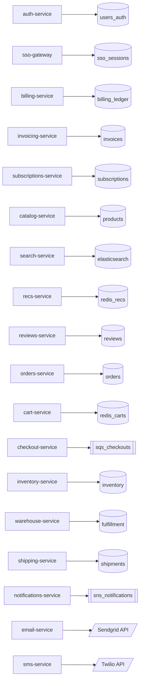

### Expected finding

```text
test_complexity_recommend.md:N-M: NodeCountExceedsAcceptable 36 nodes > 35 acceptable threshold
```

### Recommendation

An 18-pair service→store catalogue is a *catalogue*, not an architecture
diagram. The reader can't see structure at this density. Two canonical
fixes:

1. **Group by responsibility domain.** Most services fall into 3–5 business
   domains (Identity, Commerce, Content, Fulfillment, Communications). Wrap
   each in a `subgraph`.
2. **Drop the per-service store when it's implied.** "Every service owns
   its own DB" is the microservices convention; showing 18 copies of it
   communicates nothing. Reserve store nodes for data that's *shared*
   across services, or when a store type (queue vs. cache vs. RDBMS) is
   itself a design point worth calling out.

### ✅ Positive example

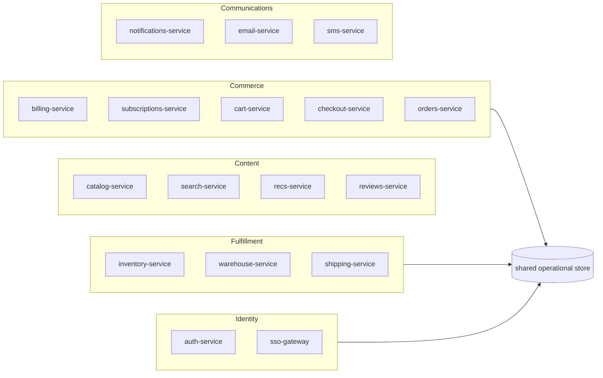

---

## 2. NodeCountExceedsCognitiveLimit — per-source pipeline stages

### ❌ Negative example

A realistic ELT pipeline that forgot to abstract: every SaaS source gets
its own landing table, its own normalizer, its own enricher, and its own
publish destination. 10 sources × 5 stages + 1 orchestrator = 51 nodes.

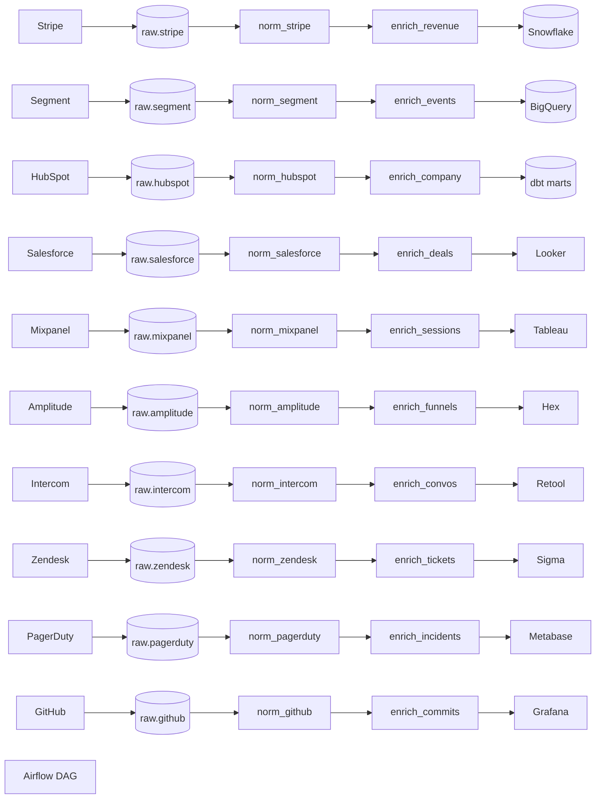

### Expected findings

```text
test_complexity_recommend.md:N-M: NodeCountExceedsCognitiveLimit 51 nodes > 50 (Huang 2020 cognitive limit)
test_complexity_recommend.md:N-M: VisualComplexityExceedsAcceptable VCS 76.0 > 60 acceptable threshold
```

Two codes co-fire: VCS codes do **not** waterfall under node-count codes
because they measure different dimensions of cognitive load. A 51-node
pipeline with 50 edges fails both the node cap and the edge-weight cap.

### Recommendation

Huang et al. (2020) identified **50 nodes as the cognitive load threshold**
for comprehension of a node-link diagram. Past that, readers stop tracing
paths and start pattern-matching. The fix for pipeline diagrams specifically
is almost always the same: **collapse the fan-out**. If stage N does the
same thing to every source, draw stage N as one box — don't replicate it
per source.

Apply the dual-density pattern from
`resources/diagram_organization.md`:

1. Keep this 51-node pipeline as a `## Data Pipeline — Detail` section
   wrapped in a `<details>` collapsible for engineers doing a deep dive.
2. Author a new **overview** (<=12 nodes) for the README that collapses
   each per-source stage into one generalized stage. Place it *above* the
   `<details>` block.

### ✅ Positive example

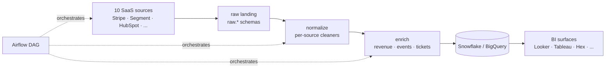

---

## 3. NodeCountExceedsHardLimit — full AWS footprint dump

### ❌ Negative example

An inventory-style dump of a mid-sized team's prod AWS account. Three tiers
× three availability zones × realistic resource mix = 101 nodes. Mermaid
will render it but the image is illegible at any screen size.


### Expected findings

```text
test_complexity_recommend.md:N-M: NodeCountExceedsHardLimit 101 nodes > 100 hard limit
test_complexity_recommend.md:N-M: VisualComplexityExceedsCritical VCS ~105 > 100 critical threshold
```

### Recommendation

Beyond the hard limit, there is **no fix that preserves the diagram**. This
is a signal that the *scope* is wrong: you've attempted to show an entire
account's resource inventory at a single level of abstraction. That isn't
architecture — it's `aws-cli describe-everything`.

1. **Pick a lens.** Is this about request flow? Deployment topology? Cost
   attribution? Blast radius? The lens narrows what to draw.
2. **Pick a level.** Overview (<=12 nodes representing actors / tiers /
   systems) or single-subsystem detail (<=35 nodes inside one boundary).
   Don't mix.
3. **Start over from an empty canvas** at the chosen lens × level. Do not
   try to trim a 101-node inventory to 35 — you'll preserve the wrong
   things.

For the inventory itself, the right tool is a table or a resource-tagging
report, not a diagram.

### ✅ Positive example

The deployment lens at overview level — what actually *flows* through the
stack, ignoring individual instances:

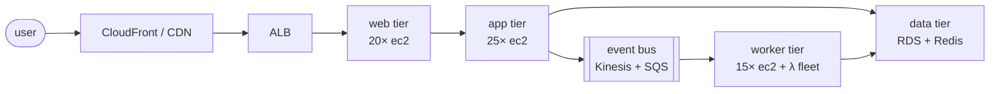

---

## 4. VisualComplexityExceedsAcceptable — no-gateway microservice mesh

### ❌ Negative example

15 real microservices, each calling every other directly — the "polyglot
microservices without a service mesh" anti-pattern. ~105 edges. Nodes stay
under the acceptable cap, but edge density makes the diagram unreadable.

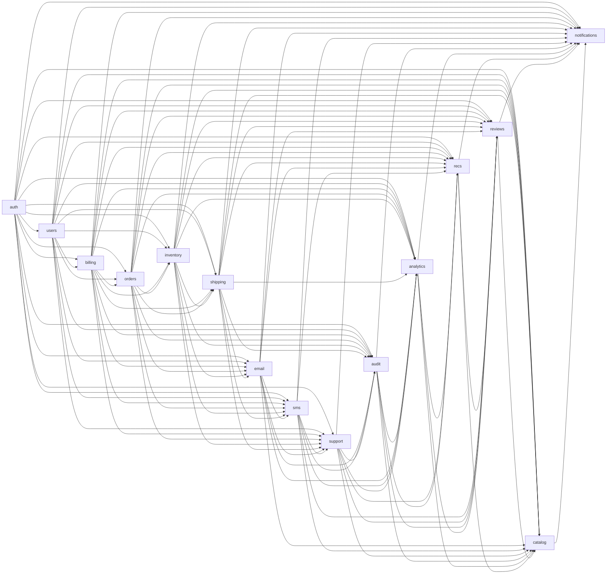

### Expected finding

```text
test_complexity_recommend.md:N-M: VisualComplexityExceedsAcceptable VCS ~67.5 > 60 acceptable threshold
```

### Recommendation

A diagram where every service touches every other service is an adjacency
matrix with arrows — the wrong tool for the shape. The fix mirrors the
real architectural fix:

1. **Introduce a mediating node.** Reality: services shouldn't call each
   other directly either. Drawing an **API gateway** or **service mesh**
   (istio / linkerd / consul-connect) turns an N² mesh into two N-shaped
   fans — same semantics, 1/7th the visual complexity.
2. **Enable `elk.mergeEdges: true`.** If true peer-to-peer is the actual
   topology, ELK will at least bundle parallel edges into single strokes.
   See `resources/layout_algorithms.md`.
3. **Replace with an event bus.** If the interactions are async, make that
   explicit: services publish to / subscribe from an event stream rather
   than call each other.

### ✅ Positive example

Introduce a mesh. Same 15 services, radically simpler diagram:

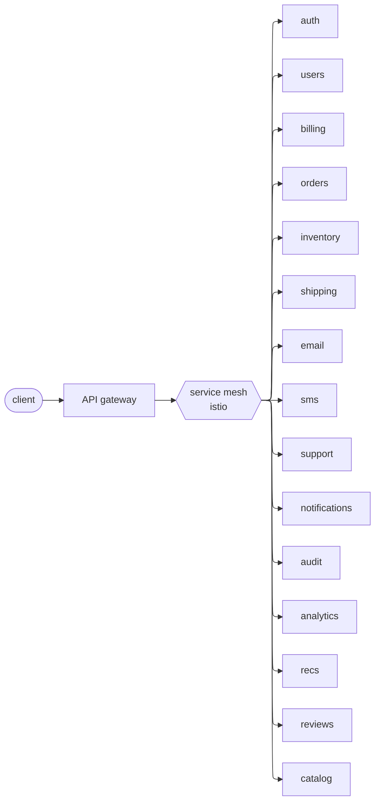

---

## 5. VisualComplexityExceedsCritical — full-mesh monolith-in-progress

### ❌ Negative example

20 services, fully mutually coupled — the "monolith-being-broken-apart"
state where every extraction still depends on every other. ~190 edges.
VCS soars past the critical threshold.

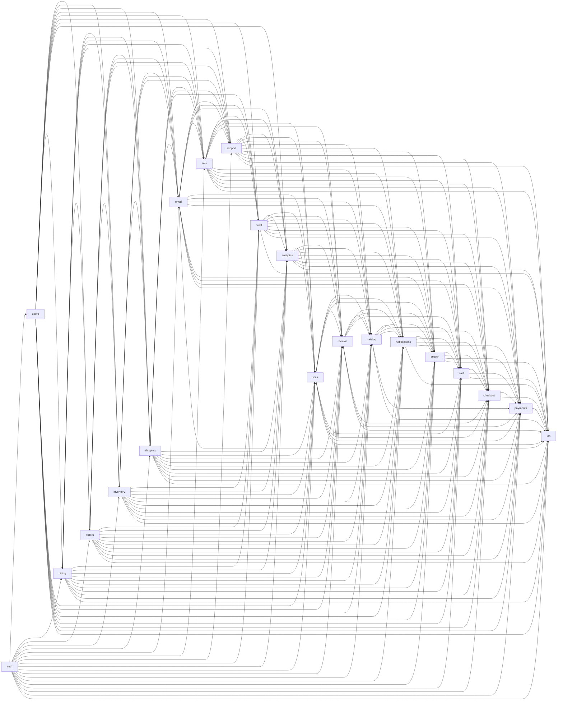

### Expected finding

```text
test_complexity_recommend.md:N-M: VisualComplexityExceedsCritical VCS ~115 > 100 critical threshold
```

### Recommendation

"Critical" means a reader would bail before finishing. The answer is
**split by lens**, not by component count. The same 20 services give you:

- **Architecture** lens: what the components *are*, hierarchically.
  Minimal edges (parent-child only).
- **Sequence** lens: how a specific interaction (e.g. checkout) traces
  through a subset of them, temporally.
- **Data flow** lens: how a specific entity (e.g. an order) moves between
  stores.

Readers pick the lens that answers their question; no single diagram tries
to show all three.

### ✅ Positive example — architecture lens

Six domains, 20 services hidden inside them. Tells the structural story:

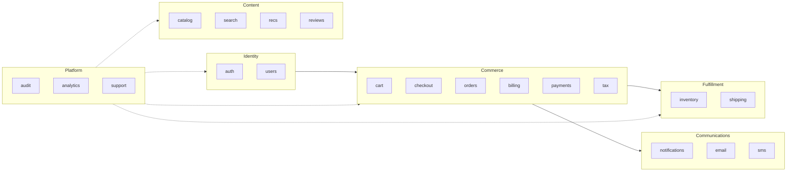

### ✅ Positive example — sequence lens (companion diagram)

For the same 20-service system, the checkout interaction as a sequence
diagram. One specific workflow, temporal, reads top-to-bottom — far
clearer than trying to show all interactions on a single flowchart:

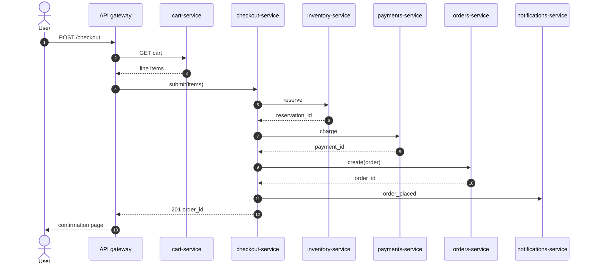

---

## 6. SubgraphNestingTooDeep — AWS org / account / region nesting

### ❌ Negative example

A realistic multi-account cloud topology drawn with 3 levels of nesting:
AWS organization → account → region. Past 2 levels, Mermaid pads inner
boundaries until the diagram is mostly whitespace and readers lose track
of which container they're in.

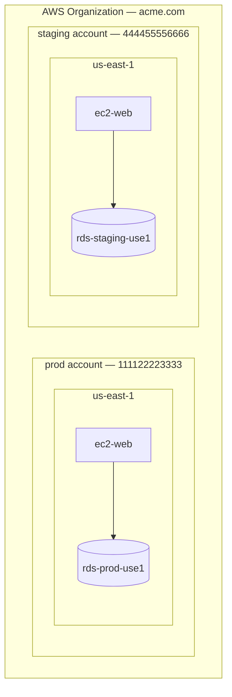

### Expected finding

```text
test_complexity_recommend.md:N-M: SubgraphNestingTooDeep subgraph nesting depth 3 (≥3) hinders readability
```

### Recommendation

Past 2 levels of nesting, both dagre and elk over-pad inner boundaries and
the render becomes whitespace-heavy. Two fixes:

1. **Promote the inner label onto the middle level.** `prod / us-east-1`
   as a single label replaces a nested region subgraph with a labelled
   node. The hierarchy is still communicated, just without the extra box.
2. **Separate diagrams per leaf.** For genuinely important per-region
   detail (e.g. when regions diverge architecturally), make each region
   its own diagram, linked from a parent overview that shows just
   Organization → Account.

### ✅ Positive example — compound labels, depth 2

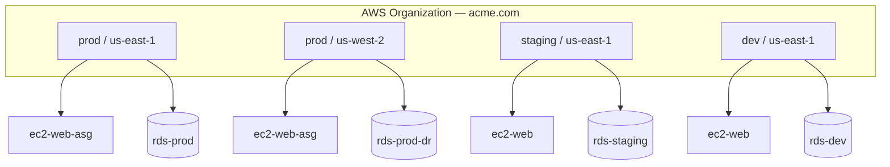

---

## 7. ParserFailure — genuinely unparseable fence

### ❌ Negative example — unknown diagram keyword

The canonical `@mermaid-js/parser` doesn't recognise the diagram kind and
the fence yields 0 nodes, firing `ParserFailure` (error).

```mermaid
not_a_known_diagram_type
  alpha
  beta
```

### Expected finding

```text
test_complexity_recommend.md:N-M: ParserFailure not_a_known_diagram_type yielded 0 nodes from multi-line source (parser: mermaid-core)
```

`ParserFailure` short-circuits every other check for the fence — when the
parser returns 0 nodes, node-count and VCS metrics would be meaningless, so
the linter suppresses all other codes for that block.

A sibling code, `ParserDegraded` (warning), fires when the canonical
parser extracted *something* via regex fallback but not a real AST. Treat
its numbers as approximate.

### Recommendation

Every mermaid diagram kind the skill supports parses cleanly via canonical
parsers — see `test_complexity.md` §1–§2 and §11–§30 for working fixtures
of each (`flowchart`, `architecture-beta`, `classDiagram`, `sequenceDiagram`,
`stateDiagram-v2`, `erDiagram`, `journey`, `mindmap`, `gantt`, `pie`,
`timeline`, `xychart-beta`, `sankey-beta`, `quadrantChart`, `block-beta`,
`C4Context`, `kanban`, `gitGraph`, `packet-beta`, `radar-beta`,
`treemap-beta`, `requirementDiagram`). If one of these trips
`ParserFailure` in your diagram but not in the fixture, the difference is
syntax-level — your fence has an author error, not a tooling limitation.

Common author-error causes:

| Cause | Fix |
|-------|-----|
| Typo in the diagram keyword (`flochart` → `flowchart`) | Spell it right |
| Unterminated `subgraph` / `end` blocks | Match them up |
| Grammar-level syntax error (e.g. hyphen in a `requirementDiagram` id like `REQ-001` — grammar allows alphanumerics + `_` only) | Use the canonical syntax — cross-reference with the `test_complexity.md` fixture for the diagram kind |
| Mermaid version mismatch — fence uses syntax newer than `@mermaid-js/parser` in `scripts/package.json` | Update the package, or revise the fence |

### ✅ Positive example — canonical flowchart

The same intent as the unknown-keyword fence, expressed as a valid
flowchart:

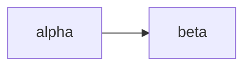

---

## 8. Hierarchical decomposition — "See Sub-Diagram" pointers

An alternative to the dual-density pattern (§2's "overview +
`<details>`-collapsed detail"). When a system has **multiple
semi-independent subsystems**, each deserving its own reference diagram,
the cleaner shape is an **overview full of dotted-border compound nodes**,
each of which links to its own dedicated sub-diagram section below.

Think UML package diagrams, but Mermaid-native and clickable in rendered
HTML.

### ❌ Negative example

Full e-commerce platform drawn as one diagram with every subsystem
exploded. 54 nodes, modest edge density, but no reader can hold all of
this in working memory — they'd give up before finishing the trace.

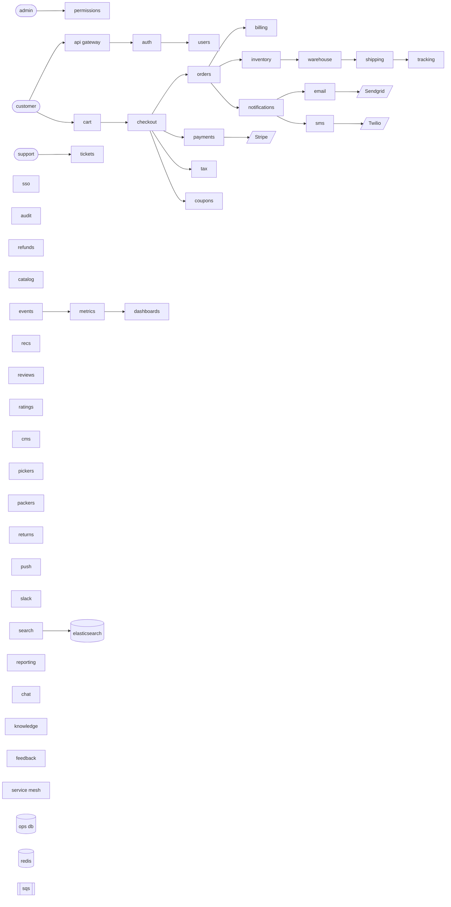

### Expected finding

```text
test_complexity_recommend.md:N-M: NodeCountExceedsCognitiveLimit 51 nodes > 50 (Huang 2020 cognitive limit)
test_complexity_recommend.md:N-M: VisualComplexityExceedsAcceptable VCS 63.5 > 60 acceptable threshold
```

### Recommendation

When the system decomposes into **≥4 subsystems, each meaningful on its
own**, don't collapse them into a `<details>` block together — break each
out into its own reference diagram and have the parent **point at them**.

Three Mermaid features make this work:

| Feature | Purpose | Snippet |
|---------|---------|---------|
| `classDef` with `stroke-dasharray` | Dotted-border visual cue that a node represents "something elaborated elsewhere" | `classDef compound stroke-dasharray:5 5,stroke-width:2px,fill:#f5f5f5` |
| Markdown node labels (Mermaid ≥ 10.7) | In-label italic "_See Sub-Diagram X_" signalling the pointer intent | `commerce["\`**Commerce**<br/>*See Sub-Diagram 2*\`"]` |
| `click` directive | Makes the compound node a hyperlink in GitHub/GitLab rendering, jumping to the sub-diagram's anchor | `click commerce "#sub-diagram-2-commerce" "Commerce detail"` |

Each sub-diagram lives in its own `### Sub-Diagram N — {name}` section and
has its own complexity budget (<=35 nodes, VCS <=60). Readers navigate
top-down: see the parent, click the compound node they care about, land on
a self-contained detail diagram.

### ✅ Overview — compound-node pointers

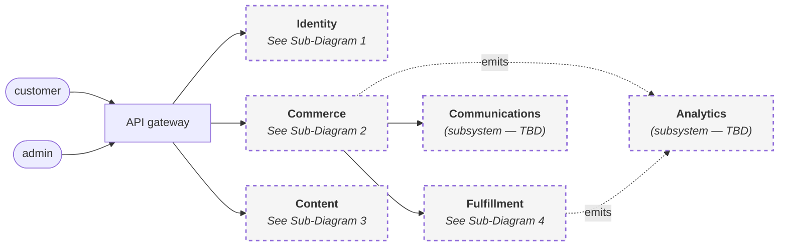

Nine nodes, well under every budget. Dotted-border compound nodes
visually distinguish "this box represents a separately-documented
subsystem" from concrete entities like the gateway or actor nodes. The
`click` directives turn the rendered diagram into a clickable table of
contents.

### Sub-Diagram 1 — Identity

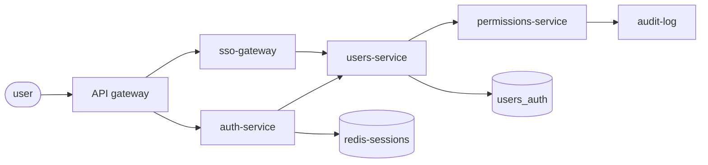

### Sub-Diagram 2 — Commerce

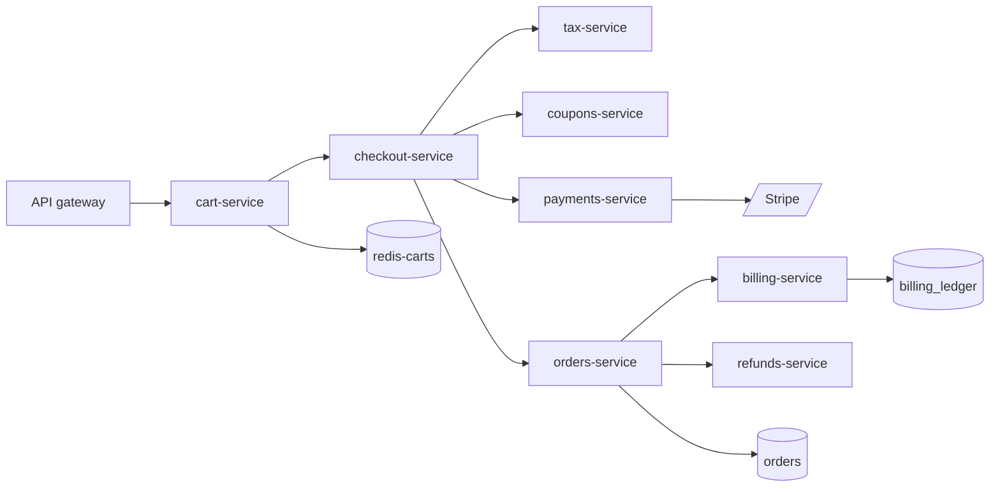

### Sub-Diagram 3 — Content

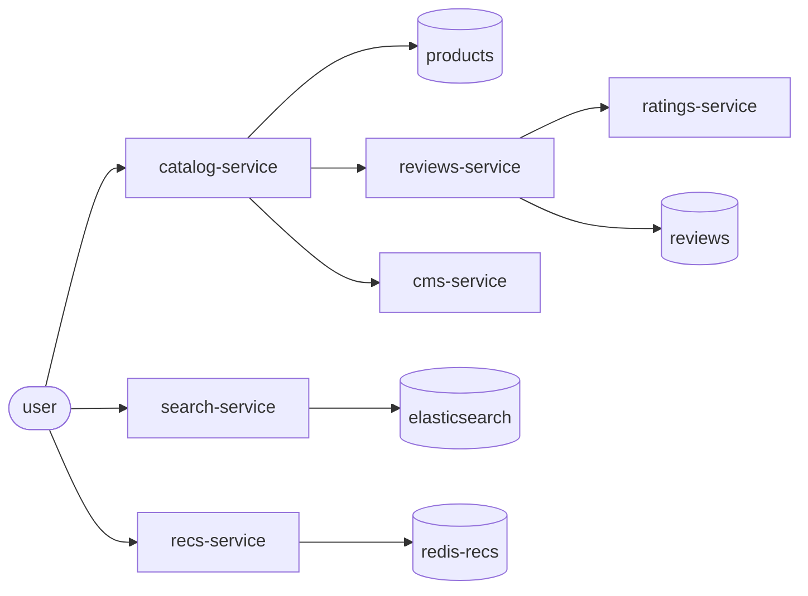

### Sub-Diagram 4 — Fulfillment

```mermaid
flowchart LR
  orders[orders-service] --> inventory[inventory-service]
  inventory --> warehouse[warehouse-service]
  warehouse --> pickers[pickers-team]
  pickers --> packers[packers-team]
  packers --> shipping[shipping-service]
  shipping --> tracking[tracking-service]
  tracking --> returns[returns-service]
  inventory --> inventory_db[(inventory)]
  shipping --> shipping_db[(shipments)]
```

### Tradeoffs vs. dual-density

| Criterion | Dual-density (§2 fix) | Hierarchical decomposition (§8 fix) |
|-----------|----------------------|--------------------------------------|
| When to pick | One diagram has one natural overview ↔ detail axis | Several semi-independent subsystems, each worth its own focused diagram |
| Maintenance cost | Low — two fences in one section | Higher — N+1 sub-sections, each with its own budget, anchors to keep in sync |
| Readability | Reader sees the whole detail if they expand | Reader follows clickable breadcrumbs, never sees "all detail at once" |
| README suitability | Excellent — collapsed detail keeps the page short | Excellent for dedicated `docs/architecture.md`; heavy for README landing page |
| Complexity analyzer behaviour | Each fence scored independently; both budgeted | Each sub-diagram scored independently; overview stays tiny by design |
| Breaks when… | The "detail" exceeds 35 nodes even after collapsing | You add a new subsystem and forget to also author its Sub-Diagram section |

Use dual-density as the default. Reach for hierarchical decomposition
when the "detail" side of dual-density is itself past 35 nodes or covers
≥4 clearly-separable subsystems — that's the signal the diagram has
outgrown the single-section pattern.
