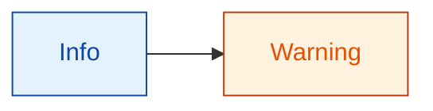
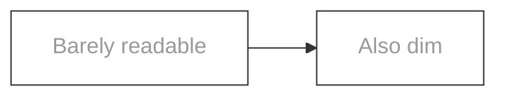
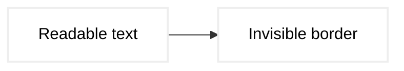
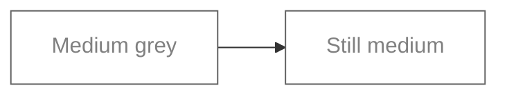
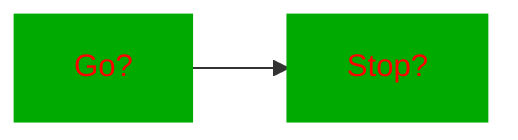
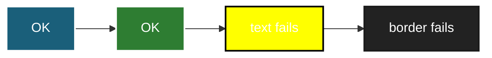
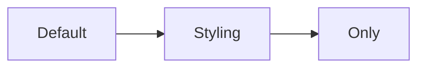
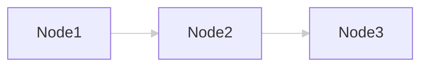
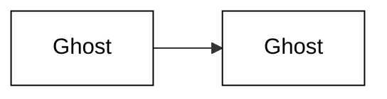

# Mermaid Contrast — WCAG Audit Test Fixtures

Each ```mermaid fence below is a named scenario for
`scripts/mermaid_contrast.ts`. The tool scores every `classDef` and `style`
directive against WCAG AA:

- **Text pairs** (fill × color): must pass **≥ 4.5 : 1**
- **Border pairs** (fill × stroke): must pass **≥ 3.0 : 1**

Run with:

```bash
bun run .claude/skills/mermaidjs_diagrams/scripts/mermaid_contrast.ts \
  .claude/skills/mermaidjs_diagrams/resources/examples/test_contrast.md
```

Exit code is 0 if every pair passes AA, 1 if any fail.

## Expected contrast outcomes

| Scenario                               | Text pair  | Border pair | Overall |
|----------------------------------------|-----------:|------------:|---------|
| AAA-level contrast (white on navy)     |  AAA (>7)  | AAA         | pass    |
| AA-passing dark text on pastel         |  AA (≥4.5) | AA (≥3)     | pass    |
| AA-failing light grey on white (text)  |  FAIL      | *(n/a)*     | fail    |
| AA-failing low-contrast border         |  *(n/a)*   | FAIL        | fail    |
| Borderline AA Large only (≥3 <4.5)     |  AA Large  | AA (≥3)     | fail    |
| Classic red-on-green (colorblind trap) |  FAIL      | FAIL        | fail    |
| Multiple classDefs — some pass, some fail | mixed   | mixed       | fail    |
| No style directives — nothing to check | n/a        | n/a         | pass    |
| Valid link-line styling (linkStyle)    | skipped    | skipped     | pass    |
| Semi-transparent fill (alpha channel)  | depends    | depends     | varies  |

---

## 1. AAA-level contrast — white text on navy background

Both text and border comfortably exceed all thresholds. Expected: all pairs
rated AAA. Zero findings.


## 2. AA-passing — dark text on pastel background

Body text is dark enough on a soft pastel to clear the 4.5 : 1 text bar.
Expected: text AA, border AA.



## 3. AA-failing text — light grey on white

A light grey body text (#999999) on a white fill is around 2.85:1, which
fails the 4.5 text threshold. Expected: FAIL on the text pair.



## 4. AA-failing border — low-contrast stroke

Border (fill × stroke) sits around 1.3 : 1, well under the 3.0 minimum for
non-text UI. Text pair is fine. Expected: FAIL on the border pair only.



## 5. AA Large only — in the 3–4.5 : 1 gap

Text ratio is between 3.0 and 4.5 — passes AA Large (big/bold text only)
but fails AA for normal body text. Expected: FAIL (the linter enforces AA,
not AA Large).



## 6. Red-on-green — colorblind trap AND poor contrast

Classic low-contrast / deuteranopia-unfriendly combo. Red text on green
fill is around 2 : 1. Expected: FAIL for both text and border.



## 7. Mixed classDefs — some pass, some fail

Four classes in one diagram: two compliant, two non-compliant. The linter
should emit findings only for the failing pairs, keeping compliant classes
silent. Useful for verifying the tool doesn't conflate classes.



## 8. No style directives — nothing to audit

Default mermaid styling; no `classDef` or `style`. Expected: zero findings,
exit 0, no work done by the contrast linter.



## 9. linkStyle — should be skipped

`linkStyle` colors edges, not nodes. The contrast linter only evaluates
`classDef` and `style` fill/color/stroke, so this fence should produce no
findings even though it defines a dim link color.



## 10. Semi-transparent fill — alpha channel

Hex with alpha (`#FFFFFF80` = 50% white). The contrast calculation composites
against an assumed background, so results may vary. Expected: a finding is
produced either way; this is a regression probe, not a pass/fail assertion.



## 11. `style` directive (per-node, not classDef)

`style` applies to a single node rather than a reusable class. The linter
must evaluate `style` directives the same as `classDef`. Expected: a finding
per failing pair, independent of classDef coverage.


## 12. Named CSS colors — not just hex

`color: red` is valid CSS and must resolve to the same #FF0000 pair the hex
form resolves to. This probes the colorjs.io parser. Expected: the same
red-on-green finding as fence 6.


## 13. oklch — modern perceptual space

OKLCH is the preferred CSS color space for accessible palettes. A high-L
oklch text on a low-L oklch fill should easily clear AA. Expected: text
AAA, border AAA.

```mermaid
flowchart LR
  classDef modern fill:oklch(0.25 0.05 250),color:oklch(0.98 0 0),stroke:oklch(0.98 0 0),stroke-width:2px
  A[Modern] --> B[Palette]
  A:::modern
  B:::modern
```
