# Mermaid Diagram Test Gallery

A curated, single-example-per-type fixture for every diagram supported by
mermaid-js. Examples are drawn from the canonical demo HTML pages at
`/demos/*.html` in the mermaid monorepo (or the syntax docs at
`packages/mermaid/src/docs/syntax/*.md` when the demo was too large).

**Purpose**
- Serves as a regression fixture for `scripts/find_mermaid_fences.ts`.
- Documents which diagrams parse via the Langium grammar package
  (`@mermaid-js/parser`) versus the legacy JISON grammars bundled inside
  `packages/mermaid/src/diagrams/*/parser/*.jison`.
- Gives consumers a one-page visual index of what mermaid can draw.

## Parser Engine Mapping

Complete mapping as of `mermaid@11.14.0` + `@mermaid-js/parser@1.1.0`. The
**Langium** parsers return a typed AST headlessly (no DOM required). The
**JISON** parsers run inside mermaid core; most call DOMPurify sanitization
hooks during `mermaid.parse()` which fails under headless Bun without a DOM
polyfill (e.g. happy-dom / jsdom), but a few JISON parsers happen to skip that
path and work headlessly.

**Scope**: this gallery tracks only **officially released** diagram types
that are bundled in the current `mermaid` npm package + `@mermaid-js/parser`
npm package. Types that exist only on the `develop` branch (e.g. upcoming
Langium grammars) and external plugins (e.g. zenuml) are excluded so the
script's parser dispatch stays aligned to what's actually shipped.

The "Headless parse?" column reflects **empirical behavior** of running
`scripts/find_mermaid_fences.ts --ast` against this gallery. Legend:

- ✅ **full** — typed AST returned, graph data available for analysis
- ✅ **type-only** — diagram type returned, no graph data (mermaid.parse needs DOM for getDiagramFromText)
- ❌ **needs DOM** — `mermaid.parse()` throws because DOMPurify.addHook is unavailable
- 🟡 **v1.1.0 gap** — Langium grammar exists on `develop` but not in the published parser package

| Diagram type (dir) | First-line keyword    | Parser   | Headless parse? | Source of truth |
|--------------------|-----------------------|----------|-----------------|-----------------|
| architecture       | `architecture-beta`   | Langium  | ✅ full          | `packages/parser/src/parse.ts` |
| git                | `gitGraph`            | Langium  | ✅ full          | `packages/parser/src/parse.ts` |
| info               | `info`                | Langium  | ✅ full          | `packages/parser/src/parse.ts` |
| packet             | `packet-beta`         | Langium  | ✅ full          | `packages/parser/src/parse.ts` |
| pie                | `pie`                 | Langium  | ✅ full          | `packages/parser/src/parse.ts` |
| radar              | `radar-beta`          | Langium  | ✅ full (cyclic AST — stripper uses WeakSet) | `packages/parser/src/parse.ts` |
| treemap            | `treemap`             | Langium  | ✅ full          | `packages/parser/src/parse.ts` |
| treeView           | `treeView-beta`       | Langium  | ✅ full          | `packages/parser/src/parse.ts` |
| wardley            | `wardley-beta`        | Langium  | ✅ full          | `packages/parser/src/parse.ts` |
| er                 | `erDiagram`           | JISON    | ✅ type-only     | `packages/mermaid/src/diagrams/er/parser/erDiagram.jison` |
| requirement        | `requirementDiagram`  | JISON    | ✅ type-only     | `packages/mermaid/src/diagrams/requirement/parser/requirementDiagram.jison` |
| sequence           | `sequenceDiagram`     | JISON    | ✅ type-only     | `packages/mermaid/src/diagrams/sequence/parser/sequenceDiagram.jison` |
| block              | `block`               | JISON    | ❌ needs DOM     | `packages/mermaid/src/diagrams/block/parser/block.jison` |
| c4                 | `C4Context` (and C4*) | JISON    | ❌ needs DOM     | `packages/mermaid/src/diagrams/c4/parser/c4Diagram.jison` |
| class              | `classDiagram`        | JISON    | ❌ needs DOM     | `packages/mermaid/src/diagrams/class/parser/classDiagram.jison` |
| flowchart          | `flowchart` / `graph` | JISON    | ❌ needs DOM     | `packages/mermaid/src/diagrams/flowchart/parser/flow.jison` |
| gantt              | `gantt`               | JISON    | ❌ needs DOM     | `packages/mermaid/src/diagrams/gantt/parser/gantt.jison` |
| ishikawa           | `ishikawa-beta`       | JISON    | ❌ needs DOM     | `packages/mermaid/src/diagrams/ishikawa/parser/ishikawa.jison` |
| kanban             | `kanban`              | JISON    | ❌ needs DOM     | `packages/mermaid/src/diagrams/kanban/parser/kanban.jison` |
| mindmap            | `mindmap`             | JISON    | ❌ needs DOM     | `packages/mermaid/src/diagrams/mindmap/parser/mindmap.jison` |
| quadrant-chart     | `quadrantChart`       | JISON    | ❌ needs DOM     | `packages/mermaid/src/diagrams/quadrant-chart/parser/quadrant.jison` |
| sankey             | `sankey-beta`         | JISON    | ❌ needs DOM     | `packages/mermaid/src/diagrams/sankey/parser/sankey.jison` |
| state              | `stateDiagram`        | JISON    | ❌ needs DOM     | `packages/mermaid/src/diagrams/state/parser/stateDiagram.jison` |
| timeline           | `timeline`            | JISON    | ❌ needs DOM     | `packages/mermaid/src/diagrams/timeline/parser/timeline.jison` |
| user-journey       | `journey`             | JISON    | ❌ needs DOM     | `packages/mermaid/src/diagrams/user-journey/parser/journey.jison` |
| venn               | `venn-beta`           | JISON    | ❌ needs DOM     | `packages/mermaid/src/diagrams/venn/parser/venn.jison` |
| xychart            | `xychart-beta`        | JISON    | ❌ needs DOM     | `packages/mermaid/src/diagrams/xychart/parser/xychart.jison` |

**Totals**: 9 Langium-parsed types (published in `@mermaid-js/parser@1.1.0`),
17 JISON-parsed types bundled in mermaid core (3 work headlessly, 14 need a DOM
polyfill). Some types are beta-gated by their keyword (`-beta` suffix) —
mermaid may drop the suffix in a future major release.

### Out of scope

The following are intentionally omitted from this gallery and from the parser
dispatch table in `scripts/find_mermaid_fences.ts` /
`scripts/mermaid_complexity.ts`:

- **`eventmodeling`** — exists only on the mermaid `develop` branch; not in
  the published `@mermaid-js/parser@1.1.0`. Add once it ships.
- **`zenuml`** — external npm plugin (`mermaid-zenuml`), not bundled into
  mermaid core. Out of scope for a stand-alone CLI that pins to mermaid proper.

---

## Langium-parsed diagrams (AST available headlessly)

### architecture-beta

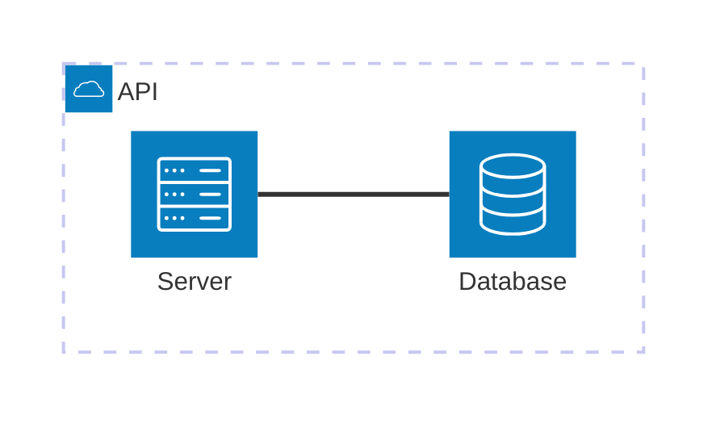

### gitGraph

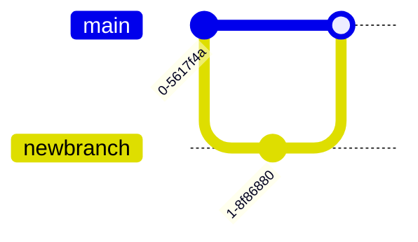

### info

```mermaid
info
```

### packet-beta

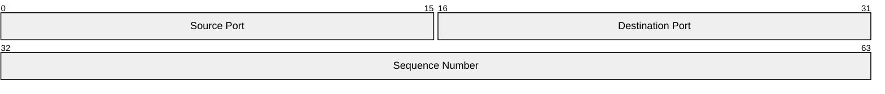

### pie

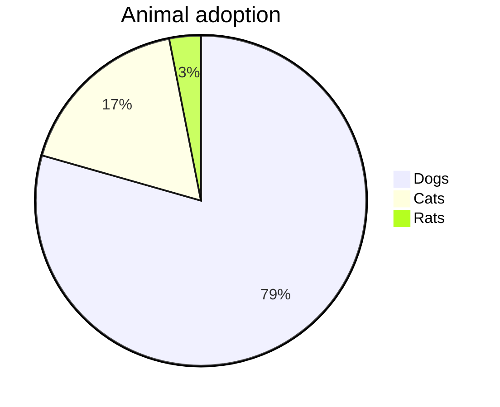

### radar-beta

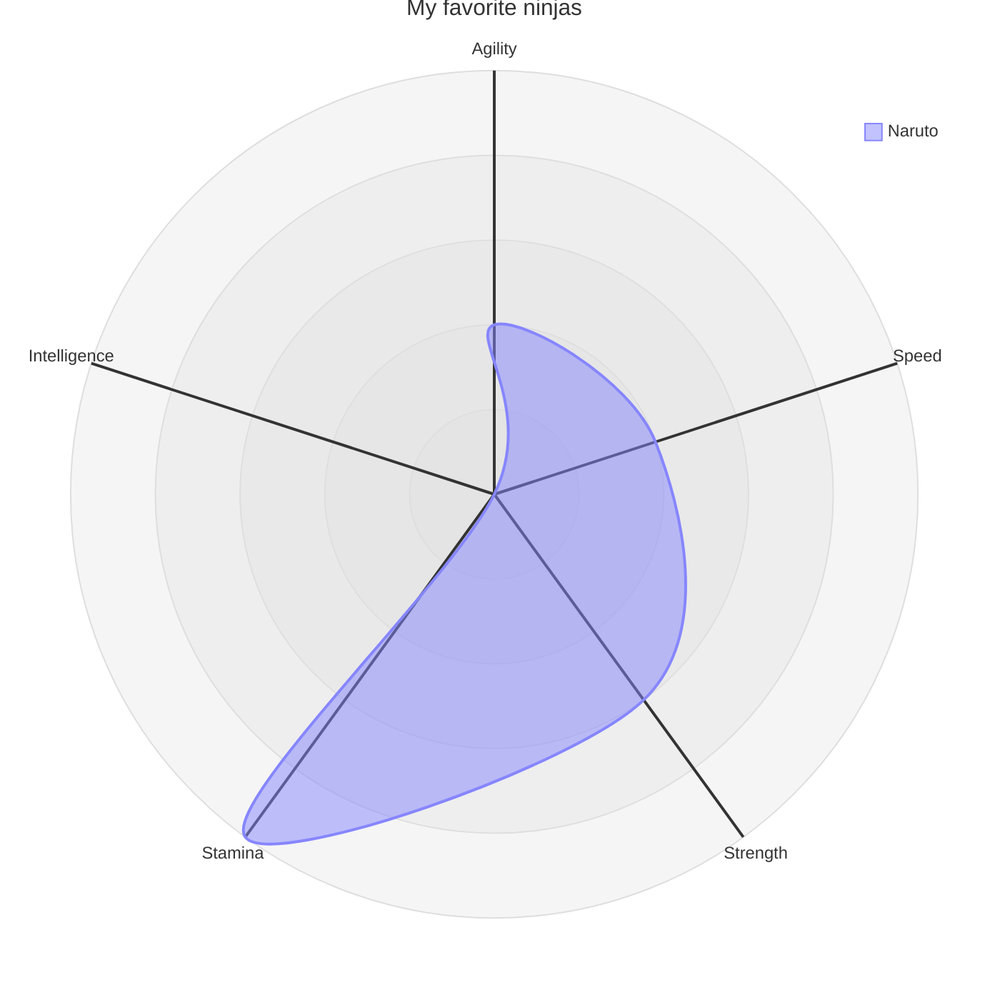

### treemap

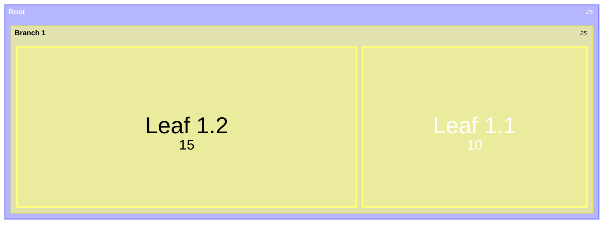

### treeView-beta

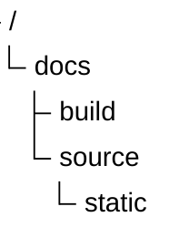

### wardley-beta

```mermaid
wardley-beta
  title Tea Shop
  anchor Business [0.95, 0.63]
  component Cup of Tea [0.85, 0.62] label [0, 0]
  component Tea Leaves [0.43, 0.12] label [0, 0]
  Business -> Cup of Tea
  Cup of Tea -> Tea Leaves
```

---

## JISON-parsed diagrams (legacy; AST needs DOM / jsdom)

### block

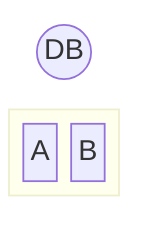

### C4Context

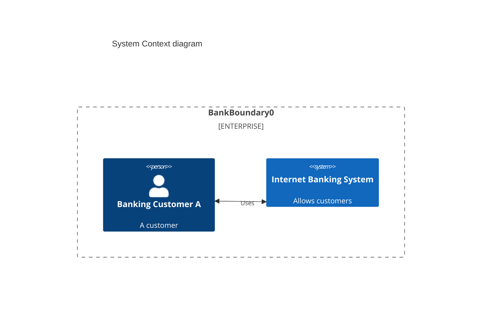

### classDiagram

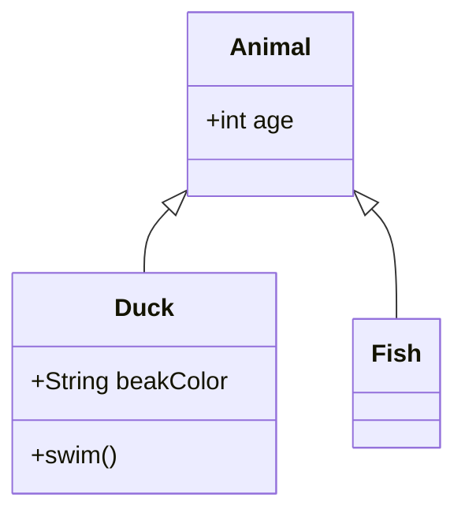

### erDiagram

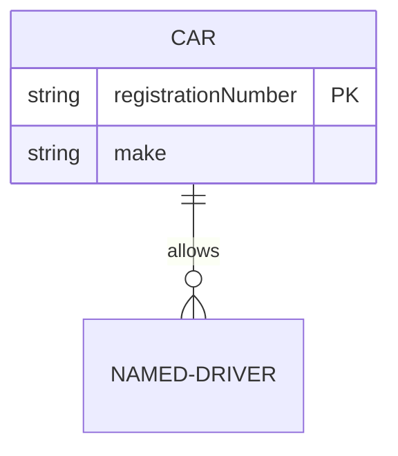

### flowchart

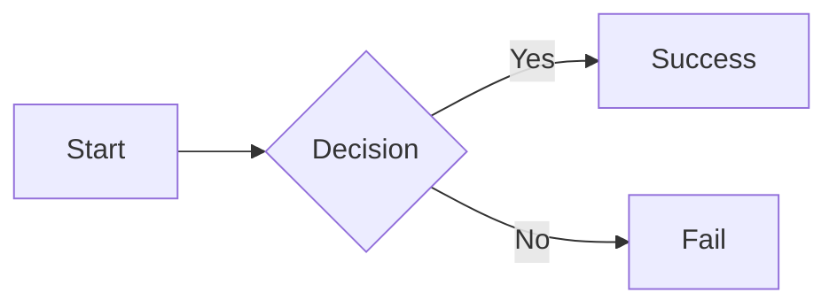

### gantt

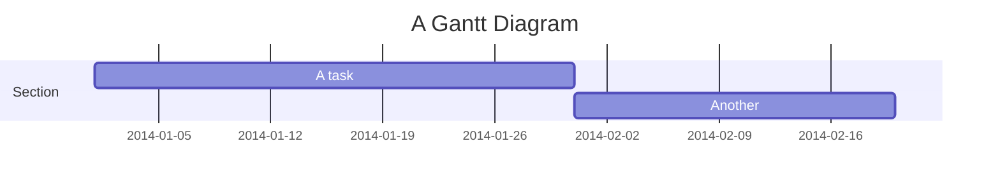

### ishikawa-beta

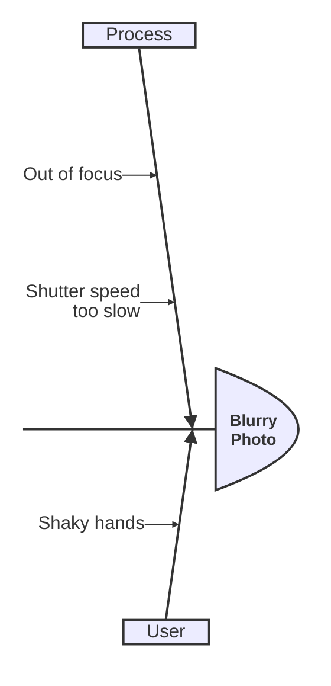

### kanban

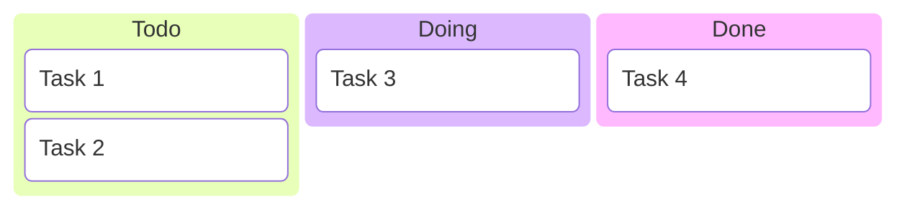

### mindmap

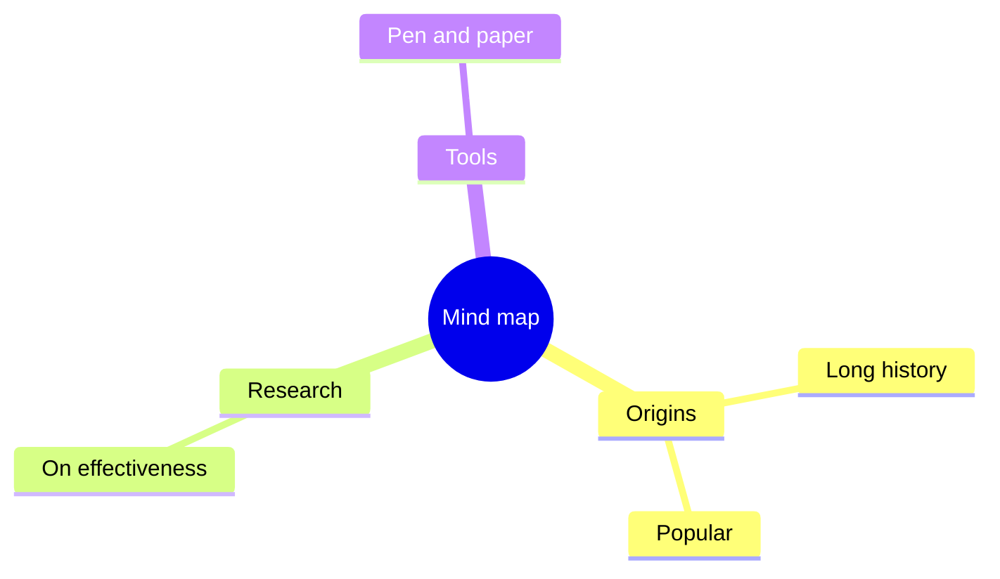

### quadrantChart

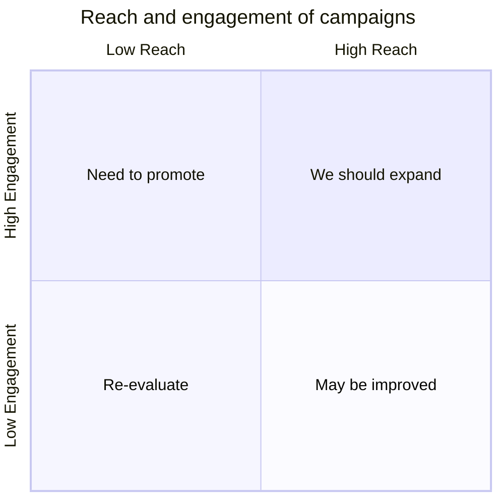

### requirementDiagram

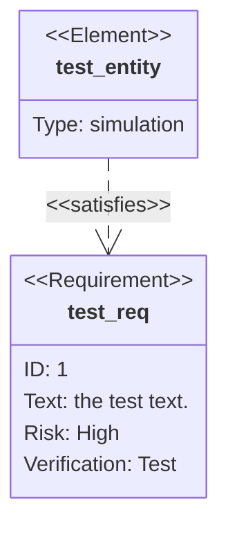

### sankey-beta

```mermaid
sankey-beta
iPhone,Products,205
Mac,Products,40
Products,Revenue,315
Services,Revenue,60
```

### sequenceDiagram

```mermaid
sequenceDiagram
  participant Alice
  participant Bob
  Alice ->> Bob: Hello Bob, how are you?
  Bob -->> Alice: Great, thanks!
```

### stateDiagram

```mermaid
stateDiagram-v2
  [*] --> Still
  Still --> Moving
  Moving --> Still
  Moving --> Crash
  Crash --> [*]
```

### timeline

```mermaid
timeline
  title History of Social Media
  section 2002-2006
    2002 : LinkedIn
    2004 : Facebook
  section 2007-2009
    2007 : iPhone
```

### journey

```mermaid
journey
  title My working day
  section Go to work
    Make tea: 5: Me
    Go upstairs: 3: Me
    Do work: 1: Me, Cat
  section Go home
    Go downstairs: 5: Me
    Sit down: 5: Me
```

### venn-beta

```mermaid
venn-beta
  title Very Basic Venn Diagram
  set A
  set B
  union A,B["AB"]
```

### xychart-beta

```mermaid
xychart-beta
  title Sales Revenue
  x-axis [jan, feb, mar]
  y-axis Revenue 4000 --> 11000
  bar [5000, 6000, 7500]
  line [5000, 6000, 7500]
```
