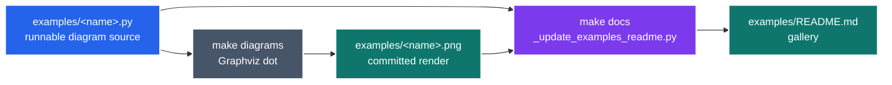
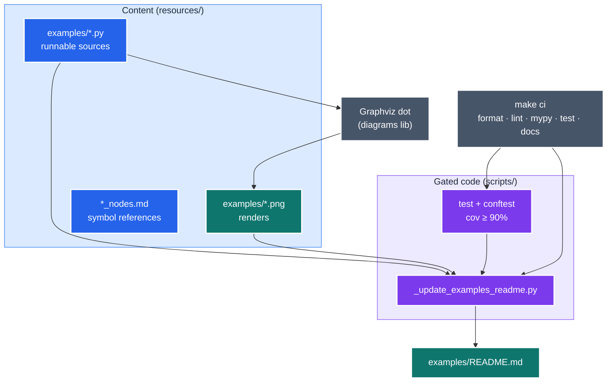
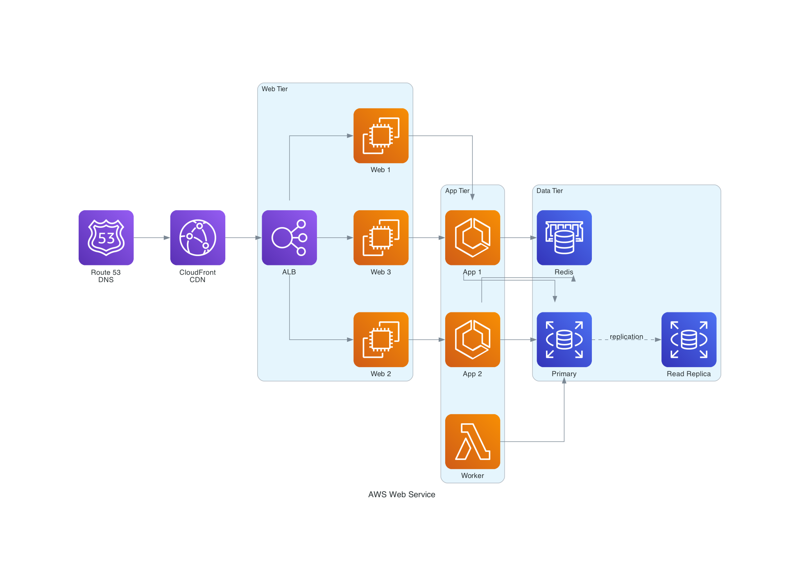
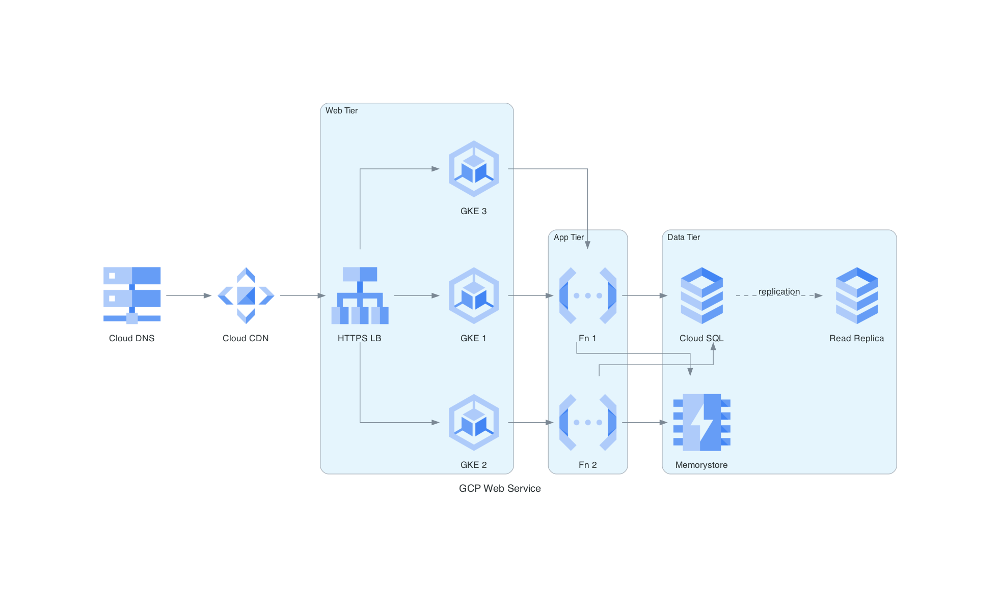
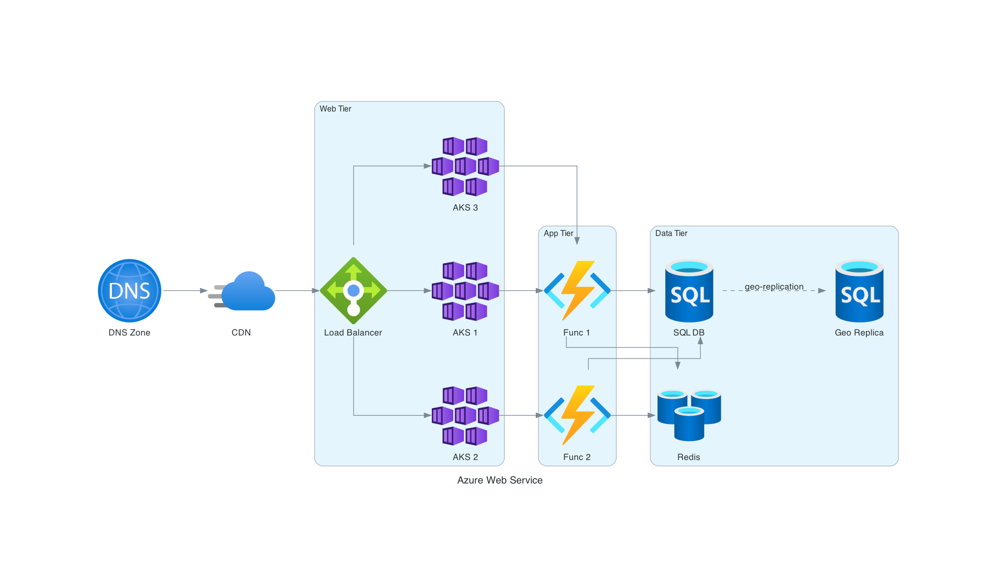

# mingrammer_diagrams

Generate production-quality **cloud architecture diagrams as code** with the Python
[`diagrams`](https://github.com/mingrammer/diagrams) library (Graphviz under the hood). It
exists so an agent can turn an infrastructure description into a clean, versionable PNG —
AWS, GCP, Azure, Kubernetes, or on-prem — using one set of layout conventions that are
known to render well, plus a gallery of runnable examples to copy from.

---

<details>
<summary><b>Table of Contents</b></summary>
<!--TOC-->

- [mingrammer_diagrams](#mingrammer_diagrams)
  - [Quickstart](#quickstart)
  - [Architecture](#architecture)
  - [Multi-cloud gallery](#multi-cloud-gallery)
  - [Requirements](#requirements)
  - [Command reference](#command-reference)
  - [Adding an example](#adding-an-example)
  - [Troubleshooting](#troubleshooting)
  - [For maintainers](#for-maintainers)

<!--TOC-->
</details>

---

## Quickstart

Invoke it in Claude Code with a natural-language brief:

```text
/mingrammer_diagrams a 3-tier GCP web service: Cloud DNS -> Cloud CDN -> HTTPS LB -> GKE -> Cloud SQL + Memorystore
```

Or drive the library directly — a diagram is just a PEP-723 Python script:

```bash
# Render one of the shipped examples (writes the .png beside the source)
uv run .claude/skills/mingrammer_diagrams/resources/examples/aws_web_service.py
```

The escape hatch — re-render every example PNG, then rebuild the gallery README:

```bash
make -C .claude/skills/mingrammer_diagrams/scripts diagrams   # render *.png (needs Graphviz)
make -C .claude/skills/mingrammer_diagrams/scripts docs       # rebuild resources/examples/README.md
```

> Requires Graphviz (`dot`) on PATH and `uv`. See [Requirements](#requirements).

## Architecture

Two artifacts per example — a runnable `.py` source and its committed `.png` render — flow
into an autogenerated gallery. Authoring an example and regenerating is the whole loop.



*Author → render → regenerate gallery.*

<details>
<summary>Complete diagram — skill anatomy + the quality gate</summary>



The example sources are **content** (exempt from the coverage gate, like fixtures); the only
gated Python is the private gallery generator. See [`CLAUDE.md`](CLAUDE.md) for the rationale.

</details>

## Multi-cloud gallery

The same 3-tier shape rendered across three providers — proof the layout conventions are
provider-agnostic. Full source for each is in
[`resources/examples/README.md`](resources/examples/README.md).

| AWS | GCP | Azure |
|-----|-----|-------|
|  |  |  |

## Requirements

| Need | Why |
|------|-----|
| Graphviz (`dot`) on PATH | `diagrams` shells out to Graphviz to lay out and render. Install: `brew install graphviz` / `apt-get install graphviz`. |
| `uv` on PATH | Diagram scripts declare deps inline (PEP-723: `diagrams>=0.24`); `uv` builds the venv on first run. |

No network access or API key is needed — rendering is fully local.

## Command reference

Authoring a diagram is just writing a `diagrams` script — the full operating manual (layout
engines, graph attributes, cluster design, edge styling, node-class references for every
provider) is in [`SKILL.md`](SKILL.md). The repeatable maintenance commands are:

| Command | Does |
|---------|------|
| `uv run resources/examples/<name>.py` | Render one example to its `.png`. |
| `make -C scripts diagrams` | Re-render every example PNG (needs Graphviz). |
| `make -C scripts docs` | Regenerate the gallery `README.md` from `.py`+`.png` pairs. |
| `make -C scripts ci` | The gate: format-check, lint, mypy `--strict`, tests (≥90% cov), docs. |
| `make -C scripts fix` | Auto-format + lint-fix the gated Python. |

## Adding an example

1. Drop a self-contained `resources/examples/<name>.py` (PEP-723, `show=False`, render to
   `Path(__file__).with_suffix("")` so the PNG lands beside the source).
2. `make -C scripts diagrams` to render `<name>.png`.
3. `make -C scripts docs` to fold it into the gallery (alphabetical; the TOC updates itself).
4. `make -C scripts ci` — the `docs` step fails loudly if a `.py` has no matching `.png`.

## Troubleshooting

| Symptom | Cause / fix |
|---------|-------------|
| `failed to execute ['dot', ...]` / `ExecutableNotFound` | Graphviz isn't installed or not on PATH. `brew install graphviz`, then `dot -V`. |
| The image opens in a viewer / hangs in CI | You omitted `show=False` in `Diagram(...)`. Always set it for scripted generation. |
| Nodes scattered, clusters ignored | A non-`dot` engine was selected. Remove `diag.dot.engine = "neato"` — `dot` is the default and the only good fit for architecture. |
| `make docs` errors `Missing rendered PNG(s)` | You added a `.py` but didn't render it. Run `make -C scripts diagrams` first. |
| `ImportError` on a node class | The class name/casing is wrong. Check the relevant `resources/*_nodes.md`, or the provider quick-reference in `SKILL.md`. |

## For maintainers

The development contract (`make fix` / `make ci`), the file map, and the design rationale
(ADR log — why the example sources are content, not gated scripts) live in
[`CLAUDE.md`](CLAUDE.md).
