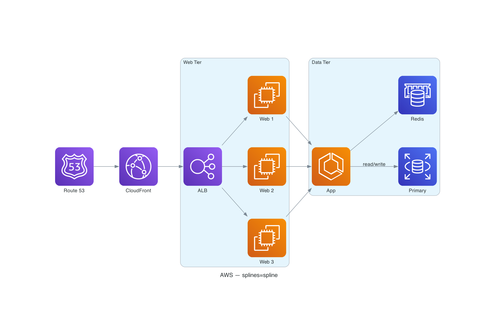
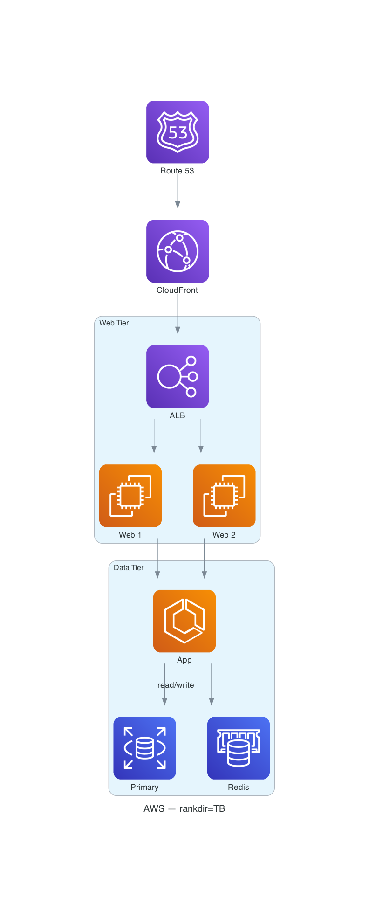

# Examples

Each example below is a **self-contained, runnable** `diagrams` script. The PNG
is the committed render of that exact source. To reproduce one:

```bash
uv run .claude/skills/mingrammer_diagrams/resources/examples/<name>.py
```

> This file is generated by `scripts/_update_examples_readme.py` (wired to
> `make docs`). Do not edit it by hand — add a `<name>.py` + `<name>.png` pair
> and regenerate.

---

<details>
<summary><b>Table of Contents</b></summary>
<!--TOC-->

- [Examples](#examples)
  - [aws_layout_spline](#aws_layout_spline)
  - [aws_layout_vertical](#aws_layout_vertical)
  - [aws_web_service](#aws_web_service)
  - [azure_web_service](#azure_web_service)
  - [gcp_web_service](#gcp_web_service)
  - [Re-rendering](#re-rendering)

<!--TOC-->
</details>

---

## aws_layout_spline

### Code

```python
#!/usr/bin/env python3
# /// script
# requires-python = ">=3.9"
# dependencies = ["diagrams>=0.24"]
# ///
"""Layout variant — same AWS architecture, `splines=spline` (soft curves).

Use spline edges when `ortho` produces too many overlapping right-angle bends
in an edge-dense graph. Self-rendering: `uv run <this file>` writes the PNG.
"""

from pathlib import Path

from diagrams import Cluster, Diagram, Edge
from diagrams.aws.compute import ECS, EC2
from diagrams.aws.database import RDS, Elasticache
from diagrams.aws.network import ELB, CloudFront, Route53

OUT = str(Path(__file__).with_suffix(""))  # -> resources/examples/aws_layout_spline(.png)

with Diagram(
    "AWS — splines=spline",
    filename=OUT,
    show=False,
    outformat="png",
    graph_attr={"rankdir": "LR", "splines": "spline", "nodesep": "0.70", "ranksep": "0.90"},
):
    dns = Route53("Route 53")
    cdn = CloudFront("CloudFront")

    with Cluster("Web Tier"):
        lb = ELB("ALB")
        web = [EC2("Web 1"), EC2("Web 2"), EC2("Web 3")]

    with Cluster("Data Tier"):
        app = ECS("App")
        primary = RDS("Primary")
        cache = Elasticache("Redis")

    dns >> cdn >> lb >> web
    web[0] >> app
    web[1] >> app
    web[2] >> app
    app >> Edge(label="read/write") >> primary
    app >> cache
```

### Image (PNG)



---

## aws_layout_vertical

### Code

```python
#!/usr/bin/env python3
# /// script
# requires-python = ">=3.9"
# dependencies = ["diagrams>=0.24"]
# ///
"""Layout variant — same AWS architecture, `rankdir=TB` (top-to-bottom).

Vertical flow suits request-lifecycle / waterfall diagrams with few parallel
paths. Prefer LR for 3+ wide tiers (TB grows very tall). Self-rendering.
"""

from pathlib import Path

from diagrams import Cluster, Diagram, Edge
from diagrams.aws.compute import ECS, EC2
from diagrams.aws.database import RDS, Elasticache
from diagrams.aws.network import ELB, CloudFront, Route53

OUT = str(Path(__file__).with_suffix(""))  # -> resources/examples/aws_layout_vertical(.png)

with Diagram(
    "AWS — rankdir=TB",
    filename=OUT,
    show=False,
    outformat="png",
    graph_attr={"rankdir": "TB", "splines": "ortho", "nodesep": "0.70", "ranksep": "0.75"},
):
    dns = Route53("Route 53")
    cdn = CloudFront("CloudFront")

    with Cluster("Web Tier"):
        lb = ELB("ALB")
        web = [EC2("Web 1"), EC2("Web 2")]

    with Cluster("Data Tier"):
        app = ECS("App")
        primary = RDS("Primary")
        cache = Elasticache("Redis")

    dns >> cdn >> lb >> web
    web[0] >> app
    web[1] >> app
    app >> Edge(label="read/write") >> primary
    app >> cache
```

### Image (PNG)



---

## aws_web_service

### Code

```python
#!/usr/bin/env python3
# /// script
# requires-python = ">=3.9"
# dependencies = ["diagrams>=0.24"]
# ///
"""AWS 3-tier web service — the recommended layout (dot, LR, ortho edges).

Self-rendering example: `uv run <this file>` writes `aws_web_service.png`
beside it. Requires Graphviz (`dot`) on PATH.
"""

from pathlib import Path

from diagrams import Cluster, Diagram, Edge
from diagrams.aws.compute import ECS, EC2, Lambda
from diagrams.aws.database import RDS, Elasticache
from diagrams.aws.network import ELB, CloudFront, Route53

OUT = str(Path(__file__).with_suffix(""))  # -> resources/examples/aws_web_service(.png)

with Diagram(
    "AWS Web Service",
    filename=OUT,
    show=False,
    outformat="png",
    graph_attr={"rankdir": "LR", "splines": "ortho", "nodesep": "0.70", "ranksep": "0.90"},
):
    dns = Route53("Route 53\nDNS")
    cdn = CloudFront("CloudFront\nCDN")

    with Cluster("Web Tier"):
        lb = ELB("ALB")
        web = [EC2("Web 1"), EC2("Web 2"), EC2("Web 3")]

    with Cluster("App Tier"):
        apps = [ECS("App 1"), ECS("App 2")]
        worker = Lambda("Worker")

    with Cluster("Data Tier"):
        primary = RDS("Primary")
        replica = RDS("Read Replica")
        cache = Elasticache("Redis")

    dns >> cdn >> lb >> web
    web[0] >> apps[0]
    web[1] >> apps[1]
    web[2] >> apps[0]
    apps[0] >> [primary, cache]
    apps[1] >> [primary, cache]
    worker >> primary
    primary >> Edge(label="replication", style="dashed") >> replica
```

### Image (PNG)


---

## azure_web_service

### Code

```python
#!/usr/bin/env python3
# /// script
# requires-python = ">=3.9"
# dependencies = ["diagrams>=0.24"]
# ///
"""Azure 3-tier web service — same shape as the AWS example, Azure node set.

Self-rendering example: `uv run <this file>` writes `azure_web_service.png`
beside it. Requires Graphviz (`dot`) on PATH.
"""

from pathlib import Path

from diagrams import Cluster, Diagram, Edge
from diagrams.azure.compute import AKS, FunctionApps
from diagrams.azure.database import CacheForRedis, SQLDatabases
from diagrams.azure.network import CDNProfiles, DNSZones, LoadBalancers

OUT = str(Path(__file__).with_suffix(""))  # -> resources/examples/azure_web_service(.png)

with Diagram(
    "Azure Web Service",
    filename=OUT,
    show=False,
    outformat="png",
    graph_attr={"rankdir": "LR", "splines": "ortho", "nodesep": "0.70", "ranksep": "0.90"},
):
    dns = DNSZones("DNS Zone")
    cdn = CDNProfiles("CDN")

    with Cluster("Web Tier"):
        lb = LoadBalancers("Load Balancer")
        web = [AKS("AKS 1"), AKS("AKS 2"), AKS("AKS 3")]

    with Cluster("App Tier"):
        fn = [FunctionApps("Func 1"), FunctionApps("Func 2")]

    with Cluster("Data Tier"):
        primary = SQLDatabases("SQL DB")
        replica = SQLDatabases("Geo Replica")
        cache = CacheForRedis("Redis")

    dns >> cdn >> lb >> web
    web[0] >> fn[0]
    web[1] >> fn[1]
    web[2] >> fn[0]
    fn[0] >> [primary, cache]
    fn[1] >> [primary, cache]
    primary >> Edge(label="geo-replication", style="dashed") >> replica
```

### Image (PNG)


---

## gcp_web_service

### Code

```python
#!/usr/bin/env python3
# /// script
# requires-python = ">=3.9"
# dependencies = ["diagrams>=0.24"]
# ///
"""GCP 3-tier web service — same shape as the AWS example, GCP node set.

Self-rendering example: `uv run <this file>` writes `gcp_web_service.png`
beside it. Requires Graphviz (`dot`) on PATH.
"""

from pathlib import Path

from diagrams import Cluster, Diagram, Edge
from diagrams.gcp.compute import Functions, GKE
from diagrams.gcp.database import SQL, Memorystore
from diagrams.gcp.network import CDN, DNS, LoadBalancing

OUT = str(Path(__file__).with_suffix(""))  # -> resources/examples/gcp_web_service(.png)

with Diagram(
    "GCP Web Service",
    filename=OUT,
    show=False,
    outformat="png",
    graph_attr={"rankdir": "LR", "splines": "ortho", "nodesep": "0.70", "ranksep": "0.90"},
):
    dns = DNS("Cloud DNS")
    cdn = CDN("Cloud CDN")

    with Cluster("Web Tier"):
        lb = LoadBalancing("HTTPS LB")
        web = [GKE("GKE 1"), GKE("GKE 2"), GKE("GKE 3")]

    with Cluster("App Tier"):
        fn = [Functions("Fn 1"), Functions("Fn 2")]

    with Cluster("Data Tier"):
        primary = SQL("Cloud SQL")
        replica = SQL("Read Replica")
        cache = Memorystore("Memorystore")

    dns >> cdn >> lb >> web
    web[0] >> fn[0]
    web[1] >> fn[1]
    web[2] >> fn[0]
    fn[0] >> [primary, cache]
    fn[1] >> [primary, cache]
    primary >> Edge(label="replication", style="dashed") >> replica
```

### Image (PNG)


---

## Re-rendering

PNGs are produced by Graphviz via the `diagrams` library. Regenerate every
example PNG (requires `dot` on PATH), then refresh this gallery:

```bash
make -C .claude/skills/mingrammer_diagrams/scripts diagrams   # render *.png
make -C .claude/skills/mingrammer_diagrams/scripts docs       # rebuild this README
```
