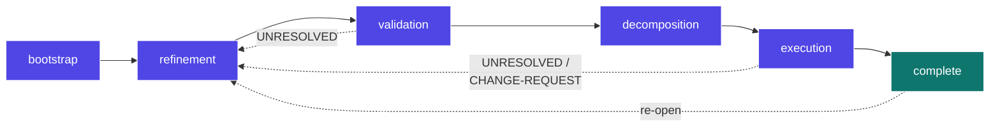
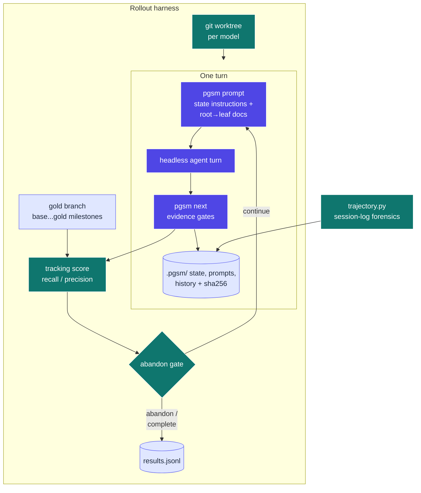

# plan-gap-sm — script-driven gap-analysis planning

Turns a one-sentence initiative brief into a completed, TDD-grounded work breakdown by driving a
tiered gap-analysis spec through a **deterministic state machine**: a Python script owns phase
tracking, checks evidence gates against the plan files, and composes each turn's exact prompt — so
the LLM never manages state in its head, loads only its current state's instructions, and every
byte of loaded context is auditable after the fact.

<details>
<summary><b>Table of Contents</b></summary>
<!--TOC-->

- [plan-gap-sm — script-driven gap-analysis planning](#plan-gap-sm--script-driven-gap-analysis-planning)
  - [Quickstart](#quickstart)
  - [Architecture](#architecture)
  - [How it differs from `plan-gap`](#how-it-differs-from-plan-gap)
  - [Evals: the gold-branch rollout protocol](#evals-the-gold-branch-rollout-protocol)
  - [Reference](#reference)
    - [Troubleshooting](#troubleshooting)
  - [For maintainers](#for-maintainers)

<!--TOC-->
</details>

## Quickstart

In Claude Code:

```
/plan-gap-sm docs/plans/my-initiative
```

Driving the script directly:

```bash
uv run .claude/skills/plan-gap-sm/scripts/pgsm.py init docs/plans/my-initiative \
  --brief "One-sentence initiative description"
uv run .claude/skills/plan-gap-sm/scripts/pgsm.py status docs/plans/my-initiative
```

Escape hatch — see exactly what context a turn would receive, without recording anything:

```bash
uv run .claude/skills/plan-gap-sm/scripts/pgsm.py prompt docs/plans/my-initiative --no-log
```

## Architecture

At a glance — the machine the script drives (back-edges are marker-triggered):



Every transition is fired by the script after **deterministic evidence gates** pass (files exist,
markers absent, ticket DAG acyclic, checkboxes done) — never by model judgment. The failing-gate
report doubles as the agent's remaining work list for the state.

<details>
<summary><b>Detailed view — one turn, and the eval rollout harness around it</b></summary>



</details>

## How it differs from `plan-gap`

| Concern | `plan-gap` (sibling) | `plan-gap-sm` (this skill) |
|---------|----------------------|----------------------------|
| Phase tracking | model reads playbooks, self-reports | script-owned durable state (`.pgsm/state.json`) |
| Transitions | model judgment | deterministic evidence gates, history with evidence |
| Context per turn | model Reads files itself | script composes state instructions + index→gap→ticket path into one prompt |
| Instructions loaded | whole playbooks on demand | the current state's file only, inlined |
| Execution driver | `/loop` runner prompt | goal-driven turns; the machine's gates are the stop condition |
| Resume after days | re-orient from documents | `pgsm status` — state, history, and gate evaluation on disk |
| Auditability | reconstruct from transcript | emitted prompts logged with sha256; `trajectory.py` verifies delivery |

## Evals: the gold-branch rollout protocol

Long-horizon evaluation needs a correctness reference. The protocol (config template in
`scripts/evals/rollouts/example.toml`):

1. Drive a real initiative to completion **once** on a feature branch of a real repo — that branch
   is the **hidden gold standard**. Wind the repo back to the base branch.
2. `rollout.py run` creates a detached git worktree off base per model (Opus first, then Sonnet,
   then Haiku) and loops prompt → agent turn → gates, never checking the gold branch out.
3. After every turn the worktree's touched-file set is scored against the gold `base...gold`
   milestone set (recall/precision/jaccard). **Early-abandon gates** kill rollouts that stop
   tracking: recall floor, stalled-turns ceiling, tool-failure-rate ceiling — all after a grace
   window, all tunable in TOML.
4. Each run appends to `results.jsonl` — `rollout.py status` is the effectiveness-over-time view.

Single-turn goldens (cheap, per-state) live in `scripts/evals/goldens/cases.toml` and run via
`make -C .claude/skills/plan-gap-sm/scripts evals` (real agent calls — costs money, never part of
`ci`).

## Reference

- **Requirements:** `uv` (all scripts are stdlib-only PEP-723; evals additionally use `deepeval`
  and the `claude` CLI). Rollouts and goldens spend real money — budgets are capped per turn via
  `--max-budget-usd`.
- **Command reference:** see [SKILL.md](SKILL.md) — the operating manual is the single source of
  truth for flags.
- **Dev loop:** `make -C .claude/skills/plan-gap-sm/scripts fix` then `… ci` (75 deterministic
  tests, ≥90% coverage, mypy strict, $0).

### Troubleshooting

| Symptom | Cause / fix |
|---------|-------------|
| `pgsm next` reports "holding" forever | The `[FAIL]` gate lines are the missing evidence — produce it; gates never pass on assertion alone |
| `error: machine is paused` | `pgsm resume <plan>` |
| `FileNotFoundError: no state … run pgsm init first` | The plan folder was never initialised (or `.pgsm/` was deleted) — `pgsm init` |
| `no transcript for session …` from trajectory.py | Session id wrong, or transcript dir is non-default — pass `--projects-dir` |
| Rollout abandons immediately after grace | `min_tracking_score` too high for the initiative's early file footprint — lower it or raise `grace_turns` |
| `worktree add` fails with "already exists" | A previous abandoned run kept its worktree for inspection — `git worktree remove --force <dir>` after reviewing |
| Validation gate fails with receipt present | The marker/diagram checks also gate the transition — check `pgsm status` for which `[FAIL]` remains |

## For maintainers

Design rationale, the ADR log (with decision Lenses), file map, and extension checklist live in
[CLAUDE.md](CLAUDE.md). Start there before changing the machine TOML, the gate vocabulary, or the
rollout scoring.
