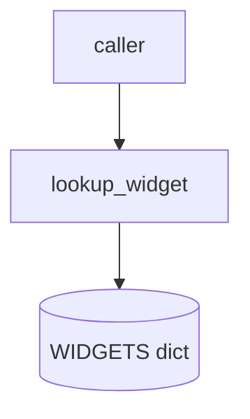
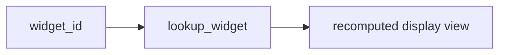
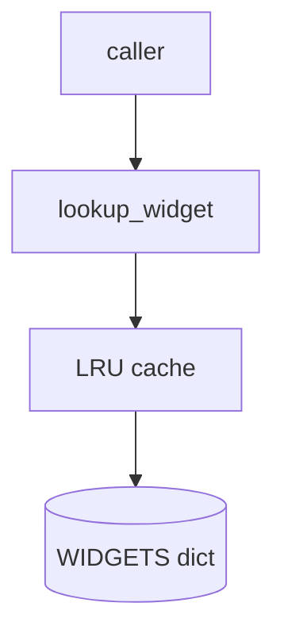
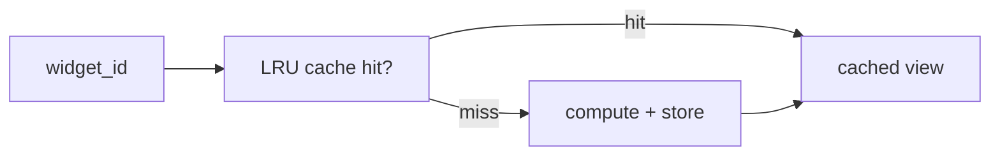

# Widget lookup cache — Discovery (Current, Desired & Increments)

> - **Index:** [README.md](./README.md)

Review/background context: the architecture that motivates the gap, not loaded during execution.

## Current State

### Current State — components

### Current State — data flow

## Desired State

### Desired State — components

### Desired State — data flow

## Gap Increments

### G1 increment

**G1 inserts the LRU cache between the caller and the recompute path** — extends Current State.

