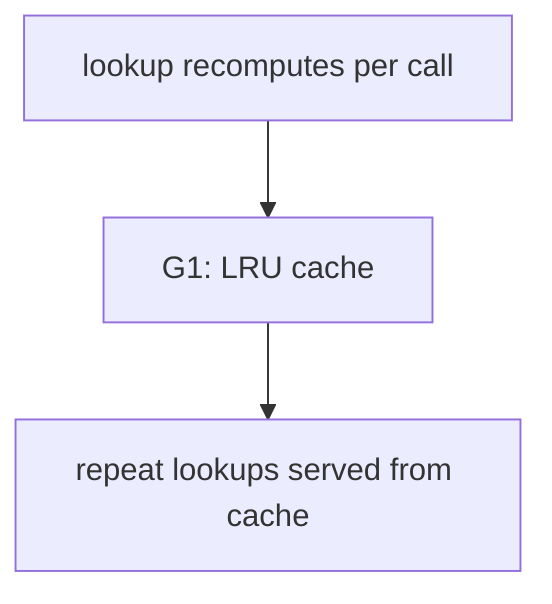

# Widget lookup cache

## Execution Plan

<b>Runner, progress, done criteria</b>

### Runner

Execution is driven by the plan-gap state machine; each turn the driver emits the composed prompt
for the next eligible ticket.

### Progress

| Gap | Tickets total | `[x]` done | `[ ]` todo | Next eligible | Blocked on |
|-----|---------------|-----------|-----------|---------------|------------|
| [G1](./G1.md) | 1 | 0 | 1 | [T1.1](./G1-T1.1.md) | — |

### Done Criteria

- [ ] Every ticket file is marked `[x]`
- [ ] `python3 -m pytest tests/ -q` passes
- [ ] No `<!-- UNRESOLVED -->` / `<!-- CHANGE-REQUEST -->` markers remain

## Overview

Repeated widget lookups recompute the derived display view every call. This initiative adds an
in-memory LRU cache to the lookup path.

- [G1: Cache the widget lookup path](./G1.md) — repeated lookups hit a cache, observable via a
  cache-hit counter.

## Gap Analysis

### Gap Map

### Dependencies

### Gaps (detailed specs)

| Gap | Spec | Tickets | Summary |
|-----|------|:-------:|---------|
| G1 | [Cache the widget lookup path](./G1.md) | 1 | Repeat lookups served from an LRU cache |

## Decisions (ADRs)

| ADR | Decision | Why |
|-----|----------|-----|
| [ADR1.1](./G1.md) | Use `functools.lru_cache` on the pure lookup seam | stdlib, zero deps, measurable via cache_info() |

## Success Measures

### Project Quality Bar (CI Gates)

| Command | Threshold |
|---------|-----------|
| `python3 -m pytest tests/ -q` | exit 0 |

### Domain-Specific Measures

- **[G1](./G1.md):** `lookup_widget.cache_info().hits >= 1` after two identical lookups — asserted
  by `tests/test_cache.py::test_repeat_lookup_hits_cache`.

## Negative Measures

### Quality Bar Violations

- A cache layer that is bypassed by the public API (cache exists but `lookup_widget` never hits it).

### Domain-Specific Failures

- Tests assert on a parallel cached helper while the shipped `lookup_widget` stays uncached.
