# Auditing `plan-gap` usage with the `introspect` skill

This skill is a set of *instructions to read files*: `SKILL.md` tells the agent to load
`resources/phaseN-*.md`, `spec-body.md`, `style.md`, `escalators-not-stairs.md`, the `tdd/` set, and so
on at the right moments. Whether the agent actually loaded them is **observable after the fact** — and
the sibling `introspect` skill already records it. Use this doc to audit a planning session: extract a
timeline of which resources loaded (and roughly how heavy each was), check it against what each phase
*requires*, and render the timeline as a Mermaid gantt.

## Why this is auditable

Resource loading in Claude Code is **model-driven, not automatic**:

- At session start only a skill's frontmatter `description` is in context.
- The `SKILL.md` body loads when the skill is invoked.
- A `resources/*.md` file enters context **only when the model issues a `Read`** against it. There is no
  harness auto-injection — a "Read `resources/…`" instruction is advisory, so a phase can run without
  its playbook ever loading.

Every such `Read` is logged in the session JSONL as a `tool_use` event, and `introspect` ingests those
into its SQLite cache (`~/.claude/cache/introspect_sessions.db`, `events` table). So "did this session
follow the playbooks?" is a query, not a guess.

## Where the path lives in the cache

For a `Read` tool call the `events` row stores:

- `msg_kind` — `tool_use` (main agent) or `subagent-tool_use` (a research sub-agent). Match both with
  `LIKE '%tool_use%'` — plan-gap does much of its reading inside Phase 1/4 sub-agents.
- `message_content` — only a summary string (`[tool: Read]`); **not** the path.
- `message_content_json` — the structured array. The path is
  `json_extract(message_content_json, '$[0].input.file_path')`; the tool name is
  `json_extract(message_content_json, '$[0].name')`.
- `timestamp` — ISO-8601, for ordering the timeline.

## Step 1 — Extract the load timeline

Scope to one session (use the current one via `${CLAUDE_SESSION_ID}`, or any past `session_id`). Per the
project rules, query the cache with the `sqlite3` CLI — it is the reliable path for this structured
extraction (the `introspect_sessions.sh` CLI summarises tool_use content as `[tool: Read]`).

```bash
DB=~/.claude/cache/introspect_sessions.db
SID="${CLAUDE_SESSION_ID}"   # or a specific session UUID

sqlite3 -box "$DB" "
SELECT
  substr(timestamp,12,8)                                            AS at,
  msg_kind,
  replace(json_extract(message_content_json,'\$[0].input.file_path'),
          rtrim('$PWD','/')||'/.claude/skills/plan-gap/', '')       AS resource
FROM events
WHERE session_id = '$SID'
  AND msg_kind LIKE '%tool_use%'
  AND json_extract(message_content_json,'\$[0].name') = 'Read'
  AND json_extract(message_content_json,'\$[0].input.file_path') LIKE '%/.claude/skills/plan-gap/%'
ORDER BY timestamp;"
```

Drop the `session_id` filter and `GROUP BY resource` for a cross-session frequency view — which
resources get loaded often, which never do.

## Step 2 — Add the "how much" (token weight)

A `Read` pulls the **whole file**, so each resource's weight is well approximated by its size on disk
(≈ 1 token per 4 bytes). Compute it from the files themselves and join in your head (or in a scratch
script) against the timeline:

```bash
# Approx tokens per resource = bytes / 4
find .claude/skills/plan-gap -name '*.md' -exec wc -c {} \; \
  | awk '{printf "%-55s ~%d tok\n", $2, $1/4}' | sort -k2 -rn
```

For the *live context cost* rather than the file size, the assistant event that follows a `Read` carries
`context_tokens` (window occupancy at that point); the jump across the `Read` is a noisier but truer
measure of what the load actually added. The file-size proxy is enough for an audit.

## Step 3 — Adherence check

Cross-reference the timeline against what each phase *requires* (from `SKILL.md` → Workflow and the
Resources table). Flags worth raising:

- A phase ran but its playbook never loaded — e.g. Phase 3 with no `phase3-validation.md` or
  `escalators-not-stairs.md` read → the requirement-integrity gate likely got skipped.
- `spec-body.md` / `style.md` never loaded before files were authored → the spec was written from memory,
  not the contract.
- Phase 4 with no `tdd/` reads → ticket decomposition probably missed the anti-pattern rules.

## Step 4 — Visualise as a Mermaid gantt

Render the timeline as a gantt so load order and weight read at a glance: one **section per phase**, one
**task per resource**, the task's start = its `Read` time and its **bar length ∝ token weight** (e.g.
1 minute of bar per 1k tokens). Validate and render through the `/mermaidjs_diagrams` skill (it supports
`gantt`); keep it within that skill's complexity gate.

````markdown

```mermaid
gantt
    title plan-gap resource loads — session <short id>
    dateFormat HH:mm:ss
    axisFormat %H:%M
    section Phase 1
    phase1-bootstrap.md   :p1, 14:03:01, 2m
    spec-body.md          :sb, 14:03:05, 4m
    style.md              :st, 14:03:06, 2m
    section Phase 3
    phase3-validation.md  :p3, 14:21:40, 2m
    escalators-not-stairs.md :esc, 14:21:44, 1m
    section Phase 4
    tdd/tdd.md            :td, 14:40:12, 1m
```

````

Bars that never appear are the audit's payload: a phase whose required resources are missing from the
chart did not load its playbook. To encode weight, set each task's duration from Step 2
(`minutes = tokens / 1000`); to show *order only*, make each a `:milestone` instead.
