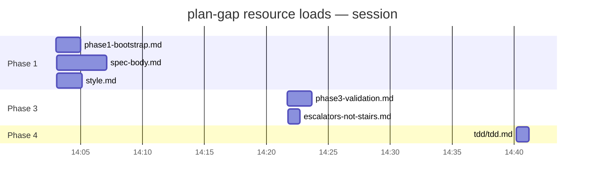

# `plan-gap` — maintainer notes

Read the **ADR log** first. Each entry carries a **Lens**: a forward-looking heuristic to apply to the
next decision of that class, so a change to this skill is settled by applying recorded reasoning rather
than re-deriving it. The second half of this file is the usage-audit procedure.

**This file is not loaded when the skill runs.** It is development-time guidance for whoever edits the
skill. Runtime authority is `SKILL.md` plus `resources/**` (and, inside `vendor/`, the vendored
`SKILL.md` plus the resources it names). So an ADR here only takes effect once the surface it governs
changes: every entry below names that surface, and a decision that names none has not been implemented.

## File map (non-obvious entries only)

| Path | Role |
|------|------|
| `resources/phase*.md` | one playbook per workflow phase; `SKILL.md` holds only the one-line shape of each step |
| `vendor/concise-decisions/` | Vendored decision loop, the Phase 2 question contract. Refresh per ADR-001; never cherry-pick or hand-edit |
| `vendor/README.md` | vendoring rules + the refresh command |

## ADR log

### ADR-001 — Vendor the decision loop; Phase 2 no longer authors its own questions

- **Status:** accepted (user instruction, 2026-08-25)
- **Context:** Phase 2 carried a hand-written question protocol — scan, rank, "ask one question
  explaining why now with recommendations", incorporate. It was a summary of a discipline that a
  sibling skill (`concise-decisions`) had since developed properly: self-answering from decision
  records before asking, the pragmatic-default test, a nine-section briefing, the five-question
  acceptance check, per-option free text so the *reasoning* is captured, the `Given/We prefer/Because/
  Unless` lens grammar, and the TBD route family (`explain`/`show`/`spike`/`defer`/`other`/`task`).
  plan-gap's version had none of the last four. Pointing at the sibling was not an option: no runtime
  surface may reference another skill (`skills/CLAUDE.md`).
- **Decision:** vendor `concise-decisions` wholesale to `vendor/concise-decisions/` (same posture as
  richdocs' vendored mermaid toolchain) and rewrite `resources/phase2-refinement.md` as an **overlay**,
  not a replacement. The vendored copy owns the question contract; the overlay owns the two ends it
  leaves to its caller — what counts as an ambiguity in a spec folder (`<!-- UNRESOLVED -->` ADRs plus
  the non-ADR sweep), and what an answer does to the file set (lens → ADR **Why**/**Rejected**, roll-up
  row, cascade into Outputs/Measures/diagrams, TBD route → ticket/gap/marker). `SKILL.md` →
  *Questioning Principles* now binds **every** phase to the vendored loop, not Phase 2 alone.
- **Enforced in:** `resources/phase2-refinement.md` (the whole file, it is the overlay); `SKILL.md`
  § Phase 2, § Questioning Principles, § Resources; `vendor/README.md`.
- **Consequences:** ~2,850 lines duplicated, and drift from upstream is accepted between refreshes.
  Phase 2 costs more context per question (the loop's `SKILL.md` plus one shape file and one harness
  adapter) and buys reasoning capture the spec previously lost. The overlay cites the vendored copy by
  step number and section number, so a refresh must reconcile those citations in the same commit.
- **Refresh procedure:** `rsync -a --delete --exclude node_modules --exclude '.*cache*' --exclude
  .DS_Store --exclude evals <upstream>/ skills/plan-gap/vendor/concise-decisions/`, then re-read
  `resources/phase2-refinement.md` and fix any citation upstream moved. Never cherry-pick.
- **Lens:** when a phase's procedure is a *summary* of a discipline another skill owns properly, vendor
  that skill and demote the phase file to an overlay that binds the discipline's roles to this skill's
  documents. Do not paraphrase the discipline into a phase playbook, and never link sideways to the
  sibling.

### ADR-002 — A user ruling is a skill change, not a runtime record

- **Status:** accepted (user adjudication, 2026-08-25) — supersedes the first draft of this entry
- **Context:** ADR-001's first pass gave plan-gap a `resources/learned/adjudications.md` and wired it
  into Phase 2 as decision-record backend 3, so that a user overruling the skill was "recorded" there.
  Two things were wrong with it. It was written under a project rule (`claude_skills/statefulness.md`)
  that treated `resources/learned/` as a runtime feedback space; the user removed that rule as a
  misapplication of its intent. And it confused two different things: a decision *about the plan being
  refined* (which belongs in the spec's ADRs, and is loaded) with a defect *in this skill* (which
  belongs in this log, and is not).
- **Decision:** plan-gap keeps **no** runtime learning store. `SKILL.md` + `resources/**` are the only
  runtime authority; `CLAUDE.md`, `README.md`, and anything under `vendor/` that is not the vendored
  `SKILL.md` or the resources it names is development-time only. When the user overrules the skill, the
  response is an ADR here **plus** the edit to the loaded surface that enforces it — never a file the
  run reads back. Phase 2's decision-record backends were re-resolved to the five things a session can
  actually consult: the spec's ADRs, its in-flight markers, the target project's decision surface, the
  user's feedback this session, and tool-reachable knowledge bases.
- **Enforced in:** `resources/phase2-refinement.md` § Division of labour, § Step 2b backend table,
  § Step 2d closing paragraph · `SKILL.md` § Phase 2 step 2b, § Resources closing note.
- **Consequences:** rulings cost a real skill edit rather than an append, which is the point — an
  append changes nothing about how the next session behaves. Upstream reached the same conclusion for
  itself and deleted its ledger outright (its ADR-0020), so after the re-vendor no `resources/learned/`
  exists anywhere in this skill — the exclusion is now structural, not a rule to remember.
- **Lens:** before writing a "the skill learns from this" file, ask whether the run loads it. If it
  does not, the learning is a maintenance task: change the surface the run *does* load, and record why
  here. A rule that lives only in an unloaded document is a documented intention, not an instruction.

## Auditing `plan-gap` usage with the `introspect` skill

This skill is a set of *instructions to read files*: `SKILL.md` tells the agent to load
`resources/phaseN-*.md`, `spec-body.md`, `style.md`, `escalators-not-stairs.md`, the `tdd/` set, and so
on at the right moments. Whether the agent actually loaded them is **observable after the fact** — and
the sibling `introspect` skill already records it. Use this doc to audit a planning session: extract a
timeline of which resources loaded (and roughly how heavy each was), check it against what each phase
*requires*, and render the timeline as a Mermaid gantt.

### Why this is auditable

Resource loading in Claude Code is **model-driven, not automatic**:

- At session start only a skill's frontmatter `description` is in context.
- The `SKILL.md` body loads when the skill is invoked.
- A `resources/*.md` file enters context **only when the model issues a `Read`** against it. There is no
  harness auto-injection — a "Read `resources/…`" instruction is advisory, so a phase can run without
  its playbook ever loading.

Every such `Read` is logged in the session JSONL as a `tool_use` event, and `introspect` ingests those
into its SQLite cache (`~/.claude/cache/introspect_sessions.db`, `events` table). So "did this session
follow the playbooks?" is a query, not a guess.

### Where the path lives in the cache

For a `Read` tool call the `events` row stores:

- `msg_kind` — `tool_use` (main agent) or `subagent-tool_use` (a research sub-agent). Match both with
  `LIKE '%tool_use%'` — plan-gap does much of its reading inside Phase 1/4 sub-agents.
- `message_content` — only a summary string (`[tool: Read]`); **not** the path.
- `message_content_json` — the structured array. The path is
  `json_extract(message_content_json, '$[0].input.file_path')`; the tool name is
  `json_extract(message_content_json, '$[0].name')`.
- `timestamp` — ISO-8601, for ordering the timeline.

### Step 1 — Extract the load timeline

Scope to one session (use the current one via `${CLAUDE_SESSION_ID}`, or any past `session_id`). Per the
project rules, query the cache with the `sqlite3` CLI — it is the reliable path for this structured
extraction (the `introspect_sessions.sh` CLI summarises tool_use content as `[tool: Read]`).

```bash
DB=~/.claude/cache/introspect_sessions.db
SID="${CLAUDE_SESSION_ID}"   # or a specific session UUID

sqlite3 -box "$DB" "
SELECT
  substr(timestamp,12,8)                                            AS at,
  msg_kind,
  replace(json_extract(message_content_json,'\$[0].input.file_path'),
          rtrim('$PWD','/')||'/.claude/skills/plan-gap/', '')       AS resource
FROM events
WHERE session_id = '$SID'
  AND msg_kind LIKE '%tool_use%'
  AND json_extract(message_content_json,'\$[0].name') = 'Read'
  AND json_extract(message_content_json,'\$[0].input.file_path') LIKE '%/.claude/skills/plan-gap/%'
ORDER BY timestamp;"
```

Drop the `session_id` filter and `GROUP BY resource` for a cross-session frequency view — which
resources get loaded often, which never do.

### Step 2 — Add the "how much" (token weight)

A `Read` pulls the **whole file**, so each resource's weight is well approximated by its size on disk
(≈ 1 token per 4 bytes). Compute it from the files themselves and join in your head (or in a scratch
script) against the timeline:

```bash
# Approx tokens per resource = bytes / 4
find .claude/skills/plan-gap -name '*.md' -exec wc -c {} \; \
  | awk '{printf "%-55s ~%d tok\n", $2, $1/4}' | sort -k2 -rn
```

For the *live context cost* rather than the file size, the assistant event that follows a `Read` carries
`context_tokens` (window occupancy at that point); the jump across the `Read` is a noisier but truer
measure of what the load actually added. The file-size proxy is enough for an audit.

### Step 3 — Adherence check

Cross-reference the timeline against what each phase *requires* (from `SKILL.md` → Workflow and the
Resources table). Flags worth raising:

- A phase ran but its playbook never loaded — e.g. Phase 3 with no `phase3-validation.md` or
  `escalators-not-stairs.md` read → the requirement-integrity gate likely got skipped.
- `spec-body.md` / `style.md` never loaded before files were authored → the spec was written from memory,
  not the contract.
- Phase 4 with no `tdd/` reads → ticket decomposition probably missed the anti-pattern rules.

### Step 4 — Visualise as a Mermaid gantt

Render the timeline as a gantt so load order and weight read at a glance: one **section per phase**, one
**task per resource**, the task's start = its `Read` time and its **bar length ∝ token weight** (e.g.
1 minute of bar per 1k tokens). Validate and render through the `/mermaidjs-diagrams` skill (it supports
`gantt`); keep it within that skill's complexity gate.

````markdown

```mermaid
gantt
    title plan-gap resource loads — session <short id>
    dateFormat HH:mm:ss
    axisFormat %H:%M
    section Phase 1
    phase1-bootstrap.md   :p1, 14:03:01, 2m
    spec-body.md          :sb, 14:03:05, 4m
    style.md              :st, 14:03:06, 2m
    section Phase 3
    phase3-validation.md  :p3, 14:21:40, 2m
    escalators-not-stairs.md :esc, 14:21:44, 1m
    section Phase 4
    tdd/tdd.md            :td, 14:40:12, 1m
```
````

Bars that never appear are the audit's payload: a phase whose required resources are missing from the
chart did not load its playbook. To encode weight, set each task's duration from Step 2
(`minutes = tokens / 1000`); to show *order only*, make each a `:milestone` instead.
