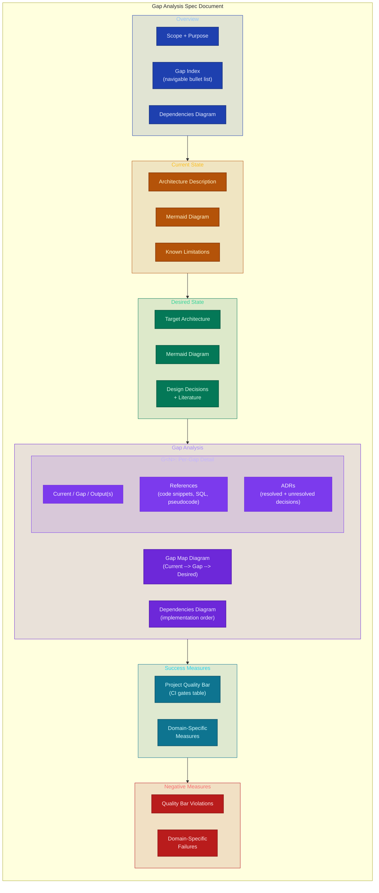
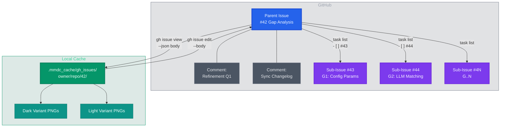

# Planning via Gap Analysis Specs `/plan-gap`

Structured planning spec designed for both human review and agent consumption. Your attention is precious.

With parallel AI research agents, verified citations (reduce hallucinated references), and structured decision records that minimize the questions you need to answer.

**USAGE**:

```text
/plan-gap docs/plans/

"Migrate our session-based auth middleware to OAuth2 + PKCE, replacing the custom token store with Redis-backed sessions."
```

## Research Workflow

```mermaid
flowchart LR
    USER(["User Brief"])

    subgraph P1b["Phase 1b: Broad Research"]
        TA["Track A - Current State<br/>Codebase Explorer"]
        TB["Track B - Future State<br/>SOTA + Prior Art"]
    end

    LV["Phase 1c: Link Verification<br/>(playwright-cli<br/>or WebFetch)"]
    SYN["Phase 1d: Identify<br/>Top-Level G&lt;N&gt; Gaps"]

    subgraph P1e["Phase 1e: Per-Gap Deep Dive"]
        G1A["G1<br/>Agent"]
        G2A["G2<br/>Agent"]
        GNA["G..N<br/>Agent"]
    end

    subgraph P1f["Phase 1f: Success Measures"]
        QA["Quality<br/>Standards<br/>Agent"]
        FM["Failure<br/>Modes<br/>Agent"]
    end

    subgraph P2["Phase 2: Refinement"]
        ADR["Scan Unresolved<br/>ADRs"]
        Q["Ask Most <b>Impactful</b><br/>Question"]
        HITL(["Human<br/>Answer"])
        INC["Integrate Answer<br/>Across All Relevant Questions<br/>and Resolve ADRs"]
    end

    subgraph P3["Phase 3: Validation"]
        MMD["Mermaid<br/>Rendering"]
        REQ["Requirement<br/>Integrity"]
        CON["Cross-<br/>Consistency"]
    end

    BTKT["Phase 4a: Per-Gap<br/>Behavior + TDD Ticket<br/>Decomposition<br/>(parallel per G&lt;N&gt;)"]
    EXE["Phase 4b: Write<br/>Execution Plan +<br/>/loop runner prompt"]
    LP_CYC(["/loop iter:<br/>RED → GREEN<br/>→ REFACTOR<br/>(per ticket)"])
    DONE([Spec Complete])

    USER --> TA & TB
    TA --> SYN
    TB --> LV --> SYN
    SYN --> G1A & G2A & GNA
    SYN --> QA & FM
    G1A & G2A & GNA --> ADR
    QA & FM --> ADR
    ADR --> Q --> HITL --> INC
    INC -->|unresolved ADRs remain| ADR
    INC -->|all resolved| MMD
    MMD --> REQ --> CON
    CON --> BTKT --> EXE --> LP_CYC
    LP_CYC --> DONE
    LP_CYC -.->|UNRESOLVED ADR| ADR

    classDef userNode fill:#f59e0b,stroke:#d97706,color:#1c1917,stroke-width:3px
    classDef exploreAgent fill:#2563eb,stroke:#1d4ed8,color:#eff6ff,stroke-width:2px
    classDef webAgent fill:#7c3aed,stroke:#6d28d9,color:#f5f3ff,stroke-width:2px
    classDef verifyNode fill:#dc2626,stroke:#b91c1c,color:#fef2f2,stroke-width:2px
    classDef synthNode fill:#0891b2,stroke:#0e7490,color:#ecfeff,stroke-width:2px
    classDef gapAgent fill:#059669,stroke:#047857,color:#ecfdf5,stroke-width:2px
    classDef qualAgent fill:#0d9488,stroke:#0f766e,color:#f0fdfa,stroke-width:2px
    classDef humanNode fill:#f59e0b,stroke:#d97706,color:#1c1917,stroke-width:3px
    classDef refinNode fill:#8b5cf6,stroke:#7c3aed,color:#f5f3ff,stroke-width:2px
    classDef validNode fill:#10b981,stroke:#059669,color:#ecfdf5,stroke-width:2px
    classDef tddAgent fill:#9d174d,stroke:#831843,color:#fdf2f8,stroke-width:2px
    classDef execNode fill:#9a3412,stroke:#7c2d12,color:#fff7ed,stroke-width:3px
    classDef terminalNode fill:#475569,stroke:#1e293b,color:#f8fafc,stroke-width:3px

    class USER,HITL userNode
    class TA exploreAgent
    class TB webAgent
    class LV verifyNode
    class SYN synthNode
    class G1A,G2A,GNA gapAgent
    class QA,FM qualAgent
    class ADR,Q,INC refinNode
    class MMD,REQ,CON validNode
    class BTKT,EXE tddAgent
    class LP_CYC execNode
    class DONE terminalNode

    style P1b fill:#1e3a8a22,stroke:#2563eb,color:#93c5fd
    style P1e fill:#065f4622,stroke:#059669,color:#34d399
    style P1f fill:#0f766e22,stroke:#0d9488,color:#2dd4bf
    style P2 fill:#5b21b622,stroke:#8b5cf6,color:#a78bfa
    style P3 fill:#04785722,stroke:#10b981,color:#6ee7b7
```



- **Parallel broad research** — codebase explorer + SOTA web researcher run simultaneously
- **Anti-hallucination** — every external URL verified via playwright-cli or WebFetch before citation
- **Per-gap deep dive** — N agents in parallel, each with fresh context focused on one gap
- **Quality + failure discovery** — agents scan your CI gates, agentic rules, and memory for codified standards and historical gotchas
- **ADR-driven questions** — unresolved decisions tracked per gap; the skill picks the single question that resolves the most ADRs across all gaps simultaneously
- **Human-in-the-loop** — you answer one focused question per iteration; the skill propagates your answer across all affected sections

## Document Structure



- **Overview** — one-screen orientation: what this is, which gaps exist, and what order to tackle them
- **Current State** — grounded in codebase exploration with file:line citations and architecture diagrams
- **Desired State** — informed by SOTA research with verified external citations (no hallucinated URLs)
- **Gap Analysis** — each gap has concrete deliverables (Output(s)), code-level References for agentic execution, and ADRs tracking every design decision
- **Success Measures** — anchored to your project's actual CI gates (not vague aspirations), plus domain-specific measures per gap
- **Negative Measures** — Type 2 failures where it *looks* done but silently isn't — discovered by scanning your project's own rules and historical gotchas


## GitHub Issues Backend



- **Local-first editing** — iterate locally with Edit tool diffs and mmdc rendering, sync back via `gh issue edit --body`
- **Sub-issues for scale** — when the body exceeds ~50K chars or 8+ gaps, each G\<N\> becomes its own tracked sub-issue
- **Audit trail** — refinement Q&A posted as comments; sync changelogs reference GitHub's edit history API
- **Native Mermaid** — diagrams render directly in the GitHub issue view
