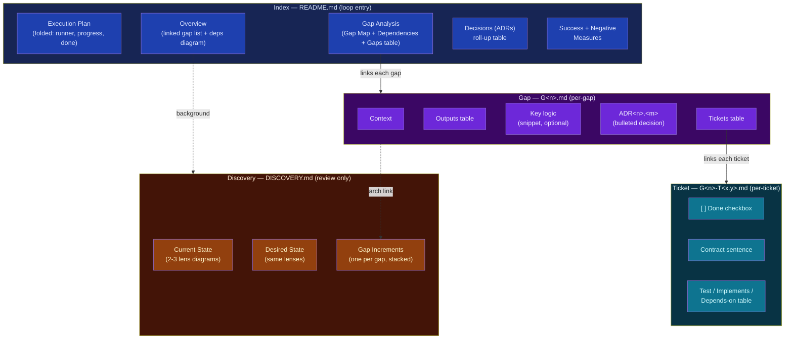
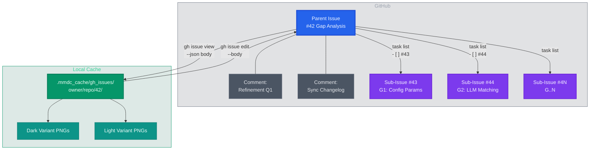

# Planning via Gap Analysis Specs `/plan-gap`

Structured planning spec designed for both human review and agent consumption. Your attention is precious.

With parallel AI research agents, verified citations (reduce hallucinated references), and structured decision records that minimize the questions you need to answer.

**USAGE**:

```text
/plan-gap docs/plans/

"Migrate our session-based auth middleware to OAuth2 + PKCE, replacing the custom token store with Redis-backed sessions."
```

## Research Workflow


- **Parallel broad research** — codebase explorer + SOTA web researcher run simultaneously
- **Anti-hallucination** — every external URL verified via playwright-cli or WebFetch before citation
- **Per-gap deep dive** — N agents in parallel, each with fresh context focused on one gap
- **Quality + failure discovery** — agents scan your CI gates, agentic rules, and memory for codified standards and historical gotchas
- **ADR-driven questions** — unresolved decisions tracked per gap; the skill picks the single question that resolves the most ADRs across all gaps simultaneously
- **Human-in-the-loop** — you answer one focused question per iteration; the skill propagates your answer across all affected sections
- **Executable evidence — no stubs, no mocks of the deliverable** — every gap's Outputs include a *proof-of-execution* artifact produced by running the real code path on real input (the tracer bullet produces it); a ticket that can only ship a stub triggers a 5-Whys root-cause check (`resources/5ys.md`), and a `<!-- CHANGE-REQUEST -->` only if a genuine plan defect is confirmed — the `/loop` stops and returns to refinement

## Document Structure

A spec is a **folder** (`<plan>/`) of tiered files with `README.md` as the index, not one document. The index + the one gap + the one ticket an agent is on are its `/loop` working-set; Current/Desired State and background move to a review-only Discovery file (**context economy**).



- **Index** (`<plan>/README.md`) — one-screen orientation: scope, the linked gap list, dependency order, a Decisions roll-up, and the CI-anchored Success/Negative Measures. The TOC and Execution Plan fold behind `<details>` so humans skim while the `/loop` agent still reads them.
- **Gap files** (`G<n>.md`) — one per gap: Context, an Outputs table (at least one row is a *proof-of-execution* artifact — the gap's evidence it really runs), an optional Key-logic snippet for agentic few-shot, gap-scoped bulleted ADRs, a Tickets table, and an `Architecture` nav link to its increment diagram — all cross-linked by ID.
- **Ticket files** (`G<n>-T<x.y>.md`) — one austere TDD slice each: a Done checkbox, a precise contract sentence, and a Test/Implements/Depends-on table. The `/loop` runner consumes one per iteration.
- **Discovery** (`DISCOVERY.md`) — Current State and Desired State as **2–3 lens diagrams each** (component, data-flow, sequence, deployment, …), plus a **Gap Increments** stack: one diagram per gap, each building on the Current baseline to show what that gap changes. Human review only — never loaded during the loop.


## GitHub Issues Backend



- **Local-first editing** — iterate locally with Edit tool diffs and mmdc rendering, sync back via `gh issue edit --body`
- **Sub-issues for scale** — when the body exceeds ~50K chars or 8+ gaps, each G\<N\> becomes its own tracked sub-issue
- **Audit trail** — refinement Q&A posted as comments; sync changelogs reference GitHub's edit history API
- **Native Mermaid** — diagrams render directly in the GitHub issue view
