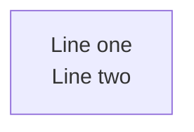
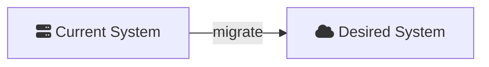

# Mermaid.JS Diagram Reference for Gap Analysis

Quick reference for writing and validating Mermaid diagrams embedded in gap analysis
markdown files. Distilled from the full `/mermaidjs_diagrams` skill.

## Rendering and Verification

mmdc exits non-zero if any mermaid fence fails to render. Use this as a validation gate.

```bash
INPUT="path/to/document.md"
INPUT_PATH="path/to/"
OUTPUT_BASE=".mmdc_cache"

# Variant 1: dark + transparent + PNG (default)
OUTPUT_FORMAT="png"
THEME=dark
BGCOLOR=transparent
VARIANT="${THEME}_${BGCOLOR}_${OUTPUT_FORMAT}"
OUTPUT_TARGET="${OUTPUT_BASE}/${VARIANT}/${INPUT_PATH}/"
OUTPUT="${OUTPUT_BASE}/${VARIANT}/${INPUT}"
npx -p @mermaid-js/mermaid-cli mmdc \
  -i "${INPUT}" \
  -a "${OUTPUT_TARGET}" \
  -o "${OUTPUT}" \
  --scale 4 -e "${OUTPUT_FORMAT}" -t "${THEME}" -b "${BGCOLOR}"

# Variant 2: default + white + PNG (for README, light-mode docs)
OUTPUT_FORMAT="png"
THEME=default
BGCOLOR=white
VARIANT="${THEME}_${BGCOLOR}_${OUTPUT_FORMAT}"
OUTPUT_TARGET="${OUTPUT_BASE}/${VARIANT}/${INPUT_PATH}/"
OUTPUT="${OUTPUT_BASE}/${VARIANT}/${INPUT}"
npx -p @mermaid-js/mermaid-cli mmdc \
  -i "${INPUT}" \
  -a "${OUTPUT_TARGET}" \
  -o "${OUTPUT}" \
  --scale 4 -e "${OUTPUT_FORMAT}" -t "${THEME}" -b "${BGCOLOR}"
```

**Exit code 0** = all diagrams valid. **Non-zero** = error on stderr with the offending fence.

## Choosing a Diagram Type

| Type | Best for | Notes |
|------|----------|-------|
| `flowchart LR` | Architecture, data flow, dependency graphs | Handles fan-out well, supports subgraphs |
| `flowchart TD` | Hierarchical/layered views | Top-down layout |
| `sequenceDiagram` | Interaction flows, API calls | Time-ordered message passing |
| `stateDiagram-v2` | State machines, workflows | Transitions and conditions |
| `architecture-beta` | Brand-logo diagrams, simple linear chains | Strict layout rules (see pitfalls) |

**Default choice for gap analysis: `flowchart LR`** — it's the most versatile and handles
the complex topology typical of current-vs-desired state comparisons.

## Common Pitfalls

### Multiline text in node labels

**`\n` does NOT work** — renders as garbled characters. Use `<br/>` instead:



For Mermaid v10.7+, markdown strings with real newlines also work:


`<br/>` does NOT work in subgraph labels or erDiagram — use short single-line titles.

### Unicode in node labels

Characters like U+21B3 (↳), U+2192 (→), U+00B7 (·) cause rendering failures in mmdc
even when they display correctly in browser previews. **Stick to ASCII-only text** in
node labels.

### architecture-beta edge rules

These are critical — violations produce silent failures (exit code 0, but error-bomb PNG):

1. **Edges MUST have labels.** `A:R -[label]-> L:B` works. `A:R --> L:B` silently fails.
2. **Direction goes BEFORE the rhs node id.** `A:R -[label]-> L:B` ✓ `A:R -[label]-> B:L` ✗
3. **One outgoing `R` edge per node.** Fan-out (one node → multiple `R` targets) causes
   collapsed/overlapping layout. Design as strict linear chains.
4. **`--iconPacks` required for CLI rendering.** Icons are not bundled. Pass
   `--iconPacks @iconify-json/logos @iconify-json/mdi` to mmdc.
5. **Only real npm packages work with `--iconPacks`.** The mechanism fetches from unpkg.com
   inside Puppeteer. Non-existent packages fail silently (empty icon boxes, exit code 0).

### Flowchart with Font Awesome icons

Flowchart diagrams using `fa:fa-icon` syntax need no `--iconPacks` flag:



## Variant Quick Reference

| Variant | Flags | Best For |
|---------|-------|----------|
| `dark_transparent_png` | `-e png -t dark -b transparent` | Dark UIs, slides (default) |
| `default_white_png` | `-e png -t default -b white` | README, light docs, print |
| `dark_transparent_svg` | `-e svg -t dark -b transparent` | Scalable dark docs |
| `default_white_svg` | `-e svg -t default -b white` | Scalable light docs |

## Diagram Guidance for Gap Analysis Sections

| Section | Recommended diagram types | Purpose |
|---------|--------------------------|---------|
| **Current State** | `flowchart LR`, `architecture-beta` | Show existing components, data flows, dependencies |
| **Desired State** | `flowchart LR`, `architecture-beta` | Show target components — visually distinguishable from Current State |
| **Gap Analysis** | `flowchart LR`, `stateDiagram-v2` | Show migration paths, dependency ordering, what changes between states |

**Tip:** Use consistent node IDs between Current State and Desired State diagrams so the
reader can visually diff what changed, what was added, and what was removed.
